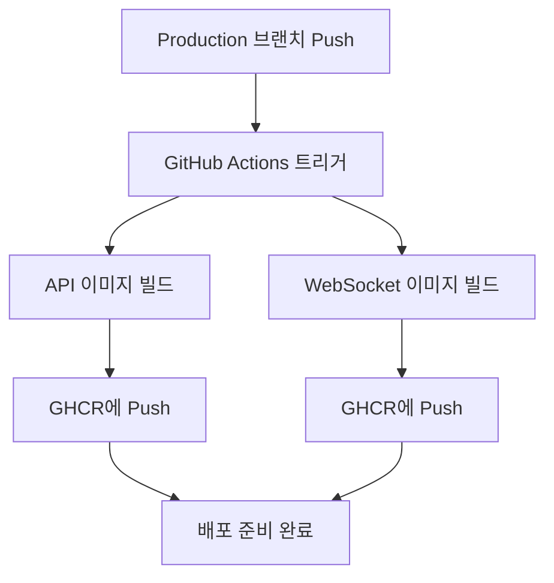

# 🔧 GitHub 설정 가이드

GitHub Container Registry(GHCR) 자동 배포를 위한 저장소 설정 방법입니다.

## 📋 필수 설정

### 1. Repository 권한 설정

1. **Settings** → **Actions** → **General**
2. **Workflow permissions** 섹션에서:
   - ✅ **Read and write permissions** 선택
   - ✅ **Allow GitHub Actions to create and approve pull requests** 체크

### 2. Package 권한 설정

1. **Settings** → **Actions** → **General**
2. **Workflow permissions**에서 **Read and write permissions** 확인

### 3. GHCR 패키지 가시성 설정 (선택)

빌드 후 생성된 패키지의 가시성을 설정할 수 있습니다:

1. Repository 메인 페이지 우측 **Packages** 섹션 확인
2. 패키지 클릭 → **Package settings**
3. **Change package visibility**에서 원하는 옵션 선택

## 🚀 배포 트리거

### Production 브랜치 푸시
```bash
git checkout -b production
git push origin production
```

### Release 생성
```bash
# Git 태그 생성
git tag v1.0.0
git push origin v1.0.0

# GitHub UI에서 Release 생성
# Repository → Releases → Create a new release
```

## 📦 생성되는 이미지

### API 서버
```
ghcr.io/your-username/auto_trader:latest
ghcr.io/your-username/auto_trader:production
ghcr.io/your-username/auto_trader:v1.0.0
```

### WebSocket 서버
```
ghcr.io/your-username/auto_trader-ws:latest
ghcr.io/your-username/auto_trader-ws:production
ghcr.io/your-username/auto_trader-ws:v1.0.0
```

## 🔍 워크플로우 모니터링

1. **Actions** 탭에서 빌드 진행상황 확인
2. 각 단계별 로그 확인 가능
3. 실패 시 에러 메시지 확인

## 🔧 문제 해결

### 권한 에러
```
Error: Process completed with exit code 1.
```

**해결방법:**
1. Repository Settings → Actions → General
2. Workflow permissions를 "Read and write permissions"로 변경

### 이미지 Pull 실패

**로컬에서 이미지 확인:**
```bash
# GitHub 토큰으로 로그인
echo $GITHUB_TOKEN | docker login ghcr.io -u your-username --password-stdin

# 이미지 Pull 테스트
docker pull ghcr.io/your-username/auto_trader:latest
```

## 📝 환경변수 설정

Production 배포시 `docker-compose.prod.yml`에서 사용할 환경변수:

```bash
# .env.prod 파일에 설정
GITHUB_REPOSITORY=your-username/auto_trader
```

이 값이 Docker 이미지 경로와 일치해야 합니다.

## 🔄 자동화된 워크플로우



완료되면 [배포 가이드](DEPLOYMENT.md)를 참고하여 서버에 배포하세요!

