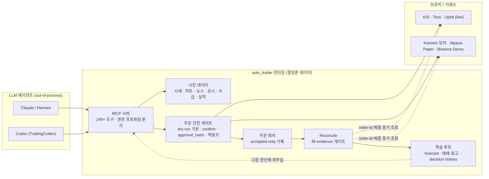

# Auto Trader

**LLM 에이전트가 시장 분석부터 주문 실행, 체결 확정, 매매 회고까지 수행하는 AI 자동매매 시스템.**

런타임은 결정론적인 데이터·주문·안전 레이어만 담당하고, 판단(LLM)은 MCP(Model Context Protocol)로 연결된 **프로세스 밖의 에이전트**가 수행합니다. 국내주식·미국주식·암호화폐를 실계좌로 운용 중이며, 같은 도구 표면 위에서 다수의 모의 환경(KIS 모의, 키움 모의, Alpaca Paper, Binance Demo, Upbit shadow-sim)을 함께 지원합니다.

이 저장소를 관통하는 질문은 하나입니다 — **"AI에게 계좌를 맡기려면 무엇이 필요한가?"** 아래 설계 원칙들은 그 답으로 하나씩 쌓아온 안전장치입니다.

> ⚠️ 개인 프로젝트이며 투자 조언이 아닙니다. 실계좌 연동 기능은 모두 기본 비활성(fail-closed)이며, 명시적인 환경변수 게이트와 주문별 confirm 없이는 동작하지 않습니다.

## 아키텍처



## 핵심 설계 원칙

### 1. LLM은 프로세스 밖에

런타임 코드는 in-process LLM provider를 import하지 않습니다(정적 가드 테스트가 `app/**` 전체를 스캔해 강제). 판단은 MCP로 연결된 에이전트가, 데이터 수집·주문 실행·검증은 런타임이 맡습니다. 도구 표면은 **권한 프로파일**로 분리되어, 계좌조회 전용 에이전트는 주문 도구에 아예 접근할 수 없습니다.

### 2. 주문은 fail-closed

- 모든 주문 도구는 `dry_run` 기본값 — 실전송은 `confirm=True`를 매번 명시해야 합니다.
- `preview → approval_hash(정규화된 주문의 해시 토큰, TTL 5분) → place에서 재계산 검증` — 프리뷰와 다른 주문은 전송 자체가 거부됩니다.
- 결정적 멱등키가 같은 주문의 이중 제출을 차단합니다. 주문 POST의 타임아웃 재시도는 전면 제거했고(재-POST = 이중주문 리스크), 브로커가 멱등을 지원하지 않는 경로는 전송 전 intent 테이블 선점으로 로컬에서 차단합니다.
- 손실매도 가드, 래더 사이징 캡, 섹터 집중도 경고 등 코드 레벨 가드가 판단 레이어와 독립적으로 동작합니다.
- 실계좌·모의 어댑터 모두 호스트 allowlist로 엔드포인트를 고정합니다(모의 어댑터에서 live 호스트는 선택 불가).

### 3. 체결은 증거로만 (fill-evidence gate)

주문 전송 시점에는 **accepted-only**만 기록합니다. 체결·손익 장부는 브로커의 order-id 키 체결 증거를 확인한 reconcile을 통해서만 확정됩니다. "보냈으니 체결됐겠지"를 시스템 차원에서 금지한 것으로, KR/US/crypto 전 시장의 라이브 주문 경로에 동일하게 적용되어 있습니다.

### 4. 매매는 학습 루프로

주문→체결→저널→forecast→회고가 `correlation_id`로 연결됩니다. 에이전트는 다음 판단 때 자신의 과거 결정과 회고를 주입받고, forecast는 확률·범위로 기록되어 실제 결과와 대조하는 캘리브레이션 대시보드로 노출됩니다. 예측이 맞았는지 시스템이 기억하고 다시 보여주는 구조입니다.

## 지원 시장 / 브로커

| 시장 | 데이터 | 실주문 | 모의 |
|---|---|---|---|
| 국내주식 (KRX/NXT) | KIS · Toss · Naver · KRX | KIS · Toss | KIS 모의 · Kiwoom 모의 |
| 미국주식 | KIS · Toss · Yahoo · Finnhub · TradingView | KIS · Toss | Alpaca Paper |
| 암호화폐 | Upbit (REST + WebSocket) | Upbit | Upbit shadow-sim · Binance Spot/Futures Demo |

보조 데이터: DART 공시, Finnhub 실적 캘린더, 네이버/Finnhub 뉴스(관련성 판정 파이프라인), 투자자 수급(외인/기관), 증권사 리서치 리포트 인제스트, 환율.

## MCP 도구 표면

140+ 도구가 streamable-http MCP 서버로 노출됩니다.

- **조회/분석**: 시세, OHLCV(멀티 타임프레임), 스크리너(KR/US/crypto), 뉴스, 공시, 실적, 수급, 밸류에이션, 포트폴리오
- **주문 계열**: preview / place / modify / cancel + 주문이력 · 주문가능금액 (브로커·계좌모드별 변형)
- **레저/검증**: 주문 레저 조회, reconcile(fill-evidence), 매매 회고, forecast 기록
- **정책/운영**: trading policy 조회(버전 스탬핑), 운영 브리핑, watch 조건 관리

도구 상세는 [`app/mcp_server/README.md`](app/mcp_server/README.md)를 참고하세요.

## 웹 대시보드 (`/invest`)

스크리너(KR/US/crypto), 종목 상세(수급·뉴스·실적·리서치), 통합 주문/체결 뷰(주문 provenance 포함), forecast 캘리브레이션 인사이트를 제공하는 React 대시보드입니다.

<!-- TODO(ROB-805): 스크린샷 2~3장 — 스크리너 / 종목 상세 / insights 캘리브레이션 -->

## 기술 스택

Python 3.13 · FastAPI · SQLAlchemy(async) + PostgreSQL · Redis · Alembic · TaskIQ · Prefect · React + TypeScript(invest 프론트엔드) · MCP(streamable-http) · pytest(85%+ 커버리지, xdist 병렬)

## 시작하기

### 요구사항

- Python 3.13+, UV, PostgreSQL, Redis

### 설치

```bash
git clone <repository-url>
cd auto_trader

uv sync --all-groups          # 의존성 설치
cp env.example .env           # 환경변수 설정 (.env 편집)
uv run alembic upgrade head   # DB 마이그레이션
make dev                      # 개발 서버 (uvicorn --reload)
```

```bash
docker compose up -d          # PostgreSQL / Redis / Adminer
```

**주요 환경 변수** (전체는 `env.example` 참고):

- `DATABASE_URL`, `REDIS_URL` — 필수 인프라
- `KIS_APP_KEY/SECRET`, `UPBIT_ACCESS_KEY/SECRET_KEY` — 브로커 자격증명
- 실주문·모의주문 게이트(`TOSS_LIVE_ORDER_MUTATIONS_ENABLED`, `KIWOOM_MOCK_ENABLED`, `BINANCE_SPOT_DEMO_ENABLED` 등)는 **모두 기본 off**

## 테스트

```bash
make test          # fast gate (live 제외)
make test-unit     # 단위 테스트만
make test-cov      # 커버리지 리포트
make test-live     # 외부 API 실호출 테스트 (--run-live 명시 필요)
make lint          # Ruff + ty 타입체크
make security      # bandit · safety
```

- 마커: `unit` / `integration` / `live`(integration의 strict subset, `--run-live` 필요) / `slow`
- CI(GitHub Actions): lint → 병렬 fast gate(xdist loadfile) → TaskIQ smoke → 보안 검사 → 커버리지

## 문서

- 운영 런북: [`docs/runbooks/`](docs/runbooks/) — 브로커별 smoke 테스트, reconcile, 배포, 인시던트 대응
- DB 구조: [`STOCK_INFO_GUIDE.md`](STOCK_INFO_GUIDE.md)
- 배포: [`DEPLOYMENT.md`](DEPLOYMENT.md) · [`DOCKER_USAGE.md`](DOCKER_USAGE.md)
- Upbit WebSocket: [`UPBIT_WEBSOCKET_README.md`](UPBIT_WEBSOCKET_README.md)

## 모니터링

표준 모니터링은 Sentry입니다. `SENTRY_DSN` 설정 시 활성화되며, 민감 필드(`authorization`, `cookie`, `token`, `secret`, `password`)는 마스킹됩니다.

## 라이센스

이 프로젝트는 MIT 라이센스 하에 배포됩니다.
