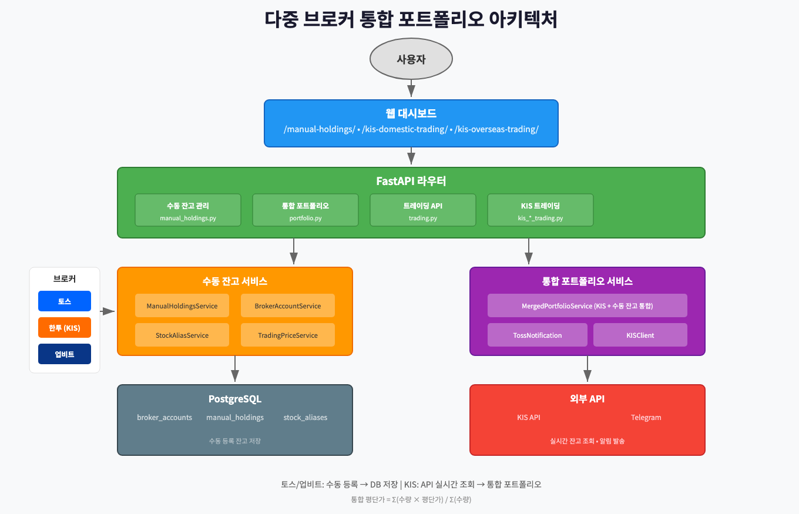
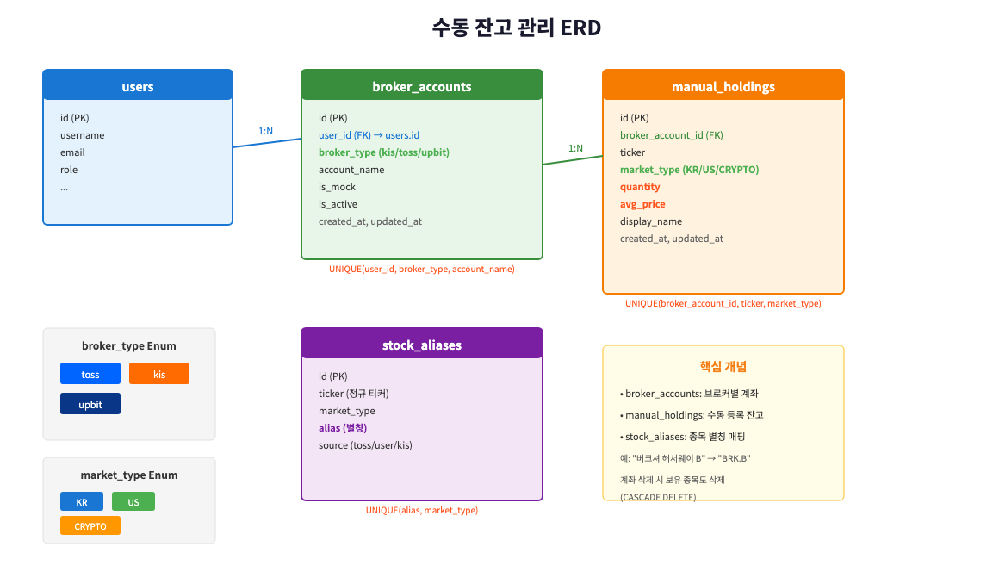
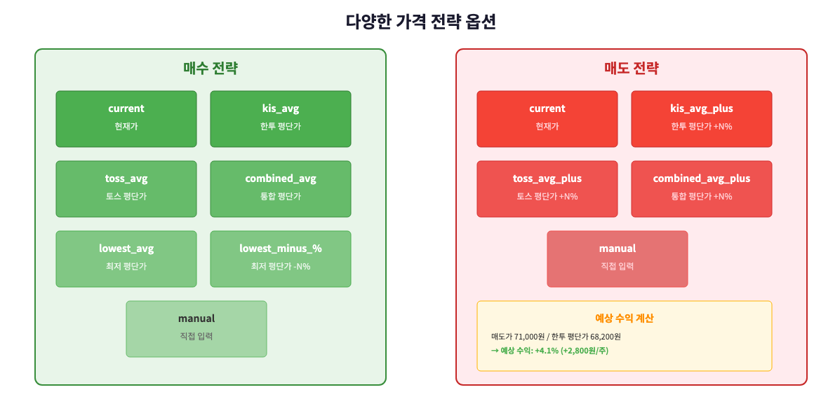
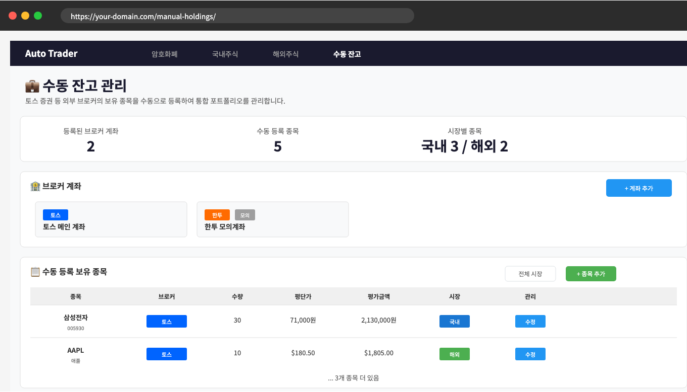

# 다중 브로커 통합 포트폴리오: 토스 증권 수동 잔고 연동하기


> 이 글은 AI 기반 자동매매 시스템 시리즈의 **10편**입니다.
>
> **전체 시리즈:**
> - [1편: 한투 API로 실시간 주식 데이터 수집하기](https://mgh3326.tistory.com/227)
> - [2편: yfinance로 애플·테슬라 분석하기](https://mgh3326.tistory.com/228)
> - [3편: Upbit으로 비트코인 24시간 분석하기](https://mgh3326.tistory.com/229)
> - [4편: AI 분석 결과 DB에 저장하기](https://mgh3326.tistory.com/230)
> - [5편: Upbit 웹 트레이딩 대시보드 구축하기](https://mgh3326.tistory.com/232)
> - [6편: 실전 운영을 위한 모니터링 시스템 구축](https://mgh3326.tistory.com/233)
> - [7편: 라즈베리파이 홈서버에 자동 HTTPS로 안전하게 배포하기](https://mgh3326.tistory.com/234)
> - [8편: JWT 인증 시스템으로 안전한 웹 애플리케이션 구축하기](https://mgh3326.tistory.com/235)
> - [9편: KIS 국내/해외 주식 자동 매매 시스템 구축하기](https://mgh3326.tistory.com/237)
> - **10편: 다중 브로커 통합 포트폴리오 시스템 구축하기** ← 현재 글

## 들어가며

### 왜 통합 포트폴리오인가?

실제 투자를 하다 보면 여러 증권사에 분산 투자하는 경우가 많습니다.

```
나의 현실:
├── 한국투자증권 (KIS) - API 연동 ✅
│   ├── 삼성전자 50주 @ 68,200원
│   └── SK하이닉스 20주 @ 185,500원
│
└── 토스증권 - API 없음 ❌
    ├── 삼성전자 30주 @ 71,000원
    └── AAPL 10주 @ $180
```

**문제점:**
1. **분산된 보유 현황**: 같은 종목을 여러 브로커에서 보유
2. **평단가 계산 불가**: 통합 평단가를 알 수 없음
3. **AI 분석 비효율**: 실제 보유량을 모르면 정확한 분석 불가
4. **수동 관리 필요**: 토스 잔고 변경 시 수동으로 기록해야 함

### 이번 편에서 만들 것

```
통합 포트폴리오 시스템
├── 수동 잔고 등록 대시보드
│   ├── 브로커 계좌 관리 (토스, 한투, 업비트)
│   ├── 종목별 잔고 등록/수정/삭제
│   └── 대량 등록 (Bulk Import)
│
├── 통합 평단가 계산
│   ├── KIS 보유 + 토스 보유 = 통합 평단가
│   └── 브로커별 평단가 비교
│
├── 가격 전략 시스템
│   ├── 다양한 매수/매도 전략
│   └── 시뮬레이션 (Dry-run)
│
└── 토스 알림 서비스
    ├── 매수/매도 추천 알림
    └── 예상 수익 계산
```

## 시스템 아키텍처


*다중 브로커 통합 포트폴리오 시스템 구조*

### 핵심 설계 원칙

**1. KIS는 API, 나머지는 수동**
```python
# KIS: 실시간 API로 자동 조회
kis_holdings = await kis_client.fetch_my_stocks()

# 토스: DB에 수동 등록된 데이터 조회
manual_holdings = await manual_service.get_holdings_by_user(user_id)
```

**2. 통합 평단가 = 가중 평균**
```python
# 삼성전자 예시
# KIS: 50주 @ 68,200원
# 토스: 30주 @ 71,000원

total_value = (50 * 68,200) + (30 * 71,000)  # 5,540,000원
total_quantity = 50 + 30  # 80주
combined_avg = total_value / total_quantity  # 69,250원
```

**3. 매도는 KIS 보유분만**
```python
# 토스는 API가 없으므로 주문 불가
# KIS 보유분 50주 내에서만 매도 가능
if requested_quantity > kis_quantity:
    raise Error("KIS 보유 수량 초과")
```

## 데이터베이스 설계


*수동 잔고 관리 ERD*

### 브로커 계좌 테이블

```python
# app/models/manual_holdings.py

class BrokerType(str, enum.Enum):
    """브로커 타입"""
    kis = "kis"      # 한국투자증권
    toss = "toss"    # 토스증권
    upbit = "upbit"  # 업비트 (암호화폐)


class MarketType(str, enum.Enum):
    """시장 타입"""
    KR = "KR"          # 국내주식
    US = "US"          # 해외주식
    CRYPTO = "CRYPTO"  # 암호화폐


class BrokerAccount(Base):
    """브로커 계좌 테이블

    사용자별 브로커 계좌를 관리
    """

    __tablename__ = "broker_accounts"
    __table_args__ = (
        UniqueConstraint(
            "user_id", "broker_type", "account_name",
            name="uq_broker_account"
        ),
    )

    id: Mapped[int] = mapped_column(BigInteger, primary_key=True)
    user_id: Mapped[int] = mapped_column(
        ForeignKey("users.id", ondelete="CASCADE"),
        nullable=False,
        index=True
    )
    broker_type: Mapped[BrokerType] = mapped_column(
        Enum(BrokerType, name="broker_type"),
        nullable=False
    )
    account_name: Mapped[str] = mapped_column(
        Text, nullable=False, default="기본 계좌"
    )
    is_mock: Mapped[bool] = mapped_column(
        Boolean, default=False, nullable=False
    )  # 모의투자 계좌 여부
    is_active: Mapped[bool] = mapped_column(
        Boolean, default=True, nullable=False
    )

    # Relationships
    holdings: Mapped[list["ManualHolding"]] = relationship(
        back_populates="broker_account",
        cascade="all, delete-orphan"  # 계좌 삭제 시 보유 종목도 삭제
    )
```

### 수동 보유 종목 테이블

```python
class ManualHolding(Base):
    """수동 등록 보유 종목 테이블

    외부 브로커의 보유 종목을 수동으로 등록
    """

    __tablename__ = "manual_holdings"
    __table_args__ = (
        UniqueConstraint(
            "broker_account_id", "ticker", "market_type",
            name="uq_holding_ticker"
        ),
    )

    id: Mapped[int] = mapped_column(BigInteger, primary_key=True)
    broker_account_id: Mapped[int] = mapped_column(
        ForeignKey("broker_accounts.id", ondelete="CASCADE"),
        nullable=False,
        index=True
    )
    ticker: Mapped[str] = mapped_column(Text, nullable=False, index=True)
    market_type: Mapped[MarketType] = mapped_column(
        Enum(MarketType, name="market_type"),
        nullable=False
    )
    quantity: Mapped[float] = mapped_column(
        Numeric(18, 8), nullable=False
    )
    avg_price: Mapped[float] = mapped_column(
        Numeric(18, 8), nullable=False
    )
    display_name: Mapped[str | None] = mapped_column(
        Text, nullable=True
    )  # "버크셔 해서웨이 B" 같은 사용자 정의 표시명

    # Relationships
    broker_account: Mapped["BrokerAccount"] = relationship(
        back_populates="holdings"
    )
```

### 종목 별칭 테이블

토스에서는 "버크셔 해서웨이 B"로 표시되지만, 실제 티커는 "BRK.B"입니다.

```python
class StockAlias(Base):
    """종목 별칭 테이블

    토스 등에서 사용하는 종목 별칭을 정규 티커에 매핑
    예: "버크셔 해서웨이 B" -> "BRK.B"
    """

    __tablename__ = "stock_aliases"
    __table_args__ = (
        UniqueConstraint("alias", "market_type", name="uq_alias_market"),
    )

    id: Mapped[int] = mapped_column(BigInteger, primary_key=True)
    ticker: Mapped[str] = mapped_column(Text, nullable=False, index=True)
    market_type: Mapped[MarketType] = mapped_column(
        Enum(MarketType, name="market_type"),
        nullable=False
    )
    alias: Mapped[str] = mapped_column(Text, nullable=False, index=True)
    source: Mapped[str] = mapped_column(
        Text, nullable=False, default="user"
    )  # toss, user, kis
```

**사용 예시:**
```python
# 별칭 등록
await alias_service.create({
    "ticker": "BRK.B",
    "market_type": "US",
    "alias": "버크셔 해서웨이 B",
    "source": "toss"
})

# 별칭으로 티커 조회
ticker = await alias_service.resolve_alias(
    "버크셔 해서웨이 B", MarketType.US
)  # → "BRK.B"
```

## 통합 포트폴리오 서비스

### 핵심 데이터 구조

```python
# app/services/merged_portfolio_service.py

@dataclass
class HoldingInfo:
    """단일 브로커의 보유 정보"""
    broker: str      # "kis", "toss" 등
    quantity: float
    avg_price: float


@dataclass
class ReferencePrices:
    """참조 평단가 정보"""
    kis_avg: float | None = None
    kis_quantity: int = 0
    toss_avg: float | None = None
    toss_quantity: int = 0
    combined_avg: float | None = None
    total_quantity: int = 0


@dataclass
class MergedHolding:
    """통합 보유 종목 정보"""
    ticker: str
    name: str
    market_type: str

    # 브로커별 보유 정보
    holdings: list[HoldingInfo]
    kis_quantity: int = 0
    kis_avg_price: float = 0.0
    toss_quantity: int = 0
    toss_avg_price: float = 0.0

    # 통합 정보
    combined_avg_price: float = 0.0
    total_quantity: int = 0
    current_price: float = 0.0
    evaluation: float = 0.0
    profit_loss: float = 0.0
    profit_rate: float = 0.0

    # AI 분석 정보
    analysis_id: int | None = None
    last_analysis_decision: str | None = None
    analysis_confidence: int | None = None
```

### 가중 평균 평단가 계산

```python
class MergedPortfolioService:
    """통합 포트폴리오 서비스"""

    @staticmethod
    def calculate_combined_avg(holdings: list[HoldingInfo]) -> float:
        """가중 평균 평단가 계산

        공식: Σ(수량 × 평단가) / Σ(수량)
        """
        total_value = 0.0
        total_quantity = 0.0

        for h in holdings:
            total_value += h.quantity * h.avg_price
            total_quantity += h.quantity

        if total_quantity == 0:
            return 0.0

        return total_value / total_quantity
```

### KIS + 수동 잔고 병합

```python
async def _build_merged_portfolio(
    self,
    user_id: int,
    market_type: MarketType,
    kis_client: KISClient,
) -> list[MergedHolding]:
    """KIS 보유 종목과 수동 등록 종목을 병합"""
    merged: dict[str, MergedHolding] = {}

    # 1. KIS 보유 종목 조회 및 적용
    kis_stocks = await self._fetch_kis_holdings(kis_client, market_type)
    self._apply_kis_holdings(merged, kis_stocks, market_type)

    # 2. 수동 등록 보유 종목 적용
    await self._apply_manual_holdings(merged, user_id, market_type)

    # 3. 통합 정보 계산 (평단가, 수익률 등)
    self._finalize_holdings(merged)

    # 4. AI 분석 결과 및 거래 설정 첨부
    await self._attach_analysis_and_settings(merged)

    return list(merged.values())
```

### 수동 잔고 적용 로직

```python
async def _apply_manual_holdings(
    self,
    merged: dict[str, MergedHolding],
    user_id: int,
    market_type: MarketType,
) -> None:
    """수동 등록 보유 종목 적용"""
    manual_holdings = await self.manual_holdings_service.get_holdings_by_user(
        user_id, market_type=market_type
    )

    for holding in manual_holdings:
        ticker = holding.ticker
        broker_type = holding.broker_account.broker_type.value  # "toss"
        qty = int(holding.quantity)
        avg_price = float(holding.avg_price)
        name = holding.display_name or ticker

        # 기존 MergedHolding에 추가하거나 새로 생성
        merged_holding = merged.get(ticker)
        if not merged_holding:
            merged_holding = self._get_or_create_holding(
                merged, ticker, name, market_type
            )

        # 브로커별로 분류
        if broker_type == "toss":
            merged_holding.toss_quantity = qty
            merged_holding.toss_avg_price = avg_price
        else:
            merged_holding.other_quantity += qty

        # 보유 목록에 추가
        merged_holding.holdings.append(
            HoldingInfo(
                broker=broker_type, quantity=qty, avg_price=avg_price
            )
        )
```

## 가격 전략 서비스

### 다양한 매수/매도 전략


*다양한 가격 전략 옵션*

```python
# app/services/trading_price_service.py

class PriceStrategy(str, enum.Enum):
    """가격 전략"""
    # 공통
    current = "current"  # 현재가
    manual = "manual"    # 직접 입력

    # 매수 전략
    kis_avg = "kis_avg"              # 한투 평단가
    toss_avg = "toss_avg"            # 토스 평단가
    combined_avg = "combined_avg"    # 통합 평단가
    lowest_avg = "lowest_avg"        # 최저 평단가
    lowest_minus_percent = "lowest_minus_percent"  # 최저 평단가 -N%

    # 매도 전략
    kis_avg_plus = "kis_avg_plus"        # 한투 평단가 +N%
    toss_avg_plus = "toss_avg_plus"      # 토스 평단가 +N%
    combined_avg_plus = "combined_avg_plus"  # 통합 평단가 +N%
```

### 매수 가격 계산

```python
class TradingPriceService:
    """매수/매도 가격 계산 서비스"""

    def calculate_buy_price(
        self,
        reference_prices: ReferencePrices,
        current_price: float,
        strategy: PriceStrategy,
        discount_percent: float = 0.0,
        manual_price: float | None = None,
    ) -> PriceCalculationResult:
        """매수 가격 계산"""
        ref = reference_prices

        match strategy:
            case PriceStrategy.current:
                price, source = current_price, "현재가"

            case PriceStrategy.kis_avg:
                price = self._require_price(
                    ref.kis_avg, "한투 평단가 정보가 없습니다"
                )
                source = "한투 평단가"

            case PriceStrategy.toss_avg:
                price = self._require_price(
                    ref.toss_avg, "토스 평단가 정보가 없습니다"
                )
                source = "토스 평단가"

            case PriceStrategy.combined_avg:
                price = self._require_price(
                    ref.combined_avg, "통합 평단가 정보가 없습니다"
                )
                source = "통합 평단가"

            case PriceStrategy.lowest_avg:
                lowest = self.get_lowest_avg(ref)
                price = self._require_price(
                    lowest, "평단가 정보가 없습니다"
                )
                source = "최저 평단가"

            case PriceStrategy.lowest_minus_percent:
                lowest = self.get_lowest_avg(ref)
                price = self._require_price(
                    lowest, "평단가 정보가 없습니다"
                )
                price = lowest * (1 - discount_percent / 100)
                source = f"최저 평단가 -{discount_percent}%"

            case PriceStrategy.manual:
                price = self._validate_manual_price(manual_price)
                source = "직접 입력"

            case _:
                raise ValueError(f"지원하지 않는 매수 전략: {strategy}")

        return PriceCalculationResult(
            price=round(price, 2),
            price_source=source,
            reference_prices=ref,
        )
```

### 예상 수익 계산

```python
def calculate_expected_profit(
    self,
    quantity: int,
    sell_price: float,
    reference_prices: ReferencePrices,
) -> dict[str, ExpectedProfit]:
    """예상 수익 계산 (각 평단가 기준별)"""
    ref = reference_prices
    results: dict[str, ExpectedProfit] = {}

    # 한투 평단가 기준 수익
    if ref.kis_avg and ref.kis_avg > 0:
        profit = (sell_price - ref.kis_avg) * quantity
        percent = (sell_price - ref.kis_avg) / ref.kis_avg * 100
        results["based_on_kis_avg"] = ExpectedProfit(
            amount=round(profit, 2),
            percent=round(percent, 2),
        )

    # 토스 평단가 기준 수익
    if ref.toss_avg and ref.toss_avg > 0:
        profit = (sell_price - ref.toss_avg) * quantity
        percent = (sell_price - ref.toss_avg) / ref.toss_avg * 100
        results["based_on_toss_avg"] = ExpectedProfit(
            amount=round(profit, 2),
            percent=round(percent, 2),
        )

    # 통합 평단가 기준 수익
    if ref.combined_avg and ref.combined_avg > 0:
        profit = (sell_price - ref.combined_avg) * quantity
        percent = (sell_price - ref.combined_avg) / ref.combined_avg * 100
        results["based_on_combined_avg"] = ExpectedProfit(
            amount=round(profit, 2),
            percent=round(percent, 2),
        )

    return results
```

## 매수/매도 API

### 시뮬레이션 (Dry-run) 모드

```python
# app/routers/trading.py

@router.post("/api/buy", response_model=OrderSimulationResponse)
async def buy_order(
    data: BuyOrderRequest,
    db: AsyncSession = Depends(get_db),
    current_user: User = Depends(get_authenticated_user),
):
    """매수 주문

    dry_run=True: 시뮬레이션 (기본값)
    dry_run=False: 실제 주문 실행
    """
    kis_client = KISClient()
    portfolio_service = MergedPortfolioService(db)
    price_service = TradingPriceService()

    ticker = data.ticker.upper()

    # 1. KIS 보유 정보 조회
    kis_info = await get_kis_holding_for_ticker(
        kis_client, ticker, data.market_type
    )

    # 2. 현재가 조회
    current_price = await _get_current_price(
        kis_client, ticker, data.market_type
    )

    # 3. 참조 평단가 조회 (KIS + 수동 잔고 통합)
    ref = await portfolio_service.get_reference_prices(
        current_user.id, ticker, data.market_type,
        kis_holdings=kis_info if kis_info.get("quantity", 0) > 0 else None,
    )

    # 4. 매수 가격 계산 (선택한 전략에 따라)
    try:
        result = price_service.calculate_buy_price(
            reference_prices=ref,
            current_price=current_price,
            strategy=data.price_strategy,
            discount_percent=data.discount_percent,
            manual_price=data.manual_price,
        )
    except ValueError as e:
        raise HTTPException(status_code=400, detail=str(e))

    # 5. 시뮬레이션 모드면 결과만 반환
    if data.dry_run:
        return OrderSimulationResponse(
            status="simulated",
            order_price=result.price,
            price_source=result.price_source,
            current_price=current_price,
            reference_prices=ReferencePricesResponse(**ref.to_dict()),
        )

    # 6. 실제 주문 실행
    if data.market_type == MarketType.KR:
        order_result = await kis_client.order_korea_stock(
            stock_code=ticker,
            order_type="buy",
            quantity=data.quantity,
            price=int(result.price),
        )
    else:
        # 해외주식 주문...
        pass

    return OrderSimulationResponse(
        status="executed",
        order_price=result.price,
        price_source=result.price_source,
        order_result=order_result,
    )
```

### 매도 수량 검증

```python
def validate_sell_quantity(
    self,
    kis_quantity: int,
    requested_quantity: int,
) -> tuple[bool, str | None]:
    """매도 수량 검증 (KIS 보유분 내에서만 매도 가능)

    토스는 API가 없으므로 KIS 보유분만 매도 가능
    """
    if requested_quantity <= 0:
        return False, "매도 수량은 0보다 커야 합니다"

    if kis_quantity <= 0:
        return False, "KIS 보유분이 없어 매도할 수 없습니다"

    if requested_quantity > kis_quantity:
        return False, f"KIS 보유 수량({kis_quantity}주)을 초과할 수 없습니다"

    return True, None
```

## 토스 알림 서비스

### 매수/매도 추천 알림

토스에 보유 중인 종목에 대해 AI 분석 결과를 텔레그램으로 알림:

```python
# app/services/toss_notification_service.py

@dataclass
class TossNotificationData:
    """토스 알림 데이터"""
    ticker: str
    name: str
    current_price: float
    toss_quantity: int
    toss_avg_price: float
    kis_quantity: int | None = None
    kis_avg_price: float | None = None
    recommended_price: float = 0.0
    recommended_quantity: int = 1
    expected_profit: float = 0.0
    profit_percent: float = 0.0
    currency: str = "원"
    market_type: str = "국내주식"


class TossNotificationService:
    """토스 보유 종목 알림 서비스"""

    async def should_notify_toss(
        self,
        user_id: int,
        ticker: str,
        market_type: MarketType,
        kis_holdings: dict | None = None,
    ) -> tuple[bool, ReferencePrices | None]:
        """토스 알림을 보내야 하는지 확인"""
        ref = await self.portfolio_service.get_reference_prices(
            user_id, ticker, market_type, kis_holdings
        )

        # 토스 보유분이 있으면 알림 대상
        if ref.toss_quantity > 0:
            return True, ref

        return False, None

    async def notify_buy_recommendation(
        self,
        data: TossNotificationData,
    ) -> bool:
        """토스 매수 추천 알림 발송"""
        if data.toss_quantity <= 0:
            return False

        notifier = get_trade_notifier()
        return await notifier.notify_toss_buy_recommendation(
            symbol=data.ticker,
            korean_name=data.name,
            current_price=data.current_price,
            toss_quantity=data.toss_quantity,
            toss_avg_price=data.toss_avg_price,
            kis_quantity=data.kis_quantity,
            kis_avg_price=data.kis_avg_price,
            recommended_price=data.recommended_price,
            recommended_quantity=data.recommended_quantity,
            currency=data.currency,
            market_type=data.market_type,
        )
```

### AI 분석 결과 처리

```python
async def process_analysis_result(
    self,
    user_id: int,
    ticker: str,
    name: str,
    market_type: MarketType,
    decision: str,  # buy/sell/hold
    current_price: float,
    recommended_buy_price: float | None = None,
    recommended_sell_price: float | None = None,
    recommended_quantity: int = 1,
    kis_holdings: dict | None = None,
) -> bool:
    """AI 분석 결과를 처리하여 토스 알림 발송"""

    # hold면 알림 안 함
    if decision.lower() == "hold":
        return False

    # 토스 보유 확인
    should_notify, ref = await self.should_notify_toss(
        user_id, ticker, market_type, kis_holdings
    )

    if not should_notify or not ref:
        return False

    # 알림 데이터 구성
    data = TossNotificationData(
        ticker=ticker,
        name=name,
        current_price=current_price,
        toss_quantity=ref.toss_quantity,
        toss_avg_price=ref.toss_avg or 0,
        kis_quantity=ref.kis_quantity if ref.kis_quantity > 0 else None,
        kis_avg_price=ref.kis_avg if ref.kis_avg else None,
        recommended_quantity=recommended_quantity,
        currency="$" if market_type == MarketType.US else "원",
        market_type="해외주식" if market_type == MarketType.US else "국내주식",
    )

    # 매수 추천
    if decision.lower() == "buy" and recommended_buy_price:
        data.recommended_price = recommended_buy_price
        return await self.notify_buy_recommendation(data)

    # 매도 추천
    elif decision.lower() == "sell" and recommended_sell_price:
        data.recommended_price = recommended_sell_price

        # 예상 수익 계산 (토스 평단가 기준)
        if ref.toss_avg and ref.toss_avg > 0:
            data.profit_percent = (
                (recommended_sell_price - ref.toss_avg)
                / ref.toss_avg * 100
            )
            data.expected_profit = (
                (recommended_sell_price - ref.toss_avg)
                * recommended_quantity
            )

        return await self.notify_sell_recommendation(data)

    return False
```

## 웹 대시보드

### 수동 잔고 관리 UI


*수동 잔고 관리 대시보드*

```html
<!-- app/templates/manual_holdings_dashboard.html -->

<div class="container py-4">
    <h2 class="mb-3">
        <i class="bi bi-wallet2 text-primary"></i> 수동 잔고 관리
    </h2>
    <p class="text-muted">
        토스 증권 등 외부 브로커의 보유 종목을 수동으로 등록하여
        통합 포트폴리오를 관리합니다.
    </p>

    <!-- 요약 카드 -->
    <div class="row mb-4">
        <div class="col-md-4">
            <div class="card">
                <div class="card-body text-center">
                    <h5 class="text-muted">등록된 브로커 계좌</h5>
                    <h3 id="account-count" class="fw-bold">-</h3>
                </div>
            </div>
        </div>
        <div class="col-md-4">
            <div class="card">
                <div class="card-body text-center">
                    <h5 class="text-muted">수동 등록 종목</h5>
                    <h3 id="holding-count" class="fw-bold">-</h3>
                </div>
            </div>
        </div>
        <div class="col-md-4">
            <div class="card">
                <div class="card-body text-center">
                    <h5 class="text-muted">시장별 종목</h5>
                    <h3 id="market-summary" class="fw-bold">-</h3>
                </div>
            </div>
        </div>
    </div>

    <!-- 브로커 계좌 관리 -->
    <div class="card">
        <div class="card-header d-flex justify-content-between">
            <span><i class="bi bi-bank"></i> 브로커 계좌</span>
            <button class="btn btn-sm btn-primary" onclick="showAddAccountModal()">
                <i class="bi bi-plus"></i> 계좌 추가
            </button>
        </div>
        <div class="card-body">
            <div id="accounts-list" class="row">
                <!-- 동적으로 계좌 카드 렌더링 -->
            </div>
        </div>
    </div>

    <!-- 수동 보유 종목 테이블 -->
    <div class="card">
        <div class="card-header d-flex justify-content-between">
            <span><i class="bi bi-list-ul"></i> 수동 등록 보유 종목</span>
            <div>
                <select id="market-filter" class="form-select form-select-sm">
                    <option value="">전체 시장</option>
                    <option value="KR">국내주식</option>
                    <option value="US">해외주식</option>
                </select>
                <button class="btn btn-sm btn-success" onclick="showAddHoldingModal()">
                    <i class="bi bi-plus"></i> 종목 추가
                </button>
            </div>
        </div>
        <div class="card-body">
            <table class="table table-hover">
                <thead>
                    <tr>
                        <th>종목</th>
                        <th>브로커</th>
                        <th class="text-end">수량</th>
                        <th class="text-end">평단가</th>
                        <th class="text-end">평가금액</th>
                        <th class="text-center">시장</th>
                        <th class="text-center">관리</th>
                    </tr>
                </thead>
                <tbody id="holdings-list">
                    <!-- 동적으로 보유 종목 렌더링 -->
                </tbody>
            </table>
        </div>
    </div>
</div>
```

### 브로커 배지 스타일

```css
.broker-badge {
    font-size: 0.75rem;
    padding: 0.25rem 0.5rem;
}
.broker-toss {
    background-color: #0064FF;  /* 토스 브랜드 컬러 */
    color: white;
}
.broker-kis {
    background-color: #FF6B00;  /* 한투 브랜드 컬러 */
    color: white;
}
.broker-upbit {
    background-color: #093687;  /* 업비트 브랜드 컬러 */
    color: white;
}
```

### JavaScript 구현

```javascript
// 보유 종목 렌더링
function renderHoldings() {
    const tbody = document.getElementById('holdings-list');

    tbody.innerHTML = holdings.map(h => {
        const evaluation = h.quantity * h.avg_price;
        const currency = h.market_type === 'US' ? '$' : '원';

        return `
            <tr>
                <td>
                    <strong>${h.display_name || h.ticker}</strong>
                    ${h.display_name ? `<br><small class="text-muted">${h.ticker}</small>` : ''}
                </td>
                <td>
                    <span class="badge broker-${h.broker_type}">
                        ${getBrokerName(h.broker_type)}
                    </span>
                </td>
                <td class="text-end">${h.quantity.toLocaleString()}</td>
                <td class="text-end">${formatPrice(h.avg_price, h.market_type)}</td>
                <td class="text-end">${formatPrice(evaluation, h.market_type)}</td>
                <td class="text-center">
                    <span class="badge ${h.market_type === 'KR' ? 'bg-primary' : 'bg-success'}">
                        ${h.market_type === 'KR' ? '국내' : '해외'}
                    </span>
                </td>
                <td class="text-center">
                    <button class="btn btn-sm btn-outline-primary"
                            onclick="showEditHoldingModal(${h.id})">
                        <i class="bi bi-pencil"></i>
                    </button>
                </td>
            </tr>
        `;
    }).join('');
}

// 브로커명 변환
function getBrokerName(type) {
    const names = { toss: '토스', kis: '한투', upbit: '업비트' };
    return names[type] || type;
}
```

## 기존 대시보드 통합

### KIS 트레이딩 대시보드에 브로커 표시 추가

```html
<!-- 종목 행에 브로커 배지 추가 -->
<td>
    <strong>${stock.name}</strong>
    <div class="mt-1">
        <!-- KIS 보유분 -->
        
        <span class="badge broker-kis me-1">
            한투 ${stock.kis_quantity}주
        </span>
        

        <!-- 토스 보유분 -->
        
        <span class="badge broker-toss">
            토스 ${stock.toss_quantity}주
        </span>
        
    </div>
</td>

<!-- 통합 평단가 표시 -->
<td class="text-end">
    <div>${formatPrice(stock.combined_avg_price)}</div>
    
    <small class="text-muted">
        한투: ${formatPrice(stock.kis_avg_price)}
    </small>
    
</td>
```

## 테스트

### 단위 테스트

```python
# tests/test_manual_holdings_service.py

@pytest.mark.asyncio
async def test_calculate_combined_avg():
    """가중 평균 평단가 계산 테스트"""
    from app.services.merged_portfolio_service import (
        MergedPortfolioService, HoldingInfo
    )

    holdings = [
        HoldingInfo(broker="kis", quantity=50, avg_price=68200),
        HoldingInfo(broker="toss", quantity=30, avg_price=71000),
    ]

    result = MergedPortfolioService.calculate_combined_avg(holdings)

    # 기대값: (50*68200 + 30*71000) / 80 = 69,250
    assert result == pytest.approx(69250, rel=1e-2)


@pytest.mark.asyncio
async def test_create_holding(db_session, test_user):
    """수동 잔고 생성 테스트"""
    service = ManualHoldingsService(db_session)

    # 계좌 생성
    account = await service.broker_service.create(test_user.id, {
        "broker_type": "toss",
        "account_name": "토스 계좌",
    })

    # 보유 종목 등록
    holding = await service.create_holding(
        user_id=test_user.id,
        data={
            "broker_type": "toss",
            "account_name": "토스 계좌",
            "ticker": "005930",
            "market_type": "KR",
            "quantity": 30,
            "avg_price": 71000,
        }
    )

    assert holding.ticker == "005930"
    assert holding.quantity == 30
    assert holding.avg_price == 71000


@pytest.mark.asyncio
async def test_sell_quantity_validation():
    """매도 수량 검증 테스트"""
    from app.services.trading_price_service import TradingPriceService

    service = TradingPriceService()

    # KIS 50주, 요청 30주 → OK
    valid, msg = service.validate_sell_quantity(50, 30)
    assert valid is True

    # KIS 50주, 요청 60주 → 초과
    valid, msg = service.validate_sell_quantity(50, 60)
    assert valid is False
    assert "초과" in msg

    # KIS 0주 → 매도 불가
    valid, msg = service.validate_sell_quantity(0, 10)
    assert valid is False
    assert "보유분이 없어" in msg
```

### 통합 테스트

```python
# tests/test_trading_integration.py

@pytest.mark.asyncio
async def test_merged_portfolio_with_manual_holdings(
    db_session, test_user, mock_kis_client
):
    """통합 포트폴리오 테스트 (KIS + 수동 잔고)"""

    # 1. 수동 잔고 등록
    manual_service = ManualHoldingsService(db_session)
    await manual_service.create_holding(
        user_id=test_user.id,
        data={
            "broker_type": "toss",
            "ticker": "005930",
            "market_type": "KR",
            "quantity": 30,
            "avg_price": 71000,
        }
    )

    # 2. 통합 포트폴리오 조회
    portfolio_service = MergedPortfolioService(db_session)
    holdings = await portfolio_service.get_merged_portfolio_domestic(
        test_user.id, mock_kis_client
    )

    # 3. 삼성전자 확인
    samsung = next((h for h in holdings if h.ticker == "005930"), None)
    assert samsung is not None

    # KIS 50주 + 토스 30주 = 80주
    assert samsung.total_quantity == 80
    assert samsung.kis_quantity == 50
    assert samsung.toss_quantity == 30

    # 통합 평단가 계산 확인
    expected_avg = (50 * 68200 + 30 * 71000) / 80
    assert samsung.combined_avg_price == pytest.approx(expected_avg, rel=1e-2)
```

## 마이그레이션

```python
# alembic/versions/xxx_add_manual_holdings.py

def upgrade() -> None:
    # 브로커 타입 Enum 생성
    op.execute("CREATE TYPE broker_type AS ENUM ('kis', 'toss', 'upbit')")
    op.execute("CREATE TYPE market_type AS ENUM ('KR', 'US', 'CRYPTO')")

    # 브로커 계좌 테이블
    op.create_table(
        'broker_accounts',
        sa.Column('id', sa.BigInteger(), primary_key=True),
        sa.Column('user_id', sa.BigInteger(),
                  sa.ForeignKey('users.id', ondelete='CASCADE')),
        sa.Column('broker_type',
                  postgresql.ENUM('kis', 'toss', 'upbit',
                                  name='broker_type', create_type=False)),
        sa.Column('account_name', sa.Text(), nullable=False,
                  server_default='기본 계좌'),
        sa.Column('is_mock', sa.Boolean(), server_default='false'),
        sa.Column('is_active', sa.Boolean(), server_default='true'),
        sa.Column('created_at', sa.TIMESTAMP(timezone=True),
                  server_default=sa.func.now()),
        sa.Column('updated_at', sa.TIMESTAMP(timezone=True),
                  server_default=sa.func.now()),
        sa.UniqueConstraint('user_id', 'broker_type', 'account_name',
                           name='uq_broker_account'),
    )

    # 수동 보유 종목 테이블
    op.create_table(
        'manual_holdings',
        sa.Column('id', sa.BigInteger(), primary_key=True),
        sa.Column('broker_account_id', sa.BigInteger(),
                  sa.ForeignKey('broker_accounts.id', ondelete='CASCADE')),
        sa.Column('ticker', sa.Text(), nullable=False),
        sa.Column('market_type',
                  postgresql.ENUM('KR', 'US', 'CRYPTO',
                                  name='market_type', create_type=False)),
        sa.Column('quantity', sa.Numeric(18, 8), nullable=False),
        sa.Column('avg_price', sa.Numeric(18, 8), nullable=False),
        sa.Column('display_name', sa.Text(), nullable=True),
        sa.Column('created_at', sa.TIMESTAMP(timezone=True),
                  server_default=sa.func.now()),
        sa.Column('updated_at', sa.TIMESTAMP(timezone=True),
                  server_default=sa.func.now()),
        sa.UniqueConstraint('broker_account_id', 'ticker', 'market_type',
                           name='uq_holding_ticker'),
    )

    # 인덱스 생성
    op.create_index('ix_broker_accounts_user_id', 'broker_accounts', ['user_id'])
    op.create_index('ix_manual_holdings_ticker', 'manual_holdings', ['ticker'])


def downgrade() -> None:
    op.drop_table('manual_holdings')
    op.drop_table('broker_accounts')
    op.execute('DROP TYPE market_type')
    op.execute('DROP TYPE broker_type')
```

## 실전 사용 예시

### 1. 토스 잔고 등록

```bash
# 1. 수동 잔고 관리 페이지 접속
https://your-domain.com/manual-holdings/

# 2. 토스증권 계좌 추가
# - 브로커: 토스증권
# - 계좌 이름: 토스 메인

# 3. 보유 종목 등록
# - 종목코드: 005930
# - 종목명: 삼성전자
# - 수량: 30주
# - 평단가: 71,000원
```

### 2. 통합 포트폴리오 확인

```bash
# 국내주식 트레이딩 페이지 접속
https://your-domain.com/kis-domestic-trading/

# 삼성전자 확인:
# - 한투: 50주 @ 68,200원
# - 토스: 30주 @ 71,000원 (뱃지 표시)
# - 통합 평단가: 69,250원
# - 총 보유: 80주
```

### 3. 토스 기준 매수 전략

```
매수 전략: "최저 평단가 -3%"

참조 평단가:
- 한투: 68,200원
- 토스: 71,000원
- 최저: 68,200원 (한투)

계산된 매수가: 68,200 × 0.97 = 66,154원
→ 한투에서 66,154원에 지정가 매수 주문
```

### 4. Telegram 알림

```
📈 **국내주식 AI 분석 완료**

종목: 삼성전자 (005930)
결정: BUY
신뢰도: 75%

📋 **토스 보유 알림**
토스 보유: 30주 @ 71,000원
한투 보유: 50주 @ 68,200원
통합 평단가: 69,250원

💡 추천 매수가: 66,154원 (최저 평단가 -3%)
```

## 마치며

### 배운 교훈

> **"여러 브로커를 통합하면 투자 판단이 달라진다"**

처음에는 "그냥 한투 잔고만 보면 되지"라고 생각했습니다.

하지만 실제로는:
- **평단가가 다름**: 토스에서 고점에 샀다면 평단가가 높음
- **물타기 전략 변화**: 통합 평단가 기준으로 물타기해야 정확함
- **매도 타이밍 달라짐**: 토스 평단가 기준으로는 이미 수익권

### 시스템의 강점

**1. 유연한 수동 등록:**
- 토스, 한투, 업비트 등 다양한 브로커 지원
- 종목별 별칭 관리로 편리한 입력
- 대량 등록 지원

**2. 정확한 통합 분석:**
- 가중 평균으로 정확한 평단가 계산
- 브로커별 보유 현황 한눈에 확인
- AI 분석에 통합 정보 반영

**3. 다양한 가격 전략:**
- 현재가, 평단가 기반 등 8가지 전략
- 시뮬레이션 모드로 안전한 테스트
- 브로커별 예상 수익 계산

**4. 실시간 알림:**
- 토스 보유 종목 분석 시 자동 알림
- 매수/매도 추천 및 예상 수익 제공

### 다음 단계

이제 우리의 자동매매 시스템은:
- ✅ 데이터 수집 (한투/Upbit/yfinance)
- ✅ AI 분석 (Gemini)
- ✅ DB 저장 및 정규화
- ✅ 암호화폐 웹 대시보드
- ✅ 모니터링 (Grafana Stack)
- ✅ 프로덕션 배포 (HTTPS + 24시간)
- ✅ JWT 인증 + RBAC
- ✅ 국내/해외 주식 자동 매매
- ✅ **다중 브로커 통합 포트폴리오** ← 완성!

**추가로 고려할 수 있는 기능:**
- 토스 잔고 자동 동기화 (스크래핑)
- 포트폴리오 리밸런싱 제안
- 세금 계산 (양도소득세)
- 백테스팅 시스템

---

**참고 자료:**
- [한국투자증권 OpenAPI 문서](https://apiportal.koreainvestment.com/)
- [FastAPI 공식 문서](https://fastapi.tiangolo.com/)
- [SQLAlchemy 2.0 문서](https://docs.sqlalchemy.org/)
- [전체 프로젝트 코드 (GitHub)](https://github.com/mgh3326/auto_trader)
- [PR #86: 외부 브로커 수동 잔고 등록 및 통합 포트폴리오 기능 구현](https://github.com/mgh3326/auto_trader/pull/86)
