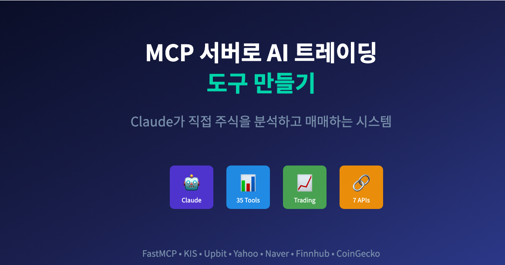
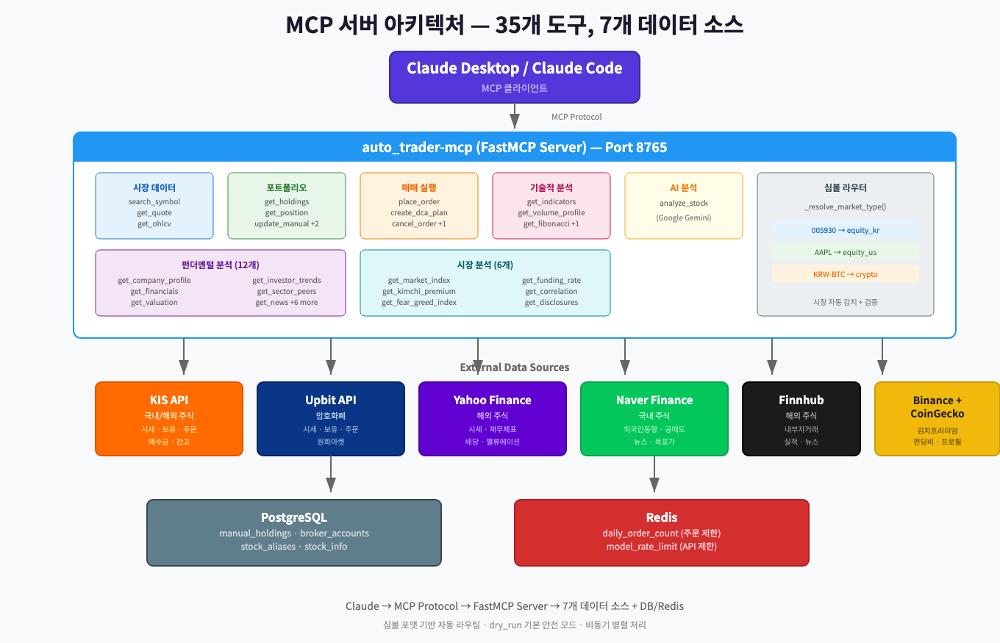
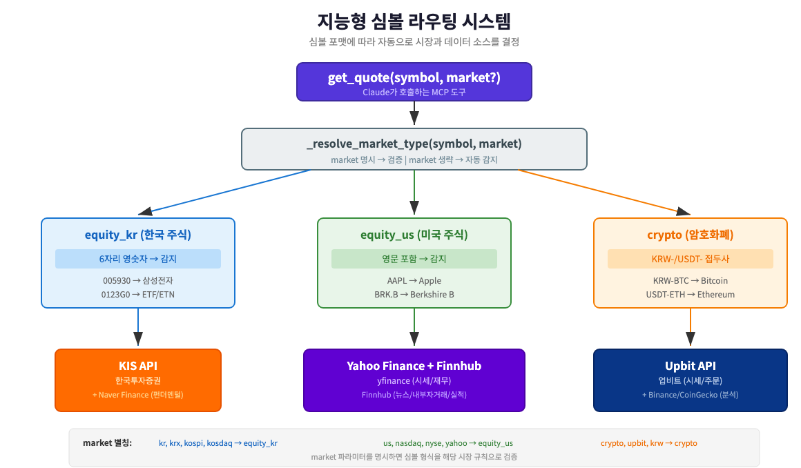

# MCP 서버로 AI 트레이딩 도구 만들기: Claude가 직접 주식을 분석한다



> 이 글은 AI 기반 자동매매 시스템 시리즈의 **11편**입니다.
>
> **전체 시리즈:**
> - [1편: 한투 API로 실시간 주식 데이터 수집하기](https://mgh3326.tistory.com/227)
> - [2편: yfinance로 애플·테슬라 분석하기](https://mgh3326.tistory.com/228)
> - [3편: Upbit으로 비트코인 24시간 분석하기](https://mgh3326.tistory.com/229)
> - [4편: AI 분석 결과 DB에 저장하기](https://mgh3326.tistory.com/230)
> - [5편: Upbit 웹 트레이딩 대시보드 구축하기](https://mgh3326.tistory.com/232)
> - [6편: 실전 운영을 위한 모니터링 시스템 구축](https://mgh3326.tistory.com/233)
> - [7편: 라즈베리파이 홈서버에 자동 HTTPS로 안전하게 배포하기](https://mgh3326.tistory.com/234)
> - [8편: JWT 인증 시스템으로 안전한 웹 애플리케이션 구축하기](https://mgh3326.tistory.com/235)
> - [9편: KIS 국내/해외 주식 자동 매매 시스템 구축하기](https://mgh3326.tistory.com/237)
> - [10편: 다중 브로커 통합 포트폴리오 시스템 구축하기](https://mgh3326.tistory.com/238)
> - **11편: MCP 서버로 AI 트레이딩 도구 만들기** ← 현재 글

## 들어가며

### MCP란 무엇인가?

**MCP(Model Context Protocol)**는 AI 모델이 외부 도구와 데이터 소스에 접근할 수 있게 해주는 표준 프로토콜입니다. 쉽게 말해, Claude Desktop이나 Claude Code 같은 AI 클라이언트가 우리가 만든 서버의 함수를 직접 호출할 수 있게 해줍니다.

```
기존 방식:
사용자 → "삼성전자 현재가 알려줘" → Claude → "저는 실시간 데이터에 접근할 수 없습니다"

MCP 연동 후:
사용자 → "삼성전자 현재가 알려줘" → Claude → [get_quote("005930")] → "71,500원입니다"
```

### 왜 MCP 서버를 만들었나?

**원래 목적은 [OpenClaw](https://openclaw.ai) 연동입니다.** [Infra-5편](https://mgh3326.tistory.com/242)에서 OpenClaw를 통해 LLM 분석을 오프로딩하는 구조를 만들었는데, OpenClaw가 MCP 클라이언트를 지원하기 때문에 우리 트레이딩 시스템의 데이터를 MCP 도구로 노출하면 OpenClaw 에이전트가 직접 시세 조회, 포트폴리오 확인, 매매까지 할 수 있습니다.

개발 과정에서 **로컬 테스트용으로 Claude Desktop과 Claude Code를 사용**했는데, 결과가 기대 이상이었습니다. 35개 도구를 자유자재로 조합하여 종합 분석 보고서를 만들어주는 것을 보고, **MCP 서버를 배포하여 Claude Desktop에서도 원격으로 접속**할 수 있게 할 계획입니다.

```
활용 시나리오:

1. OpenClaw (프로덕션 — 메신저 기반)
   사용자 → Telegram/WhatsApp → OpenClaw Agent → [MCP 도구] → 분석/매매

2. Claude Desktop / Claude Code (배포 서버에 원격 접속)
   사용자 → Claude → [배포된 MCP 서버] → 어디서든 분석/매매
```

지금까지 우리 시스템은 웹 대시보드와 Celery 태스크를 통해 동작했습니다. 하지만 실제 투자를 하다 보면 이런 상황이 생깁니다:

```
"삼성전자 최근 외국인 매수 동향이 어때?"
"테슬라 RSI가 과매도 구간인지 확인해줘"
"내 포트폴리오에서 가장 수익률 높은 종목이 뭐야?"
"비트코인 김치 프리미엄이 지금 몇 %야?"
```

이런 질문에 대해 웹 대시보드를 열고 직접 확인하는 대신, **AI 에이전트에게 직접 물어보면 되는 시스템**을 만들고 싶었습니다.

### 이번 편에서 만들 것

```
MCP 서버 (auto_trader-mcp)
├── 시장 데이터 도구 (3개)
│   ├── search_symbol   - 종목 검색
│   ├── get_quote       - 현재가 조회
│   └── get_ohlcv       - 차트 데이터 (일봉/주봉/월봉)
│
├── 포트폴리오 관리 (5개)
│   ├── get_holdings     - 전체 보유 종목 조회
│   ├── get_position     - 특정 종목 포지션
│   ├── get_cash_balance - 예수금 조회
│   ├── update_manual_holdings - 수동 잔고 업데이트
│   └── simulate_avg_cost - 평단가 시뮬레이션
│
├── 매매 실행 (4개)
│   ├── place_order     - 매수/매도 주문
│   ├── get_open_orders - 미체결 주문 조회
│   ├── cancel_order    - 주문 취소
│   └── create_dca_plan - DCA 분할매수 계획
│
├── 기술적 분석 (4개)
│   ├── get_indicators         - 기술 지표 (RSI, MACD, 볼린저 등)
│   ├── get_volume_profile     - 거래량 프로파일
│   ├── get_support_resistance - 지지/저항선
│   └── get_fibonacci          - 피보나치 되돌림
│
├── 펀더멘털 분석 (12개)
│   ├── get_company_profile      - 기업 프로필
│   ├── get_crypto_profile       - 암호화폐 프로필
│   ├── get_financials           - 재무제표
│   ├── get_valuation            - PER/PBR/ROE
│   ├── get_investment_opinions  - 애널리스트 의견
│   ├── get_insider_transactions - 내부자 거래
│   ├── get_earnings_calendar    - 실적 캘린더
│   ├── get_investor_trends      - 외국인/기관 동향
│   ├── get_short_interest       - 공매도 현황
│   ├── get_sector_peers         - 동종 업종 비교
│   ├── get_dividends            - 배당 정보
│   └── get_news                 - 뉴스
│
├── 시장 분석 (6개)
│   ├── get_market_index    - 시장 지수
│   ├── get_kimchi_premium  - 김치 프리미엄
│   ├── get_funding_rate    - 펀딩비
│   ├── get_fear_greed_index - 공포/탐욕 지수
│   ├── get_correlation     - 상관관계 분석
│   └── get_disclosures     - 공시 정보 (DART)
│
└── AI 분석 (1개)
    └── analyze_stock       - AI 종합 분석
```

**총 35개 도구**, 7개 외부 데이터 소스를 통합한 MCP 서버입니다.

## 시스템 아키텍처


*MCP 서버 아키텍처 — Claude가 7개 데이터 소스에 접근*

### 핵심 설계

**1. FastMCP 프레임워크**

```python
# app/mcp_server/main.py
from fastmcp import FastMCP

mcp = FastMCP(
    name="auto_trader-mcp",
    instructions=(
        "Read-only market and holdings lookup tools for auto_trader "
        "(symbol search, quote, holdings, OHLCV, indicators)."
    ),
    version="0.1.0",
)

register_tools(mcp)  # 35개 도구 등록
```

FastMCP는 Python의 MCP 서버 구현체로, `@mcp.tool()` 데코레이터로 간편하게 도구를 등록할 수 있습니다.

**2. 3가지 전송 방식 지원**

```python
mcp_type = _env("MCP_TYPE", "streamable-http")

if mcp_type == "stdio":
    mcp.run(transport="stdio")           # Claude Desktop 직접 연결
elif mcp_type == "sse":
    mcp.run(transport="sse", ...)        # Server-Sent Events
elif mcp_type == "streamable-http":
    mcp.run(transport="streamable-http", ...)  # HTTP 스트리밍 (기본값)
```

| 전송 방식 | 용도 | 장점 |
|----------|------|------|
| `stdio` | Claude Desktop 직접 연결 | 가장 간단한 설정 |
| `sse` | 네트워크 서버 | 실시간 스트리밍 |
| `streamable-http` | 프로덕션 서버 | HTTP 기반, 가장 안정적 |

**3. 7개 데이터 소스 통합**

| 데이터 소스 | 대상 시장 | 제공 데이터 |
|------------|----------|------------|
| KIS API | 국내/해외 주식 | 시세, 보유 종목, 주문 |
| Upbit API | 암호화폐 | 시세, 보유 코인, 주문 |
| Yahoo Finance | 해외 주식 | 시세, 재무제표, 배당 |
| Naver Finance | 국내 주식 | 기업 프로필, 외국인 동향, 공매도 |
| Finnhub | 해외 주식 | 뉴스, 내부자 거래, 실적 |
| Binance | 암호화폐 | 펀딩비, USDT 가격 (김치 프리미엄용) |
| CoinGecko | 암호화폐 | 코인 프로필, 시가총액 |

## 지능형 심볼 라우팅


*심볼 포맷에 따른 자동 시장 감지 로직*

### 자동 시장 감지

MCP 도구를 사용할 때 심볼만 입력하면 시장을 자동으로 감지합니다:

```python
# app/mcp_server/tools.py

def _is_korean_equity_code(symbol: str) -> bool:
    """한국 주식 코드: 6자리 영숫자 (예: 005930, 0123G0)"""
    s = symbol.strip().upper()
    return len(s) == 6 and s.isalnum()

def _is_crypto_market(symbol: str) -> bool:
    """암호화폐: KRW-/USDT- 접두사"""
    s = symbol.strip().upper()
    return s.startswith("KRW-") or s.startswith("USDT-")

def _is_us_equity_symbol(symbol: str) -> bool:
    """미국 주식: 영문 포함, 암호화폐 아닌 것"""
    s = symbol.strip().upper()
    return (not _is_crypto_market(s)) and any(c.isalpha() for c in s)
```

**사용 예시:**
```
get_quote("005930")     → 한국주식 (KIS) → 삼성전자 71,500원
get_quote("AAPL")       → 미국주식 (Yahoo) → Apple $185.50
get_quote("KRW-BTC")    → 암호화폐 (Upbit) → 비트코인 145,500,000원
```

### market 파라미터로 명시적 지정

자동 감지가 애매한 경우 `market` 파라미터로 명시할 수 있습니다:

```python
_MARKET_ALIASES = {
    # 한국 주식
    "kr": "equity_kr", "krx": "equity_kr",
    "kospi": "equity_kr", "kosdaq": "equity_kr",

    # 미국 주식
    "us": "equity_us", "nasdaq": "equity_us",
    "nyse": "equity_us",

    # 암호화폐
    "crypto": "crypto", "upbit": "crypto",
}
```

### 시장별 데이터 소스 자동 선택

```python
@mcp.tool(name="get_quote", description="...")
async def get_quote(symbol: str, market: str | None = None) -> dict:
    market_type, symbol = _resolve_market_type(symbol, market)

    if market_type == "crypto":
        return await _fetch_quote_crypto(symbol)      # Upbit
    elif market_type == "equity_kr":
        return await _fetch_quote_equity_kr(symbol)    # KIS
    else:
        return await _fetch_quote_equity_us(symbol)    # Yahoo Finance
```

이 패턴은 `get_quote`, `get_ohlcv`, `get_indicators`, `get_company_profile` 등 대부분의 도구에서 동일하게 적용됩니다.

## 포트폴리오 통합 조회

### 5개 계좌를 하나로

```python
@mcp.tool(name="get_holdings", description="...")
async def get_holdings(
    account: str | None = None,     # kis/upbit/toss/samsung_pension/isa
    market: str | None = None,      # kr/us/crypto
    include_current_price: bool = True,
    minimum_value: float | None = 1000.0,  # 최소 평가액 필터
) -> dict[str, Any]:
```

**지원 계좌:**
- `kis` — 한국투자증권 (API 자동 연동)
- `upbit` — 업비트 (API 자동 연동)
- `toss` — 토스증권 (수동 등록)
- `samsung_pension` — 삼성 퇴직연금 (수동 등록)
- `isa` — ISA 계좌 (수동 등록)

### 3단계 데이터 수집

```python
async def _collect_portfolio_positions(
    account, market, include_current_price
):
    positions = []

    # 1단계: KIS 보유 종목 (국내 + 해외)
    kis_domestic = await kis_client.fetch_my_stocks()
    kis_overseas = await kis_client.fetch_my_overseas_stocks()

    # 2단계: Upbit 보유 코인
    upbit_coins = await upbit_service.fetch_my_coins()

    # 3단계: 수동 등록 종목 (토스, 삼성연금, ISA)
    async with AsyncSessionLocal() as db:
        manual = await ManualHoldingsService(db).get_holdings_by_user(
            user_id=_MCP_USER_ID
        )

    # 현재가 일괄 조회 (옵션)
    if include_current_price:
        await _batch_fetch_prices(positions)

    return positions
```

### 스크린샷 기반 잔고 업데이트

토스 같은 API 없는 브로커의 잔고를 스크린샷으로 업데이트할 수 있습니다:

```python
@mcp.tool(name="update_manual_holdings", description="...")
async def update_manual_holdings(
    holdings: list[dict],       # 파싱된 보유 종목 데이터
    broker: str = "toss",       # 브로커 타입
    account_name: str = "기본 계좌",
    dry_run: bool = True,       # 미리보기 모드
) -> dict[str, Any]:
```

**동작 원리:**
1. Claude가 증권 앱 스크린샷을 이미지로 분석
2. 종목명, 수량, 평가금액, 손익을 파싱
3. `update_manual_holdings`로 DB 업데이트

```python
# ScreenshotHoldingsService - 3단계 심볼 해석
async def _resolve_symbol(self, stock_name, market_section, broker):
    # 1단계: StockAlias DB 검색 ("버크셔 해서웨이 B" → "BRK.B")
    ticker = await alias_service.get_ticker_by_alias(stock_name, market_type)
    if ticker:
        return ticker, market_type.value, "alias"

    # 2단계: 마스터 데이터 검색 ("삼성전자" → "005930")
    if market_type == MarketType.KR:
        ticker = get_kospi_name_to_code().get(stock_name)

    # 3단계: Fallback - 이름 그대로 대문자
    return stock_name.upper(), market_type.value, "fallback"
```

## 기술적 분석 도구

### 7가지 기술 지표

```python
@mcp.tool(name="get_indicators", description="...")
async def get_indicators(
    symbol: str,
    indicators: list[str],  # ["sma", "rsi", "macd", "bollinger", ...]
    market: str | None = None,
) -> dict[str, Any]:
```

**지원 지표:**

| 지표 | 설명 | 계산 |
|------|------|------|
| `sma` | 단순 이동평균 | 5/10/20/50/200일 |
| `ema` | 지수 이동평균 | 12/26/50일 |
| `rsi` | 상대강도지수 | 14일 기준, 0~100 |
| `macd` | MACD | 12/26/9 기본값 |
| `bollinger` | 볼린저 밴드 | 20일, 2σ |
| `atr` | 평균진폭 | 14일 |
| `pivot` | 피봇 포인트 | Standard Pivot |

**사용 예시 (Claude와의 대화):**
```
사용자: "삼성전자의 RSI와 볼린저 밴드 분석해줘"

Claude: [get_indicators("005930", ["rsi", "bollinger"])]

→ RSI: 32.5 (과매도 구간에 근접)
→ 볼린저: 현재가 71,500원이 하단 밴드(70,200원) 근처
→ 단기적으로 반등 가능성이 있어 보입니다
```

### 거래량 프로파일

```python
@mcp.tool(name="get_volume_profile", description="...")
async def get_volume_profile(
    symbol: str,
    market: str | None = None,
    period: int = 60,    # 60일간 데이터
    bins: int = 20,      # 20개 가격 구간
) -> dict[str, Any]:
```

**반환값:**
- **POC (Point of Control)**: 가장 거래량이 많은 가격대
- **Value Area (70%)**: 전체 거래량의 70%가 집중된 가격 범위
- **가격별 거래량 분포**: bins개 구간의 거래량

### 지지/저항선 자동 감지

```python
@mcp.tool(name="get_support_resistance", description="...")
async def get_support_resistance(
    symbol: str,
    market: str | None = None,
) -> dict[str, Any]:
```

최근 차트 데이터에서 자동으로 지지선과 저항선을 감지합니다. 피봇 포인트, 볼린저 밴드, 최근 고저점 등을 종합적으로 분석합니다.

## 펀더멘털 분석 도구

### 네이버 금융 연동 (국내 주식)

네이버 금융의 모바일 JSON API와 웹 페이지를 활용하여 다양한 데이터를 수집합니다:

```python
# app/services/naver_finance.py

async def fetch_company_profile(code: str) -> dict:
    """기업 프로필 (이름, 섹터, 시가총액)"""

async def fetch_financials(code: str) -> dict:
    """재무제표 (매출, 영업이익, 순이익)"""

async def fetch_investor_trends(code: str, days: int = 20) -> dict:
    """외국인/기관 매수 동향"""

async def fetch_investment_opinions(code: str) -> dict:
    """애널리스트 목표가 및 투자의견"""

async def fetch_valuation(code: str) -> dict:
    """밸류에이션 (PER, PBR, ROE, 배당수익률)"""

async def fetch_short_interest(code: str, days: int = 20) -> dict:
    """공매도 잔고 및 거래량"""

async def fetch_news(code: str, limit: int = 10) -> dict:
    """최신 뉴스"""
```

**한국어 숫자 파싱:**
```python
def _parse_korean_number(text: str) -> float | None:
    """'1조 2,345억' → 1234500000000"""
    # totalInfos 값에서 '배', '원', '%' 접미사 제거 후 파싱
```

### Finnhub 연동 (해외 주식)

```python
# Finnhub API를 통한 해외 주식 데이터
@mcp.tool(name="get_insider_transactions", description="...")
async def get_insider_transactions(symbol: str, limit: int = 20):
    """내부자 거래 내역 (CEO, CFO 등의 매수/매도)"""

@mcp.tool(name="get_earnings_calendar", description="...")
async def get_earnings_calendar(symbol: str, days: int = 30):
    """실적 발표 캘린더 (예상 EPS vs 실제 EPS)"""
```

### 동종 업종 비교

```python
@mcp.tool(name="get_sector_peers", description="...")
async def get_sector_peers(
    symbol: str,
    market: str | None = None,
    limit: int = 6,
) -> dict[str, Any]:
```

**국내 주식**: 네이버 금융 `industryCompareInfo`에서 동종 업종 6개사 비교
**해외 주식**: Finnhub `company_peers()` + yfinance 밸류에이션 데이터

## 매매 실행 도구

### 안전한 주문 시스템

```python
@mcp.tool(name="place_order", description="...")
async def place_order(
    symbol: str,
    side: Literal["buy", "sell"],
    order_type: Literal["limit", "market"] = "limit",
    quantity: float | None = None,
    price: float | None = None,
    amount: float | None = None,      # KRW 금액 기반 매수
    dry_run: bool = True,             # 기본값: 시뮬레이션
    reason: str = "",                 # 주문 사유
) -> dict[str, Any]:
```

**안전 장치:**
- `dry_run=True`가 기본값 — 명시적으로 `False`로 설정해야 실제 주문
- 1회 최대 100만원 제한
- 일일 최대 20건 주문 제한 (Redis 카운터)
- 매도 시 보유 수량 초과 검증

### DCA 분할매수 계획

```python
@mcp.tool(name="create_dca_plan", description="...")
async def create_dca_plan(
    symbol: str,
    total_amount: float,        # 총 투자 금액
    num_splits: int,            # 분할 횟수
    strategy: str = "equal",    # equal/aggressive/rsi_weighted
    interval_days: int | None = None,
    market: str | None = None,
    dry_run: bool = True,
) -> dict[str, Any]:
```

**3가지 분할 전략:**

| 전략 | 설명 | 예시 (100만원, 4분할) |
|------|------|---------------------|
| `equal` | 균등 분할 | 25만원 × 4회 |
| `aggressive` | 초반 집중 | 40/30/20/10만원 |
| `rsi_weighted` | RSI 기반 가중치 | RSI 낮을수록 더 많이 매수 |

## 시장 분석 도구

### 김치 프리미엄

```python
@mcp.tool(name="get_kimchi_premium", description="...")
async def get_kimchi_premium(
    symbols: list[str] | None = None,  # None이면 주요 코인 전체
) -> dict[str, Any]:
```

Upbit(KRW)와 Binance(USDT) 가격을 비교하여 김치 프리미엄을 계산합니다:

```
비트코인:
  Upbit:   145,500,000 KRW
  Binance: 105,200 USDT × 1,350 환율 = 142,020,000 KRW
  김치 프리미엄: +2.45%
```

### 공포/탐욕 지수

```python
@mcp.tool(name="get_fear_greed_index", description="...")
async def get_fear_greed_index(days: int = 7) -> dict[str, Any]:
    """Alternative.me API를 통한 암호화폐 공포/탐욕 지수"""
```

| 값 | 분류 |
|----|------|
| 0~24 | Extreme Fear (극단적 공포) |
| 25~49 | Fear (공포) |
| 50~74 | Greed (탐욕) |
| 75~100 | Extreme Greed (극단적 탐욕) |

### DART 공시 정보

```python
@mcp.tool(name="get_disclosures", description="...")
async def get_disclosures(
    symbol: str,
    limit: int = 20,
    report_type: str | None = None,  # 보고서 유형 필터
) -> dict[str, Any]:
```

OpenDART API를 통해 국내 기업의 공시 정보를 조회합니다. 사업보고서, 분기보고서, 주요 경영사항 등을 확인할 수 있습니다.

## 에러 처리 패턴

### 통일된 에러 응답

```python
def _error_payload(
    *,
    source: str,           # "kis", "upbit", "yahoo", "naver", ...
    message: str,
    symbol: str | None = None,
    instrument_type: str | None = None,
    query: str | None = None,
) -> dict[str, Any]:
    """통일된 에러 응답 생성"""
    payload: dict[str, Any] = {"error": message, "source": source}
    if symbol:
        payload["symbol"] = symbol
    if instrument_type:
        payload["instrument_type"] = instrument_type
    if query:
        payload["query"] = query
    return payload
```

**모든 도구가 동일한 에러 포맷을 사용:**
```json
{
  "error": "Stock not found",
  "source": "kis",
  "symbol": "999999",
  "instrument_type": "equity_kr"
}
```

### 부분 실패 허용

보유 종목 조회처럼 여러 심볼을 한 번에 처리하는 도구는 개별 심볼의 실패를 허용합니다:

```python
# 보유 종목 현재가 일괄 조회
for position in positions:
    try:
        price = await get_current_price(position["symbol"])
        position["current_price"] = price
    except Exception as exc:
        errors.append({"symbol": position["symbol"], "error": str(exc)})
        # 실패해도 다음 종목 계속 처리

# 응답에 에러 목록 포함
return {"accounts": accounts, "errors": errors}
```

## Docker 배포

### docker-compose.prod.yml

```yaml
mcp:
  image: ghcr.io/mgh3326/auto_trader:prod
  container_name: auto_trader_mcp_prod
  command: python -m app.mcp_server.main
  network_mode: host
  env_file: .env.prod
  environment:
    MCP_TYPE: streamable-http
    MCP_HOST: 0.0.0.0
    MCP_PORT: 8765
    MCP_PATH: /mcp
  volumes:
    - ./tmp:/app/tmp
    - ./logs:/app/logs
  deploy:
    resources:
      limits:
        memory: 512M
  restart: unless-stopped
```

### 간편 실행 스크립트

```bash
#!/bin/bash
# scripts/mcp_server.sh
cd "$(dirname "$0")/.." || exit 1
exec uv run python -m app.mcp_server.main
```

## 클라이언트 연동

### OpenClaw 연동 (프로덕션)

[Infra-5편](https://mgh3326.tistory.com/242)에서 구축한 OpenClaw와 연동하면, Telegram/WhatsApp 등 메신저를 통해 AI 에이전트가 직접 트레이딩 도구를 사용합니다.

```
OpenClaw Agent가 MCP 서버에 접속:
→ http://your-server:8765/mcp (streamable-http)

사용자 (Telegram) → "삼성전자 분석해줘"
→ OpenClaw Agent → [get_quote + get_indicators + get_valuation]
→ 종합 분석 결과를 Telegram으로 응답
```

OpenClaw는 MCP 클라이언트를 기본 지원하기 때문에, 서버를 배포해 두면 별도 설정 없이 에이전트가 35개 도구를 모두 활용할 수 있습니다. 라즈베리파이에서 운영 중인 auto_trader와 같은 네트워크에서 동작하므로 지연 시간도 최소화됩니다.

### Claude Desktop / Claude Code 연동

MCP 서버를 배포하면 Claude Desktop에서 원격 서버에 접속하여 어디서든 트레이딩 도구를 사용할 수 있습니다.

**claude_desktop_config.json (배포 서버 원격 접속):**
```json
{
  "mcpServers": {
    "auto_trader": {
      "url": "https://your-server.com:8765/mcp"
    }
  }
}
```

**로컬 개발 시:**
```json
{
  "mcpServers": {
    "auto_trader": {
      "url": "http://localhost:8765/mcp"
    }
  }
}
```

또는 stdio 모드로 직접 연결:
```json
{
  "mcpServers": {
    "auto_trader": {
      "command": "/path/to/scripts/mcp_server.sh"
    }
  }
}
```

### 실제 대화 예시

```
사용자: 내 포트폴리오 전체 현황을 알려줘

Claude: [get_holdings()]
→ 총 3개 계좌에서 15개 종목을 보유하고 있습니다.

┌─────────────┬───────┬──────────┬──────────┐
│ 계좌        │ 종목수 │ 평가금액  │ 수익률   │
├─────────────┼───────┼──────────┼──────────┤
│ 한투 (KIS)  │ 8     │ 12,456만 │ +5.23%  │
│ 토스        │ 5     │ 8,230만  │ +2.15%  │
│ 업비트      │ 2     │ 1,450만  │ -3.45%  │
└─────────────┴───────┴──────────┴──────────┘

수익률이 가장 높은 종목은 NAVER(+8.59%)이고,
가장 낮은 종목은 비트코인(-3.45%)입니다.
```

```
사용자: 삼성전자를 기술적 분석과 펀더멘털 분석 해줘

Claude:
[get_quote("005930")]
[get_indicators("005930", ["rsi", "macd", "bollinger"])]
[get_valuation("005930")]
[get_investor_trends("005930")]

→ 기술적 분석:
  - RSI(14): 32.5 (과매도 근접)
  - MACD: 데드크로스 발생 후 수렴 중
  - 볼린저 하단: 70,200원 (현재가 71,500원 근접)

→ 펀더멘털:
  - PER: 12.3배 (업종 평균 15.2배 대비 저평가)
  - PBR: 1.1배
  - 외국인 5일 연속 순매수 (+1,245억원)

→ 종합: 기술적으로 과매도 구간이고 외국인 매수세가
  이어지고 있어 단기 반등 가능성이 높아 보입니다.
```

## 테스트

### 8,000줄의 테스트 코드

```bash
# 전체 MCP 서버 테스트
uv run pytest tests/test_mcp_server_tools.py -v

# 네이버 금융 서비스 테스트
uv run pytest tests/test_naver_finance.py -v

# 스크린샷 잔고 업데이트 테스트
uv run pytest tests/test_screenshot_holdings.py -v

# 환경 유틸리티 테스트
uv run pytest tests/test_mcp_server_env_utils.py -v
```

### DummyMCP 패턴

테스트에서는 `DummyMCP` 클래스로 실제 MCP 서버 없이 도구를 테스트합니다:

```python
class DummyMCP:
    """테스트용 MCP 서버 모킹"""
    def __init__(self):
        self._tools = {}

    def tool(self, *, name, description=""):
        def decorator(func):
            self._tools[name] = func
            return func
        return decorator

# 도구 등록
mcp = DummyMCP()
register_tools(mcp)

# 도구 호출 테스트
result = await mcp._tools["get_quote"]("005930")
assert result["symbol"] == "005930"
```

### 모킹 패턴

외부 API 호출을 모킹하여 빠르고 안정적인 테스트를 작성합니다:

```python
@pytest.fixture
def mock_kis_client(monkeypatch):
    """KIS API 모킹"""
    async def mock_fetch_stocks():
        return [
            {"symbol": "005930", "name": "삼성전자",
             "quantity": 50, "avg_buy_price": 68200, ...}
        ]
    monkeypatch.setattr(
        mcp_tools, "_fetch_kis_domestic_stocks",
        AsyncMock(return_value=mock_fetch_stocks())
    )

@pytest.fixture
def mock_naver_finance(monkeypatch):
    """네이버 금융 모킹"""
    monkeypatch.setattr(
        mcp_tools.naver_finance, "fetch_company_profile",
        AsyncMock(return_value={"name": "삼성전자", ...})
    )
```

## 마치며

### 배운 교훈

> **"AI에게 도구를 주면, 도구 이상의 것을 해준다"**

단순히 `get_quote`를 제공했을 뿐인데, AI 에이전트는 여러 도구를 조합하여 종합적인 분석 보고서를 작성합니다. `get_indicators`와 `get_valuation`을 함께 호출하여 기술적 분석 + 펀더멘털 분석을 한 번에 제공하고, `get_sector_peers`로 동종 업종과 비교까지 해줍니다. 처음에는 OpenClaw 연동용으로 만들었는데, Claude Desktop으로 로컬 테스트를 해보니 그 자체로도 강력한 투자 도구가 되었습니다.

### 아키텍처의 강점

**1. 심볼만 입력하면 끝:**
- 시장 자동 감지로 사용자가 "한국주식인지 미국주식인지" 신경 쓸 필요 없음
- 7개 데이터 소스의 복잡성을 하나의 인터페이스로 추상화

**2. 안전한 매매:**
- dry_run 기본값으로 실수 방지
- 금액/건수 제한으로 과도한 거래 방지
- 매도 시 보유 수량 검증

**3. 스크린샷으로 잔고 동기화:**
- API 없는 브로커도 지원 (토스, 삼성연금, ISA)
- Claude가 이미지를 분석하여 자동 파싱
- 3단계 심볼 해석 (별칭 → 마스터 → 폴백)

**4. 확장 가능한 구조:**
- 새로운 도구 추가: `@mcp.tool()` 데코레이터 하나면 끝
- 새로운 데이터 소스: `_fetch_*` 함수 추가
- 새로운 시장: `_normalize_market`에 별칭 추가

### 다음 단계

이제 우리의 자동매매 시스템은:
- ✅ 데이터 수집 (한투/Upbit/yfinance)
- ✅ AI 분석 (Gemini)
- ✅ DB 저장 및 정규화
- ✅ 암호화폐 웹 대시보드
- ✅ 모니터링 (Grafana Stack)
- ✅ 프로덕션 배포 (HTTPS + 24시간)
- ✅ JWT 인증 + RBAC
- ✅ 국내/해외 주식 자동 매매
- ✅ 다중 브로커 통합 포트폴리오
- ✅ **MCP 서버 — OpenClaw & Claude 연동** ← 완성!

**다음 계획: 프로덕션 배포**

현재 로컬에서 검증이 완료되었고, 라즈베리파이에 Docker Compose로 배포하여 OpenClaw 에이전트와 상시 연동할 예정입니다. 배포가 완료되면:
- **OpenClaw**: Telegram에서 "삼성전자 분석해줘"로 AI 종합 분석
- **Claude Desktop**: 집이든 사무실이든 원격 MCP 서버에 접속하여 동일한 35개 도구 활용

**추가로 고려할 수 있는 기능:**
- OpenClaw 에이전트의 자동 리밸런싱 워크플로우
- 실시간 WebSocket 기반 알림 도구
- 백테스팅 결과를 AI로 분석
- 다중 사용자 지원 (인증 토큰 기반)

---

**참고 자료:**
- [MCP 공식 문서](https://modelcontextprotocol.io/)
- [FastMCP GitHub](https://github.com/jlowin/fastmcp)
- [OpenClaw — Personal AI Assistant](https://openclaw.ai)
- [한국투자증권 OpenAPI 문서](https://apiportal.koreainvestment.com/)
- [Naver Finance 모바일 API](https://m.stock.naver.com)
- [Finnhub API 문서](https://finnhub.io/docs/api)
- [전체 프로젝트 코드 (GitHub)](https://github.com/mgh3326/auto_trader)
- [PR #114: Add MCP server (market data tools)](https://github.com/mgh3326/auto_trader/pull/114)
