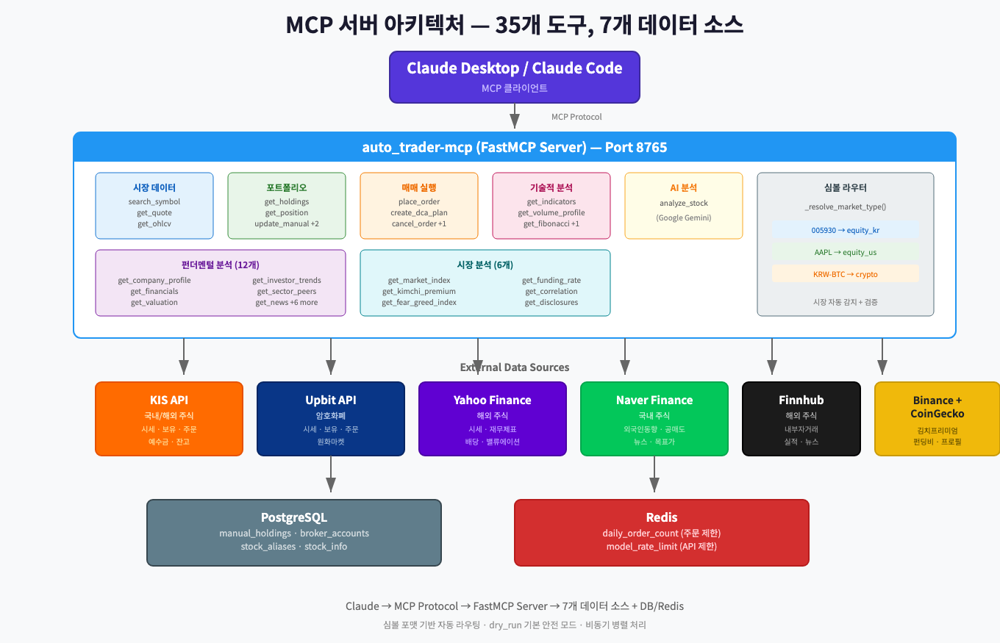
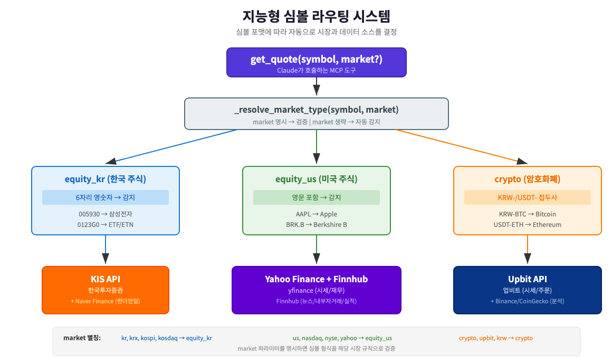

# MCP 서버로 AI 트레이딩 도구 만들기: Claude가 직접 주식을 분석한다


## 콜백 파이프라인을 만들고, 한 달 만에 방향을 뒤집었다

[지난 Infra-5편](https://mgh3326.tistory.com/244)에서 OpenClaw 콜백으로 LLM 분석을 오프로딩하는 구조를 만들었습니다. auto_trader가 분석 요청을 보내면, 외부 에이전트가 분석해서 콜백으로 결과를 돌려주는 방식이었죠. 글 말미에 "다음 단계: HMAC 서명, 재시도 로직, 배치 분석"까지 적어뒀습니다.

그 다음 단계는 하나도 진행하지 않았습니다.

콜백 구조를 운영해 보니 근본적인 어색함이 있었습니다. 제가 프롬프트를 조립해서 LLM에게 보내면, LLM은 제가 담아준 데이터만 볼 수 있습니다. "외국인 수급도 봐야 하는데"라는 판단은 결국 프롬프트를 조립하는 제 코드가 미리 해야 합니다. 분석의 주도권이 여전히 파이썬 코드에 있는 겁니다.

그러다 MCP(Model Context Protocol)를 접하고 관점이 뒤집혔습니다. **내가 LLM을 호출하는 게 아니라, LLM 에이전트가 내 시스템의 도구를 호출하게 하면 어떨까?** "삼성전자 분석해줘"라고 하면 에이전트가 알아서 현재가를 조회하고, RSI를 확인하고, 외국인 수급이 궁금하면 그것도 스스로 가져오는 구조입니다.


*왼쪽: 콜백 파이프라인 시절 — 내가 조립한 데이터만 받아먹는 LLM. 오른쪽: MCP 전환 후 — 도구함에서 직접 꺼내 쓰는 에이전트*

이번 편은 auto_trader를 MCP 도구 서버로 바꾼 이야기입니다.

## MCP란 무엇인가

<b>MCP(Model Context Protocol)</b>는 AI 모델이 외부 도구와 데이터 소스에 접근할 수 있게 해주는 표준 프로토콜입니다. Claude Desktop이나 Claude Code 같은 AI 클라이언트가 우리가 만든 서버의 함수를 직접 호출할 수 있게 해줍니다.

```
기존 방식:
사용자 → "삼성전자 현재가 알려줘" → Claude → "저는 실시간 데이터에 접근할 수 없습니다"

MCP 연동 후:
사용자 → "삼성전자 현재가 알려줘" → Claude → [get_quote("005930")] → "71,500원입니다"
```

처음 목적은 OpenClaw 연동이었습니다. OpenClaw가 MCP 클라이언트를 지원하니, 트레이딩 시스템의 데이터를 MCP 도구로 노출하면 메신저의 에이전트가 직접 시세 조회와 포트폴리오 확인을 할 수 있습니다. 그런데 개발 중 로컬 테스트용으로 Claude Desktop을 붙여 보니 결과가 기대 이상이었습니다. 35개 도구를 자유자재로 조합해 종합 분석 보고서를 만들어내는 걸 보고, 이게 사이드 기능이 아니라 시스템의 새 중심이 되겠다고 확신했습니다.

## 이번 편에서 만든 것

```
MCP 서버 (auto_trader-mcp)
├── 시장 데이터 도구 (3개)
│   ├── search_symbol   - 종목 검색
│   ├── get_quote       - 현재가 조회
│   └── get_ohlcv       - 차트 데이터 (일봉/주봉/월봉)
│
├── 포트폴리오 관리 (5개)
│   ├── get_holdings     - 전체 보유 종목 조회
│   ├── get_position     - 특정 종목 포지션
│   ├── get_cash_balance - 예수금 조회
│   ├── update_manual_holdings - 수동 잔고 업데이트
│   └── simulate_avg_cost - 평단가 시뮬레이션
│
├── 매매 실행 (3개)
│   ├── place_order     - 매수/매도 주문
│   ├── get_open_orders - 미체결 주문 조회
│   └── cancel_order    - 주문 취소
│
├── 기술적 분석 (4개)
│   ├── get_indicators         - 기술 지표 (RSI, MACD, 볼린저 등)
│   ├── get_volume_profile     - 거래량 프로파일
│   ├── get_support_resistance - 지지/저항선
│   └── get_fibonacci          - 피보나치 되돌림
│
├── 펀더멘털 분석 (12개)
│   ├── get_company_profile / get_crypto_profile
│   ├── get_financials / get_valuation
│   ├── get_investment_opinions / get_insider_transactions
│   ├── get_earnings_calendar / get_investor_trends
│   ├── get_short_interest / get_sector_peers
│   └── get_dividends / get_news
│
├── 시장 분석 (6개)
│   ├── get_market_index / get_kimchi_premium
│   ├── get_funding_rate / get_fear_greed_index
│   └── get_correlation / get_disclosures (DART)
│
└── AI 분석 (1개)
    └── analyze_stock       - AI 종합 분석
```

총 35개 도구, 7개 외부 데이터 소스를 통합한 MCP 서버입니다. (이 숫자가 나중에 어떻게 되는지는 글 끝에서 다시 이야기합니다.)

## 시스템 아키텍처


*MCP 서버 아키텍처 — Claude가 7개 데이터 소스에 접근*

### FastMCP 프레임워크

```python
# app/mcp_server/main.py
from fastmcp import FastMCP

mcp = FastMCP(
    name="auto_trader-mcp",
    instructions=(
        "Read-only market and holdings lookup tools for auto_trader "
        "(symbol search, quote, holdings, OHLCV, indicators)."
    ),
    version="0.1.0",
)

register_tools(mcp)  # 35개 도구 등록
```

FastMCP는 Python의 MCP 서버 구현체로, `@mcp.tool()` 데코레이터 하나로 함수를 도구로 등록합니다.

전송 방식은 세 가지를 지원하게 했습니다. Claude Desktop에 직접 붙일 때는 `stdio`, 네트워크로 띄울 때는 `sse` 또는 `streamable-http`를 씁니다. 프로덕션은 HTTP 기반이라 가장 안정적인 `streamable-http`를 기본값으로 잡았습니다.

```python
mcp_type = _env("MCP_TYPE", "streamable-http")

if mcp_type == "stdio":
    mcp.run(transport="stdio")           # Claude Desktop 직접 연결
elif mcp_type == "sse":
    mcp.run(transport="sse", ...)
elif mcp_type == "streamable-http":
    mcp.run(transport="streamable-http", ...)  # 기본값
```

### 7개 데이터 소스 통합

| 데이터 소스 | 대상 시장 | 제공 데이터 |
|------------|----------|------------|
| KIS API | 국내/해외 주식 | 시세, 보유 종목, 주문 |
| Upbit API | 암호화폐 | 시세, 보유 코인, 주문 |
| Yahoo Finance | 해외 주식 | 시세, 재무제표, 배당 |
| Naver Finance | 국내 주식 | 기업 프로필, 외국인 동향, 공매도 |
| Finnhub | 해외 주식 | 뉴스, 내부자 거래, 실적 |
| Binance | 암호화폐 | 펀딩비, USDT 가격 (김치 프리미엄용) |
| CoinGecko | 암호화폐 | 코인 프로필, 시가총액 |

시리즈 1~10편에서 하나씩 붙여온 데이터 소스들이 여기서 전부 한 인터페이스 뒤로 들어갑니다.

## 지능형 심볼 라우팅


*심볼 포맷에 따른 자동 시장 감지 로직*

에이전트가 도구를 쓸 때 "이건 한국주식이니까 KIS로 조회해줘" 같은 걸 신경 쓰게 하고 싶지 않았습니다. 심볼만 주면 시장을 자동으로 감지합니다.

```python
# app/mcp_server/tools.py

def _is_korean_equity_code(symbol: str) -> bool:
    """한국 주식 코드: 6자리 영숫자 (예: 005930, 0123G0)"""
    s = symbol.strip().upper()
    return len(s) == 6 and s.isalnum()

def _is_crypto_market(symbol: str) -> bool:
    """암호화폐: KRW-/USDT- 접두사"""
    s = symbol.strip().upper()
    return s.startswith("KRW-") or s.startswith("USDT-")

def _is_us_equity_symbol(symbol: str) -> bool:
    """미국 주식: 영문 포함, 암호화폐 아닌 것"""
    s = symbol.strip().upper()
    return (not _is_crypto_market(s)) and any(c.isalpha() for c in s)
```

```
get_quote("005930")     → 한국주식 (KIS) → 삼성전자 71,500원
get_quote("AAPL")       → 미국주식 (Yahoo) → Apple $185.50
get_quote("KRW-BTC")    → 암호화폐 (Upbit) → 비트코인 145,500,000원
```

자동 감지가 애매하면 `market` 파라미터로 명시할 수 있고, `kr`/`kospi`/`krx` 같은 별칭도 전부 받아줍니다. 시장이 정해지면 데이터 소스가 자동으로 선택됩니다:

```python
@mcp.tool(name="get_quote", description="...")
async def get_quote(symbol: str, market: str | None = None) -> dict:
    market_type, symbol = _resolve_market_type(symbol, market)

    if market_type == "crypto":
        return await _fetch_quote_crypto(symbol)      # Upbit
    elif market_type == "equity_kr":
        return await _fetch_quote_equity_kr(symbol)    # KIS
    else:
        return await _fetch_quote_equity_us(symbol)    # Yahoo Finance
```

이 패턴이 `get_ohlcv`, `get_indicators`, `get_company_profile` 등 대부분의 도구에 똑같이 적용됩니다.

## 포트폴리오 통합 조회

10편에서 만든 다중 브로커 통합 포트폴리오가 MCP 도구로 노출됩니다. API가 있는 계좌(KIS, Upbit)는 자동 연동, API가 없는 계좌(토스, 삼성 퇴직연금, ISA)는 수동 등록분을 합쳐서 하나로 보여줍니다.

```python
@mcp.tool(name="get_holdings", description="...")
async def get_holdings(
    account: str | None = None,     # kis/upbit/toss/samsung_pension/isa
    market: str | None = None,      # kr/us/crypto
    include_current_price: bool = True,
    minimum_value: float | None = 1000.0,  # 최소 평가액 필터
) -> dict[str, Any]:
```

재미있는 건 수동 계좌의 잔고 업데이트 방식입니다. 토스 앱 스크린샷을 Claude에게 보여주면, Claude가 이미지에서 종목명·수량·평가금액을 파싱해서 `update_manual_holdings` 도구로 DB에 넣습니다. 파싱된 종목명은 3단계로 심볼을 해석합니다:

```python
# ScreenshotHoldingsService - 3단계 심볼 해석
async def _resolve_symbol(self, stock_name, market_section, broker):
    # 1단계: StockAlias DB 검색 ("버크셔 해서웨이 B" → "BRK.B")
    ticker = await alias_service.get_ticker_by_alias(stock_name, market_type)
    if ticker:
        return ticker, market_type.value, "alias"

    # 2단계: 마스터 데이터 검색 ("삼성전자" → "005930")
    if market_type == MarketType.KR:
        ticker = get_kospi_name_to_code().get(stock_name)

    # 3단계: Fallback - 이름 그대로 대문자
    return stock_name.upper(), market_type.value, "fallback"
```

이미지 분석은 MCP 클라이언트(Claude)가 하고, 서버는 구조화된 데이터만 받는 분업입니다. OCR 라이브러리를 한 줄도 안 쓰고 스크린샷 잔고 동기화가 생겼습니다.

## 기술적 분석 도구

`get_indicators`는 sma/ema/rsi/macd/bollinger/atr/pivot 7가지 지표를 계산합니다.

| 지표 | 계산 기준 |
|------|------|
| `sma` | 5/10/20/50/200일 |
| `ema` | 12/26/50일 |
| `rsi` | 14일, 0~100 |
| `macd` | 12/26/9 |
| `bollinger` | 20일, 2σ |
| `atr` | 14일 |
| `pivot` | Standard Pivot |

실제 대화에서는 이렇게 쓰입니다:

```
사용자: "삼성전자의 RSI와 볼린저 밴드 분석해줘"

Claude: [get_indicators("005930", ["rsi", "bollinger"])]

→ RSI: 32.5 (과매도 구간에 근접)
→ 볼린저: 현재가 71,500원이 하단 밴드(70,200원) 근처
→ 단기적으로 반등 가능성이 있어 보입니다
```

이 외에 거래량 프로파일(`get_volume_profile` — POC와 Value Area 계산), 지지/저항선 자동 감지(`get_support_resistance`)도 도구로 노출했습니다.

## 펀더멘털 분석 도구

국내 주식은 네이버 금융의 모바일 JSON API를 활용합니다. 기업 프로필, 재무제표, 외국인/기관 동향, 애널리스트 의견, 밸류에이션, 공매도 현황, 뉴스까지 함수 하나씩입니다.

```python
# app/services/naver_finance.py
async def fetch_company_profile(code: str) -> dict: ...
async def fetch_financials(code: str) -> dict: ...
async def fetch_investor_trends(code: str, days: int = 20) -> dict: ...
async def fetch_valuation(code: str) -> dict: ...
async def fetch_short_interest(code: str, days: int = 20) -> dict: ...
```

여기서 지루하지만 꼭 필요했던 작업이 한국어 숫자 파싱입니다. "1조 2,345억" 같은 문자열을 숫자로 바꾸는 `_parse_korean_number`가 없으면 시가총액 비교가 안 됩니다.

해외 주식은 Finnhub로 내부자 거래(`get_insider_transactions` — CEO, CFO의 매수/매도)와 실적 캘린더(`get_earnings_calendar` — 예상 EPS vs 실제)를 가져오고, 동종 업종 비교(`get_sector_peers`)는 국내는 네이버 `industryCompareInfo`, 해외는 Finnhub peers + yfinance 밸류에이션을 조합했습니다.

## 매매 실행 도구 — 안전장치가 본체

에이전트에게 주문 도구를 준다는 건 무서운 일입니다. `place_order`는 기능보다 안전장치 설계에 시간을 더 썼습니다.

```python
@mcp.tool(name="place_order", description="...")
async def place_order(
    symbol: str,
    side: Literal["buy", "sell"],
    order_type: Literal["limit", "market"] = "limit",
    quantity: float | None = None,
    price: float | None = None,
    amount: float | None = None,      # KRW 금액 기반 매수
    dry_run: bool = True,             # 기본값: 시뮬레이션
    reason: str = "",                 # 주문 사유
) -> dict[str, Any]:
```

- `dry_run=True`가 기본값입니다. 에이전트가 명시적으로 `False`를 넣어야 실제 주문이 나갑니다.
- 1회 최대 100만원, 일일 최대 20건(Redis 카운터)으로 제한했습니다.
- 매도는 보유 수량을 초과할 수 없습니다.
- `reason` 파라미터로 주문 사유를 강제 기록합니다. 나중에 "왜 샀지?"를 추적할 수 있어야 하니까요.

이 안전장치 레이어는 이후 시스템이 커지면서 계속 두꺼워지는데(승인 해시, 멱등키, 체결 증거 게이트…), 그 이야기는 다음 편들에서 다룹니다.

## 시장 분석 도구

암호화폐 쪽에서 제일 재미있는 건 김치 프리미엄입니다. Upbit KRW 가격과 Binance USDT 가격 × 환율을 비교합니다.

```
비트코인:
  Upbit:   145,500,000 KRW
  Binance: 105,200 USDT × 1,350 환율 = 142,020,000 KRW
  김치 프리미엄: +2.45%
```

Alternative.me의 공포/탐욕 지수(`get_fear_greed_index`), 펀딩비(`get_funding_rate`), OpenDART 공시 조회(`get_disclosures`)도 붙였습니다.

## 에러 처리 패턴

35개 도구가 7개 데이터 소스를 두드리다 보면 뭐든 실패합니다. 두 가지 원칙을 세웠습니다.

**모든 도구가 같은 에러 포맷을 반환합니다.** 에이전트가 에러를 이해하고 다음 행동을 정할 수 있어야 하기 때문입니다.

```json
{
  "error": "Stock not found",
  "source": "kis",
  "symbol": "999999",
  "instrument_type": "equity_kr"
}
```

**부분 실패를 허용합니다.** 보유 종목 15개 중 1개의 현재가 조회가 실패했다고 전체 조회가 죽으면 안 됩니다. 실패한 심볼은 `errors` 목록에 담아 응답에 포함시키고 나머지는 계속 처리합니다.

```python
for position in positions:
    try:
        price = await get_current_price(position["symbol"])
        position["current_price"] = price
    except Exception as exc:
        errors.append({"symbol": position["symbol"], "error": str(exc)})
        # 실패해도 다음 종목 계속 처리

return {"accounts": accounts, "errors": errors}
```

## 배포와 클라이언트 연동

배포는 7편에서 만든 라즈베리파이 + Docker Compose 환경에 컨테이너 하나를 추가하는 걸로 끝났습니다.

```yaml
mcp:
  image: ghcr.io/mgh3326/auto_trader:prod
  command: python -m app.mcp_server.main
  network_mode: host
  environment:
    MCP_TYPE: streamable-http
    MCP_PORT: 8765
    MCP_PATH: /mcp
  restart: unless-stopped
```

Claude Desktop에서는 설정 파일에 서버 주소만 넣으면 됩니다:

```json
{
  "mcpServers": {
    "auto_trader": {
      "url": "https://your-server.com:8765/mcp"
    }
  }
}
```

OpenClaw 에이전트도 같은 엔드포인트에 붙습니다. Telegram에서 "삼성전자 분석해줘"라고 보내면 에이전트가 MCP 도구들을 호출해 답하는 흐름이 완성됩니다.

### 실제 대화 예시

```
사용자: 내 포트폴리오 전체 현황을 알려줘

Claude: [get_holdings()]
→ 총 3개 계좌에서 15개 종목을 보유하고 있습니다.

┌─────────────┬───────┬──────────┬──────────┐
│ 계좌        │ 종목수 │ 평가금액  │ 수익률   │
├─────────────┼───────┼──────────┼──────────┤
│ 한투 (KIS)  │ 8     │ 12,456만 │ +5.23%  │
│ 토스        │ 5     │ 8,230만  │ +2.15%  │
│ 업비트      │ 2     │ 1,450만  │ -3.45%  │
└─────────────┴───────┴──────────┴──────────┘

수익률이 가장 높은 종목은 NAVER(+8.59%)이고,
가장 낮은 종목은 비트코인(-3.45%)입니다.
```

```
사용자: 삼성전자를 기술적 분석과 펀더멘털 분석 해줘

Claude:
[get_quote("005930")]
[get_indicators("005930", ["rsi", "macd", "bollinger"])]
[get_valuation("005930")]
[get_investor_trends("005930")]

→ 기술적 분석:
  - RSI(14): 32.5 (과매도 근접)
  - MACD: 데드크로스 발생 후 수렴 중
  - 볼린저 하단: 70,200원 (현재가 71,500원 근접)

→ 펀더멘털:
  - PER: 12.3배 (업종 평균 15.2배 대비 저평가)
  - PBR: 1.1배
  - 외국인 5일 연속 순매수 (+1,245억원)

→ 종합: 기술적으로 과매도 구간이고 외국인 매수세가
  이어지고 있어 단기 반등 가능성이 높아 보입니다.
```

제가 시킨 건 "분석해줘" 한 마디인데, 도구 4개를 골라 조합하는 건 에이전트가 알아서 합니다. 콜백 파이프라인에서는 이 조합 로직을 전부 제가 코드로 짜야 했습니다. 이게 서두에서 말한 주도권의 이동입니다.

## 테스트

도구가 35개면 테스트가 없을 때 지옥이 됩니다. 실제 MCP 서버 없이 도구 함수를 테스트하는 `DummyMCP` 패턴을 만들었습니다.

```python
class DummyMCP:
    """테스트용 MCP 서버 모킹"""
    def __init__(self):
        self._tools = {}

    def tool(self, *, name, description=""):
        def decorator(func):
            self._tools[name] = func
            return func
        return decorator

mcp = DummyMCP()
register_tools(mcp)

result = await mcp._tools["get_quote"]("005930")
assert result["symbol"] == "005930"
```

외부 API는 전부 `monkeypatch`로 모킹해서, 네트워크 없이 도구 로직만 검증합니다. 이 시점에 테스트 코드만 8,000줄쯤 쌓였습니다.

## 마치며 — 그리고 그 후의 이야기

이 글의 본문은 MCP 서버를 처음 만든 시점의 기록입니다. 솔직한 후기를 덧붙이면, 이 구조 전환은 이후 프로젝트에서 일어난 거의 모든 일의 출발점이 됐습니다.

**도구는 35개에서 140개를 넘겼습니다.** 주문 이력, 매매 회고, 뉴스 관련성 판정, 스크리너, 투자 리포트 생성까지 전부 도구가 됐습니다. 도구가 너무 많아져서 전수 감사를 하고 11개를 폐기하고 용도별 프로파일로 분리하는 일까지 겪었는데, 이건 별도 글감입니다.

**in-process LLM 호출은 결국 완전히 사라졌습니다.** 이 글 시점에는 `analyze_stock`이 내부에서 Gemini를 호출했지만, 지금 auto_trader 런타임에는 LLM SDK가 하나도 import되지 않습니다. LLM 판단은 전부 MCP 클라이언트(에이전트) 쪽 책임이고, 누가 실수로 provider import를 되살리면 CI의 정적 가드 테스트가 실패합니다. "결정론적 데이터·실행은 서버, 판단은 에이전트"라는 경계가 코드로 강제되는 셈입니다.

**단일 연결이 SPOF라는 것도 배웠습니다.** streamable-http 세션이 한 번 끊기면 에이전트 입장에서 도구 백 개가 통째로 사라집니다. 자동 재연결을 붙이고 나서야 상시 운용이 가능해졌습니다.

시리즈 1편에서 "AI 투자 분석의 시작"이라고 적었을 때는 제가 데이터를 모아 AI에게 바치는 그림이었습니다. 11편에 와서야 그 관계가 뒤집혔습니다. 다음 편에서는 이 도구들을 쥔 에이전트에게 실제 주문을 맡기기 위해 쌓은 안전장치들 — 체결 증거 게이트, 승인 해시, 이중 제출 방지 — 을 다룹니다. 돈이 걸리면 설계가 어떻게 달라지는지에 대한 이야기입니다.

---

**참고 자료:**
- [MCP 공식 문서](https://modelcontextprotocol.io/)
- [FastMCP GitHub](https://github.com/jlowin/fastmcp)
- [한국투자증권 OpenAPI 문서](https://apiportal.koreainvestment.com/)
- [Finnhub API 문서](https://finnhub.io/docs/api)
- [전체 프로젝트 코드 (GitHub)](https://github.com/mgh3326/auto_trader)
- [PR #114: Add MCP server (market data tools)](https://github.com/mgh3326/auto_trader/pull/114)

---

> 이 글은 AI 기반 자동매매 시스템 시리즈의 **11편**입니다.
>
> - [1편: 한투 API로 실시간 주식 데이터 수집하기](https://mgh3326.tistory.com/227)
> - [2편: yfinance로 애플·테슬라 분석하기](https://mgh3326.tistory.com/228)
> - [3편: Upbit으로 비트코인 24시간 분석하기](https://mgh3326.tistory.com/229)
> - [4편: AI 분석 결과 DB에 저장하기](https://mgh3326.tistory.com/230)
> - [5편: Upbit 웹 트레이딩 대시보드 구축하기](https://mgh3326.tistory.com/232)
> - [6편: 실전 운영을 위한 모니터링 시스템 구축](https://mgh3326.tistory.com/233)
> - [7편: 라즈베리파이 홈서버에 자동 HTTPS로 안전하게 배포하기](https://mgh3326.tistory.com/234)
> - [8편: JWT 인증 시스템으로 안전한 웹 애플리케이션 구축하기](https://mgh3326.tistory.com/235)
> - [9편: KIS 국내/해외 주식 자동 매매 시스템 구축하기](https://mgh3326.tistory.com/237)
> - [10편: 다중 브로커 통합 포트폴리오 시스템 구축하기](https://mgh3326.tistory.com/238)
> - **11편: MCP 서버로 AI 트레이딩 도구 만들기** ← 현재 글
