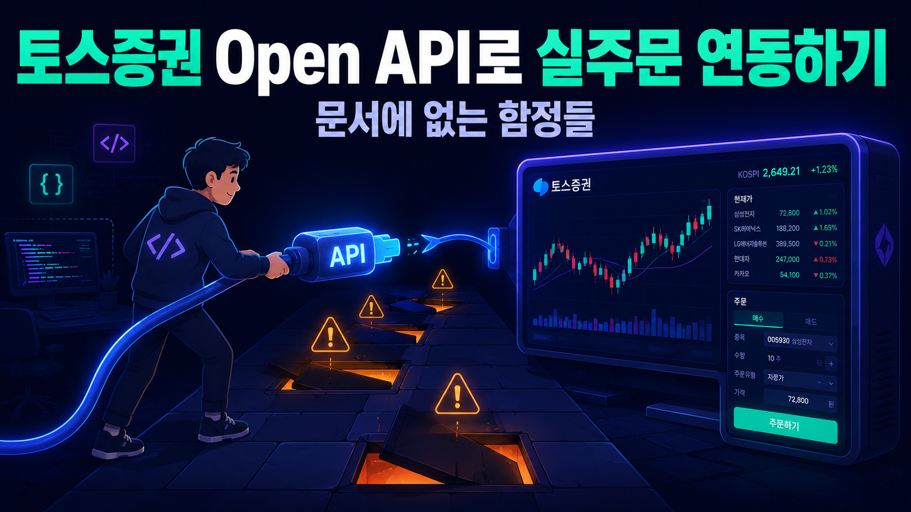
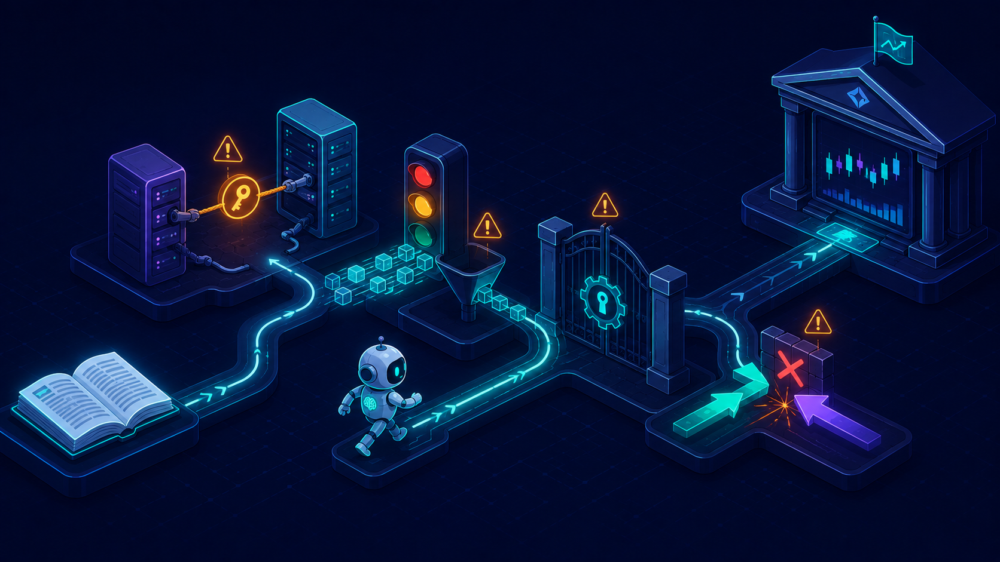

# 토스증권 Open API로 실주문 연동하기: 문서에 없는 함정들



## 두 번째 실주문 브로커

토스증권이 Open API를 열었습니다. `openapi.tossinvest.com`으로 REST 요청을 보내면 시세 조회부터 실계좌 주문까지 됩니다. 국내 증권사 중 이런 걸 열어주는 곳이 몇 없어서, 공개 소식을 보자마자 바로 신청했습니다.

공식 문서는 깔끔했습니다. OAuth2로 토큰을 받고, `/api/v1/orders`에 POST를 보내면 주문이 나간다. 엔드포인트 명세, 파라미터, 에러 코드까지 잘 정리되어 있었습니다. [9편](https://mgh3326.tistory.com/237)부터 한국투자증권(KIS) API로 실주문을 운영해 왔으니, "두 번째 브로커니까 금방 붙이겠지"라고 생각했습니다.

그리고 실주문을 붙이는 과정에서 만난 함정들은 대부분 문서에 없었습니다. 새 토큰을 받으면 기존 토큰이 조용히 죽는다든가, 계좌 설정 하나 때문에 모든 국내 주문이 422로 거부된다든가, 같은 종목에 매수와 매도 주문을 동시에 걸 수 없다든가 하는 것들입니다. 전부 실제 요청을 날려보고서야 알았습니다.

이번 편은 그 함정들의 기록입니다. 국내에 토스증권 Open API 연동 자료가 거의 없어서, 같은 길을 걸을 분들에게 지도가 되었으면 합니다.

## 기본 구조: 모의투자가 없다

시작하기 전에 KIS와 가장 다른 점 하나를 짚어야 합니다. **토스증권 Open API에는 모의투자가 없습니다.** KIS는 모의투자 서버가 따로 있어서 주문 코드를 마음껏 두들겨볼 수 있었지만, 토스는 첫 주문부터 실계좌입니다.

그래서 안전장치를 코드 쪽에 더 두껍게 깔았습니다. 주문 도구는 `dry_run=True`가 기본값이고, 실제 전송은 `dry_run=False`에 `confirm=True`까지 명시해야 하며, 그 전에 `TOSS_LIVE_ORDER_MUTATIONS_ENABLED` 환경 변수가 켜져 있어야 합니다. 게이트가 세 겹입니다.

```python
if dry_run:
    return {"success": True, **base_response, "payload_preview": payload}

if not confirm:
    return {
        "success": False,
        **base_response,
        "error": "toss_place_order requires confirm=True when dry_run=False.",
    }
```

HTTP 전송 레이어도 가장 낮은 곳에서 잠갔습니다. 허용 호스트는 `openapi.tossinvest.com` 하나뿐이고, https가 아니면 거부하고, 3xx 리다이렉트도 거부합니다. Bearer 토큰이 실리는 클라이언트가 설정 실수로 엉뚱한 곳에 요청을 보내는 일 자체를 막는 겁니다.

```python
# app/services/brokers/toss/transport.py
TOSS_API_HOSTS = frozenset({"openapi.tossinvest.com"})

def assert_toss_host(host, *, scheme=None):
    if scheme is not None and scheme != "https":
        raise TossHostBlocked(
            f"Scheme {scheme!r} is not allowed for Toss Open API; https is required "
            "(http would expose the Bearer token and client secret in cleartext)."
        )
    if host not in TOSS_API_HOSTS:
        raise TossHostBlocked(f"Host {host!r} is not in TOSS_API_HOSTS. ...")

async def _on_response(response):
    if 300 <= response.status_code < 400:
        raise TossHostBlocked(
            "... Toss Open API endpoints do not legitimately redirect. Refusing."
        )
```

이 검증은 httpx의 event hook으로 걸어서 매 요청·매 응답마다 실행됩니다. "정상 API는 리다이렉트하지 않는다"는 가정을 코드로 박아두면, LB나 CDN이 이상한 응답을 돌려줄 때 토큰을 들고 따라가는 대신 즉시 실패합니다.

인증은 OAuth2 Client Credentials입니다. `TOSS_API_CLIENT_ID`와 `TOSS_API_CLIENT_SECRET`으로 `/oauth2/token`에서 access token을 받아 Bearer 헤더에 실으면 됩니다. 여기까지는 문서 그대로입니다. 문제는 지금부터입니다.


*문서에는 엔드포인트가 있고, 실전에는 함정이 있습니다*

## 함정 1: 유효한 토큰은 client당 하나뿐이다

첫 함정은 인증에서 나왔습니다. **새 토큰을 발급받으면 기존 토큰이 무효화됩니다.** client당 유효한 access token이 딱 하나라는 뜻입니다.

혼자 스크립트 하나 돌릴 때는 아무 문제가 없습니다. 그런데 이 시스템은 FastAPI 웹 서버, MCP 서버, TaskIQ 워커가 각자 다른 프로세스로 떠 있습니다. 각 프로세스가 순진하게 "토큰 없네? 발급받자"를 하면 이런 일이 벌어집니다.

```
프로세스 A: 토큰 T1 발급 → 사용 중
프로세스 B: 토큰 T2 발급 → T1 즉시 무효화
프로세스 A: T1으로 요청 → invalid-token → 재발급 T3 → T2 무효화
프로세스 B: T2로 요청 → invalid-token → 재발급 T4 → T3 무효화
...
```

서로가 서로의 토큰을 죽이는 무한 싸움입니다. 각 프로세스는 자기 관점에서 완벽하게 합리적으로 동작하는데, 전체로 보면 아무도 요청을 성공시키지 못합니다.

해결은 세 가지 조합입니다.

**첫째, 토큰을 Redis에 공유합니다.** 어느 프로세스가 발급받았든 모두가 같은 토큰을 씁니다. KIS 연동 때 이미 같은 패턴(Redis 토큰 매니저)을 만들어둔 게 있어서 뼈대는 재사용했습니다.

**둘째, 발급을 단일비행(single-flight)으로 묶습니다.** Redis `SET NX` 락으로 발급 권한을 한 명만 갖고, 나머지는 캐시에 새 토큰이 나타날 때까지 짧게 폴링하며 기다립니다.

**셋째, 락을 잡은 뒤에도 다시 확인합니다.** 이게 미묘한 부분입니다. `invalid-token`을 맞고 재발급하러 온 호출자가 락을 잡았는데, 그 사이에 다른 프로세스가 이미 재발급을 끝냈을 수 있습니다. 여기서 무조건 또 발급하면 방금 나온 멀쩡한 토큰을 죽입니다. 그래서 "실패한 토큰"을 파라미터로 들고 다니면서, 캐시의 토큰이 그것과 다르면 — 즉 누군가 이미 갈아끼웠으면 — 발급하지 않고 그걸 씁니다.

```python
# app/services/brokers/toss/auth.py — TossOAuthTokenManager
async def get_access_token(self, *, force_reissue=False, failed_token=None):
    if not force_reissue:
        cached = await self._get_cached_token()
        if cached is not None:
            return cached
    elif failed_token is not None:
        # invalid-token으로 재발급하러 왔지만, 캐시에 이미 '다른' 토큰이
        # 있다면 누군가 먼저 재발급한 것 — 새로 발급하지 않고 재사용
        cached = await self._get_cached_token()
        if cached is not None and cached != failed_token:
            return cached
    return await self._issue_single_flight(
        force_reissue=force_reissue, failed_token=failed_token
    )
```

기다리는 쪽에도 같은 논리가 적용됩니다. `invalid-token`을 맞은 호출자가 캐시를 폴링할 때, 자기가 방금 실패한 그 토큰이 다시 보이면 받아들이면 안 됩니다. 진짜로 "다른" 토큰이 나타날 때까지 기다립니다.

```python
async def _wait_for_cached_token(self, *, failed_token=None):
    deadline = time.monotonic() + TOKEN_WAIT_TIMEOUT_SECONDS
    while True:
        cached = await self._get_cached_token()
        # 죽은 토큰을 다시 받아들이면 안 된다 — 재발급된 다른 토큰만 유효
        if cached is not None and cached != failed_token:
            return cached
        if time.monotonic() >= deadline:
            return None
        await asyncio.sleep(poll + random.uniform(0.0, poll))
```

호출부에서는 API 응답의 에러 코드가 `invalid-token`/`expired-token`일 때만 이 경로를 태웁니다. 이 double-check 로직은 처음 구현에는 없었고, 검증 과정에서 레이스를 발견해 나중에 보강했습니다([PR #1280](https://github.com/mgh3326/auto_trader/pull/1280)). "토큰이 하나뿐"이라는 제약은 문서에 한 줄이지만, 다중 프로세스 환경에서 올바르게 다루려면 이만큼의 코드가 필요합니다.

## 함정 2: rate limit은 그룹별, 그리고 장 시작 10분

토스 Open API의 rate limit은 전역 하나가 아니라 **API 그룹별**입니다. 코드에 박아둔 초당 호출 예산은 이렇습니다.

| API 그룹 | TPS | 비고 |
|---------|-----|------|
| AUTH (토큰) | 5 | |
| ACCOUNT (계좌 목록) | 1 | 가장 빡빡함 |
| ASSET (잔고) | 5 | |
| STOCK (종목 정보) | 5 | |
| MARKET_INFO (환율/캘린더) | 3 | |
| MARKET_DATA (시세) | 10 | |
| MARKET_DATA_CHART (캔들) | 5 | |
| ORDER (주문 전송) | 6 | 09:00~09:10에는 3 |
| ORDER_HISTORY (주문 조회) | 5 | |
| ORDER_INFO (주문가능금액 등) | 6 | 09:00~09:10에는 3 |

두 가지가 함정이었습니다.

하나는 **장 시작 09:00~09:10 KST에 주문 그룹 한도가 절반으로 줄어드는 것**입니다. 하필 자동매매 시스템이 가장 바쁘게 주문을 내고 싶은 시간대입니다. 이걸 모르고 평소 한도로 쏘면 개장 직후에만 429가 쏟아지는, 재현이 고약한 장애가 됩니다.

```python
# app/services/brokers/toss/rate_limiter.py
@staticmethod
def limit_for(group, *, now=None):
    now = now or datetime.now(ZoneInfo("Asia/Seoul"))
    if group in {TossApiGroup.ORDER, TossApiGroup.ORDER_INFO}:
        if now.hour == 9 and 0 <= now.minute < 10:
            return 3
    return _BASE_LIMITS[group]
```

acquire 루프는 대기에서 깨어날 때마다 한도를 다시 계산합니다. 08:59:59에 "한도 6"으로 계산해 두고 잠들었다가 09:00:00에 깨어나 그대로 전송하면 한 발이 초과로 나갈 수 있기 때문입니다. 락은 그룹별로 분리해서, 스로틀에 걸린 그룹이 다른 그룹의 호출까지 줄 세우지 않게 했습니다.

다른 하나는 **rate limiter가 프로세스 전역 싱글톤이어야 한다는 것**입니다. 클라이언트 인스턴스마다 limiter를 새로 만들면 각자 "나는 예산 안 넘었는데?"가 되어 합산으로는 한도를 초과합니다. 환율 조회, 잔고 조회, 주문이 각각 다른 코드 경로에서 `TossReadClient`를 만들다 보니 실제로 이 문제를 겪었고, `get_shared_rate_limiter()` 하나로 모았습니다.

```python
_shared_rate_limiter: TossRateLimiter | None = None

def get_shared_rate_limiter() -> TossRateLimiter:
    """from_settings로 만들어지는 모든 클라이언트/토큰 매니저가 공유하는
    프로세스 전역 limiter — 그룹별 TPS 예산이 호출 지점을 가로질러 유지된다."""
    global _shared_rate_limiter
    if _shared_rate_limiter is None:
        _shared_rate_limiter = TossRateLimiter()
    return _shared_rate_limiter
```

429를 맞았을 때는 `Retry-After` 헤더를 우선 존중하고, 없으면 지수 백오프 + 지터로 물러납니다.

## 함정 3: 계좌 설정이 주문을 막는다

코드를 다 만들고 국내 주식 첫 실주문을 넣었더니 422가 돌아왔습니다. 에러 코드는 `investor-exchange-not-integrated`.

한참 코드를 의심했는데, 원인은 코드가 아니라 **계좌 설정**이었습니다. 토스증권 앱에서 해당 계좌의 "투자자지시 거래소" 설정이 "통합(SOR)"으로 되어 있어야 Open API로 국내 주문을 넣을 수 있습니다. 특정 거래소(KRX 지정 등)로 되어 있으면 API 주문이 전부 거부됩니다.

이건 API 문서의 엔드포인트 명세만 봐서는 알 수 없고, 실제 주문을 넣어봐야 만나는 종류의 에러입니다. 지금은 라이브 스모크 런북의 사전 점검 1번 항목으로 박아뒀습니다. 코드보다 먼저 확인할 것: 계좌 설정.

이 경험 때문에 에러 응답 처리에도 공을 들였습니다. 토스의 에러는 `{"error": {"requestId", "code", "message", "data"}}` 봉투 형식인데, LB나 CDN이 HTML 에러 페이지를 돌려주는 경우도 있어서 non-JSON 응답도 typed error로 감쌌습니다. 에이전트(MCP 클라이언트)가 주문 실패를 이해하려면 "422였음"이 아니라 "code가 investor-exchange-not-integrated였음"까지 전달돼야 합니다.

```python
# app/services/brokers/toss/errors.py
def parse_toss_response(response):
    try:
        payload = response.json()
    except (json.JSONDecodeError, ValueError):
        # LB/CDN HTML 에러 페이지, 빈 바디 → status + request id를 담은
        # typed error로 표면화 (raw JSONDecodeError 금지)
        envelope = _non_json_envelope(response)
        ...
```

## 함정 4: 반대방향 대기주문이 있으면 거부된다

네 번째 함정은 전략 설계에까지 영향을 준 놈입니다. **같은 종목에 반대방향 미체결 주문이 있으면 신규 주문이 `opposite-pending-order-exists`로 거부됩니다.**

이게 왜 문제냐면, 제 매매 방식은 래더(ladder)입니다. 지지선 근처에 매수 지정가 두세 개를 깔아두고, 동시에 저항선 근처에 매도 지정가를 걸어두는 식입니다. KIS에서는 아무 문제 없이 되던 게 토스에서는 구조적으로 불가능합니다. 매수 래더가 걸려 있는 동안 그 종목의 매도 주문은 못 넣습니다.

브로커의 제약이 전략의 형태를 바꾼 첫 사례였습니다. 토스로 운용하는 종목은 "한 방향씩" 운용하거나, 양방향이 필요하면 KIS로 라우팅합니다.

코드에서는 실주문 전송 전에 반대방향 미체결을 사전검사합니다. 어차피 서버가 거부할 테지만, 사전검사가 있으면 에이전트에게 "지금은 왜 안 되는지"를 명확한 에러로 돌려줄 수 있고, 의미 없는 주문 POST로 주문 그룹 TPS를 태우지 않아도 됩니다.

```python
# app/mcp_server/tooling/orders_toss_variants.py
async def _opposite_pending_error(client, symbol, side, base):
    cursor, seen_cursors = None, set()
    try:
        while True:
            page = await client.list_orders(status="OPEN", symbol=symbol, cursor=cursor)
            opp_side = "SELL" if side == "buy" else "BUY"
            for order in page.orders:
                if order.symbol == symbol and order.side.upper() == opp_side:
                    return {
                        "success": False, **base,
                        "error": f"An opposite pending order exists for symbol {symbol} ({opp_side}).",
                    }
            if not page.has_next:
                return None
            next_cursor = page.next_cursor
            if not next_cursor or next_cursor in seen_cursors:
                return {"success": False, **base,
                        "error": "... pagination cursor was missing or repeated (fail closed)."}
            seen_cursors.add(next_cursor)
            cursor = next_cursor
    except Exception as exc:
        return {"success": False, **base, "error": f"Failed to check pending orders: {exc}"}
```

디테일 하나: 미체결 목록은 커서 페이지네이션인데, 커서가 빠지거나 반복되면 "다 확인 못 했으니 통과"가 아니라 **fail-closed로 주문을 막습니다**. 사전검사가 뚫리면 어차피 서버가 거부하겠지만, "확인 실패 = 통과"라는 패턴을 주문 경로에 한 번 허용하면 언젠가 다른 가드에서 사고가 납니다.

## 멱등성: clientOrderId의 진화

토스 주문 API는 `clientOrderId`라는 클라이언트 지정 멱등키를 받습니다. 같은 `clientOrderId`로 다시 POST하면 새 주문이 아니라 기존 주문이 돌아옵니다. 타임아웃 후 재시도가 이중 주문이 되는 사고를 브로커 레벨에서 막아주는, 실주문 연동에서 정말 귀한 기능입니다.

처음 구현은 호출마다 `uuid4()`였습니다. 그런데 이러면 멱등키의 가치가 반토막입니다. 타임아웃이 나서 애플리케이션이 죽었다 살아난 경우, 아까 그 uuid를 잃어버렸으면 재시도는 새 uuid로 나가고, 멱등성은 무용지물이 됩니다.

그래서 **주문 내용에서 결정적으로 파생되는 키**로 바꿨습니다. 시장·종목·방향·주문유형·수량·가격을 정규화한 canonical JSON에 거래일 날짜를 소금으로 섞어 해시합니다.

```python
# app/mcp_server/tooling/toss_approval.py
def derive_client_order_id(canonical, *, market, now, rung=None):
    salt = trading_day_salt(market, now)   # KR은 KST, US는 뉴욕 시간 기준 거래일
    disc = "" if rung is None else str(rung)
    blob = f"{_canonical_json(canonical)}|{salt}|{disc}".encode()
    digest = hashlib.sha256(blob).hexdigest()[:16]
    return f"tossp6-{digest}"
```

같은 거래일에 같은 내용의 주문이면 언제 재시도해도 같은 키가 나옵니다. 프로세스가 죽었다 살아나도 마찬가지입니다. 다음 거래일에는 소금이 바뀌므로 정상적인 신규 주문이 됩니다. "같은 날 진짜로 같은 주문을 두 번" 내고 싶은 경우(래더의 두 번째 단)를 위해 `rung` 구분자를 뒀습니다.

거래일 소금에서 미국 주식은 뉴욕 시간(DST 반영) 기준입니다. KST 자정을 넘겨도 미국장은 같은 거래일이니, KST 날짜로 소금을 만들면 장중에 멱등키가 바뀌는 구멍이 생깁니다.

그리고 에러 응답에도 `client_order_id`를 반드시 실어 보냅니다. 타임아웃이나 레저 기록 실패 시에도 호출자가 **같은 키로** 재시도할 수 있어야 하기 때문입니다([PR #1278](https://github.com/mgh3326/auto_trader/pull/1278)에서 이 구멍을 메웠습니다).

## 접수는 접수일 뿐: accepted-only 레저와 reconcile

12편에서 다룬 원칙이 토스에도 그대로 적용됩니다. **주문 POST가 성공했다는 건 "접수"이지 "체결"이 아닙니다.**

주문이 접수되면 레저 테이블에 accepted 상태로만 기록합니다. 체결 수량, 체결가, 손익 같은 건 이 시점에 아무것도 쓰지 않습니다. 체결 확정은 별도의 reconcile 도구가 주문 단건 상세 조회(`GET /api/v1/orders/{orderId}`)로 브로커의 체결 증거를 확인한 뒤에만 기록합니다.

```python
res = await client.place_order(payload)
ledger = await record_toss_place_order(...)   # accepted-only
return {
    "success": True, ...,
    "message": (
        "Toss live order accepted and recorded accepted-only; "
        "run toss_reconcile_orders to book confirmed fills."
    ),
}
```

레저의 `record_send`는 `client_order_id` 기준으로 멱등입니다. 같은 멱등키로 재시도된 주문이 UNIQUE 제약 에러를 내며 죽는 대신, 기존 행을 재생(replay)합니다. 브로커가 멱등하게 처리해준 주문을 우리 DB가 이중 기록하거나 에러로 터뜨리면 곤란하니까요.

## 주문 밖의 수확: 데이터 소스로서의 토스

주문 붙이자고 시작한 연동인데, 데이터 소스로서의 수확이 예상보다 컸습니다.

**환율.** 시스템 곳곳에서 USD/KRW 환율이 필요한데(김치 프리미엄 계산, 해외 주식 평가액 환산), 기존에는 무료 API 하나에 의존했습니다. 토스는 매수/매도 환율과 함께 중간값(`midRate`)을 주고 유효기간(`validUntil`)까지 명시합니다. 지금은 토스를 primary로 쓰고 실패 시 기존 소스로 폴백하며, 캐시 TTL도 응답의 유효기간에 맞춥니다.

**종목 마스터와 시가총액.** `/api/v1/stocks`는 심볼을 최대 200개씩 배치로 받아 종목 정보를 돌려줍니다. 이걸로 KR/US 심볼 유니버스의 빈 구멍을 채우는데, 원칙은 **gap-fill only**입니다. 다른 소스(예: NASDAQ Trader 분류)가 이미 채운 값은 토스 값으로 덮어쓰지 않고 건너뜁니다. 소스가 늘어날 때마다 "누가 이겼는지 모르는 덮어쓰기"가 생기는 걸 막는 규칙입니다.

**분봉.** KIS 분봉 API는 시리즈 초반부터 저를 괴롭힌 `time_unit` 이슈가 있었는데, 토스 캔들 API는 1분봉을 커서 페이지네이션으로 성실하게 돌려줍니다. 1분봉을 페이지당 200개씩 모아서 5분/15분/30분봉은 서버에서 집계해 만듭니다. 여기에도 함정이 하나 있었습니다. 초기 구현이 한 페이지(200개)만 가져와서, 30분봉을 요청하면 조용히 6개 남짓만 나오는 버그였습니다. 페이지네이션은 "된다"가 아니라 "몇 페이지를 돌아야 하는지"까지 계산해야 합니다.

```python
# app/services/market_data/toss_ohlcv.py
# N개의 버킷 집계에는 N*bucket 개의 1분봉이 필요 — 페이지 수를 그만큼 확보
request_count = count if bucket == 1 else max(count * bucket, bucket)
one_minute = await fetch_toss_candles_frame(
    ..., count=request_count,
    max_pages=max(1, (request_count + 199) // 200),
)
```

**시장 캘린더.** `/api/v1/market-calendar/KR`은 정규장뿐 아니라 NXT 프리마켓/애프터마켓 세션 창까지 돌려줍니다. 대체거래소 시대에 "지금 이 종목이 거래 가능한 세션인가"를 판정하려면 이 데이터가 필요합니다. 주문 전 NXT 세션 preflight 검사가 이 캘린더를 씁니다.

**거래유의 종목 가드.** `/api/v1/stocks/{symbol}/warnings`로 종목의 경고 상태를 조회해 주문 전 가드로 씁니다. 여기서 방향에 따른 비대칭이 중요합니다. 정리매매(`LIQUIDATION_TRADING`) 경고가 활성이면 **매수는 차단하지만 매도는 차단하지 않습니다**. 상장폐지 정리매매 기간에 매도까지 막으면 포지션이 갇혀버리기 때문입니다. 가드가 보호 장치가 아니라 감옥이 되는 순간입니다.

```python
# app/services/brokers/toss/warnings_guard.py
blocking = [w for w in active_warnings if w.warning_type in _BLOCKING_WARNING_TYPES]
if blocking and str(side).lower() != "sell":
    return WarningsGuardResult(ok=False, warnings=active_warnings,
                               error_message=f"Order blocked due to warning types: ...")
```

이 가드는 조회 실패나 타임아웃 시 fail-open(주문 진행)입니다. 주문 경로의 다른 가드들은 fail-closed인데 이것만 반대인 이유가 있습니다. warnings 조회는 부가 정보이고, 이게 죽었다고 모든 주문이 멈추면 가용성 손실이 위험 감소보다 큽니다. 가드마다 "실패하면 어느 쪽으로 넘어질 것인가"를 따로 정해야 합니다.

## 마치며: 두 번째 브로커가 가르쳐준 것

KIS 하나만 쓸 때는 "브로커 API란 이런 것"이라는 가정이 코드 곳곳에 스며들어 있어도 몰랐습니다. 토스를 붙이면서 그 가정들이 하나씩 깨졌습니다. 토큰은 여러 개 발급받아도 되는 게 아니었고, rate limit은 시간대에 따라 변했고, 양방향 주문은 당연한 게 아니었습니다.

그래서 두 번째 브로커부터 진짜 자산은 공통 추상화가 아니라 **차이점 목록**이라고 생각하게 됐습니다. 처음부터 "Broker 인터페이스"를 만들어 둘을 욱여넣었다면, 반대방향 주문 거부나 09:00~09:10 한도 축소 같은 토스 고유의 제약이 추상화 뒤에 숨어버렸을 겁니다. 지금은 브로커별 어댑터를 따로 두고, 안전 원칙(dry_run 기본, 접수-체결 분리, 멱등키, fail-closed 가드)만 패턴으로 공유합니다. 원칙은 같게, 구현은 브로커의 결을 따라 다르게.

문서에 없는 함정들을 정리하면 이렇습니다. 토큰은 client당 하나만 유효하다. 주문 그룹 rate limit은 장 시작 10분간 절반이 된다. 국내 주문은 계좌의 거래소 설정이 통합(SOR)이어야 한다. 반대방향 대기주문이 있으면 신규 주문이 거부된다. 이 네 줄을 미리 알았다면 며칠은 아꼈을 겁니다. 이 글이 누군가에게 그 며칠이 되기를 바랍니다.

---

**참고 자료:**
- [토스증권 Open API 문서](https://openapi.tossinvest.com/docs)
- [전체 프로젝트 코드 (GitHub)](https://github.com/mgh3326/auto_trader)
- [PR #1278: Toss live mutation activation — ledger idempotency + order-id-preserving errors](https://github.com/mgh3326/auto_trader/pull/1278)
- [PR #1280: harden Toss client — token double-check, process-global limiter, https pin](https://github.com/mgh3326/auto_trader/pull/1280)

---

> 이 글은 AI 기반 자동매매 시스템 시리즈의 **13편**입니다.
>
> - [1편: 한투 API로 실시간 주식 데이터 수집하기](https://mgh3326.tistory.com/227)
> - [2편: yfinance로 애플·테슬라 분석하기](https://mgh3326.tistory.com/228)
> - [3편: Upbit으로 비트코인 24시간 분석하기](https://mgh3326.tistory.com/229)
> - [4편: AI 분석 결과 DB에 저장하기](https://mgh3326.tistory.com/230)
> - [5편: Upbit 웹 트레이딩 대시보드 구축하기](https://mgh3326.tistory.com/232)
> - [6편: 실전 운영을 위한 모니터링 시스템 구축](https://mgh3326.tistory.com/233)
> - [7편: 라즈베리파이 홈서버에 자동 HTTPS로 안전하게 배포하기](https://mgh3326.tistory.com/234)
> - [8편: JWT 인증 시스템으로 안전한 웹 애플리케이션 구축하기](https://mgh3326.tistory.com/235)
> - [9편: KIS 국내/해외 주식 자동 매매 시스템 구축하기](https://mgh3326.tistory.com/237)
> - [10편: 다중 브로커 통합 포트폴리오 시스템 구축하기](https://mgh3326.tistory.com/238)
> - [11편: MCP 서버로 AI 트레이딩 도구 만들기](https://mgh3326.tistory.com/245)
> - [12편: AI에게 주문 버튼을 줘도 될까 — 실계좌 자동매매의 안전장치 설계](https://mgh3326.tistory.com/246)
> - **13편: 토스증권 Open API로 실주문 연동하기** ← 현재 글
