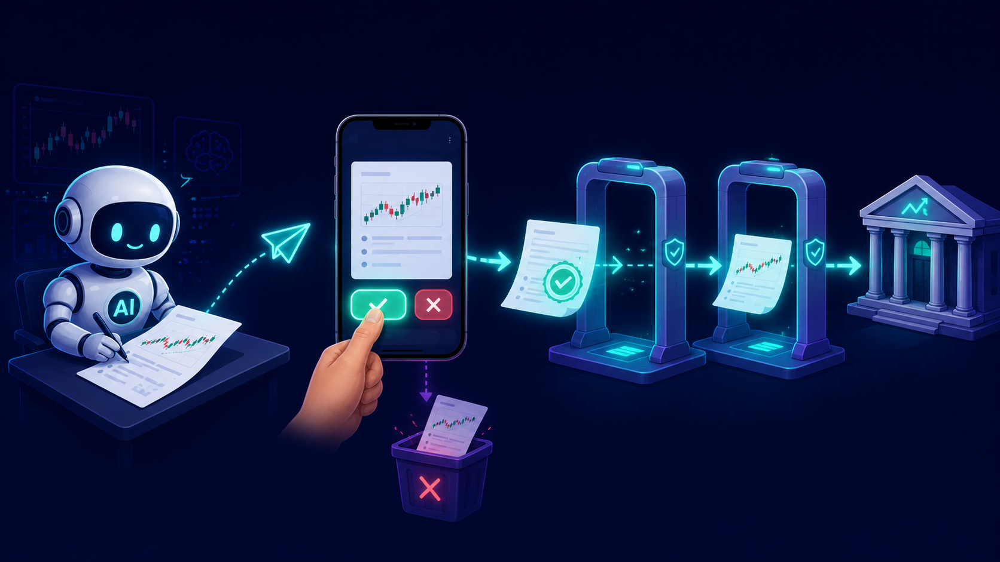

# 텔레그램 버튼으로 승인하는 반자동 매매: AI와 사람의 결재선 만들기


## 안전장치를 다 쌓고 나니 남은 질문: 버튼은 누가 누르는가

[12편](https://mgh3326.tistory.com/246)에서 실주문 경로에 게이트를 잔뜩 쌓았습니다. 이중 게이트, 승인 해시, 멱등키, 단일 전송, 증거 기반 장부. 주문 하나가 나가려면 일곱 개쯤 되는 검문소를 통과해야 합니다.

그런데 그 검문소들을 다 만들고 나서도 마지막 질문 하나가 해결되지 않은 채 남아 있었습니다. **그래서 `dry_run=False, confirm=True`는 결국 누가 넣는가.**

선택지는 둘로 보였습니다. 하나는 에이전트에게 전권을 주는 것. 판단이 서면 실주문까지 알아서 내보내는 전자동입니다. 12편을 쓴 사람으로서 이건 못 믿습니다. 안전장치는 사고의 피해를 줄여주지, 사고 자체를 없애주지 않으니까요.

다른 하나는 제가 세션에 붙어 앉아 에이전트의 제안을 보고 직접 도구를 호출해주는 것. 몇 주 해보니 이건 자동매매가 아니라 그냥 제가 매매하는 거였습니다. 장중에 회의라도 들어가면 좋은 진입가는 지나가 있습니다.

결국 도달한 답은 결재선이었습니다. **AI는 제안서를 쓰고, 저는 폰에서 버튼을 누릅니다.** 에이전트는 근거와 수량과 가격이 붙은 주문 제안을 장부에 남기고, 그 제안이 텔레그램 메시지로 도착하고, 제가 [승인] 버튼을 누르면 그때서야 12편의 모든 게이트를 통과한 실주문이 나갑니다.

이번 편은 그 결재선을 만든 기록입니다. 그리고 언제나처럼, 만들자마자 터진 것들의 기록이기도 합니다.

## 주문 대신 제안서를 쓰게 하다

첫 단계는 에이전트에게서 주문 도구를 빼앗는 대신, **제안 도구**를 쥐여주는 것이었습니다 ([PR #1491](https://github.com/mgh3326/auto_trader/pull/1491)). 에이전트는 `place_order`를 직접 부르지 않고 `order_proposal_create`를 부릅니다. 이 호출은 브로커에 아무것도 보내지 않습니다. DB에 제안 레코드 하나를 남길 뿐입니다.

```python
# app/mcp_server/tooling/order_proposal_tools.py (시그니처 발췌)
async def order_proposal_create(
    symbol: str,
    market: str,          # equity_kr / equity_us / crypto
    account_mode: str,    # kis_live / toss_live / upbit / ...
    side: str,
    order_type: str,      # limit / market
    proposer: str,        # 누가 제안했는가
    rungs: list[dict],    # [{"rung_index", "side", "quantity", "limit_price", ...}]
    thesis: str | None = None,       # 왜 이 주문인가 (한 줄 논지)
    rationale: dict | None = None,   # 구조화된 근거
    valid_until: str | None = None,  # 이 제안의 유통기한
    ...
) -> dict:
    """Create a place, replace, or cancel proposal without broker mutation."""
```

설계에서 신경 쓴 부분이 세 가지 있습니다.

**제안은 그룹과 rung의 2계층입니다.** 분할 매수처럼 한 판단이 여러 주문으로 쪼개지는 경우가 많아서, 제안 그룹 하나가 여러 개의 rung(래더 한 단)을 가집니다. "이 종목을 이 근거로 산다"가 그룹이고, "얼마에 몇 주"가 rung입니다. 승인·체결·취소는 rung 단위로 추적됩니다.

**근거와 유효기간이 스키마에 있습니다.** `thesis`, `rationale`, `valid_until`은 장식이 아닙니다. 근거는 텔레그램 승인 메시지에 그대로 실려서 제가 버튼을 누르기 전에 읽는 내용이 되고, 유효기간이 지난 제안은 승인 자체가 불가능해집니다. 시장 상황은 변하는데 제안서가 영원히 유효하면 그건 시한폭탄입니다.

**상태 전이는 코드가 강제합니다.** 제안 rung의 생애주기는 순수 상태 머신 모듈이 관리하고, 모든 상태 변경 직전에 전이 검증을 통과해야 합니다.

```python
# app/services/order_proposals/state_machine.py (발췌)
_ALLOWED: dict[str, frozenset[str]] = {
    "pending_approval": frozenset(
        {"revalidating", "rejected", "expired", "voided", ...}
    ),
    "revalidating": frozenset(
        {"approved", "needs_reconfirm", "pending_approval", "rejected", ...}
    ),
    "approved": frozenset({"submitting", "superseded", "expired", "voided"}),
    "submitting": frozenset(
        {"acked", "resting", "rejected", "unverified", "cancelled"}
    ),
    "acked": frozenset({"filled", "partially_filled", "cancelled", "unverified"}),
    ...
    # terminals
    "filled": frozenset(),
    "cancelled": frozenset(),
}
```

눈에 띄는 상태가 두 개 있을 겁니다. `unverified`는 12편의 "불확실을 일급으로 인정한다" 원칙의 연장입니다. 전송이 실패하거나 응답을 분류할 수 없으면 성공도 실패도 아닌 `unverified`로 남기고, 나중에 브로커 증거로만 확정합니다. 그리고 `submitting`에서 `filled`로 가는 직행 경로가 없습니다. 접수는 체결이 아니니까요.

이 테이블이 주문 의사결정의 단일 진실 소스(SOT)가 됩니다. 모든 쓰기는 서비스 레이어를 통해서만 일어나고, "에이전트가 뭘 제안했고, 누가 언제 승인했고, 그 결과 무엇이 체결됐는가"가 전부 한 장부에 남습니다.

제안서라는 형식에서 따라오는 요구사항이 하나 더 있었는데, **수정 이력**입니다. 에이전트가 시장을 다시 보고 "아까 그 가격 말고 조금 더 아래"라고 마음을 바꾸는 일은 흔합니다. 이때 기존 제안 레코드를 고치면 감사 추적이 깨집니다. 그래서 제안은 불변이고, 마음이 바뀌면 기존 제안을 대체(supersede)하는 새 revision을 만듭니다. 레코드에는 최초 제안을 가리키는 `root_proposal_id`와 `revision` 번호, 대체 관계의 양방향 링크가 남아서 "이 판단이 어떻게 변해왔는가"가 계보로 읽힙니다.

대체된 옛 제안은 즉시 무효화되고, 이미 발송된 텔레그램 메시지의 버튼도 함께 죽습니다 ([PR #1529](https://github.com/mgh3326/auto_trader/pull/1529)). 이걸 빠뜨리면 폰에 살아 있는 옛 버전의 [승인] 버튼이 남는데, 사람은 최신 제안인 줄 알고 누르게 됩니다. 결재선에서 가장 위험한 건 악의가 아니라 낡은 문서입니다.

신규 주문만 제안 대상인 것도 아닙니다. `action` 필드로 기존 주문의 정정(replace)과 취소(cancel)도 제안할 수 있습니다. 이 경우 제안 생성 시점에 대상 브로커 주문이 실제로 존재하고 아직 살아 있는지 read-only로 미리 확인해서, 이미 체결돼버린 주문의 취소 제안 같은 허깨비가 결재선에 올라오는 것을 막습니다.

## 폰에서 누르는 결재 버튼

제안이 만들어지면 텔레그램으로 메시지가 옵니다 ([PR #1490](https://github.com/mgh3326/auto_trader/pull/1490)). 대략 이런 모양입니다.

```
주문 제안 승인
- 종목: AAPL (equity_us / kis_live)
- 방향: buy · 지정가
- #1: 2주 × $208.50
- 근거: 실적 발표 후 갭하락이 과매도 구간 진입,
  200일선 지지 확인 시 분할 진입 1단
- 유효기한: 오늘 22:00
[✅ 승인] [❌ 거부]
```

종목, 방향, rung별 수량과 가격, 에이전트가 쓴 근거, 유효기한. 그리고 밑에 인라인 버튼 두 개. 지하철에서도 이 메시지 하나로 판단에 필요한 것을 다 볼 수 있어야 한다는 게 메시지 포맷의 요구사항이었습니다. 근거가 부실한 제안은 여기서 바로 태가 나기 때문에, 이 포맷 자체가 에이전트에게 근거를 성실히 쓰게 만드는 압력이 되기도 합니다.

버튼을 누르면 텔레그램이 봇 전용 서브도메인의 웹훅 엔드포인트로 콜백을 보내고, 서버가 그걸 받아 실주문을 진행합니다. 여기서부터가 진짜 설계 문제였습니다. **인터넷에 노출된 HTTP 엔드포인트의 버튼 클릭 한 번이 실계좌 주문으로 이어지는 구조**이기 때문입니다. 방어는 겹겹이 들어갔습니다.

**웹훅 인증.** 텔레그램은 웹훅 등록 시 `secret_token`을 지정하면 모든 콜백 요청 헤더에 그 토큰을 실어 보냅니다. 서버의 인증 미들웨어가 이 헤더를 공유 시크릿과 대조하고, 토큰이 아예 설정돼 있지 않으면 403으로 잠급니다. 열어둔 적이 없으면 닫혀 있는 게 기본입니다. 기능 게이트도 별도로 있어서, 환경 변수로 켜지 않는 한 엔드포인트 자체가 503으로 응답합니다.

그 위에 채팅 allowlist가 한 겹 더 있습니다. 등록된 채팅 밖에서 온 업데이트는 처리 자체를 거부합니다. 토큰이 새더라도 승인 권한은 특정 채팅에 묶여 있는 구조입니다.

**콜백 데이터에는 아무 정보도 담지 않습니다.** 버튼에 심는 callback data는 이게 전부입니다.

```python
# app/services/order_proposals/approval_message.py
data = f"{action}:{str(proposal_id)[:8]}:{nonce}"
```

액션 코드, 제안 ID 앞 8자리, 그리고 일회용 nonce. 수량도 가격도 없습니다. 주문 내용은 전부 서버의 제안 레코드에서 읽습니다. 클라이언트가 들고 있는 데이터는 위조해봐야 "어떤 제안을 가리키는가"뿐이고, nonce는 한 번 소비되면 끝이라 같은 버튼을 두 번 누르든, 콜백이 재전송되든 두 번째 시도는 재생 공격으로 걸러집니다. nonce 소비는 승인·거부 양쪽 분기에서 **다른 어떤 변경보다 먼저** 일어나도록 코드 순서가 고정돼 있습니다.

nonce 위에 커밋 리스(commit lease)가 한 겹 더 있습니다. 버튼이 거의 동시에 두 번 눌리거나 웹훅이 겹쳐 도착하면 두 요청이 같은 nonce를 들고 경주를 벌일 수 있는데, 승인 처리에 들어가는 쪽이 제안에 짧은 리스를 걸어 두 번째 요청이 처리 중간에 끼어들지 못하게 합니다. 12편에서 "같은 주문이 두 번 나가는 경로"를 그렇게 막았는데, 사람이 개입하는 순간 "같은 승인이 두 번 처리되는 경로"라는 새 변종이 생긴 겁니다. 층이 하나 늘면 멱등성 숙제도 하나 늘어납니다.

[거부] 버튼의 의미도 정의가 필요했습니다. 거부는 아직 전송 전 단계에 있는 rung만 `rejected`로 보냅니다. 이미 브로커에 접수돼 대기 중인 rung은 거부 버튼으로 건드리지 않습니다. 그건 "제안을 반려한다"가 아니라 "나간 주문을 취소한다"는 전혀 다른 행위라서, 별도의 취소 제안 경로를 타야 합니다. 결재 버튼 하나에 여러 의미를 욱여넣지 않는 것도 결재선 설계의 일부였습니다.

**클릭 시점에 전부 다시 검증합니다.** 이게 이 흐름의 심장입니다. 12편에서 승인 해시의 TTL을 5분으로 잡았다고 했는데, 사람이 결재선에 들어오는 순간 이 설계와 정면충돌합니다. 제안이 온 걸 30분 뒤에 볼 수도 있으니까요. 그렇다고 TTL을 30분으로 늘리면 승인 해시의 존재 의미가 없어집니다.

답은 해시의 수명을 늘리는 게 아니라, **해시를 클릭 시점에 새로 만드는 것**이었습니다. 승인 버튼이 눌리면 서버는 그 자리에서 dry-run 미리보기를 새로 돌립니다. 손실매도 가드, 섹터 집중도, 잔고 확인까지 12편의 가드 체인 전체가 다시 실행되고, 그 결과에서 나이 0초짜리 승인 해시가 발급되고, 정규화된 가격·수량이 **제가 승인한 시점의 내용과 대조됩니다.**

그 사이에 가격이 움직여서 주문 내용이 달라졌다면 어떻게 될까요. 주문은 나가지 않습니다. 제안이 `needs_reconfirm` 상태로 돌아가고, 무엇이 어떻게 달라졌는지 diff가 담긴 재확인 메시지가 새로 도착합니다.

```
제안 생성 → 텔레그램 메시지 (근거 + [승인/거부])
[승인] 클릭 → nonce 소비 (재생 차단)
           → fresh dry-run: 가드 체인 재실행 + 새 approval_hash 발급
           → 승인 당시 내용과 대조
              일치: 실주문 전송 (12편의 멱등키·단일 전송 경로 그대로)
              불일치: needs_reconfirm + diff 재전송 (주문 없음)
```

즉 사람의 승인은 "이 바이트를 전송하라"가 아니라 "이 내용이면 전송해도 좋다"는 뜻이고, 그 내용이 여전히 성립하는지는 기계가 클릭 시점에 다시 확인합니다. 사람은 판단을 결재하고, 기계는 신선도를 책임지는 분업입니다.


*에이전트의 제안이 실주문이 되기까지. 승인 버튼과 실주문 사이에 클릭 시점 재검증이 한 층 더 있다*

디테일 하나를 더 적어두자면, DB 커밋과 텔레그램 알림의 순서도 고정돼 있습니다. 브로커 주문 결과의 기록이 **먼저** 커밋되고, 메시지 수정은 그 다음입니다. 텔레그램 API가 레이트리밋에 걸리거나 네트워크가 출렁여서 알림이 실패해도, 이미 나간 주문의 기록이 롤백되는 일은 없어야 하니까요. 알림은 전부 best-effort이고, 장부는 절대 아닙니다.

## 첫 캐너리에서 터진 것들

배선을 끝내고 프로덕션에서 관통 테스트를 했습니다. 단위 테스트는 넉넉히 있었지만, 이 흐름은 텔레그램 서버, 웹훅 터널, 인증 미들웨어, DB, 브로커 API가 전부 실물로 이어져야 완성되는 물건이라 실제로 한 바퀴를 돌려보기 전까지는 "된다"고 말할 수 없었습니다. 캐너리는 암호화폐 소액 — 7천 원어치 비트코인 지정가 매수였습니다. 시나리오는 끝까지 갑니다. 에이전트가 제안을 만들고, 폰에 메시지가 오고, 승인을 누르고, 재검증을 통과해 실제로 브로커에 접수되고, 접수를 확인한 뒤 취소해서 마무리. 장부에는 `pending_approval → revalidating → approved → submitting → resting → cancelled`가 남아야 합니다.

첫 시도는 승인 버튼에서 멈췄습니다. 결과: **"가드에 의해 차단됨."**

가드가 일을 했구나, 하고 사유를 봤는데 어떤 가드인지가 없습니다. 파고 들어가 보니 가드가 아니라 `TypeError`였습니다. 제안 장부는 수량과 가격을 `Decimal`로 저장하는데, 기존 주문 실행 코드는 MCP 도구 레이어에서 float가 들어온다고 가정하고 있었습니다. 수수료 계산에서 `Decimal * float` 연산이 터졌고, 그 예외가 "가드 차단"으로 뭉뚱그려져 보고된 겁니다. 수리는 제안 장부에서 주문 실행으로 넘어가는 경계에서 타입을 강제하는 것이었습니다 ([PR #1492](https://github.com/mgh3326/auto_trader/pull/1492)).

```python
# app/services/order_proposals/revalidation.py
# 제안 레저는 quantity/limit_price를 Decimal로 저장하지만
# _place_order_impl의 수치 경로는 MCP 도구 레이어의 float/int 입력을
# 가정한다 — 예: 수수료 계산 estimated_value * 0.0005 가 Decimal에서
# TypeError를 던지고, 운영자에게는 가짜 "guard_blocked"로 표면화됐다
# (활성화 스모크, KRW-BTC 캐너리). 호출자 경계에서 정규화한다.
kwargs = {k: (float(v) if isinstance(v, Decimal) else v) for k, v in kwargs.items()}
```

이 사건이 남긴 교훈은 타입 버그 자체보다 **오분류**였습니다. 예상외 예외가 "가드 차단"이라는, 정상 동작처럼 보이는 라벨을 달고 있으면 운영자는 시스템이 잘 막았다고 착각합니다. 결재선에서 사람이 받는 메시지는 사람이 가진 정보의 전부라서, 그 메시지가 부정확하면 결재 자체가 부정확해집니다.

그래서 후속 작업에서 승인 경로의 보고 체계를 손봤습니다 ([PR #1497](https://github.com/mgh3326/auto_trader/pull/1497)). 가드가 의도적으로 거부한 것과 코드가 예외로 죽은 것을 구분해서 기록하고, 텔레그램 메시지에 거부 사유를 실제로 표시하고, 차단된 rung이 상태 전이 없이 무기한 잔존하던 문제를 유효기간 만료와 운영자 void(사유 필수) 경로로 정리했습니다. 검문소는 통과/차단만 알려주면 안 되고, 왜 차단했는지와 차단된 것이 그 뒤 어떻게 되는지까지 책임져야 합니다.

수리 후 다시 돌린 캐너리는 접수까지 관통했고, 취소로 마무리했습니다. 7천 원짜리 리허설이었지만 이 한 바퀴가 잡아낸 결함들을 생각하면 싼 수업료였습니다.

## 승인 피로: 다이얼을 조금 돌리다

결재선이 돌기 시작하니 새로운 문제가 왔습니다. **승인 피로입니다.**

미국장 세션 하나에서 에이전트가 만든 제안이 열여섯 그룹이었습니다. 폰이 저녁 내내 울립니다. 처음 며칠은 근거를 정독하고 눌렀는데, 일주일쯤 지나니 손가락이 먼저 나갑니다. 이러면 결재선은 안전장치가 아니라 요식행위가 됩니다. 사람의 주의력은 유한한 자원이고, 그걸 저위험 결재에 소진하면 정작 고위험 결재에서 방전됩니다.

그래서 다이얼을 조금 돌렸습니다. 첫 번째가 **저위험 유형의 자동 승인**입니다 ([PR #1531](https://github.com/mgh3326/auto_trader/pull/1531)). 대상은 딱 하나의 프로파일 — 단일 rung, 지정가, 현재가에서 충분히 떨어진 대기 주문. "지금 시장가로 사겠다"가 아니라 "여기까지 내려오면 받겠다"는 그물을 치는 주문입니다. 즉시 체결될 수 없고, 금액이 작고, 잘못돼도 취소하면 그만인 부류입니다.

자동 승인의 자격 판정은 순수 함수 하나로 모여 있고, 기본이 거부입니다.

```python
# app/services/order_proposals/auto_approve.py (발췌)
if (getattr(group, "action", None) or "place") != "place":
    return reject("action_not_place")
if getattr(group, "order_type", None) != "limit":
    return reject("order_type_not_limit")
if getattr(group, "exit_intent", None) is not None:
    return reject("exit_intent_present")        # 손절류는 무조건 사람
if preview.get("success") is not True:
    return reject("preview_guard_failed")        # 신선한 미리보기 가드 통과 필수

# 제안자가 적어낸 금액이 아니라 실행 가능 가격 × 수량으로 캡을 검사한다.
# 축소 기재된 메타데이터로 캡을 우회할 수 없도록.
notional = limit_price * quantity
if notional > limits.per_order_cap:
    return reject("per_order_cap_exceeded", ...)
if daily_notional + notional > limits.daily_cap:
    return reject("daily_cap_exceeded", ...)
```

시장가, 손절, 정정·취소, 멀티 rung 래더, 현재가 근접 주문은 전부 자격 미달로 떨어져 기존 버튼 흐름으로 갑니다. 건당 상한과 하루 누적 상한은 매매 정책 YAML에서 읽고, 판정에 쓴 정책 버전과 수치 증거가 전부 제안 레코드에 남습니다. 그리고 자동 승인이어도 통보는 옵니다 — 접수 요약 메시지에 일회용 [취소] 버튼이 달려 있어서, 사후 거부권은 여전히 사람에게 있습니다. 사전 결재를 사후 거부권으로 바꾼 것이지, 사람을 뺀 게 아닙니다.

두 번째가 <b>일괄 승인</b>입니다 ([PR #1536](https://github.com/mgh3326/auto_trader/pull/1536)). 자동 승인 자격은 없지만 개별 검토까지는 필요 없는 제안들이 쌓이면, 요약 메시지 하나에 [전체 승인] 버튼이 붙습니다. 중요한 건 이게 껍데기만 배치라는 점입니다. 내부적으로는 제안 하나하나가 각자의 nonce와 감사 기록, 그리고 **각자의 클릭 시점 재검증**을 그대로 통과합니다. 한 건이 재검증에서 걸려도 나머지는 계속 진행되고, 결과 메시지에 건별 결과가 따로 찍힙니다. 결재 도장을 한 번만 찍게 해주는 것이지 검문소를 건너뛰게 해주는 게 아닙니다.

이 다이얼이 실제로 얼마나 돌아갔는지는 자동 승인 도입 검토 때 프로덕션 세션 하나를 분류해본 수치가 말해줍니다.

| 분류 | 그룹 수 |
|------|------|
| 세션 전체 유효 제안 | 16 |
| 자동 승인 자격 충족 | 3 |
| 건당 상한 초과 (보수적 초기값) | 9 |
| 현재가 근접·멀티 rung 등 구조적 수동 | 4 |

자동화된 건 16건 중 3건입니다. 상한을 올리면 늘겠지만, 시작은 이 정도가 맞다고 봤습니다. 다이얼은 한 칸씩 돌리는 물건입니다.

그리고 다이얼은 반대 방향으로도 돕니다. 어떤 유형은 오히려 마찰을 **더** 넣었습니다. 손절 제안이 대표적입니다. 12편에서 라이브 계좌의 손실매도는 기본 차단이고 sanctioned 경로만 열려 있다고 했는데, 그 경로가 결재선에 합류하면서 텔레그램에서도 특별 취급을 받습니다. 손절 제안은 회고 기록 참조가 붙어야 만들어질 수 있고, 승인도 한 번의 클릭으로 끝나지 않습니다. 첫 클릭이 손실 규모와 근거가 담긴 확인 메시지를 새로 띄우고, 두 번째 클릭이 있어야 주문이 나가는 2단 확인입니다. 손실 확정은 실수로 일어나면 안 되는 행동이라는 원칙을, 버튼의 개수로 표현한 셈입니다.

승인 클릭과 실제 전송 사이에는 매수 여력 게이트도 있습니다 ([PR #1522](https://github.com/mgh3326/auto_trader/pull/1522)). 제안 생성 시점에는 잔고가 충분했어도 승인이 눌리는 시점에는 다른 주문이 현금을 먼저 써버렸을 수 있습니다. 그래서 전송 직전에 가용 현금을 다시 확인하고, 부족하면 주문 대신 이런 메시지가 옵니다.

```
매수가능 ₩312,000 / 필요 ₩500,000 → 부족 ₩188,000 — 입금 후 재승인
```

제안은 죽지 않고 재확인 대기 상태로 남습니다. 잔고가 채워진 뒤 다시 승인하면 되는 겁니다. 브로커 거절 에러를 받고 나서 사후에 아는 것과, 전송 전에 정확한 부족분을 알고 시작하는 것은 운영 감각이 완전히 다릅니다.

## 승인으로 끝나지 않는다: 체결까지 추적

결재선의 마지막 조각은 승인 이후입니다. 12편의 원칙 그대로, 접수는 체결이 아닙니다. 승인돼서 나간 지정가 주문은 `resting`(대기) 상태로 남는데, 초기 구현에는 구멍이 있었습니다. **브로커에서 그 주문이 체결되거나 취소돼도 제안 장부의 rung은 영원히 `resting`이었습니다.** 장부가 "의사결정의 기록"이 되려면 결정의 결말까지 적혀야 하는데, 결말 부분이 배선돼 있지 않았던 겁니다.

세 갈래로 메꿨습니다.

**라이브 reconcile 증거의 투영** ([PR #1498](https://github.com/mgh3326/auto_trader/pull/1498)). 12편에서 소개한 증거 기반 reconcile 커널이 브로커 조회로 체결·취소를 확정할 때, 그 증거를 주문 장부뿐 아니라 해당 rung에도 투영합니다. 체결 증거면 `filled`, 취소 증거면 `cancelled`. 투영은 다운스트림 best-effort라서 실패해도 원장(주문 레저)의 정합성은 건드리지 않고, 이미 종결된 rung에 증거가 재배달되면 예외 대신 no-op으로 흡수합니다.

**웹소켓 체결 이벤트의 실시간 투영** ([PR #1534](https://github.com/mgh3326/auto_trader/pull/1534)). 암호화폐 쪽은 브로커 웹소켓이 내 주문의 체결 이벤트를 실시간으로 흘려주는데, 이걸 브로커 주문 ID와 클라이언트 멱등키로 rung에 매칭합니다. 부분 체결은 누적 증거로 `partially_filled`를 갱신하고, 종결 이벤트는 **내구성 있는 체결 기록이 원장에 먼저 존재할 때만** rung을 `filled`로 종결시킵니다. 웹소켓 이벤트는 휘발성이라, 이벤트만 믿고 종결하지 않는다는 원칙입니다.

**만료 스윕** ([PR #1551](https://github.com/mgh3326/auto_trader/pull/1551)). 이건 운영 중 실제로 겪고 나서야 만든 조각입니다. 어느 날부터 "재확인 필요" 알림이 계속 반복해서 왔습니다. 추적해 보니 사흘 전에 만들어져 이틀 전에 유효기간이 지난 제안 세 건이 여전히 비종결 상태로 살아 있었습니다. 만료 처리가 **텔레그램 콜백 안에서만** 일어나고 있었기 때문입니다.

버튼을 아무도 안 누른 제안은 만료를 판정해줄 코드 경로 자체가 없어서 영원히 떠돌았고, 한술 더 떠 이 유령 제안들의 예약 금액이 매수 여력 계산에 합산돼 멀쩡한 새 제안에 "잔고 부족" 오탐 경고까지 띄우고 있었습니다. 유효기간 지난 비종결 제안을 쓸어서 `expired`로 종결하고 승인 메시지를 "⏰ 제안 만료됨"으로 정리하는 스윕을 넣고, 매수 여력 계산에는 유효기간 필터를 달았습니다. 이때도 원칙은 지켜서, 이미 브로커에 나가 있는 rung(대기·부분 체결)은 스윕이 건드리지 않고 넘어갑니다.

까다로운 건 역시 `unverified`였습니다. 전송 결과를 분류하지 못해 이 상태에 빠진 rung은 "주문이 나갔을 수도, 안 나갔을 수도 있는" 슈뢰딩거 상태라 함부로 종결할 수 없습니다. 그렇다고 방치하면 매수 여력 계산과 알림에 계속 잡음을 냅니다. 결론은 12편의 fail-closed 원칙 그대로입니다. `unverified`를 정리하는 유일한 경로는 브로커 주문 조회로 "이 주문은 존재하지 않는다" 혹은 "이렇게 끝났다"는 증거를 확인한 뒤의 전이뿐이고, 증거 없는 편의적 정리는 코드가 허용하지 않습니다 ([PR #1521](https://github.com/mgh3326/auto_trader/pull/1521)). 귀찮음을 줄이려고 불확실을 지우기 시작하면 장부는 다시 거짓말을 합니다.

이 조각들이 들어가고 나서야 제안 장부가 완결된 문장이 됐습니다. 잘 끝난 제안 하나의 생애는 이렇게 읽힙니다.

```
07-14 21:47  proposed          에이전트: "AAPL 2주 @ $208.50, 근거: ..."
07-14 21:47  pending_approval  텔레그램 승인 요청 발송
07-14 22:03  revalidating      [승인] 클릭 → fresh preview + 가드 재실행
07-14 22:03  approved          승인 시점 내용과 일치 확인
07-14 22:03  resting           브로커 접수, 대기 주문으로 유지
07-15 04:12  filled            reconcile 증거로 체결 확정 → 일지/손익 기록
```

누가 무엇을 왜 제안했고, 누가(혹은 어떤 정책이) 승인했고, 브로커에서 어떻게 끝났는지 — 한 레코드의 생애로 전부 읽힙니다. 매매 회고를 쓸 때 이 장부가 감사 추적의 척추가 됩니다.

## 마치며: 자동화는 스위치가 아니라 다이얼이다

이 시스템을 만들기 전에는 자동매매를 켠다/끈다의 문제로 생각했습니다. 지금은 생각이 다릅니다. **자동화 수준은 스위치가 아니라 다이얼이고, 주문 유형마다 다이얼 위치가 달라야 합니다.**

지금의 다이얼 위치는 이렇습니다.

| 주문 유형 | 결재 방식 |
|------|------|
| 소액·원거리 지정가 대기 (캡 이내) | 자동 승인 + 사후 취소 버튼 |
| 일반 매수·매도 제안 | 텔레그램 버튼 1클릭 |
| 저위험 제안 여러 건 | 일괄 승인 (건별 재검증은 유지) |
| 손절 | 텔레그램 2단 확인 + 회고 기록 필수 |
| 시장가·정정·취소·멀티 rung 래더 | 무조건 사람 버튼 |
| 정책·상한 변경 | 코드 리뷰를 거치는 PR |

위험이 클수록 결재선이 길어지는, 어느 조직에나 있는 그 구조를 코드로 옮긴 셈입니다.

다이얼을 어디까지 돌릴지는 결국 신뢰의 문제인데, 여기서의 신뢰는 감정이 아니라 데이터입니다. 자동 승인의 자격 판정 증거가 전부 레코드에 남으니, "자동으로 승인된 제안들의 성적"과 "내가 버튼으로 승인한 제안들의 성적"을 같은 장부에서 비교할 수 있습니다. 그 비교가 충분히 쌓여서 특정 유형의 수동 결재가 가치를 더하지 못한다는 게 숫자로 보이면, 그 유형의 다이얼을 한 칸 더 돌릴 겁니다. 반대 방향도 마찬가지입니다. 자동 승인된 주문에서 이상 패턴이 보이면 다이얼은 즉시 되감깁니다. env 게이트 하나 끄면 전량 사람 결재로 돌아오도록 만들어져 있으니까요.

12편의 마지막 문장을 다시 빌리면, 실계좌가 최고의 코드 리뷰어였습니다. 이번 편에서는 실계좌에 더해 제 손가락이 리뷰어로 합류했습니다. 저녁마다 울리는 폰이 귀찮아질 때쯤, 그 귀찮음이야말로 "여기는 자동화해도 된다"는 가장 정직한 신호였다는 게 이번 작업에서 얻은 뜻밖의 수확입니다.

---

**참고 자료:**
- [전체 프로젝트 코드 (GitHub)](https://github.com/mgh3326/auto_trader)
- [PR #1491: 주문 제안 SOT 장부 + 조회/생성 MCP 도구](https://github.com/mgh3326/auto_trader/pull/1491)
- [PR #1490: 텔레그램 버튼 승인 흐름](https://github.com/mgh3326/auto_trader/pull/1490)
- [PR #1492: 제안→실주문 경계의 Decimal→float 강제](https://github.com/mgh3326/auto_trader/pull/1492)
- [PR #1497: 승인 안전장치 보강 — 가드/예외 구분, 사유 표시, 만료·void](https://github.com/mgh3326/auto_trader/pull/1497)
- [PR #1529: 대체(supersede)된 제안의 승인 무효화](https://github.com/mgh3326/auto_trader/pull/1529)
- [PR #1522: 전송 전 매수 여력 게이트](https://github.com/mgh3326/auto_trader/pull/1522)
- [PR #1531: 대기 지정가 제안 자동 승인 + 사후 취소 버튼](https://github.com/mgh3326/auto_trader/pull/1531)
- [PR #1536: 텔레그램 일괄 승인](https://github.com/mgh3326/auto_trader/pull/1536)
- [PR #1534: 웹소켓 체결 이벤트의 제안 rung 투영](https://github.com/mgh3326/auto_trader/pull/1534)
- [PR #1498: 라이브 reconcile 증거로 제안 rung 상태 수렴](https://github.com/mgh3326/auto_trader/pull/1498)
- [PR #1521: 증거 확인을 거친 unverified 제안 정리](https://github.com/mgh3326/auto_trader/pull/1521)
- [PR #1551: 만료 제안 스윕 + 매수 여력 오탐 수정](https://github.com/mgh3326/auto_trader/pull/1551)

---

> 이 글은 AI 기반 자동매매 시스템 시리즈의 **14편**입니다.
>
> - [1편: 한투 API로 실시간 주식 데이터 수집하기](https://mgh3326.tistory.com/227)
> - [2편: yfinance로 애플·테슬라 분석하기](https://mgh3326.tistory.com/228)
> - [3편: Upbit으로 비트코인 24시간 분석하기](https://mgh3326.tistory.com/229)
> - [4편: AI 분석 결과 DB에 저장하기](https://mgh3326.tistory.com/230)
> - [5편: Upbit 웹 트레이딩 대시보드 구축하기](https://mgh3326.tistory.com/232)
> - [6편: 실전 운영을 위한 모니터링 시스템 구축](https://mgh3326.tistory.com/233)
> - [7편: 라즈베리파이 홈서버에 자동 HTTPS로 안전하게 배포하기](https://mgh3326.tistory.com/234)
> - [8편: JWT 인증 시스템으로 안전한 웹 애플리케이션 구축하기](https://mgh3326.tistory.com/235)
> - [9편: KIS 국내/해외 주식 자동 매매 시스템 구축하기](https://mgh3326.tistory.com/237)
> - [10편: 다중 브로커 통합 포트폴리오 시스템 구축하기](https://mgh3326.tistory.com/238)
> - [11편: MCP 서버로 AI 트레이딩 도구 만들기](https://mgh3326.tistory.com/245)
> - [12편: AI에게 주문 버튼을 줘도 될까 — 실계좌 자동매매의 안전장치 설계](https://mgh3326.tistory.com/246)
> - [13편: 토스증권 Open API로 실주문 연동하기](https://mgh3326.tistory.com/248)
> - **14편: 텔레그램 버튼으로 승인하는 반자동 매매 — AI와 사람의 결재선 만들기** ← 현재 글
