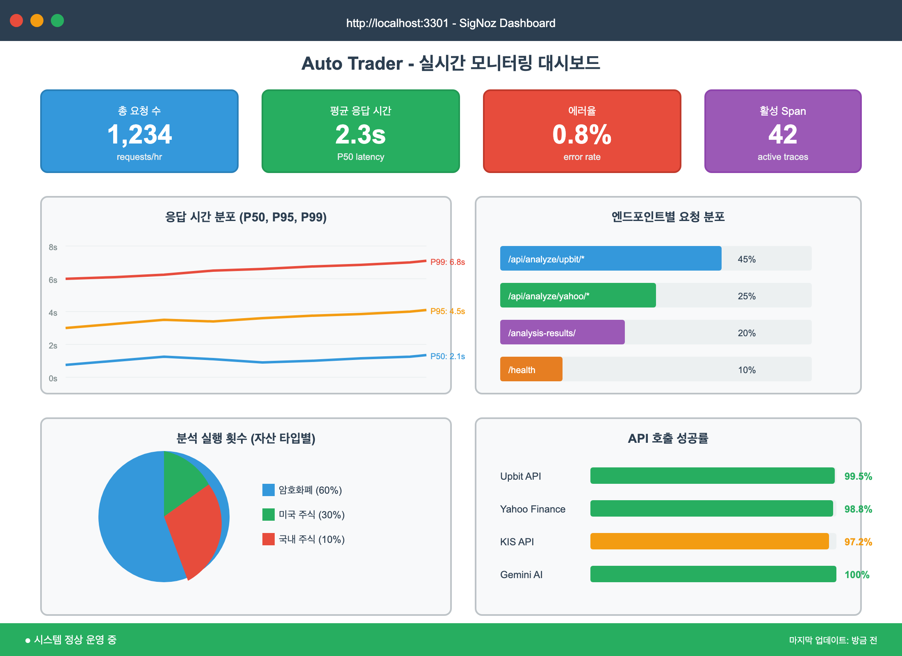

# 실전 운영을 위한 모니터링 시스템 구축: OpenTelemetry + SigNoz로 완벽한 관찰성 확보하기


> 이 글은 AI 기반 자동매매 시스템 시리즈의 **6편**입니다.
>
> **전체 시리즈:**
> - [1편: 한투 API로 실시간 주식 데이터 수집하기](https://mgh3326.tistory.com/227)
> - [2편: yfinance로 애플·테슬라 분석하기](https://mgh3326.tistory.com/228)
> - [3편: Upbit으로 비트코인 24시간 분석하기](https://mgh3326.tistory.com/229)
> - [4편: AI 분석 결과 DB에 저장하기](https://mgh3326.tistory.com/230)
> - [5편: 웹 대시보드로 분석 결과 시각화하기](https://mgh3326.tistory.com/231)
> - **6편: 실전 운영을 위한 모니터링 시스템 구축** ← 현재 글
> - 7편: 라즈베리파이 홈서버에 Docker 배포하기 (예정)

## 들어가며

### 지금까지의 여정

우리는 지금까지:
- ✅ 한투/yfinance/Upbit API로 데이터 수집
- ✅ AI 분석 자동화 (Gemini)
- ✅ DB 저장 및 정규화
- ✅ 웹 대시보드 구축

까지 완성했습니다.

### 원래 계획과 실제

원래 이번 글에서는 **'라즈베리파이에 배포하기'**를 다루려고 했습니다.

하지만 실제로 시스템을 며칠 운영해보니 **심각한 문제**를 발견했습니다.

### 🚨 실전에서 마주한 문제들

#### 문제 1: 보이지 않는 실패

```
[아침 9시] "어? 비트코인 매수가 안 됐네?"
[로그 확인] 새벽 3시: 잔고 부족으로 매수 실패
→ 6시간 동안 실패한 줄도 모르고 있었음
```

**원인**: 에러가 발생해도 로그에만 기록되고, 실시간으로 알림을 받을 방법이 없었습니다.

#### 문제 2: 에러 발견 지연

```
[오후 2시] "왜 오늘 분석이 하나도 안 돌았지?"
[서버 접속] API 키 만료로 모든 분석 실패
→ 하루 종일 시스템이 멈춰있었음
```

**원인**: 서버에 직접 접속해야만 상태를 확인할 수 있었습니다.

#### 문제 3: 성능 문제 파악 불가

- AI 분석이 평소보다 느린가? → **모름**
- 어떤 코인이 가장 자주 에러나는가? → **모름**
- API 호출 성공률은? → **모름**

**원인**: 메트릭을 수집하지 않아서 시스템 상태를 정량적으로 파악할 수 없었습니다.

### 💡 깨달음: 프로덕션 배포 전에 모니터링이 필수!

에러를 즉시 알 수 없다면, 라즈베리파이에 배포해봤자 **'조용히 실패하는 시스템'**만 만들 뿐입니다.

그래서 결정했습니다:

1. ✋ 라즈베리파이 배포를 잠시 미루고
2. 🔍 **모니터링 시스템을 먼저 구축**하기로
3. 📊 에러 알림, 메트릭 수집, 대시보드를 완성한 후
4. 🚀 안심하고 프로덕션 배포하기

이번 글에서는 이 과정을 공유합니다.

## 왜 모니터링이 필요한가?

### 실전 사례로 보는 모니터링의 가치


*모니터링 시스템 구축 전과 후의 차이*

#### 사례 1: 잔고 부족 조기 발견

**Before (모니터링 없음):**
- 문제: 새벽 3시 잔고 부족으로 매수 실패
- 발견: 오전 9시 수동 확인
- 손실: 6시간 거래 기회 상실

**After (Telegram 알림):**
```
[텔레그램 알림 - 03:02]
❌ 매수 주문 실패
코인: 비트코인
이유: InsufficientFunds
잔액: 5,000원 / 필요: 50,000원
```
→ 즉시 확인하고 입금 처리 가능!

#### 사례 2: API 장애 즉시 감지

**Before:**
- Upbit API 일시적 장애로 30분간 모든 주문 실패
- 로그만 쌓이고 아무도 모름
- 다음날 발견

**After:**
- API 호출 실패 즉시 Telegram 알림
- 5분 안에 문제 인지
- 수동 모드로 전환하여 대응

#### 사례 3: 성능 저하 추적

**SigNoz 대시보드로 발견:**
- 특정 코인의 AI 분석 시간: 평소 30초 → 2분
- 원인: 해당 코인의 API 타임아웃 증가
- 조치: 타임아웃 설정 조정

### 모니터링으로 얻는 3가지 이점

**1. 빠른 문제 발견 (Mean Time To Detect ↓)**
- 에러 발생 → 알림 수신: 1초 이내
- 서버 접속 없이 Telegram으로 즉시 파악

**2. 근거 있는 의사결정**
- "이 API는 신뢰할 만한가?" → 성공률 99.2% 확인
- "분석 빈도를 높여도 될까?" → 평균 응답시간 체크

**3. 안정적인 운영**
- 배포 전: "괜찮겠지...?" (불안)
- 배포 후: 대시보드로 실시간 모니터링 (안심)

## 기술 스택 선택

### 고려했던 옵션들

| 도구 | 장점 | 단점 | 선택 여부 |
|------|------|------|----------|
| **Prometheus + Grafana** | 검증된 조합, 커뮤니티 활성화 | 설정 복잡, 별도 로그 시스템 필요 | ❌ |
| **Datadog** | 올인원 SaaS, 설정 간편 | 유료 (월 $15~), 자체 호스팅 불가 | ❌ |
| **Elastic Stack (ELK)** | 강력한 로그 분석 | 무겁고 복잡, 리소스 많이 사용 | ❌ |
| **SigNoz + OpenTelemetry** | 오픈소스, 로그+메트릭+트레이스 통합 | 비교적 새로운 프로젝트 | ✅ |

### 최종 선택: SigNoz + OpenTelemetry

**왜 SigNoz인가?**

1. **완전 오픈소스**: 무료, 자체 호스팅 가능
2. **올인원**: 로그, 메트릭, 트레이스를 하나의 UI에서
3. **OpenTelemetry 네이티브**: 표준 계측 라이브러리 사용
4. **설정 간단**: Docker Compose로 5분 안에 시작
5. **가벼움**: Prometheus+Grafana보다 리소스 적게 사용
6. **현대적 UI**: 직관적이고 빠른 대시보드

**OpenTelemetry란?**

> CNCF(Cloud Native Computing Foundation) 표준 관찰성(Observability) 프레임워크
>
> - 벤더 중립적 (한 번 계측하면 모든 백엔드 호환)
> - 자동 계측(Auto-instrumentation) 지원
> - 업계 표준으로 자리 잡음

## 시스템 아키텍처

우리가 구축할 모니터링 시스템의 전체 구조입니다:


*FastAPI + OpenTelemetry + SigNoz + Telegram으로 구성된 모니터링 시스템*

**핵심 컴포넌트:**

1. **MonitoringMiddleware**: 모든 HTTP 요청을 가로채서 추적
2. **Telemetry Manager**: OpenTelemetry 초기화 및 관리
3. **ErrorReporter**: Telegram으로 에러 알림 (Redis 중복 제거)
4. **SigNoz**: 메트릭/트레이스를 저장하고 시각화
5. **Telegram Bot**: 실시간 에러 알림

## OpenTelemetry 통합

### 1. 의존성 추가

```toml
# pyproject.toml
[project.dependencies]
opentelemetry-api = "^1.27.0"
opentelemetry-sdk = "^1.27.0"
opentelemetry-exporter-otlp = "^1.27.0"
opentelemetry-instrumentation-fastapi = "^0.48b0"
opentelemetry-instrumentation-httpx = "^0.48b0"
opentelemetry-instrumentation-sqlalchemy = "^0.48b0"
opentelemetry-instrumentation-redis = "^0.48b0"
```

```bash
uv sync
```

### 2. Telemetry 설정

```python
# app/monitoring/telemetry.py
from opentelemetry import trace, metrics
from opentelemetry.exporter.otlp.proto.grpc.trace_exporter import OTLPSpanExporter
from opentelemetry.exporter.otlp.proto.grpc.metric_exporter import OTLPMetricExporter
from opentelemetry.sdk.resources import Resource
from opentelemetry.sdk.trace import TracerProvider
from opentelemetry.sdk.metrics import MeterProvider

def setup_telemetry(
    service_name: str,
    endpoint: str,
    environment: str = "development",
    insecure: bool = True
) -> None:
    """
    OpenTelemetry 초기화

    Args:
        service_name: 서비스 이름 (예: "auto-trader")
        endpoint: SigNoz OTLP 엔드포인트 (예: "localhost:4317")
        environment: 환경 (development/staging/production)
        insecure: gRPC 연결 암호화 여부 (개발: True, 프로덕션: False)
    """
    # Resource 설정 (서비스 메타데이터)
    resource = Resource.create({
        "service.name": service_name,
        "service.version": "0.1.0",
        "deployment.environment": environment,
    })

    # 1. Trace Provider 설정
    tracer_provider = TracerProvider(resource=resource)
    span_exporter = OTLPSpanExporter(
        endpoint=endpoint,
        insecure=insecure
    )
    tracer_provider.add_span_processor(
        BatchSpanProcessor(span_exporter)
    )
    trace.set_tracer_provider(tracer_provider)

    # 2. Metrics Provider 설정
    metric_reader = PeriodicExportingMetricReader(
        OTLPMetricExporter(endpoint=endpoint, insecure=insecure),
        export_interval_millis=10000  # 10초마다 전송
    )
    meter_provider = MeterProvider(
        resource=resource,
        metric_readers=[metric_reader]
    )
    metrics.set_meter_provider(meter_provider)

    print(f"✅ Telemetry initialized: {service_name} -> {endpoint}")
```

**핵심 포인트:**
- `Resource`: 서비스 이름, 버전, 환경 등 메타데이터 정의
- `TracerProvider`: 분산 추적 설정
- `MeterProvider`: 메트릭 수집 설정
- `insecure=True`: 개발 환경에서는 암호화 없이 연결 (빠름)

### 3. FastAPI 자동 계측

```python
# app/main.py
from fastapi import FastAPI
from opentelemetry.instrumentation.fastapi import FastAPIInstrumentor
from opentelemetry.instrumentation.httpx import HTTPXClientInstrumentor
from opentelemetry.instrumentation.sqlalchemy import SQLAlchemyInstrumentor
from opentelemetry.instrumentation.redis import RedisInstrumentor

from app.core.config import settings
from app.monitoring.telemetry import setup_telemetry

app = FastAPI(title="Auto Trader")

# Telemetry 초기화
if settings.SIGNOZ_ENABLED:
    setup_telemetry(
        service_name=settings.OTEL_SERVICE_NAME,
        endpoint=settings.SIGNOZ_ENDPOINT,
        environment=settings.OTEL_ENVIRONMENT,
        insecure=settings.SIGNOZ_INSECURE
    )

    # 자동 계측
    FastAPIInstrumentor.instrument_app(app)  # FastAPI 요청/응답 자동 추적
    HTTPXClientInstrumentor().instrument()   # httpx HTTP 클라이언트 추적
    SQLAlchemyInstrumentor().instrument()     # DB 쿼리 추적
    RedisInstrumentor().instrument()          # Redis 명령 추적

    print("✅ Auto-instrumentation enabled")
```

**자동 계측의 장점:**
- 코드 수정 없이 FastAPI 엔드포인트 추적
- HTTP 요청, DB 쿼리, Redis 명령 자동 기록
- 분산 추적으로 전체 요청 흐름 파악

### 4. 환경 변수 설정

```.env
# OpenTelemetry / SigNoz
SIGNOZ_ENABLED=true
SIGNOZ_ENDPOINT=localhost:4317
SIGNOZ_INSECURE=true
OTEL_SERVICE_NAME=auto-trader
OTEL_SERVICE_VERSION=0.1.0
OTEL_ENVIRONMENT=development
```

## SigNoz 설정 및 실행

### 1. Docker Compose 파일 작성

```yaml
# docker-compose.monitoring.yml
version: "3.8"

services:
  # ClickHouse: 메트릭/트레이스 저장소
  clickhouse:
    image: clickhouse/clickhouse-server:23.7
    volumes:
      - signoz-clickhouse-data:/var/lib/clickhouse
    environment:
      - CLICKHOUSE_DB=signoz

  # SigNoz Query Service: 백엔드 API
  query-service:
    image: signoz/query-service:0.39.0
    depends_on:
      - clickhouse
    environment:
      - ClickHouseUrl=tcp://clickhouse:9000

  # OTLP Collector: 텔레메트리 수집
  otel-collector:
    image: signoz/signoz-otel-collector:0.88.11
    command: ["--config=/etc/otel-collector-config.yaml"]
    volumes:
      - ./signoz-config/otel-collector-config.yaml:/etc/otel-collector-config.yaml
    ports:
      - "4317:4317"   # OTLP gRPC
      - "4318:4318"   # OTLP HTTP

  # Frontend: 대시보드 UI
  frontend:
    image: signoz/frontend:0.39.0
    depends_on:
      - query-service
    ports:
      - "3301:3301"
    environment:
      - FRONTEND_API_ENDPOINT=http://query-service:8080

volumes:
  signoz-clickhouse-data:
```

### 2. OTLP Collector 설정

```yaml
# signoz-config/otel-collector-config.yaml
receivers:
  otlp:
    protocols:
      grpc:
        endpoint: 0.0.0.0:4317
      http:
        endpoint: 0.0.0.0:4318

processors:
  batch:
    timeout: 10s
    send_batch_size: 1024

exporters:
  clickhouse:
    endpoint: tcp://clickhouse:9000?database=signoz
    ttl: 168h  # 7일 데이터 보관

service:
  pipelines:
    traces:
      receivers: [otlp]
      processors: [batch]
      exporters: [clickhouse]

    metrics:
      receivers: [otlp]
      processors: [batch]
      exporters: [clickhouse]
```

### 3. SigNoz 실행

```bash
# SigNoz 스택 실행
docker-compose -f docker-compose.monitoring.yml up -d

# 상태 확인
docker-compose -f docker-compose.monitoring.yml ps

# 로그 확인
docker-compose -f docker-compose.monitoring.yml logs -f otel-collector
```

### 4. 대시보드 접속

브라우저에서 **http://localhost:3301** 접속


## Telegram 에러 리포팅

### 1. Telegram Bot 생성

1. Telegram에서 [@BotFather](https://t.me/botfather) 검색
2. `/newbot` 명령으로 새 봇 생성
3. Bot Token 저장 (예: `123456:ABC-DEF...`)

### 2. Chat ID 확인

```bash
# 1. 봇에게 아무 메시지나 전송

# 2. getUpdates API 호출
curl https://api.telegram.org/bot<YOUR_BOT_TOKEN>/getUpdates

# 3. 응답에서 chat.id 확인
# {
#   "result": [{
#     "message": {
#       "chat": {"id": 123456789, "first_name": "Your Name"}
#     }
#   }]
# }
```

### 3. ErrorReporter 구현

```python
# app/monitoring/error_reporter.py
import hashlib
import logging
import traceback
from typing import Optional

import httpx
from redis.asyncio import Redis

logger = logging.getLogger(__name__)


class ErrorReporter:
    """
    Telegram 에러 리포터 (Singleton + Redis 중복 제거)
    """

    _instance: Optional["ErrorReporter"] = None

    def __new__(cls):
        if cls._instance is None:
            cls._instance = super().__new__(cls)
        return cls._instance

    def __init__(self):
        if not hasattr(self, "_initialized"):
            self._bot_token: Optional[str] = None
            self._chat_id: Optional[str] = None
            self._redis: Optional[Redis] = None
            self._http_client: Optional[httpx.AsyncClient] = None
            self._duplicate_window: int = 300  # 5분
            self._initialized = True

    def configure(
        self,
        bot_token: str,
        chat_id: str,
        redis_client: Redis,
        duplicate_window: int = 300
    ) -> None:
        """ErrorReporter 설정"""
        self._bot_token = bot_token
        self._chat_id = chat_id
        self._redis = redis_client
        self._duplicate_window = duplicate_window
        self._http_client = httpx.AsyncClient(timeout=10.0)
        logger.info(f"ErrorReporter configured: chat_id={chat_id}")

    async def shutdown(self) -> None:
        """리소스 정리"""
        if self._http_client:
            await self._http_client.aclose()
        if self._redis:
            await self._redis.aclose()

    def _generate_rate_limit_key(
        self, error_type: str, error_message: str, stack_trace: str
    ) -> str:
        """
        에러 고유 키 생성 (중복 방지용)

        에러 타입 + 메시지 첫 200자 + 스택 트레이스 첫 라인을 조합하여
        같은 에러를 식별합니다.
        """
        # 메시지 정규화 (숫자, 특수문자 제거)
        normalized_msg = error_message[:200]

        # 스택 트레이스의 첫 라인 (에러 발생 위치)
        first_stack_line = ""
        if stack_trace:
            lines = [line.strip() for line in stack_trace.split("\n") if line.strip()]
            for line in lines:
                if line.startswith("File"):
                    first_stack_line = line
                    break

        # SHA-256 해시로 고유 키 생성
        unique_str = f"{error_type}:{normalized_msg}:{first_stack_line}"
        error_hash = hashlib.sha256(unique_str.encode()).hexdigest()[:16]

        return f"error_reported:{error_hash}"

    async def report_error(
        self,
        error: Exception,
        context: dict = None,
        level: str = "ERROR"
    ) -> bool:
        """
        에러를 Telegram으로 전송 (중복 체크 포함)

        Returns:
            True: 전송 성공 또는 중복으로 스킵
            False: 전송 실패
        """
        if not self._bot_token or not self._chat_id:
            return False

        # 에러 정보 추출
        error_type = type(error).__name__
        error_message = str(error)
        stack_trace = traceback.format_exc()

        # 중복 체크
        rate_limit_key = self._generate_rate_limit_key(
            error_type, error_message, stack_trace
        )

        if self._redis:
            is_duplicate = await self._redis.get(rate_limit_key)
            if is_duplicate:
                logger.debug(f"Duplicate error skipped: {error_type}")
                return True  # 중복이므로 스킵 (성공으로 처리)

        # Telegram 메시지 작성
        message = self._format_error_message(
            error_type, error_message, stack_trace, context, level
        )

        # Telegram 전송
        try:
            response = await self._http_client.post(
                f"https://api.telegram.org/bot{self._bot_token}/sendMessage",
                json={
                    "chat_id": self._chat_id,
                    "text": message,
                    "parse_mode": "Markdown"
                }
            )

            if response.status_code == 200:
                # 중복 방지 키 설정 (TTL: duplicate_window)
                if self._redis:
                    await self._redis.setex(
                        rate_limit_key,
                        self._duplicate_window,
                        "1"
                    )
                logger.info(f"Error reported to Telegram: {error_type}")
                return True
            else:
                logger.error(f"Telegram API error: {response.text}")
                return False

        except Exception as e:
            logger.error(f"Failed to send error to Telegram: {e}")
            return False

    def _format_error_message(
        self,
        error_type: str,
        error_message: str,
        stack_trace: str,
        context: dict,
        level: str
    ) -> str:
        """에러 메시지 포맷팅 (Markdown)"""
        emoji = "🔴" if level == "CRITICAL" else "⚠️"

        message = f"{emoji} *{level}: {error_type}*\n\n"
        message += f"*Message:*\n```\n{error_message[:300]}\n```\n\n"

        # 컨텍스트 정보
        if context:
            message += "*Context:*\n"
            for key, value in context.items():
                message += f"  • {key}: `{value}`\n"
            message += "\n"

        # 스택 트레이스 (마지막 5줄만)
        if stack_trace:
            lines = stack_trace.split("\n")
            last_lines = "\n".join(lines[-5:])
            message += f"*Stack Trace:*\n```\n{last_lines[:500]}\n```"

        return message


# Singleton 인스턴스 가져오기
def get_error_reporter() -> ErrorReporter:
    return ErrorReporter()
```

**핵심 포인트:**

1. **Singleton 패턴**: 앱 전체에서 하나의 인스턴스만 사용
2. **Redis 중복 제거**: 5분 내 같은 에러는 한 번만 전송
3. **SHA-256 해시**: 에러 타입 + 메시지 + 스택 위치로 고유 키 생성
4. **Markdown 포맷**: Telegram에서 가독성 높은 메시지

### 4. 환경 변수 설정

```.env
# Telegram Error Reporting
ERROR_REPORTING_ENABLED=true
TELEGRAM_TOKEN=123456:ABC-DEF1234ghIkl-zyx57W2v1u123ew11
ERROR_REPORTING_CHAT_ID=123456789
ERROR_DUPLICATE_WINDOW=300
```

### 5. 실제 사용 예시

```python
# app/main.py
from app.monitoring.error_reporter import get_error_reporter
from app.core.redis import get_redis

@app.on_event("startup")
async def setup_error_reporting():
    if settings.ERROR_REPORTING_ENABLED:
        redis = await get_redis()
        error_reporter = get_error_reporter()
        error_reporter.configure(
            bot_token=settings.TELEGRAM_TOKEN,
            chat_id=settings.ERROR_REPORTING_CHAT_ID,
            redis_client=redis,
            duplicate_window=settings.ERROR_DUPLICATE_WINDOW
        )
        print("✅ Error reporting enabled")


@app.on_event("shutdown")
async def cleanup_error_reporting():
    error_reporter = get_error_reporter()
    await error_reporter.shutdown()
```

### 6. Telegram 알림 예시

에러 발생 시 Telegram으로 다음과 같은 메시지가 전송됩니다:

```
🔴 ERROR: InsufficientFundsError

Message:
```
잔고 부족: 보유 5,000원, 필요 50,000원
```

Context:
  • coin: 비트코인
  • order_type: buy
  • amount: 50000
  • timestamp: 2025-11-06 03:02:15

Stack Trace:
```
  File "app/trading/order.py", line 142, in place_buy_order
    raise InsufficientFundsError(...)
```
```

## 모니터링 미들웨어 구현

### 1. MonitoringMiddleware 작성

```python
# app/middleware/monitoring.py
import time
from typing import Callable

from fastapi import Request, Response, HTTPException
from starlette.middleware.base import BaseHTTPMiddleware

from app.monitoring.telemetry import get_tracer, get_meter
from app.monitoring.error_reporter import get_error_reporter

logger = logging.getLogger(__name__)


class MonitoringMiddleware(BaseHTTPMiddleware):
    """
    모든 HTTP 요청을 모니터링하는 미들웨어
    """

    def __init__(self, app):
        super().__init__(app)
        self._tracer = None
        self._meter = None
        self._request_duration_histogram = None
        self._request_counter = None
        self._error_counter = None

    async def dispatch(self, request: Request, call_next: Callable) -> Response:
        """요청 처리 및 모니터링"""
        start_time = time.time()
        request_id = request.headers.get("X-Request-ID", "unknown")

        # Lazy initialization (Telemetry가 준비되면 자동 초기화)
        await self._ensure_instruments()

        # Span 생성
        if self._tracer:
            with self._tracer.start_as_current_span(
                f"{request.method} {request.url.path}"
            ) as span:
                return await self._process_request_with_span(
                    request, call_next, start_time, request_id, span
                )
        else:
            return await self._process_request_without_span(
                request, call_next, start_time, request_id
            )

    async def _ensure_instruments(self):
        """Telemetry 계측 초기화 (Lazy)"""
        if self._instruments_ready:
            return

        from app.monitoring.telemetry import is_telemetry_initialized
        if not is_telemetry_initialized():
            return

        self._tracer = get_tracer(__name__)
        self._meter = get_meter(__name__)

        # Metrics 정의
        self._request_duration_histogram = self._meter.create_histogram(
            name="http.server.request.duration",
            description="HTTP request duration in milliseconds",
            unit="ms"
        )

        self._request_counter = self._meter.create_counter(
            name="http.server.requests",
            description="Total HTTP requests"
        )

        self._error_counter = self._meter.create_counter(
            name="http.server.errors",
            description="Total HTTP errors"
        )

        self._instruments_ready = True
        logger.debug("MonitoringMiddleware instruments initialized")

    async def _process_request_with_span(
        self, request, call_next, start_time, request_id, span
    ):
        """Span과 함께 요청 처리"""
        try:
            # Span 속성 설정
            span.set_attribute("http.method", request.method)
            span.set_attribute("http.url", str(request.url))
            span.set_attribute("http.route", request.url.path)
            span.set_attribute("http.request_id", request_id)

            if request.client:
                span.set_attribute("http.client_host", request.client.host)

            # 요청 처리
            response = await call_next(request)

            # 응답 속성 설정
            span.set_attribute("http.status_code", response.status_code)

            # 메트릭 기록
            duration_ms = (time.time() - start_time) * 1000
            self._record_metrics(request, response.status_code, duration_ms)

            # 커스텀 헤더 추가
            response.headers["X-Request-ID"] = request_id
            response.headers["X-Process-Time"] = f"{duration_ms:.2f}ms"

            return response

        except Exception as exc:
            # 에러 처리
            await self._handle_error(exc, request, span, start_time)
            raise

    async def _handle_error(
        self, exc: Exception, request: Request, span, start_time: float
    ):
        """에러 처리 및 리포팅"""
        # Span에 에러 기록
        if span:
            span.record_exception(exc)
            span.set_status(Status(StatusCode.ERROR, str(exc)))

        # 메트릭 기록
        duration_ms = (time.time() - start_time) * 1000

        if isinstance(exc, HTTPException):
            status_code = exc.status_code
        else:
            status_code = 500

        self._record_metrics(request, status_code, duration_ms, is_error=True)

        # Telegram 에러 리포팅 (500+ 에러만)
        if status_code >= 500:
            error_reporter = get_error_reporter()
            await error_reporter.report_error(
                exc,
                context={
                    "method": request.method,
                    "path": request.url.path,
                    "status_code": status_code,
                },
                level="ERROR" if status_code < 500 else "CRITICAL"
            )

    def _record_metrics(
        self, request: Request, status_code: int, duration_ms: float, is_error: bool = False
    ):
        """메트릭 기록"""
        if not self._instruments_ready:
            return

        labels = {
            "method": request.method,
            "route": request.url.path,
            "status_code": str(status_code)
        }

        # 요청 카운터
        self._request_counter.add(1, labels)

        # 응답 시간 히스토그램
        self._request_duration_histogram.record(duration_ms, labels)

        # 에러 카운터
        if is_error:
            self._error_counter.add(1, labels)
```

**핵심 포인트:**

1. **Lazy Initialization**: Telemetry가 준비될 때까지 대기
2. **Span 생성**: 모든 요청을 분산 추적
3. **메트릭 수집**: 요청 횟수, 응답 시간, 에러 카운트
4. **에러 리포팅**: 500+ 에러는 Telegram으로 즉시 알림

### 2. 미들웨어 등록

```python
# app/main.py
from app.middleware.monitoring import MonitoringMiddleware

app = FastAPI()

# 모니터링 미들웨어 등록 (가장 먼저!)
app.add_middleware(MonitoringMiddleware)
```

## 커스텀 비즈니스 메트릭

### 1. 분석 서비스 메트릭

```python
# app/analysis/service_analyzers.py
from app.monitoring.telemetry import get_meter, get_tracer

class UpbitAnalyzer(Analyzer):
    """Upbit 암호화폐 분석기 (커스텀 메트릭 포함)"""

    def __init__(self):
        super().__init__()

        # 메트릭 정의
        meter = get_meter(__name__)
        self._analysis_counter = meter.create_counter(
            name="analysis.executions",
            description="Number of analysis executions",
        )
        self._analysis_duration = meter.create_histogram(
            name="analysis.duration",
            description="Analysis execution time in milliseconds",
            unit="ms"
        )
        self._api_call_counter = meter.create_counter(
            name="api.calls",
            description="External API calls"
        )
        self._api_call_duration = meter.create_histogram(
            name="api.call.duration",
            description="API call duration in milliseconds",
            unit="ms"
        )

        # Tracer
        self._tracer = get_tracer(__name__)

    async def analyze_coin_json(self, coin_name: str):
        """코인 분석 (메트릭 포함)"""
        start_time = time.time()

        # Span 시작
        with self._tracer.start_as_current_span(f"analyze_coin: {coin_name}") as span:
            span.set_attribute("coin.name", coin_name)
            span.set_attribute("market", "upbit")

            try:
                # 1. 데이터 수집 (API 호출 추적)
                with self._tracer.start_as_current_span("collect_data") as data_span:
                    api_start = time.time()
                    df, info, candles = await self._collect_data(coin_name)
                    api_duration = (time.time() - api_start) * 1000

                    # API 호출 메트릭
                    self._api_call_counter.add(1, {
                        "service": "upbit",
                        "operation": "collect_data",
                        "status": "success"
                    })
                    self._api_call_duration.record(api_duration, {
                        "service": "upbit",
                        "operation": "collect_data"
                    })

                # 2. AI 분석
                result, model = await self.analyze_and_save(
                    df=df,
                    symbol=coin_name,
                    name=coin_name,
                    instrument_type="crypto",
                    # ...
                )

                # 3. 성공 메트릭 기록
                duration_ms = (time.time() - start_time) * 1000

                confidence_range = "high" if result.confidence >= 70 else \
                                   "medium" if result.confidence >= 40 else "low"

                self._analysis_counter.add(1, {
                    "status": "success",
                    "asset_type": "crypto",
                    "asset_name": coin_name,
                    "market": "upbit",
                    "model": model,
                    "decision": result.decision,
                    "confidence_range": confidence_range
                })

                self._analysis_duration.record(duration_ms, {
                    "status": "success",
                    "asset_type": "crypto",
                    "market": "upbit",
                    "model": model
                })

                span.set_attribute("analysis.decision", result.decision)
                span.set_attribute("analysis.confidence", result.confidence)

                return result, model

            except Exception as e:
                # 실패 메트릭 기록
                duration_ms = (time.time() - start_time) * 1000

                self._analysis_counter.add(1, {
                    "status": "error",
                    "asset_type": "crypto",
                    "asset_name": coin_name,
                    "market": "upbit",
                })

                self._analysis_duration.record(duration_ms, {
                    "status": "error",
                    "asset_type": "crypto",
                    "market": "upbit"
                })

                self._api_call_counter.add(1, {
                    "service": "upbit",
                    "operation": "collect_data",
                    "status": "error"
                })

                span.record_exception(e)
                span.set_status(Status(StatusCode.ERROR))
                raise
```

**수집되는 메트릭:**

1. **`analysis.executions`** (Counter)
   - 분석 실행 횟수
   - Tags: status, asset_type, asset_name, market, model, decision, confidence_range

2. **`analysis.duration`** (Histogram)
   - 분석 소요 시간 (ms)
   - Tags: status, asset_type, market, model

3. **`api.calls`** (Counter)
   - 외부 API 호출 횟수
   - Tags: service, operation, status

4. **`api.call.duration`** (Histogram)
   - API 호출 소요 시간 (ms)
   - Tags: service, operation

### 2. API 엔드포인트 메트릭

```python
# app/routers/analysis_json.py
from app.monitoring.telemetry import get_meter, get_tracer

router = APIRouter()
meter = get_meter(__name__)
tracer = get_tracer(__name__)

# 메트릭 정의
request_counter = meter.create_counter(
    name="analysis_api.requests",
    description="Analysis API requests"
)
request_duration = meter.create_histogram(
    name="analysis_api.duration",
    description="Analysis API response time",
    unit="ms"
)


@router.get("/analysis-results/")
async def get_analysis_results(
    decision: Optional[str] = None,
    page: int = 1,
    per_page: int = 20
):
    """분석 결과 조회 (메트릭 포함)"""
    start_time = time.time()

    with tracer.start_as_current_span("get_analysis_results") as span:
        span.set_attribute("page", page)
        span.set_attribute("per_page", per_page)
        if decision:
            span.set_attribute("decision", decision)

        try:
            # DB 쿼리 실행
            results = await fetch_from_db(decision, page, per_page)

            # 성공 메트릭
            duration_ms = (time.time() - start_time) * 1000
            request_counter.add(1, {
                "endpoint": "/analysis-results",
                "status": "success",
                "has_filters": "true" if decision else "false"
            })
            request_duration.record(duration_ms, {
                "endpoint": "/analysis-results"
            })

            span.set_attribute("result_count", len(results))

            return {"results": results, "page": page}

        except Exception as e:
            # 실패 메트릭
            duration_ms = (time.time() - start_time) * 1000
            request_counter.add(1, {
                "endpoint": "/analysis-results",
                "status": "error"
            })
            request_duration.record(duration_ms, {
                "endpoint": "/analysis-results"
            })

            span.record_exception(e)
            raise
```

## 실제 사용 시나리오

### 시나리오 1: 비트코인 분석 추적

```bash
# 1. 비트코인 분석 API 호출
curl http://localhost:8000/api/analyze/upbit/비트코인
```

**SigNoz에서 확인되는 Trace:**

```
└─ POST /api/analyze/upbit/비트코인 (2.3s)
   ├─ analyze_coin: 비트코인 (2.2s)
   │  ├─ collect_data (1.5s)
   │  │  ├─ GET https://api.upbit.com/v1/candles/days (0.8s)
   │  │  ├─ GET https://api.upbit.com/v1/ticker (0.3s)
   │  │  └─ GET https://api.upbit.com/v1/candles/minutes/60 (0.4s)
   │  ├─ add_indicators (0.1s)
   │  ├─ build_prompt (0.05s)
   │  └─ call_gemini_api (0.5s)
   │     └─ POST https://generativelanguage.googleapis.com/... (0.45s)
   └─ INSERT INTO stock_analysis_results (0.05s)
```

**메트릭 증가:**
- `analysis.executions{status="success", asset_name="비트코인", decision="buy"}` +1
- `analysis.duration{market="upbit"}` = 2200ms
- `api.calls{service="upbit", status="success"}` +3

### 시나리오 2: API 장애 감지

```bash
# Upbit API 타임아웃
curl http://localhost:8000/api/analyze/upbit/이더리움
# → 503 Service Unavailable
```

**Telegram 알림:**
```
⚠️ ERROR: TimeoutError

Message:
```
Upbit API 타임아웃: https://api.upbit.com/v1/candles/days
```

Context:
  • coin: 이더리움
  • api_endpoint: /v1/candles/days
  • timeout: 10s
```

**SigNoz Trace:**
```
└─ POST /api/analyze/upbit/이더리움 (10.1s) ❌
   └─ analyze_coin: 이더리움 (10s) ❌
      └─ collect_data (10s) ❌
         └─ GET https://api.upbit.com/v1/candles/days (10s) ⏱️ TIMEOUT
```

**메트릭 증가:**
- `api.calls{service="upbit", status="error"}` +1
- `http.server.errors{status_code="503"}` +1

### 시나리오 3: 성능 저하 발견

**SigNoz 대시보드에서 확인:**

```
[분석 소요 시간 추이]
10:00 - 평균 2.1초
11:00 - 평균 2.3초
12:00 - 평균 4.8초 ⬆️
13:00 - 평균 4.5초

[상세 확인]
12:15 - 비트코인 분석: 8.2초 (Gemini API 호출 7.5초)
```

**원인 분석:**
- Gemini API P95 응답시간: 7.5초 (평소 0.5초)
- → Gemini API 과부하 추정
- → 재시도 로직 또는 fallback 모델 필요

## SigNoz 대시보드 구성

### 1. 서비스 Overview 대시보드


*SigNoz 실시간 모니터링 대시보드 예시*

**패널 구성:**

**PromQL 쿼리:**

```promql
# 총 요청 수
sum(rate(http_server_requests[5m]))

# 평균 응답 시간 (P50)
histogram_quantile(0.50, http_server_request_duration_bucket)

# 에러율
sum(rate(http_server_errors[5m])) / sum(rate(http_server_requests[5m])) * 100
```

### 2. 분석 성능 대시보드

**패널 구성:**

```
┌─────────────────────────────────────────────────────────────┐
│ Analysis Performance                                        │
├─────────────────────────────────────────────────────────────┤
│ Analysis Executions by Asset Type                           │
│  📊 [그래프]                                                 │
│    crypto    ████████████ 60%                               │
│    equity_us ██████ 30%                                     │
│    equity_kr ██ 10%                                         │
├─────────────────────────────────────────────────────────────┤
│ Analysis Duration (P50, P95, P99)                           │
│  📊 [그래프]                                                 │
│    P50: 2.1s  |  P95: 4.5s  |  P99: 8.2s                   │
├─────────────────────────────────────────────────────────────┤
│ Investment Decision Distribution                            │
│  📊 [원 그래프]                                              │
│    Hold: 45%  |  Buy: 35%  |  Sell: 20%                    │
├─────────────────────────────────────────────────────────────┤
│ API Call Success Rate                                       │
│  📊 [그래프]                                                 │
│    Upbit: 99.5%  |  Yahoo: 98.8%  |  KIS: 97.2%            │
└─────────────────────────────────────────────────────────────┘
```

**PromQL 쿼리:**

```promql
# 시간대별 분석 실행 횟수
sum(rate(analysis_executions[5m])) by (asset_type, market)

# 평균 분석 소요 시간 (P50, P95, P99)
histogram_quantile(0.50, analysis_duration_bucket)
histogram_quantile(0.95, analysis_duration_bucket)
histogram_quantile(0.99, analysis_duration_bucket)

# API 호출 성공률
sum(api_calls{status="success"}) / sum(api_calls) * 100 by (service)

# 투자 결정 분포
sum(analysis_executions{status="success"}) by (decision)
```

### 3. Alerting 설정

**Alert Rule 1: 높은 에러율**

```yaml
name: High Error Rate
condition: |
  sum(rate(http_server_errors[5m])) / sum(rate(http_server_requests[5m])) > 0.05
duration: 5m
severity: warning
message: "에러율이 5%를 초과했습니다 (현재: {{ $value }}%)"
```

**Alert Rule 2: 느린 응답 시간**

```yaml
name: Slow Response Time
condition: |
  histogram_quantile(0.95, http_server_request_duration_bucket) > 5000
duration: 10m
severity: warning
message: "P95 응답 시간이 5초를 초과했습니다 (현재: {{ $value }}ms)"
```

**Alert Rule 3: API 호출 실패**

```yaml
name: API Call Failures
condition: |
  sum(rate(api_calls{status="error"}[5m])) by (service) > 0.1
duration: 5m
severity: critical
message: "{{ $labels.service }} API 호출 실패율이 높습니다"
```

## 트러블슈팅

### 문제 1: SigNoz 대시보드에 데이터가 안 보임

**증상:**
- 앱은 정상 실행
- SigNoz UI는 열리지만 데이터 없음

**해결:**

```bash
# 1. OTLP Collector 로그 확인
docker-compose -f docker-compose.monitoring.yml logs otel-collector

# 2. 앱에서 telemetry 초기화 확인
# app/main.py에서 다음 로그가 있는지 확인:
# "✅ Telemetry initialized: auto-trader -> localhost:4317"

# 3. 환경 변수 확인
echo $SIGNOZ_ENABLED  # true여야 함
echo $SIGNOZ_ENDPOINT  # localhost:4317

# 4. 네트워크 연결 확인
telnet localhost 4317
```

### 문제 2: Telegram 알림이 안 옴

**증상:**
- 에러 발생해도 Telegram 알림 없음

**해결:**

```bash
# 1. Bot Token 테스트
curl https://api.telegram.org/bot<YOUR_TOKEN>/getMe
# 정상이면 봇 정보 반환

# 2. Chat ID 확인
curl https://api.telegram.org/bot<YOUR_TOKEN>/getUpdates
# 봇에게 메시지를 보낸 후 실행

# 3. 수동 메시지 전송 테스트
curl -X POST https://api.telegram.org/bot<YOUR_TOKEN>/sendMessage \
  -H "Content-Type: application/json" \
  -d '{"chat_id": "<YOUR_CHAT_ID>", "text": "테스트 메시지"}'

# 4. 앱 로그 확인
# "ErrorReporter configured: chat_id=..." 로그 확인
```

### 문제 3: Redis 중복 제거가 안 됨

**증상:**
- 같은 에러가 5분 내에 여러 번 전송됨

**해결:**

```bash
# 1. Redis 연결 확인
docker exec -it redis redis-cli
> PING
PONG

# 2. 중복 제거 키 확인
> KEYS error_reported:*
1) "error_reported:a3f5c8d9e2b1f4a7"

> TTL error_reported:a3f5c8d9e2b1f4a7
(integer) 287  # 남은 시간 (초)

# 3. .env에서 Redis URL 확인
echo $REDIS_URL  # redis://localhost:6379/0
```

### 문제 4: 메트릭 중복 등록 에러

**증상:**
```
ValueError: Duplicated timeseries in CollectionRequest
```

**원인:**
- 같은 이름의 메트릭을 여러 번 생성

**해결:**

```python
# ❌ 잘못된 예 (매번 새로 생성)
def analyze():
    meter = get_meter(__name__)
    counter = meter.create_counter("analysis.count")  # 중복!
    counter.add(1)

# ✅ 올바른 예 (클래스 초기화 시 한 번만)
class Analyzer:
    def __init__(self):
        meter = get_meter(__name__)
        self._counter = meter.create_counter("analysis.count")

    def analyze(self):
        self._counter.add(1)  # 재사용
```

## 마치며

### 배운 교훈

이번 작업을 통해 가장 크게 배운 점은:

> **"모니터링은 선택이 아니라 필수다"**

처음에는 "일단 배포하고 문제 생기면 고치면 되지"라고 생각했습니다.

하지만 실제로는:
- 문제가 생겨도 모르고
- 알았을 때는 이미 늦고
- 원인 파악에 시간만 낭비

모니터링을 먼저 구축하니:
- 문제를 즉시 알고
- 빠르게 대응하고
- 안심하고 잠들 수 있게 되었습니다

### 실전에서 체감한 효과

**Before (모니터링 없음):**
```
[아침] "어제 시스템이 제대로 돌았나?"
→ 서버 접속 → 로그 확인 → 30분 소요
→ "어제 새벽 3시에 에러 났었네... 지금 알았다"
```

**After (모니터링 있음):**
```
[새벽 3시] Telegram 알림
❌ Upbit API 타임아웃 발생

[새벽 3시 5분] 스마트폰으로 SigNoz 확인
→ Upbit API 응답시간 급증 확인
→ "일시적 장애로 판단, 모니터링 계속"

[아침] SigNoz 대시보드 확인
→ 3시 이후 정상화 확인
→ 커피 한 잔 하며 5분 만에 상황 파악 완료
```

### 투자 대비 효과

**투자:**
- 개발 시간: 약 2일
- 학습 시간: 1일 (OpenTelemetry, SigNoz)
- 인프라 비용: $0 (오픈소스)

**효과:**
- 문제 발견 시간: 6시간 → 1초
- 상황 파악 시간: 30분 → 5분
- 심리적 안정감: 불안 → 안심
- 수면의 질: 향상 😴

혹시 "귀찮은데 나중에 해야지"라고 생각하시나요?

**지금 2일 투자하면, 앞으로 20일 절약됩니다.**

### 핵심 정리

이번 글에서 구축한 모니터링 시스템:

1. ✅ **OpenTelemetry + SigNoz**
   - 분산 추적으로 전체 요청 흐름 파악
   - 메트릭으로 시스템 성능 정량화
   - 자동 계측으로 코드 수정 최소화

2. ✅ **Telegram 에러 리포팅**
   - Redis 기반 중복 제거 (5분 윈도우)
   - 실시간 알림으로 즉각 대응
   - 컨텍스트 정보로 빠른 디버깅

3. ✅ **커스텀 비즈니스 메트릭**
   - 분석 실행 횟수, 소요 시간
   - API 호출 성공률
   - 투자 결정 분포

4. ✅ **대시보드 & 알림**
   - SigNoz UI로 실시간 모니터링
   - Alert Rule로 자동 알림
   - PromQL로 복잡한 쿼리

### 다음 편 예고

이제 모니터링 시스템도 갖췄으니, 드디어 라즈베리파이에 배포할 준비가 끝났습니다!

다음 글 **7편: 라즈베리파이 홈서버에 Docker 배포하기**(예정)에서는:

- 🍓 라즈베리파이 초기 설정
- 🐳 Docker Compose로 전체 스택 배포
- 🔒 nginx + Let's Encrypt HTTPS 설정
- 🌍 외부에서 안전하게 접속하기
- 🔄 자동 재시작 및 로그 관리
- 📊 SigNoz로 원격 모니터링

를 다룰 예정입니다.

이제 안심하고 24시간 자동매매 시스템을 운영할 수 있습니다! 🎉

---

**참고 자료:**
- [SigNoz 공식 문서](https://signoz.io/docs/)
- [OpenTelemetry Python 가이드](https://opentelemetry.io/docs/instrumentation/python/)
- [Telegram Bot API 문서](https://core.telegram.org/bots/api)
- [전체 프로젝트 코드 (GitHub)](https://github.com/mgh3326/auto_trader)
- [PR #50: Add Monitoring and Observability](https://github.com/mgh3326/auto_trader/pull/50)
