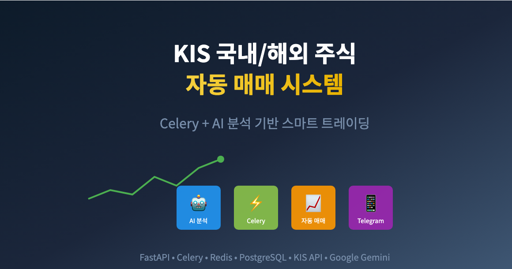
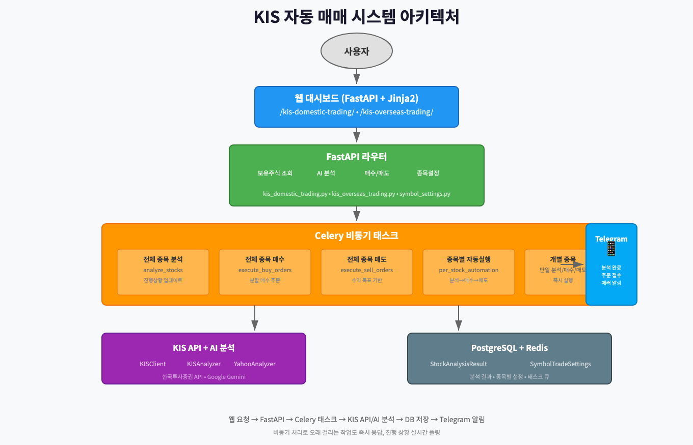
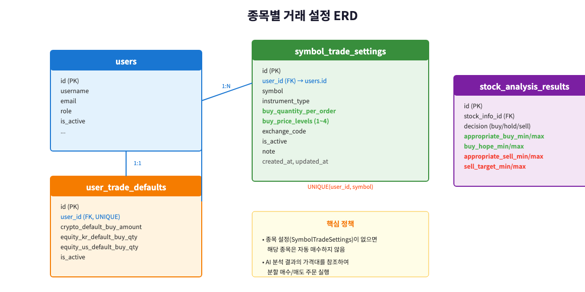
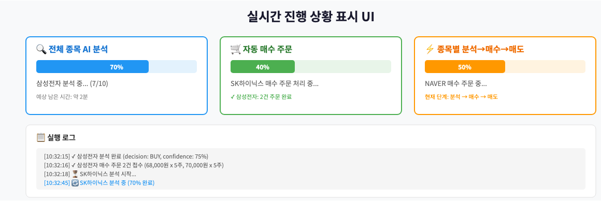
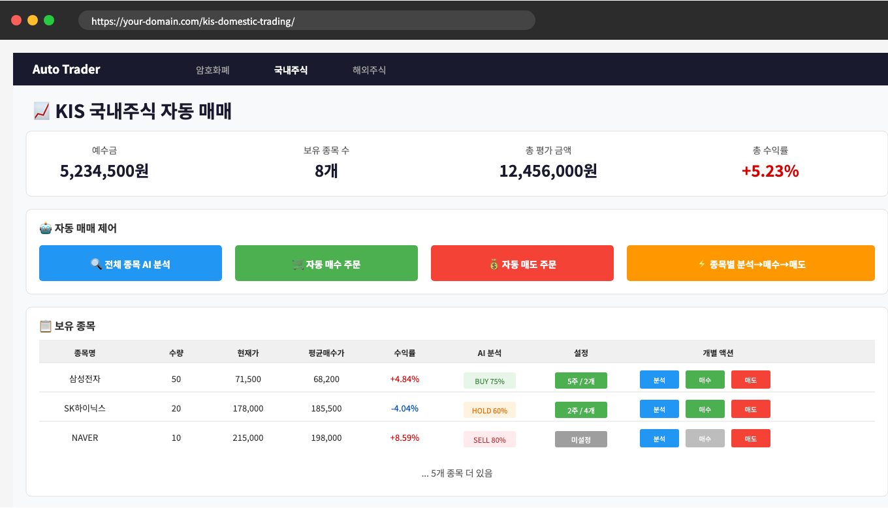
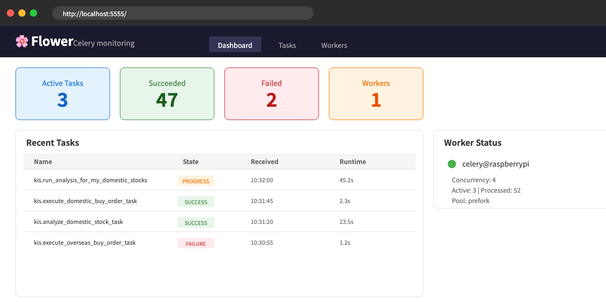

# KIS 국내/해외 주식 자동 매매 시스템 구축하기: Celery + AI 분석 기반 스마트 트레이딩



> 이 글은 AI 기반 자동매매 시스템 시리즈의 **9편**입니다.
>
> **전체 시리즈:**
> - [1편: 한투 API로 실시간 주식 데이터 수집하기](https://mgh3326.tistory.com/227)
> - [2편: yfinance로 애플·테슬라 분석하기](https://mgh3326.tistory.com/228)
> - [3편: Upbit으로 비트코인 24시간 분석하기](https://mgh3326.tistory.com/229)
> - [4편: AI 분석 결과 DB에 저장하기](https://mgh3326.tistory.com/230)
> - [5편: Upbit 웹 트레이딩 대시보드 구축하기](https://mgh3326.tistory.com/232)
> - [6편: 실전 운영을 위한 모니터링 시스템 구축](https://mgh3326.tistory.com/233)
> - [7편: 라즈베리파이 홈서버에 자동 HTTPS로 안전하게 배포하기](https://mgh3326.tistory.com/234)
> - [8편: JWT 인증 시스템으로 안전한 웹 애플리케이션 구축하기](https://mgh3326.tistory.com/235)
> - **9편: KIS 국내/해외 주식 자동 매매 시스템 구축하기** ← 현재 글

## 들어가며

### 지금까지의 여정

우리는 지금까지:
- ✅ 한투/yfinance/Upbit API로 데이터 수집
- ✅ AI 분석 자동화 (Gemini)
- ✅ DB 저장 및 정규화
- ✅ 웹 대시보드 구축 (암호화폐)
- ✅ Grafana 관찰성 스택으로 모니터링
- ✅ 라즈베리파이에 HTTPS 배포
- ✅ JWT 인증 + RBAC

까지 완성했습니다.

### 새로운 과제: 주식 자동 매매

이제 **암호화폐 자동 매매 시스템**을 **주식**으로 확장합니다!

**현재 상태:**
```bash
# Upbit 암호화폐: 자동 매매 가능 ✅
https://your-domain.com/upbit-trading/

# KIS 주식: 조회만 가능 ❌
# 매수/매도 자동화 없음
```

**목표:**
```bash
# 국내 주식 자동 매매 대시보드
https://your-domain.com/kis-domestic-trading/

# 해외 주식 자동 매매 대시보드
https://your-domain.com/kis-overseas-trading/
```

### 왜 주식 자동 매매인가?

**암호화폐 vs 주식 매매의 차이:**

| 항목 | 암호화폐 (Upbit) | 주식 (KIS) |
|------|-----------------|-----------|
| **거래 시간** | 24/7 | 국내 9:00-15:30, 해외 23:30-06:00 |
| **최소 거래 단위** | 금액 기반 (5,000원~) | 주 단위 (1주~) |
| **주문 방식** | 즉시 체결 위주 | 지정가 주문 가능 |
| **API 복잡도** | 단순 | 매우 복잡 (국내/해외 별도) |
| **시장 특성** | 변동성 높음 | 상대적 안정 |

**주식 자동 매매의 핵심 과제:**
1. **분할 매수/매도**: 목표 가격대에 분산 주문
2. **종목별 설정**: 종목마다 다른 매수 수량/금액
3. **비동기 처리**: 여러 종목 동시 분석 및 주문
4. **진행 상황 추적**: 긴 작업의 실시간 모니터링

## 시스템 아키텍처


*Celery 기반 비동기 자동 매매 시스템 구조*

### 전체 구조

```
사용자
  ↓
웹 대시보드 (FastAPI + Jinja2)
  ├─ /kis-domestic-trading/   (국내주식)
  └─ /kis-overseas-trading/   (해외주식)
  ↓
FastAPI 라우터
  ├─ 보유 주식 조회 API
  ├─ AI 분석 요청 API
  ├─ 매수/매도 주문 API
  └─ 종목별 설정 API
  ↓
Celery 비동기 태스크
  ├─ 전체 종목 분석 태스크
  ├─ 전체 종목 매수 태스크
  ├─ 전체 종목 매도 태스크
  ├─ 종목별 자동 실행 태스크
  │   (분석 → 매수 → 매도)
  └─ 개별 종목 태스크
      ├─ 분석
      ├─ 매수
      └─ 매도
  ↓
KIS API + AI 분석
  ├─ KISClient (한국투자증권 API)
  ├─ KISAnalyzer (국내주식 분석)
  └─ YahooAnalyzer (해외주식 분석)
  ↓
PostgreSQL + Redis
  ├─ StockAnalysisResult (분석 결과)
  └─ SymbolTradeSettings (종목별 설정)
```

### 핵심 컴포넌트

**1. 웹 대시보드:**
- 보유 주식 현황 표시
- 예수금/평가금액 표시
- 자동 매매 버튼 (분석/매수/매도)
- 진행 상황 실시간 표시
- 종목별 설정 관리

**2. Celery 태스크:**
- 백그라운드에서 오래 걸리는 작업 처리
- 진행 상황 실시간 업데이트
- 작업 실패 시 자동 재시도

**3. 종목별 설정:**
- 매수 수량 설정
- 주문할 가격대 수 설정 (1~4개)
- 활성화/비활성화

## 데이터베이스 설계

### 종목별 거래 설정 테이블


*종목별 거래 설정 ERD*

```python
# app/models/symbol_trade_settings.py

class SymbolTradeSettings(Base):
    """종목별 거래 설정 테이블"""

    __tablename__ = "symbol_trade_settings"
    __table_args__ = (
        UniqueConstraint("user_id", "symbol", name="uq_user_symbol"),
    )

    id: Mapped[int] = mapped_column(BigInteger, primary_key=True)
    user_id: Mapped[int] = mapped_column(
        ForeignKey("users.id", ondelete="CASCADE"),
        nullable=False,
        index=True
    )
    symbol: Mapped[str] = mapped_column(Text, nullable=False, index=True)
    instrument_type: Mapped[InstrumentType] = mapped_column(
        Enum(InstrumentType), nullable=False
    )

    # 핵심 설정: 주문당 매수 수량
    buy_quantity_per_order: Mapped[float] = mapped_column(
        Numeric(18, 8), nullable=False
    )

    # 주문할 가격대 수 (1~4)
    # 1: appropriate_buy_min만
    # 2: appropriate_buy_min, appropriate_buy_max
    # 3: + buy_hope_min
    # 4: 전체 4개 가격대 (기본값)
    buy_price_levels: Mapped[int] = mapped_column(default=4, nullable=False)

    # 해외주식 거래소 코드 (NASD, NYSE 등)
    exchange_code: Mapped[str | None] = mapped_column(Text, nullable=True)

    is_active: Mapped[bool] = mapped_column(Boolean, default=True)
    note: Mapped[str | None] = mapped_column(Text, nullable=True)
```

**설계 포인트:**

1. **사용자별 종목 설정**: `user_id + symbol` 유니크 제약
2. **유연한 가격대 설정**: `buy_price_levels`로 1~4개 가격대 선택
3. **거래소 구분**: 해외주식은 `exchange_code`로 NASDAQ/NYSE 구분

### 사용자 기본 설정 테이블

```python
class UserTradeDefaults(Base):
    """사용자별 기본 거래 설정"""

    __tablename__ = "user_trade_defaults"

    user_id: Mapped[int] = mapped_column(
        ForeignKey("users.id"), unique=True, index=True
    )

    # 코인 기본 매수 금액 (KRW)
    crypto_default_buy_amount: Mapped[float] = mapped_column(
        Numeric(18, 2), default=10000
    )

    # 국내주식 기본 매수 수량 (주)
    # None이면 설정 없는 종목은 매수 안함
    equity_kr_default_buy_quantity: Mapped[float | None] = mapped_column(
        Numeric(18, 2), nullable=True, default=None
    )

    # 해외주식 기본 매수 수량 (주)
    equity_us_default_buy_quantity: Mapped[float | None] = mapped_column(
        Numeric(18, 2), nullable=True, default=None
    )
```

**핵심 정책:**
> **종목 설정이 없으면 매수하지 않음**

암호화폐와 달리 주식은 개별 종목마다 특성이 다르기 때문에, 사전에 설정된 종목만 자동 매수합니다.

## Celery 비동기 태스크 구현

### 왜 Celery인가?

**문제: 동기 처리의 한계**

```python
# 동기 처리 (나쁜 예)
@router.post("/api/analyze-stocks")
async def analyze_stocks():
    kis = KISClient()
    my_stocks = await kis.fetch_my_stocks()

    for stock in my_stocks:  # 10개 종목
        await analyzer.analyze(stock)  # 각 30초
    # → 총 5분 동안 응답 없음 → 타임아웃!

    return {"success": True}
```

**해결: Celery 비동기 처리**

```python
# 비동기 처리 (좋은 예)
@router.post("/api/analyze-stocks")
async def analyze_stocks():
    # 태스크 즉시 시작하고 task_id 반환
    task = celery_app.send_task("kis.run_analysis_for_my_domestic_stocks")
    return {"success": True, "task_id": task.id}

# 프론트엔드에서 진행 상황 폴링
@router.get("/api/analyze-task/{task_id}")
async def get_task_status(task_id: str):
    result = celery_app.AsyncResult(task_id)
    return {
        "state": result.state,  # PENDING, PROGRESS, SUCCESS, FAILURE
        "progress": result.info  # {"current": 3, "total": 10, "status": "삼성전자 분석 중..."}
    }
```

### 진행 상황 실시간 업데이트

```python
# app/tasks/kis.py

@shared_task(name="kis.run_analysis_for_my_domestic_stocks", bind=True)
def run_analysis_for_my_domestic_stocks(self) -> dict:
    """보유 국내 주식 AI 분석 실행"""

    async def _run() -> dict:
        kis = KISClient()
        analyzer = KISAnalyzer()

        try:
            # 1. 진행 상황 업데이트: 조회 중
            self.update_state(
                state='PROGRESS',
                meta={'status': '보유 주식 조회 중...', 'current': 0, 'total': 0}
            )

            my_stocks = await kis.fetch_my_stocks()
            total_count = len(my_stocks)
            results = []

            # 2. 각 종목별 분석
            for index, stock in enumerate(my_stocks, 1):
                code = stock.get('pdno')
                name = stock.get('prdt_name')

                # 진행 상황 업데이트: 현재 종목
                self.update_state(
                    state='PROGRESS',
                    meta={
                        'current': index,
                        'total': total_count,
                        'status': f'{name} 분석 중... ({index}/{total_count})',
                        'percentage': int((index / total_count) * 100)
                    }
                )

                try:
                    await analyzer.analyze_stock_json(name)
                    results.append({'name': name, 'success': True})
                except Exception as e:
                    results.append({'name': name, 'success': False, 'error': str(e)})

            # 3. 완료
            success_count = sum(1 for r in results if r['success'])
            return {
                'status': 'completed',
                'message': f'{success_count}/{total_count}개 종목 분석 완료',
                'results': results
            }
        finally:
            await analyzer.close()

    return asyncio.run(_run())
```

### 프론트엔드 진행 상황 표시

```javascript
// 분석 시작
async function analyzeStocks() {
    const response = await fetch('/kis-domestic-trading/api/analyze-stocks', {
        method: 'POST'
    });
    const data = await response.json();

    if (data.success) {
        // 진행 상황 폴링 시작
        pollTaskStatus(data.task_id, 'analyze');
    }
}

// 진행 상황 폴링
async function pollTaskStatus(taskId, type) {
    const progressBar = document.getElementById(`${type}-progress-bar`);
    const statusText = document.getElementById(`${type}-status`);

    const poll = async () => {
        const response = await fetch(`/kis-domestic-trading/api/analyze-task/${taskId}`);
        const result = await response.json();

        if (result.state === 'PROGRESS') {
            // 진행 상황 업데이트
            const progress = result.progress;
            progressBar.style.width = `${progress.percentage}%`;
            progressBar.textContent = `${progress.percentage}%`;
            statusText.textContent = progress.status;

            // 계속 폴링
            setTimeout(poll, 1000);
        } else if (result.state === 'SUCCESS') {
            // 완료
            progressBar.style.width = '100%';
            statusText.textContent = result.result.message;
            showAlert('success', '분석이 완료되었습니다.');
            loadMyStocks();  // 데이터 새로고침
        } else if (result.state === 'FAILURE') {
            // 실패
            showAlert('danger', `오류: ${result.error}`);
        }
    };

    poll();
}
```


*실시간 진행 상황 표시 UI*

## 매수/매도 로직 구현

### AI 분석 기반 분할 매수


*AI 분석 기반 분할 매수 플로우*

```python
# app/services/kis_trading_service.py

async def process_kis_domestic_buy_orders_with_analysis(
    kis_client: KISClient,
    symbol: str,
    current_price: float,
    avg_buy_price: float
) -> Dict[str, Any]:
    """분석 결과 기반 국내 주식 분할 매수"""

    # 1. 기본 조건: 현재가가 평균 매수가보다 1% 낮아야 함
    if avg_buy_price > 0:
        target_price = avg_buy_price * 0.99
        if current_price >= target_price:
            return {
                'success': False,
                'message': f"1% 매수 조건 미충족: 현재가 {current_price} >= 목표가 {target_price}"
            }

    # 2. DB에서 최신 AI 분석 결과 조회
    analysis = await service.get_latest_analysis_by_symbol(symbol)
    if not analysis:
        return {'success': False, 'message': "분석 결과 없음"}

    # 3. 종목 설정 확인
    settings = await settings_service.get_by_symbol(symbol)
    if not settings or not settings.is_active:
        return {'success': False, 'message': "종목 설정 없음 - 매수 건너뜀"}

    # 4. AI가 제안한 매수 가격대 추출
    all_buy_prices = []
    if analysis.appropriate_buy_min:
        all_buy_prices.append(("적정매수(하한)", analysis.appropriate_buy_min))
    if analysis.appropriate_buy_max:
        all_buy_prices.append(("적정매수(상한)", analysis.appropriate_buy_max))
    if analysis.buy_hope_min:
        all_buy_prices.append(("희망매수(하한)", analysis.buy_hope_min))
    if analysis.buy_hope_max:
        all_buy_prices.append(("희망매수(상한)", analysis.buy_hope_max))

    # 5. 설정된 가격대 수만큼 선택 (1~4개)
    buy_prices = all_buy_prices[:settings.buy_price_levels]

    # 6. 조건에 맞는 가격 필터링
    # - 평균 매수가의 99%보다 낮고
    # - 현재가보다 낮은 가격
    threshold_price = avg_buy_price * 0.99 if avg_buy_price > 0 else float('inf')
    valid_prices = [
        (name, price) for name, price in buy_prices
        if price < threshold_price and price < current_price
    ]

    if not valid_prices:
        return {'success': False, 'message': "조건에 맞는 매수 가격 없음"}

    # 7. 분할 매수 주문 실행
    quantity = int(settings.buy_quantity_per_order)
    success_count = 0

    for name, price in valid_prices:
        result = await kis_client.order_korea_stock(
            symbol=symbol,
            order_type="buy",
            quantity=quantity,
            price=int(price)
        )

        if result and result.get('rt_cd') == '0':
            success_count += 1

        await asyncio.sleep(0.2)  # API 호출 간격

    return {
        'success': success_count > 0,
        'message': f"{success_count}개 주문 성공 (설정: {settings.buy_price_levels}개 가격대)"
    }
```

### 매수 가격대 설정 이해

AI 분석 결과에서 4가지 매수 가격대를 제공합니다:

| 가격대 | 의미 | 우선순위 |
|--------|------|---------|
| `appropriate_buy_min` | 적정 매수가 하한 | 1 (최우선) |
| `appropriate_buy_max` | 적정 매수가 상한 | 2 |
| `buy_hope_min` | 희망 매수가 하한 | 3 |
| `buy_hope_max` | 희망 매수가 상한 | 4 |

**`buy_price_levels` 설정 예시:**

```
buy_price_levels = 2인 경우:
→ appropriate_buy_min, appropriate_buy_max 두 가격에만 주문

buy_price_levels = 4인 경우 (기본값):
→ 4개 가격대 모두에 주문
```

### AI 분석 기반 분할 매도

```python
async def process_kis_domestic_sell_orders_with_analysis(
    kis_client: KISClient,
    symbol: str,
    current_price: float,
    avg_buy_price: float,
    balance_qty: int
) -> Dict[str, Any]:
    """분석 결과 기반 국내 주식 분할 매도"""

    # 1. AI 분석 결과 조회
    analysis = await service.get_latest_analysis_by_symbol(symbol)
    if not analysis:
        return {'success': False, 'message': "분석 결과 없음"}

    # 2. AI가 제안한 매도 가격대 추출
    sell_prices = []
    if analysis.appropriate_sell_min:
        sell_prices.append(analysis.appropriate_sell_min)
    if analysis.appropriate_sell_max:
        sell_prices.append(analysis.appropriate_sell_max)
    if analysis.sell_target_min:
        sell_prices.append(analysis.sell_target_min)
    if analysis.sell_target_max:
        sell_prices.append(analysis.sell_target_max)

    # 3. 매도 조건 필터링
    # - 평균 매수가의 101% 이상 (최소 1% 수익)
    # - 현재가 이상
    min_sell_price = avg_buy_price * 1.01
    valid_prices = [
        p for p in sell_prices
        if p >= min_sell_price and p >= current_price
    ]
    valid_prices.sort()

    # 4. 조건 미충족 시 현재가로 전량 매도 시도
    if not valid_prices:
        if current_price >= min_sell_price:
            # 이미 목표 수익 달성 → 전량 매도
            result = await kis_client.order_korea_stock(
                symbol=symbol,
                order_type="sell",
                quantity=balance_qty,
                price=int(current_price)
            )
            if result and result.get('rt_cd') == '0':
                return {'success': True, 'message': "목표가 도달로 전량 매도"}
        return {'success': False, 'message': "매도 조건 미충족"}

    # 5. 분할 매도 주문 실행
    split_count = len(valid_prices)
    qty_per_order = balance_qty // split_count

    success_count = 0
    remaining_qty = balance_qty

    for i, price in enumerate(valid_prices):
        is_last = (i == len(valid_prices) - 1)
        qty = remaining_qty if is_last else qty_per_order

        if qty < 1:
            continue

        result = await kis_client.order_korea_stock(
            symbol=symbol,
            order_type="sell",
            quantity=qty,
            price=int(price)
        )

        if result and result.get('rt_cd') == '0':
            success_count += 1
            remaining_qty -= qty

        await asyncio.sleep(0.2)

    return {
        'success': success_count > 0,
        'message': f"{success_count}건 분할 매도 주문 완료"
    }
```

## 종목별 자동 실행 (All-in-One)

### 분석 → 매수 → 매도 순차 실행

```python
@shared_task(name="kis.run_per_domestic_stock_automation", bind=True)
def run_per_domestic_stock_automation(self) -> dict:
    """국내 주식 종목별 자동 실행 (분석 → 매수 → 매도)"""

    async def _run() -> dict:
        kis = KISClient()
        analyzer = KISAnalyzer()

        my_stocks = await kis.fetch_my_stocks()
        results = []

        for index, stock in enumerate(my_stocks, 1):
            code = stock.get('pdno')
            name = stock.get('prdt_name')

            stock_steps = []

            # 1단계: AI 분석
            self.update_state(
                state='PROGRESS',
                meta={'status': f'{name} 분석 중...'}
            )
            try:
                await analyzer.analyze_stock_json(name)
                stock_steps.append({
                    'step': '분석',
                    'result': {'success': True}
                })
            except Exception as e:
                stock_steps.append({
                    'step': '분석',
                    'result': {'success': False, 'error': str(e)}
                })
                # 분석 실패 시 매수/매도 건너뜀
                results.append({'name': name, 'steps': stock_steps})
                continue

            # 2단계: 매수 주문
            self.update_state(
                state='PROGRESS',
                meta={'status': f'{name} 매수 주문 중...'}
            )
            try:
                buy_result = await process_kis_domestic_buy_orders_with_analysis(
                    kis, code, current_price, avg_price
                )
                stock_steps.append({'step': '매수', 'result': buy_result})
            except Exception as e:
                stock_steps.append({
                    'step': '매수',
                    'result': {'success': False, 'error': str(e)}
                })

            # 매수 후 잔고/평단가 최신화
            latest_holdings = await kis.fetch_my_stocks()
            latest = next((s for s in latest_holdings if s.get('pdno') == code), None)
            if latest:
                refreshed_qty = int(latest.get('hldg_qty'))
                refreshed_avg_price = float(latest.get('pchs_avg_pric'))
                refreshed_current_price = float(latest.get('prpr'))

            # 3단계: 매도 주문
            self.update_state(
                state='PROGRESS',
                meta={'status': f'{name} 매도 주문 중...'}
            )
            try:
                sell_result = await process_kis_domestic_sell_orders_with_analysis(
                    kis, code, refreshed_current_price,
                    refreshed_avg_price, refreshed_qty
                )
                stock_steps.append({'step': '매도', 'result': sell_result})
            except Exception as e:
                stock_steps.append({
                    'step': '매도',
                    'result': {'success': False, 'error': str(e)}
                })

            results.append({'name': name, 'code': code, 'steps': stock_steps})

        return {
            'status': 'completed',
            'message': '종목별 자동 실행 완료',
            'results': results
        }

    return asyncio.run(_run())
```

**핵심 포인트:**
1. **순차 실행**: 분석 → 매수 → 매도 순서 보장
2. **잔고 최신화**: 매수 후 평단가/수량 재조회하여 매도에 반영
3. **단계별 결과**: 각 단계의 성공/실패 기록

## 웹 대시보드 구현

### 국내주식 대시보드 UI


*KIS 국내주식 자동 매매 대시보드*

```html
<!-- app/templates/kis_domestic_trading_dashboard.html -->

<div class="container py-4">
    <!-- 자산 요약 -->
    <div class="card">
        <div class="card-body">
            <div class="row text-center">
                <div class="col-md-4">
                    <h5 class="text-muted">예수금</h5>
                    <h3 id="krw-balance" class="fw-bold">- 원</h3>
                </div>
                <div class="col-md-4">
                    <h5 class="text-muted">보유 종목 수</h5>
                    <h3 id="stock-count" class="fw-bold">- 개</h3>
                </div>
                <div class="col-md-4">
                    <h5 class="text-muted">총 평가 금액</h5>
                    <h3 id="total-evaluation" class="fw-bold">- 원</h3>
                </div>
            </div>
        </div>
    </div>

    <!-- 자동 매매 제어 -->
    <div class="card">
        <div class="card-header">
            <i class="bi bi-robot"></i> 자동 매매 제어
        </div>
        <div class="card-body">
            <div class="row g-2">
                <div class="col-md-3">
                    <button class="btn btn-primary btn-action" onclick="analyzeStocks()">
                        <i class="bi bi-search"></i> 전체 종목 AI 분석
                    </button>
                    <div id="analyze-progress" class="progress mt-2" style="display: none;">
                        <div id="analyze-progress-bar" class="progress-bar" style="width: 0%">0%</div>
                    </div>
                </div>
                <div class="col-md-3">
                    <button class="btn btn-success btn-action" onclick="executeBuyOrders()">
                        <i class="bi bi-cart-plus"></i> 자동 매수 주문
                    </button>
                    <div id="total-estimated-cost" class="mt-2 small text-success">
                        <i class="bi bi-calculator"></i>
                        <span id="estimated-cost-text"></span>
                    </div>
                </div>
                <div class="col-md-3">
                    <button class="btn btn-danger btn-action" onclick="executeSellOrders()">
                        <i class="bi bi-cart-dash"></i> 자동 매도 주문
                    </button>
                </div>
                <div class="col-md-3">
                    <button class="btn btn-warning btn-action" onclick="runPerStockAutomation()">
                        <i class="bi bi-collection-play"></i> 종목별 분석→매수→매도
                    </button>
                </div>
            </div>
        </div>
    </div>

    <!-- 보유 종목 목록 -->
    <div class="card">
        <div class="card-header d-flex justify-content-between">
            <span><i class="bi bi-list-ul"></i> 보유 종목</span>
            <button class="btn btn-sm btn-outline-primary" onclick="loadMyStocks()">
                <i class="bi bi-arrow-clockwise"></i> 새로고침
            </button>
        </div>
        <div class="card-body">
            <div class="table-responsive">
                <table class="table table-hover">
                    <thead>
                        <tr>
                            <th>종목명</th>
                            <th class="text-end">수량</th>
                            <th class="text-end">현재가</th>
                            <th class="text-end">평균 매수가</th>
                            <th class="text-end">수익률</th>
                            <th class="text-center">AI 분석</th>
                            <th class="text-center">설정</th>
                            <th class="text-center">액션</th>
                        </tr>
                    </thead>
                    <tbody id="stocks-table-body">
                        <!-- JavaScript로 동적 생성 -->
                    </tbody>
                </table>
            </div>
        </div>
    </div>
</div>
```

### 종목별 설정 모달

```html
<!-- 종목 설정 모달 -->
<div class="modal fade" id="settingsModal" tabindex="-1">
    <div class="modal-dialog">
        <div class="modal-content">
            <div class="modal-header">
                <h5 class="modal-title">
                    <i class="bi bi-gear"></i> <span id="settings-stock-name"></span> 설정
                </h5>
            </div>
            <div class="modal-body">
                <form id="settings-form">
                    <input type="hidden" id="settings-symbol">

                    <div class="mb-3">
                        <label class="form-label">주문당 매수 수량 (주)</label>
                        <input type="number" class="form-control"
                               id="settings-quantity" min="1" step="1" required>
                        <small class="text-muted">
                            각 가격대에 이 수량만큼 주문합니다.
                        </small>
                    </div>

                    <div class="mb-3">
                        <label class="form-label">주문할 가격대 수</label>
                        <select class="form-select" id="settings-price-levels">
                            <option value="1">1개 (적정매수 하한만)</option>
                            <option value="2">2개 (적정매수 하한/상한)</option>
                            <option value="3">3개 (+ 희망매수 하한)</option>
                            <option value="4" selected>4개 (전체 가격대)</option>
                        </select>
                        <small class="text-muted">
                            AI가 분석한 가격대 중 몇 개에 주문할지 선택합니다.
                        </small>
                    </div>

                    <div class="mb-3">
                        <label class="form-label">메모</label>
                        <textarea class="form-control" id="settings-note" rows="2"></textarea>
                    </div>

                    <div class="form-check form-switch">
                        <input class="form-check-input" type="checkbox"
                               id="settings-active" checked>
                        <label class="form-check-label">자동 매매 활성화</label>
                    </div>
                </form>
            </div>
            <div class="modal-footer">
                <button type="button" class="btn btn-secondary" data-bs-dismiss="modal">취소</button>
                <button type="button" class="btn btn-primary" onclick="saveSettings()">저장</button>
            </div>
        </div>
    </div>
</div>
```

### 예상 비용 계산

```javascript
// 예상 매수 비용 계산
function calculateEstimatedCost(stocks) {
    let totalCost = 0;
    let configuredCount = 0;

    stocks.forEach(stock => {
        if (stock.settings_quantity && stock.settings_active) {
            const levels = stock.settings_price_levels || 4;
            // 현재가 기준으로 예상 비용 계산
            const estimatedCost = stock.current_price * stock.settings_quantity * levels;
            totalCost += estimatedCost;
            configuredCount++;
        }
    });

    if (configuredCount > 0) {
        document.getElementById('total-estimated-cost').style.display = 'block';
        document.getElementById('estimated-cost-text').textContent =
            `예상 최대 비용: ${totalCost.toLocaleString()}원 (${configuredCount}개 종목)`;
    }
}
```

## 해외주식 자동 매매

### 국내주식과의 차이점

| 항목 | 국내주식 | 해외주식 |
|------|---------|---------|
| **통화** | KRW | USD |
| **거래소** | 코스피/코스닥 | NASDAQ/NYSE/AMEX |
| **거래 시간** | 09:00-15:30 | 23:30-06:00 (미국) |
| **소수점 거래** | 불가 | 일부 가능 |
| **API 엔드포인트** | 국내주식 전용 | 해외주식 전용 |

### 해외주식 라우터

```python
# app/routers/kis_overseas_trading.py

router = APIRouter(prefix="/kis-overseas-trading", tags=["KIS Overseas Trading"])

@router.get("/api/my-stocks")
async def get_my_overseas_stocks(db: AsyncSession = Depends(get_db)):
    """보유 해외 주식 조회 API"""
    kis = KISClient()

    my_stocks = await kis.fetch_my_overseas_stocks()

    # 달러 예수금 조회
    margin = await kis.inquire_integrated_margin()
    usd_balance = margin.get("usd_balance", 0)

    # 분석 결과 및 설정 조회
    stock_service = StockAnalysisService(db)
    settings_service = SymbolTradeSettingsService(db)

    processed_stocks = []
    for stock in my_stocks:
        code = stock.get("ovrs_pdno")
        analysis = await stock_service.get_latest_analysis_by_symbol(code)
        settings = await settings_service.get_by_symbol(code)

        processed_stocks.append({
            "code": code,
            "name": stock.get("ovrs_item_name"),
            "quantity": float(stock.get("ovrs_cblc_qty", 0)),
            "current_price": float(stock.get("now_pric2", 0)),  # USD
            "avg_price": float(stock.get("pchs_avg_pric", 0)),
            "profit_rate": float(stock.get("evlu_pfls_rt", 0)) / 100.0,
            "analysis_decision": analysis.decision if analysis else None,
            "settings_quantity": float(settings.buy_quantity_per_order) if settings else None,
        })

    return {
        "success": True,
        "usd_balance": usd_balance,
        "stocks": processed_stocks
    }
```

### 해외주식 분석기

```python
# 해외주식은 YahooAnalyzer 사용
async def _analyze_overseas_stock_async(symbol: str) -> Dict[str, object]:
    """단일 해외 주식 분석"""

    from app.analysis.service_analyzers import YahooAnalyzer
    analyzer = YahooAnalyzer()  # Yahoo Finance 데이터 기반

    try:
        result, _ = await analyzer.analyze_stock_json(symbol)

        # Telegram 알림
        if hasattr(result, 'decision'):
            notifier = get_trade_notifier()
            await notifier.notify_analysis_complete(
                symbol=symbol,
                korean_name=symbol,  # 해외주식은 한글명 없음
                decision=result.decision,
                confidence=result.confidence,
                market_type="해외주식",
            )

        return {"status": "completed", "symbol": symbol}
    finally:
        await analyzer.close()
```

## Telegram 알림 연동

### 분석 완료 알림

```python
# app/monitoring/trade_notifier.py

async def notify_analysis_complete(
    self,
    symbol: str,
    korean_name: str,
    decision: str,
    confidence: float,
    reasons: List[str],
    market_type: str,
):
    """AI 분석 완료 알림"""

    decision_emoji = {
        "buy": "📈",
        "sell": "📉",
        "hold": "⏸️"
    }.get(decision, "❓")

    message = f"""
{decision_emoji} **{market_type} AI 분석 완료**

종목: {korean_name} ({symbol})
결정: {decision.upper()}
신뢰도: {confidence}%

📋 근거:
{chr(10).join(f'• {r}' for r in reasons[:3])}
"""

    await self.send_telegram_message(message)
```

### 주문 체결 알림

```python
async def notify_order_placed(
    self,
    symbol: str,
    order_type: str,  # "buy" or "sell"
    quantity: int,
    price: float,
    market_type: str,
):
    """주문 접수 알림"""

    emoji = "🛒" if order_type == "buy" else "💰"
    action = "매수" if order_type == "buy" else "매도"

    message = f"""
{emoji} **{market_type} {action} 주문 접수**

종목: {symbol}
수량: {quantity:,}주
가격: {price:,.0f}원
"""

    await self.send_telegram_message(message)
```

## 테스트

### 단위 테스트

```python
# tests/test_kis_trading_service.py

import pytest
from app.services.kis_trading_service import (
    process_kis_domestic_buy_orders_with_analysis
)

@pytest.mark.asyncio
async def test_buy_condition_not_met():
    """1% 매수 조건 미충족 테스트"""
    result = await process_kis_domestic_buy_orders_with_analysis(
        kis_client=mock_kis,
        symbol="005930",
        current_price=70000,  # 현재가
        avg_buy_price=70000   # 평단가 = 현재가 (조건 미충족)
    )

    assert result['success'] is False
    assert "1% 매수 조건 미충족" in result['message']

@pytest.mark.asyncio
async def test_no_settings_skip_buy():
    """종목 설정 없으면 매수 건너뜀"""
    result = await process_kis_domestic_buy_orders_with_analysis(
        kis_client=mock_kis,
        symbol="NO_SETTINGS_STOCK",
        current_price=50000,
        avg_buy_price=60000
    )

    assert result['success'] is False
    assert "종목 설정 없음" in result['message']
```

### 통합 테스트

```python
# tests/test_kis_tasks.py

@pytest.mark.asyncio
async def test_celery_analyze_task():
    """Celery 분석 태스크 테스트"""
    from app.tasks.kis import analyze_domestic_stock_task

    result = analyze_domestic_stock_task.delay("삼성전자")

    # 태스크 완료 대기
    task_result = result.get(timeout=60)

    assert task_result['status'] == 'completed'
    assert '삼성전자' in task_result.get('name', '')
```

## 배포 및 운영

### Celery 워커 실행

```bash
# 개발 환경
celery -A app.core.celery_app worker --loglevel=info

# 프로덕션 (systemd)
sudo tee /etc/systemd/system/celery-worker.service > /dev/null <<EOF
[Unit]
Description=Celery Worker
After=network.target redis.service

[Service]
Type=simple
User=autotrader
WorkingDirectory=/home/autotrader/auto_trader
ExecStart=/home/autotrader/.local/bin/uv run celery -A app.core.celery_app worker --loglevel=info
Restart=always

[Install]
WantedBy=multi-user.target
EOF

sudo systemctl enable celery-worker
sudo systemctl start celery-worker
```

### Flower 모니터링

```bash
# Celery 모니터링 대시보드
celery -A app.core.celery_app flower --port=5555

# 접속: http://localhost:5555
```


*Flower로 Celery 태스크 모니터링*

## 실전 사용 예시

### 1. 종목 설정 후 자동 매매

```bash
# 1. 대시보드 접속
https://your-domain.com/kis-domestic-trading/

# 2. 삼성전자 설정
# - 매수 수량: 5주
# - 가격대: 2개 (적정매수 하한/상한)

# 3. "종목별 분석→매수→매도" 클릭
# - AI 분석 실행
# - 분석 결과 기반 분할 매수 주문
# - 수익 목표 기반 분할 매도 주문
```

### 2. 예상 결과

```
[삼성전자] AI 분석 완료
- 결정: BUY
- 신뢰도: 75%
- 적정매수가: 68,000원 ~ 70,000원

[삼성전자] 매수 주문 2건 접수
- 68,000원 x 5주
- 70,000원 x 5주
- 예상 비용: 690,000원

[삼성전자] 매도 주문 2건 접수
- 75,000원 x 5주
- 78,000원 x 5주
- 예상 수익: +8%
```

## 보안 주의사항

### API 키 보호

```python
# .env 파일
KIS_APP_KEY=your_app_key
KIS_APP_SECRET=your_app_secret
KIS_ACCOUNT_NO=12345678-01

# 절대 코드에 하드코딩하지 말 것!
```

### 주문 실행 권한

```python
# 인증된 사용자만 주문 가능
@router.post("/api/buy-orders")
async def execute_buy_orders(
    current_user: User = Depends(require_role(UserRole.trader))
):
    """Trader 이상 권한 필요"""
    ...
```

### Rate Limiting

```python
# API 호출 간격 유지
await asyncio.sleep(0.2)  # 200ms 간격

# KIS API는 초당 10회 제한이 있음
```

## 마치며

### 배운 교훈

> **"자동 매매는 편리하지만, 설정이 핵심이다"**

처음에는 "AI가 알아서 다 해주겠지"라고 생각했습니다.

하지만 실제로는:
- **종목별 특성이 다름**: 삼성전자와 바이오주는 완전히 다른 전략 필요
- **리스크 관리 필수**: 설정 없는 종목 자동 매수는 위험
- **분할 주문의 중요성**: 한 번에 전량 매수/매도하면 슬리피지 발생

### 시스템의 강점

**1. AI 기반 가격 분석:**
- 단순 기술적 분석이 아닌 AI의 종합 판단
- 4가지 가격대 제안으로 분할 매수/매도

**2. 종목별 세밀한 설정:**
- 각 종목 특성에 맞는 수량/가격대 설정
- 활성화/비활성화로 유연한 관리

**3. 비동기 처리:**
- 여러 종목 동시 분석
- 실시간 진행 상황 확인

### 다음 단계

이제 우리의 자동매매 시스템은:
- ✅ 데이터 수집 (한투/Upbit/yfinance)
- ✅ AI 분석 (Gemini)
- ✅ DB 저장 및 정규화
- ✅ 암호화폐 웹 대시보드
- ✅ 모니터링 (Grafana Stack)
- ✅ 프로덕션 배포 (HTTPS + 24시간)
- ✅ JWT 인증 + RBAC
- ✅ **국내/해외 주식 자동 매매** ← 완성!

**추가로 고려할 수 있는 기능:**
- 정기 자동 실행 (크론 스케줄러)
- 포트폴리오 리밸런싱
- 손절/익절 조건 설정
- 백테스팅 시스템

---

**참고 자료:**
- [한국투자증권 OpenAPI 문서](https://apiportal.koreainvestment.com/)
- [Celery 공식 문서](https://docs.celeryq.dev/)
- [FastAPI 백그라운드 태스크](https://fastapi.tiangolo.com/tutorial/background-tasks/)
- [전체 프로젝트 코드 (GitHub)](https://github.com/mgh3326/auto_trader)
- [PR #84: KIS 국내/해외 주식 자동 매매 기능 추가](https://github.com/mgh3326/auto_trader/pull/84)
