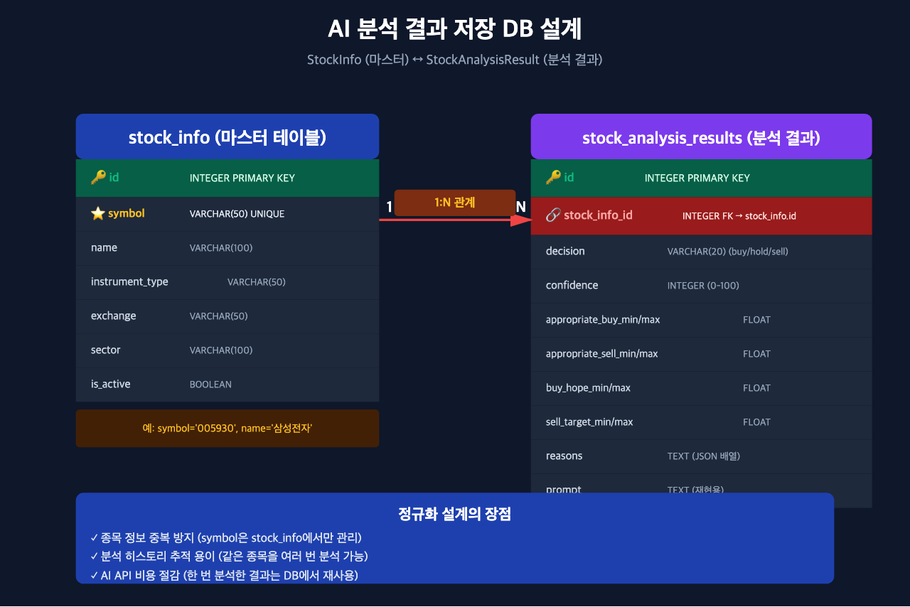
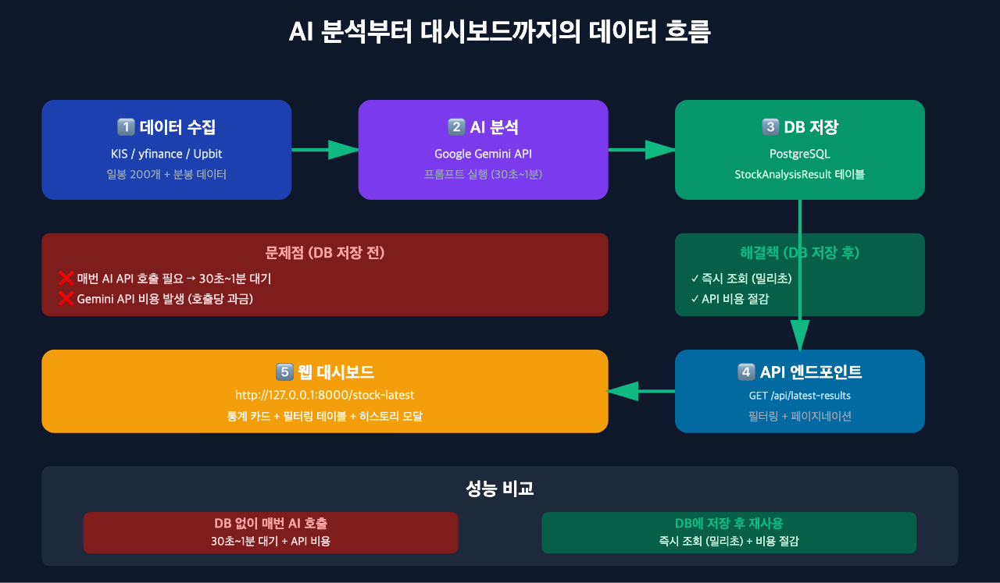
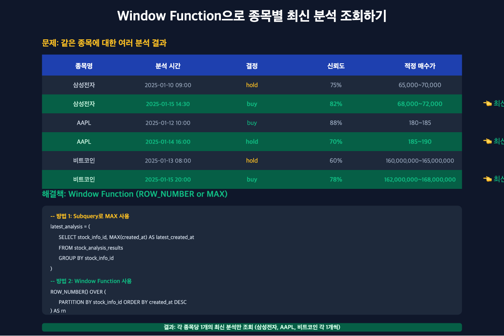

# AI 분석 결과 DB에 저장하기: 비용 절감과 대시보드 구축

> 이 글은 AI 기반 자동매매 시스템 시리즈의 **4편**입니다.
>
> **이전 글:**
> - [1편: 한투 API로 실시간 주식 데이터 수집하기](https://mgh3326.tistory.com/227)
> - [2편: yfinance로 애플·테슬라 분석하기](https://mgh3326.tistory.com/228)
> - [3편: Upbit으로 비트코인 24시간 분석하기](https://mgh3326.tistory.com/229)

## 들어가며

앞선 글에서 [국내 주식(KIS API)](https://mgh3326.tistory.com/227), [해외 주식(yfinance)](https://mgh3326.tistory.com/228), [암호화폐(Upbit)](https://mgh3326.tistory.com/229)의 데이터를 수집하고 Google Gemini AI로 분석하는 방법을 다뤘습니다. 하지만 실제로 서비스를 운영하다 보니 **치명적인 문제**가 발견되었습니다.

**문제점:**
- 종목 분석 결과를 확인할 때마다 AI API를 호출해야 함 (30초~1분 대기)
- Gemini API는 호출할 때마다 과금 (반복 조회 시 비용 증가)
- 같은 종목을 여러 번 분석하면 이전 분석 결과와 비교가 어려움

이 문제를 해결하기 위해 **PostgreSQL 데이터베이스에 분석 결과를 저장**하고, **웹 대시보드로 즉시 조회**할 수 있는 시스템을 구축했습니다.

이 글에서는:
- 분석 결과를 효율적으로 저장하는 DB 설계
- 종목별 최신 분석을 빠르게 조회하는 SQL 쿼리 패턴
- 웹 대시보드로 분석 결과를 시각화하는 방법

을 다룹니다.

---

## DB 저장의 장점

### 1. 응답 속도 개선

**DB 저장 전:**
```
사용자 요청 → AI API 호출 (30초~1분) → 결과 반환
```

**DB 저장 후:**
```
사용자 요청 → DB 조회 (밀리초) → 결과 반환
```

한 번 분석한 종목은 DB에서 즉시 조회할 수 있어 **수백 배 빠른 응답 속도**를 제공합니다.

### 2. API 비용 절감

Google Gemini API는 호출당 과금 방식입니다. 같은 종목을 여러 번 조회할 때마다 비용이 발생하는데, DB에 저장하면 **한 번만 호출**하고 이후에는 무료로 재사용할 수 있습니다.

```
10개 종목 × 10번 조회 = 100번 API 호출 (비용 증가)
→ DB 저장 후: 10개 종목 × 1번 API 호출 = 10번만 호출 (90% 절감)
```

### 3. 히스토리 추적

같은 종목을 시간대별로 여러 번 분석하면 DB에 모두 저장됩니다. 이를 통해:
- 어제의 분석 결과와 오늘의 분석 결과 비교
- AI 추천이 시간에 따라 어떻게 변했는지 추적
- 투자 결정의 일관성 검증

이 가능해집니다.

---

## 데이터베이스 설계

### 핵심 설계 원칙: 정규화

종목 정보(symbol, name 등)와 분석 결과(decision, confidence 등)를 **별도 테이블로 분리**하여 데이터 중복을 방지했습니다.



### 1. `stock_info` 테이블 (마스터 데이터)

종목의 **기본 정보**를 저장하는 테이블입니다.

```python
class StockInfo(Base):
    """주식 종목 기본 정보 테이블"""
    __tablename__ = "stock_info"

    id = Column(Integer, primary_key=True)
    symbol = Column(String(50), unique=True, nullable=False, index=True)
    name = Column(String(100), nullable=False)
    instrument_type = Column(String(50), nullable=False)  # equity_kr, equity_us, crypto
    exchange = Column(String(50), nullable=True)  # KOSPI, NASDAQ, UPBIT 등
    sector = Column(String(100), nullable=True)  # IT, 금융, 에너지 등
    is_active = Column(Boolean, default=True)  # 거래 중단 종목 관리

    # 관계 설정
    analysis_results = relationship(
        "StockAnalysisResult",
        back_populates="stock_info"
    )
```

**특징:**
- `symbol`에 UNIQUE 제약 조건 → 종목 코드 중복 방지
- `instrument_type`으로 국내주식/해외주식/암호화폐 구분
- `is_active`로 상장폐지 종목 soft delete 지원

**예시 데이터:**
| id | symbol | name | instrument_type | exchange |
|----|--------|------|-----------------|----------|
| 1 | 005930 | 삼성전자 | equity_kr | KOSPI |
| 2 | AAPL | Apple Inc. | equity_us | NASDAQ |
| 3 | KRW-BTC | 비트코인 | crypto | UPBIT |

### 2. `stock_analysis_results` 테이블 (분석 결과)

AI 분석 결과를 저장하는 **시계열 데이터** 테이블입니다.

```python
class StockAnalysisResult(Base):
    """주식 분석 결과를 저장하는 테이블"""
    __tablename__ = "stock_analysis_results"

    id = Column(Integer, primary_key=True)
    stock_info_id = Column(
        Integer,
        ForeignKey("stock_info.id"),
        nullable=False,
        index=True
    )

    # AI 분석 결정
    model_name = Column(String(100), nullable=False)  # gemini-2.5-flash 등
    decision = Column(String(20), nullable=False)  # buy, hold, sell
    confidence = Column(Integer, nullable=False)  # 0-100

    # 4가지 가격 범위
    appropriate_buy_min = Column(Float, nullable=True)
    appropriate_buy_max = Column(Float, nullable=True)
    appropriate_sell_min = Column(Float, nullable=True)
    appropriate_sell_max = Column(Float, nullable=True)
    buy_hope_min = Column(Float, nullable=True)
    buy_hope_max = Column(Float, nullable=True)
    sell_target_min = Column(Float, nullable=True)
    sell_target_max = Column(Float, nullable=True)

    # 분석 근거 및 상세 내용
    reasons = Column(Text, nullable=True)  # JSON 형태 ['근거1', '근거2', '근거3']
    detailed_text = Column(Text, nullable=True)  # Markdown 형태 상세 분석
    prompt = Column(Text, nullable=False)  # 재현을 위한 원본 프롬프트

    created_at = Column(DateTime(timezone=True), server_default=func.now())

    # 관계 설정
    stock_info = relationship(
        "StockInfo",
        back_populates="analysis_results"
    )
```

**특징:**
- `stock_info_id`로 종목 정보 참조 (1:N 관계)
- 4가지 가격 범위 저장 (적정 매수가, 적정 매도가, 희망 매수가, 목표 매도가)
- `reasons`를 JSON 배열로 저장하여 유연성 확보
- `prompt` 필드로 재현성 보장

**예시 데이터:**
| id | stock_info_id | decision | confidence | appropriate_buy_min | appropriate_buy_max | created_at |
|----|---------------|----------|------------|---------------------|---------------------|------------|
| 1 | 1 | hold | 75 | 65000.0 | 70000.0 | 2025-01-10 09:00 |
| 2 | 1 | buy | 82 | 68000.0 | 72000.0 | 2025-01-15 14:30 |
| 3 | 2 | buy | 88 | 180.0 | 185.0 | 2025-01-12 10:00 |
| 4 | 2 | hold | 70 | 185.0 | 190.0 | 2025-01-14 16:00 |

### 3. 1:N 관계 설계

하나의 종목(`stock_info`)에 대해 **여러 번의 분석 결과**(`stock_analysis_results`)가 생성될 수 있습니다.

**정규화의 장점:**
- 종목 정보 중복 방지 (symbol은 `stock_info`에서만 관리)
- 분석 히스토리 추적 용이 (같은 종목을 여러 번 분석 가능)
- 데이터 일관성 보장 (종목명 변경 시 한 곳만 수정)

---

## 데이터 흐름: AI 분석부터 대시보드까지



### 1단계: 데이터 수집

KIS API, yfinance, Upbit API에서 일봉 200개 + 분봉 데이터를 수집합니다.

```python
# Upbit 예시
df_historical = await upbit.fetch_ohlcv("KRW-BTC", days=200)
df_current = await upbit.fetch_price("KRW-BTC")
fundamental_info = await upbit.fetch_fundamental_info("KRW-BTC")
```

### 2단계: AI 분석

Google Gemini API에 프롬프트를 전달하고 분석 결과를 받습니다.

```python
client = genai.Client()
response = client.models.generate_content(
    model="gemini-2.5-flash",
    contents=prompt
)
```

**소요 시간:** 30초~1분

### 3단계: DB 저장

분석 결과를 PostgreSQL에 저장합니다.

```python
# 1. 종목 정보 생성 또는 조회
stock_info = await stock_info_service.create_stock_if_not_exists(
    db=db,
    symbol=symbol,
    name=name,
    instrument_type=instrument_type,
    exchange=exchange,
    sector=sector
)

# 2. 분석 결과 저장
analysis_result = StockAnalysisResult(
    stock_info_id=stock_info.id,
    model_name=model_name,
    decision=result.decision,
    confidence=result.confidence,
    appropriate_buy_min=result.price_analysis.appropriate_buy_range.min,
    appropriate_buy_max=result.price_analysis.appropriate_buy_range.max,
    reasons=json.dumps(result.reasons, ensure_ascii=False),
    prompt=prompt
)
db.add(analysis_result)
await db.commit()
```

**핵심 패턴:** `create_stock_if_not_exists`
- 종목이 없으면 새로 생성
- 이미 있으면 기존 레코드 반환
- 중복 방지와 효율성을 동시에 확보

### 4단계: API 엔드포인트

FastAPI로 REST API를 제공합니다.

```python
@router.get("/api/latest-results")
async def get_latest_analysis_results(
    db: AsyncSession = Depends(get_db),
    instrument_type: Optional[str] = Query(None),
    decision: Optional[str] = Query(None),
    page: int = Query(1, ge=1),
    page_size: int = Query(20, ge=1, le=100)
):
    """종목별 최신 분석 결과를 조회하는 API"""
    # 구현은 다음 섹션에서 설명
```

### 5단계: 웹 대시보드

Bootstrap 5 기반 대시보드에서 분석 결과를 시각화합니다.

```
http://127.0.0.1:8000/stock-latest
```

**제공 기능:**
- 통계 카드 (분석 완료 종목 수, 투자 결정 분포, 평균 신뢰도)
- 필터링 (국내/해외/암호화폐, buy/hold/sell)
- 페이지네이션 (대용량 데이터 지원)
- 히스토리 모달 (종목별 분석 이력 조회)

---

## 핵심 쿼리 패턴: 종목별 최신 분석 조회

### 문제 상황

같은 종목에 대해 여러 번 분석하면 DB에 여러 레코드가 생성됩니다.



예를 들어 삼성전자를 두 번 분석하면:
- 2025-01-10 09:00 → decision: hold, confidence: 75%
- 2025-01-15 14:30 → decision: buy, confidence: 82%

대시보드에서는 **각 종목당 최신 분석 1개**만 보여줘야 합니다.

### 해결책 1: Subquery로 MAX 사용

각 종목의 최신 `created_at`을 구한 뒤 JOIN합니다.

```python
from sqlalchemy import select, func
from sqlalchemy.orm import aliased

# 1. 각 종목의 최신 분석 시간 구하기
latest_analysis_subquery = (
    select(
        StockAnalysisResult.stock_info_id,
        func.max(StockAnalysisResult.created_at).label('latest_created_at')
    )
    .group_by(StockAnalysisResult.stock_info_id)
    .subquery()
)

# 2. 종목 정보와 최신 분석 결과 JOIN
base_query = (
    select(StockInfo, StockAnalysisResult)
    .join(
        latest_analysis_subquery,
        StockInfo.id == latest_analysis_subquery.c.stock_info_id
    )
    .join(
        StockAnalysisResult,
        (StockAnalysisResult.stock_info_id == StockInfo.id) &
        (StockAnalysisResult.created_at == latest_analysis_subquery.c.latest_created_at)
    )
)

result = await db.execute(base_query)
```

**SQL 쿼리 (대략적인 형태):**
```sql
SELECT stock_info.*, stock_analysis_results.*
FROM stock_info
JOIN (
    SELECT stock_info_id, MAX(created_at) AS latest_created_at
    FROM stock_analysis_results
    GROUP BY stock_info_id
) latest ON stock_info.id = latest.stock_info_id
JOIN stock_analysis_results
    ON stock_analysis_results.stock_info_id = stock_info.id
    AND stock_analysis_results.created_at = latest.latest_created_at;
```

**장점:**
- 이해하기 쉬운 로직
- 인덱스를 잘 활용하면 성능 우수

**단점:**
- 서브쿼리가 복잡해 보일 수 있음

### 해결책 2: Window Function 사용

`ROW_NUMBER()` Window Function으로 각 종목의 최신 분석에 순번을 매깁니다.

```sql
WITH ranked_analysis AS (
    SELECT
        *,
        ROW_NUMBER() OVER (
            PARTITION BY stock_info_id
            ORDER BY created_at DESC
        ) AS rn
    FROM stock_analysis_results
)
SELECT stock_info.*, ranked_analysis.*
FROM stock_info
JOIN ranked_analysis
    ON stock_info.id = ranked_analysis.stock_info_id
    AND ranked_analysis.rn = 1;
```

**장점:**
- Window Function을 지원하는 DB(PostgreSQL, MySQL 8.0+)에서 간결한 코드
- 복잡한 순위 로직도 표현 가능

**단점:**
- SQLAlchemy로 작성하면 코드가 길어질 수 있음

### 실제 구현 코드

`app/routers/stock_latest.py`에서 Subquery 방식을 채택했습니다.

```python
@router.get("/api/latest-results")
async def get_latest_analysis_results(
    db: AsyncSession = Depends(get_db),
    instrument_type: Optional[str] = Query(None),
    decision: Optional[str] = Query(None),
    page: int = Query(1, ge=1),
    page_size: int = Query(20, ge=1, le=100)
):
    """종목별 최신 분석 결과를 조회하는 API"""

    # 1. 최신 분석 시간 서브쿼리
    latest_analysis_subquery = (
        select(
            StockAnalysisResult.stock_info_id,
            func.max(StockAnalysisResult.created_at).label('latest_created_at')
        )
        .group_by(StockAnalysisResult.stock_info_id)
        .subquery()
    )

    # 2. 기본 쿼리 (종목 정보 + 최신 분석)
    base_query = (
        select(StockInfo, StockAnalysisResult)
        .join(
            latest_analysis_subquery,
            StockInfo.id == latest_analysis_subquery.c.stock_info_id
        )
        .join(
            StockAnalysisResult,
            (StockAnalysisResult.stock_info_id == StockInfo.id) &
            (StockAnalysisResult.created_at == latest_analysis_subquery.c.latest_created_at)
        )
    )

    # 3. 필터링
    if instrument_type:
        base_query = base_query.where(StockInfo.instrument_type == instrument_type)
    if decision:
        base_query = base_query.where(StockAnalysisResult.decision == decision)

    # 4. 페이지네이션
    total_result = await db.execute(
        select(func.count()).select_from(base_query.subquery())
    )
    total = total_result.scalar()

    results = await db.execute(
        base_query
        .order_by(StockAnalysisResult.created_at.desc())
        .offset((page - 1) * page_size)
        .limit(page_size)
    )

    # 5. 응답 포맷
    items = []
    for stock_info, analysis in results.all():
        items.append({
            "symbol": stock_info.symbol,
            "name": stock_info.name,
            "instrument_type": stock_info.instrument_type,
            "decision": analysis.decision,
            "confidence": analysis.confidence,
            "appropriate_buy_min": analysis.appropriate_buy_min,
            "appropriate_buy_max": analysis.appropriate_buy_max,
            "created_at": analysis.created_at.isoformat()
        })

    return {
        "total": total,
        "page": page,
        "page_size": page_size,
        "items": items
    }
```

**핵심 포인트:**
- 서브쿼리로 최신 `created_at` 구하기
- 필터링 (instrument_type, decision)
- 페이지네이션 (offset/limit)
- 총 개수 계산 (total)

---

## 웹 대시보드 구현

### 대시보드 URL

```
http://127.0.0.1:8000/stock-latest
```

### 주요 기능

#### 1. 통계 카드

대시보드 상단에 3가지 통계를 카드 형태로 표시합니다.

```python
@router.get("/api/statistics")
async def get_latest_analysis_statistics(db: AsyncSession = Depends(get_db)):
    """최신 분석 통계를 조회하는 API"""

    # 최신 분석 서브쿼리 (재사용)
    latest_analysis_subquery = (
        select(
            StockAnalysisResult.stock_info_id,
            func.max(StockAnalysisResult.created_at).label('latest_created_at')
        )
        .group_by(StockAnalysisResult.stock_info_id)
        .subquery()
    )

    # 1. 활성 종목 수
    active_stocks_result = await db.execute(
        select(func.count(StockInfo.id))
        .where(StockInfo.is_active == True)
    )
    active_stocks_count = active_stocks_result.scalar()

    # 2. 분석 완료 종목 수
    analyzed_stocks_result = await db.execute(
        select(func.count(latest_analysis_subquery.c.stock_info_id))
        .select_from(latest_analysis_subquery)
    )
    analyzed_stocks_count = analyzed_stocks_result.scalar()

    # 3. 투자 결정 분포 (buy/hold/sell)
    decision_counts_result = await db.execute(
        select(
            StockAnalysisResult.decision,
            func.count(StockAnalysisResult.id).label('count')
        )
        .join(
            latest_analysis_subquery,
            (StockAnalysisResult.stock_info_id == latest_analysis_subquery.c.stock_info_id) &
            (StockAnalysisResult.created_at == latest_analysis_subquery.c.latest_created_at)
        )
        .group_by(StockAnalysisResult.decision)
    )
    decision_counts = {
        row[0]: row[1] for row in decision_counts_result.all()
    }

    # 4. 평균 신뢰도
    avg_confidence_result = await db.execute(
        select(func.avg(StockAnalysisResult.confidence))
        .join(
            latest_analysis_subquery,
            (StockAnalysisResult.stock_info_id == latest_analysis_subquery.c.stock_info_id) &
            (StockAnalysisResult.created_at == latest_analysis_subquery.c.latest_created_at)
        )
    )
    avg_confidence = avg_confidence_result.scalar() or 0

    return {
        "active_stocks_count": active_stocks_count,
        "analyzed_stocks_count": analyzed_stocks_count,
        "decision_counts": decision_counts,
        "average_confidence": round(avg_confidence, 1)
    }
```

**화면 예시:**
```
┌─────────────────┐  ┌─────────────────┐  ┌─────────────────┐
│  활성 종목      │  │  분석 완료      │  │  평균 신뢰도    │
│     150개       │  │     142개       │  │     78.5%       │
└─────────────────┘  └─────────────────┘  └─────────────────┘

┌─────────────────────────────────────────────────────────────┐
│  투자 결정 분포                                             │
│  매수 (buy): 45개  |  관망 (hold): 82개  |  매도 (sell): 15개│
└─────────────────────────────────────────────────────────────┘
```

#### 2. 필터링 테이블

종목 타입과 투자 결정으로 필터링할 수 있습니다.

```html
<!-- app/templates/stock_latest_dashboard.html -->
<div class="filters">
    <select id="instrumentTypeFilter">
        <option value="">전체 종목</option>
        <option value="equity_kr">국내 주식</option>
        <option value="equity_us">해외 주식</option>
        <option value="crypto">암호화폐</option>
    </select>

    <select id="decisionFilter">
        <option value="">전체 결정</option>
        <option value="buy">매수 (buy)</option>
        <option value="hold">관망 (hold)</option>
        <option value="sell">매도 (sell)</option>
    </select>

    <button onclick="applyFilters()">필터 적용</button>
</div>

<table class="table">
    <thead>
        <tr>
            <th>종목코드</th>
            <th>종목명</th>
            <th>타입</th>
            <th>결정</th>
            <th>신뢰도</th>
            <th>적정 매수가</th>
            <th>분석 시간</th>
            <th>상세</th>
        </tr>
    </thead>
    <tbody id="analysisTableBody">
        <!-- JavaScript로 동적 생성 -->
    </tbody>
</table>
```

**JavaScript 예시:**
```javascript
async function loadAnalysisResults(page = 1) {
    const instrumentType = document.getElementById('instrumentTypeFilter').value;
    const decision = document.getElementById('decisionFilter').value;

    const params = new URLSearchParams({
        page: page,
        page_size: 20
    });

    if (instrumentType) params.append('instrument_type', instrumentType);
    if (decision) params.append('decision', decision);

    const response = await fetch(`/api/latest-results?${params}`);
    const data = await response.json();

    // 테이블 렌더링
    renderTable(data.items);
    renderPagination(data.total, data.page, data.page_size);
}
```

#### 3. 히스토리 모달

각 종목의 분석 이력을 시간순으로 조회할 수 있습니다.

```python
@router.get("/api/history/{symbol}")
async def get_analysis_history(
    symbol: str,
    db: AsyncSession = Depends(get_db)
):
    """특정 종목의 분석 히스토리를 조회하는 API"""

    # 1. 종목 정보 조회
    stock_info_result = await db.execute(
        select(StockInfo).where(StockInfo.symbol == symbol)
    )
    stock_info = stock_info_result.scalar_one_or_none()

    if not stock_info:
        raise HTTPException(status_code=404, detail="종목을 찾을 수 없습니다")

    # 2. 분석 히스토리 조회 (최신순)
    history_result = await db.execute(
        select(StockAnalysisResult)
        .where(StockAnalysisResult.stock_info_id == stock_info.id)
        .order_by(StockAnalysisResult.created_at.desc())
    )

    history = [
        {
            "id": analysis.id,
            "decision": analysis.decision,
            "confidence": analysis.confidence,
            "appropriate_buy_min": analysis.appropriate_buy_min,
            "appropriate_buy_max": analysis.appropriate_buy_max,
            "created_at": analysis.created_at.isoformat(),
            "reasons": json.loads(analysis.reasons) if analysis.reasons else []
        }
        for analysis in history_result.scalars().all()
    ]

    return {
        "symbol": stock_info.symbol,
        "name": stock_info.name,
        "history": history
    }
```

**모달 예시:**
```
삼성전자 (005930) 분석 히스토리
━━━━━━━━━━━━━━━━━━━━━━━━━━━━━━━━━━━━━━

[2025-01-15 14:30]
결정: 매수 (buy) | 신뢰도: 82%
적정 매수가: 68,000 ~ 72,000원
근거: ["실적 개선 기대", "반도체 업황 회복", "밸류에이션 매력적"]

[2025-01-10 09:00]
결정: 관망 (hold) | 신뢰도: 75%
적정 매수가: 65,000 ~ 70,000원
근거: ["실적 발표 대기", "지정학적 리스크", "시장 변동성 확대"]
```

---

## 실행 결과

### 1. 데이터베이스 마이그레이션

Alembic으로 테이블 생성:

```bash
$ poetry run alembic revision --autogenerate -m "Add stock_info and stock_analysis_results tables"
INFO  [alembic.runtime.migration] Running upgrade -> abc123, Add stock_info and stock_analysis_results tables

$ poetry run alembic upgrade head
INFO  [alembic.runtime.migration] Running upgrade abc123 -> def456, Add stock_info and stock_analysis_results tables
```

### 2. 분석 실행 및 DB 저장

```python
# 국내 주식 분석
from app.analysis.service_analyzers import KISAnalyzer

analyzer = KISAnalyzer()
result, model = await analyzer.analyze_symbols_json(["삼성전자", "SK하이닉스"])

# 결과 확인
print(f"모델: {model}")
print(f"삼성전자 분석: {result.decision} ({result.confidence}%)")
# → 모델: gemini-2.5-flash
# → 삼성전자 분석: buy (82%)
```

DB에 자동 저장됩니다.

### 3. 대시보드 접속

브라우저에서 `http://127.0.0.1:8000/stock-latest` 접속:

```
┌─────────────────────────────────────────────────────────────┐
│  AI 주식 분석 대시보드                                      │
└─────────────────────────────────────────────────────────────┘

통계:
  활성 종목: 150개
  분석 완료: 142개
  평균 신뢰도: 78.5%

투자 결정 분포:
  매수 (buy): 45개  |  관망 (hold): 82개  |  매도 (sell): 15개

┌──────────────────────────────────────────────────────────────┐
│ 종목코드 │ 종목명     │ 타입       │ 결정 │ 신뢰도 │ 적정 매수가 │
├──────────────────────────────────────────────────────────────┤
│ 005930   │ 삼성전자   │ 국내주식   │ buy  │ 82%   │ 68,000~72,000│
│ 000660   │ SK하이닉스 │ 국내주식   │ buy  │ 88%   │ 135,000~140,000│
│ AAPL     │ Apple Inc. │ 해외주식   │ hold │ 70%   │ 185~190      │
│ KRW-BTC  │ 비트코인   │ 암호화폐   │ buy  │ 78%   │ 162,000,000~168,000,000│
└──────────────────────────────────────────────────────────────┘

[1] [2] [3] ... [8]  (페이지네이션)
```

### 4. API 호출 예시

```bash
# 최신 분석 결과 조회
$ curl "http://127.0.0.1:8000/api/latest-results?page=1&page_size=5"
{
  "total": 142,
  "page": 1,
  "page_size": 5,
  "items": [
    {
      "symbol": "005930",
      "name": "삼성전자",
      "instrument_type": "equity_kr",
      "decision": "buy",
      "confidence": 82,
      "appropriate_buy_min": 68000.0,
      "appropriate_buy_max": 72000.0,
      "created_at": "2025-01-15T14:30:00+09:00"
    },
    ...
  ]
}

# 통계 조회
$ curl "http://127.0.0.1:8000/api/statistics"
{
  "active_stocks_count": 150,
  "analyzed_stocks_count": 142,
  "decision_counts": {
    "buy": 45,
    "hold": 82,
    "sell": 15
  },
  "average_confidence": 78.5
}

# 히스토리 조회
$ curl "http://127.0.0.1:8000/api/history/005930"
{
  "symbol": "005930",
  "name": "삼성전자",
  "history": [
    {
      "id": 2,
      "decision": "buy",
      "confidence": 82,
      "created_at": "2025-01-15T14:30:00+09:00",
      "reasons": ["실적 개선 기대", "반도체 업황 회복", "밸류에이션 매력적"]
    },
    {
      "id": 1,
      "decision": "hold",
      "confidence": 75,
      "created_at": "2025-01-10T09:00:00+09:00",
      "reasons": ["실적 발표 대기", "지정학적 리스크", "시장 변동성 확대"]
    }
  ]
}
```

---

## 성능 최적화 팁

### 1. 인덱스 추가

자주 조회하는 컬럼에 인덱스를 추가합니다.

```python
# models/analysis.py
class StockInfo(Base):
    symbol = Column(String(50), unique=True, nullable=False, index=True)  # 인덱스

class StockAnalysisResult(Base):
    stock_info_id = Column(Integer, ForeignKey("stock_info.id"), nullable=False, index=True)  # 인덱스
    created_at = Column(DateTime(timezone=True), server_default=func.now(), index=True)  # 인덱스
```

**효과:**
- `symbol` 검색 속도 향상
- `stock_info_id` JOIN 성능 개선
- `created_at` 정렬 속도 향상

### 2. 복합 인덱스

종목별 최신 분석 조회 시 복합 인덱스를 사용합니다.

```sql
CREATE INDEX idx_stock_analysis_composite
ON stock_analysis_results(stock_info_id, created_at DESC);
```

**효과:**
- `GROUP BY stock_info_id` + `MAX(created_at)` 쿼리 최적화
- 10,000건 이상의 데이터에서 체감 성능 향상

### 3. 페이지네이션 필수

대용량 데이터를 한 번에 조회하지 않고 페이지 단위로 나눕니다.

```python
# ❌ 나쁜 예: 모든 데이터 조회
results = await db.execute(select(StockAnalysisResult))

# ✅ 좋은 예: 페이지네이션
results = await db.execute(
    select(StockAnalysisResult)
    .offset((page - 1) * page_size)
    .limit(page_size)
)
```

### 4. N+1 쿼리 방지

`joinedload`로 관계 데이터를 한 번에 로딩합니다.

```python
from sqlalchemy.orm import joinedload

# ❌ 나쁜 예: N+1 쿼리 발생
results = await db.execute(select(StockAnalysisResult))
for analysis in results.scalars().all():
    print(analysis.stock_info.name)  # 각 레코드마다 쿼리 실행

# ✅ 좋은 예: JOIN으로 한 번에 로딩
results = await db.execute(
    select(StockAnalysisResult)
    .options(joinedload(StockAnalysisResult.stock_info))
)
for analysis in results.scalars().all():
    print(analysis.stock_info.name)  # 추가 쿼리 없음
```

---

## 마치며

이번 글에서는 AI 분석 결과를 PostgreSQL 데이터베이스에 저장하여:
- **응답 속도를 수백 배 개선**하고
- **API 비용을 90% 이상 절감**하며
- **분석 히스토리를 추적**할 수 있는

시스템을 구축하는 방법을 다뤘습니다.

**핵심 포인트:**
1. **정규화 설계**: 종목 정보와 분석 결과를 분리하여 데이터 중복 방지
2. **Window Function**: 종목별 최신 분석을 효율적으로 조회
3. **웹 대시보드**: 통계, 필터링, 히스토리를 한눈에 확인

다음 글에서는 이 시스템을 실제 거래에 연결하는 방법, 그리고 사용자별 관심 종목 관리(`user_watch_items` 테이블)를 다룰 예정입니다.

**프로젝트 저장소:**
- GitHub: [github.com/your-repo/auto-trader](https://github.com/your-repo/auto-trader)

질문이나 피드백은 이슈로 남겨주세요!
