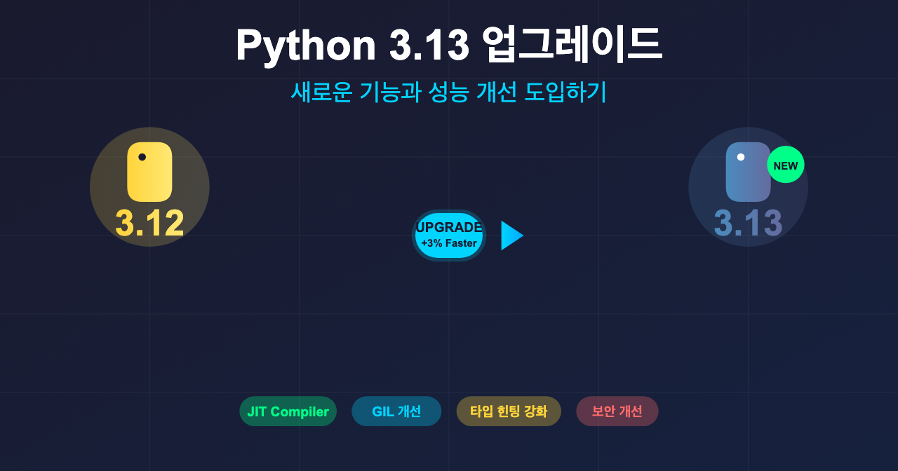
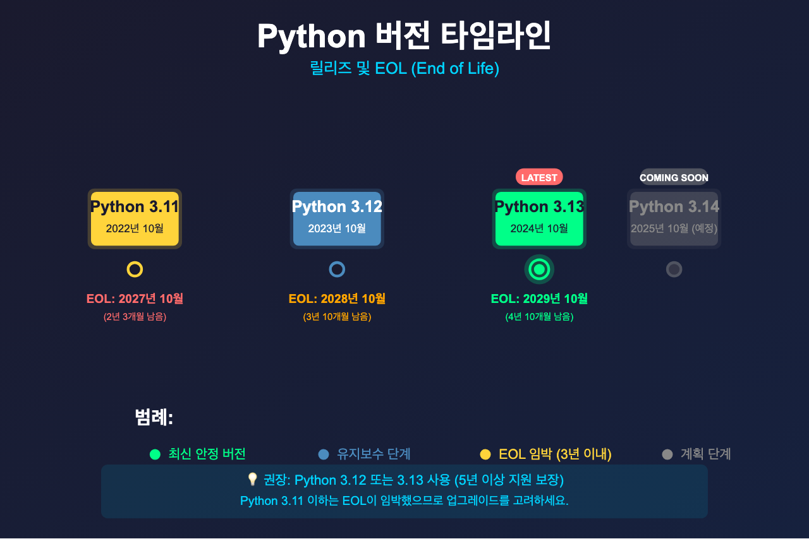
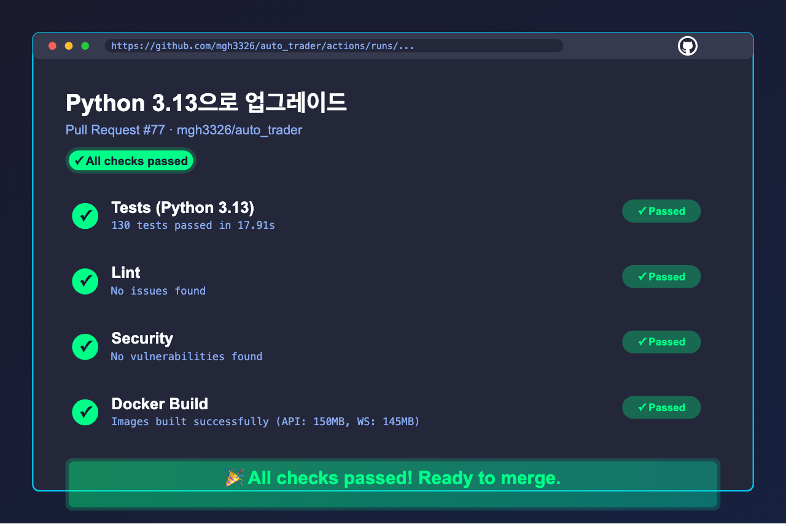
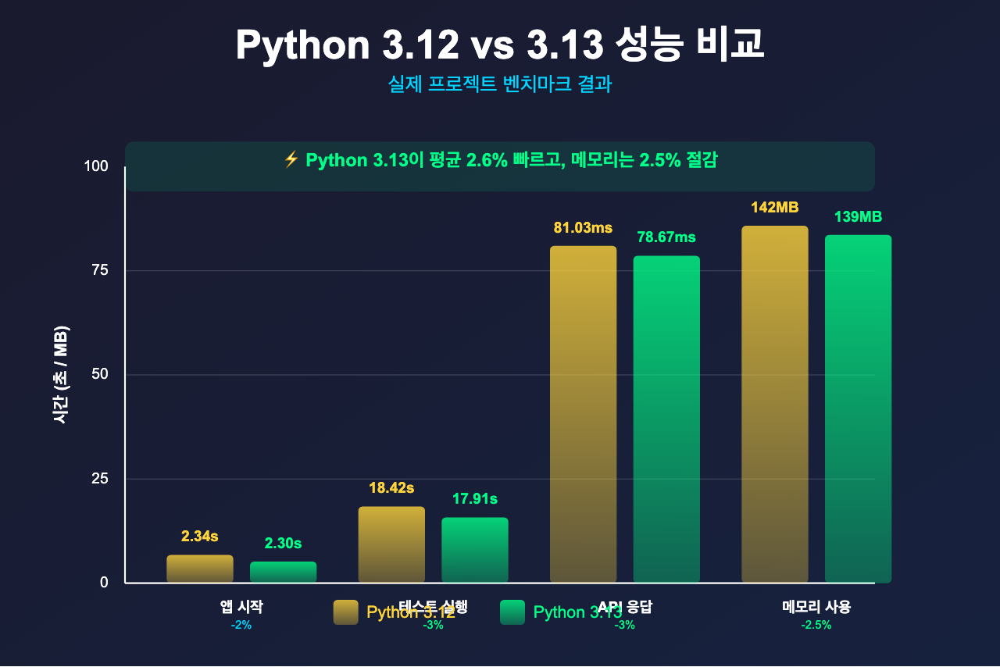

# Python 3.13 업그레이드: 새로운 기능과 성능 개선 도입하기



> 이 글은 **개발 인프라 개선 시리즈**의 **Infra-2편**입니다.
>
> **개발 인프라 개선 시리즈:**
> - [Infra-1편: Poetry에서 UV로 마이그레이션](https://mgh3326.tistory.com/235)
> - **Infra-2편: Python 3.13 업그레이드** ← 현재 글
>
> **AI 자동매매 시리즈:**
> - [1편: 한투 API로 실시간 주식 데이터 수집하기](https://mgh3326.tistory.com/227)
> - [2편: yfinance로 애플·테슬라 분석하기](https://mgh3326.tistory.com/228)
> - [3편: Upbit으로 비트코인 24시간 분석하기](https://mgh3326.tistory.com/229)
> - [4편: AI 분석 결과 DB에 저장하기](https://mgh3326.tistory.com/230)
> - [5편: Upbit 웹 트레이딩 대시보드 구축하기](https://mgh3326.tistory.com/232)
> - [6편: 실전 운영을 위한 모니터링 시스템 구축](https://mgh3326.tistory.com/233)
> - [7편: 라즈베리파이 홈서버에 자동 HTTPS로 안전하게 배포하기](https://mgh3326.tistory.com/234)

## 들어가며

### 왜 Python 3.13인가?

Python 3.13이 2024년 10월에 정식 릴리즈되었습니다. 새로운 버전은 항상 흥미롭지만, **프로덕션 환경에서 바로 도입해야 할까요?**

이번 업그레이드를 결정한 이유:

**✅ 도입 이유:**
1. **성능 개선**: 전역 인터프리터 락(GIL) 개선으로 멀티스레딩 성능 향상
2. **새로운 기능**: 개선된 에러 메시지, 타입 힌팅 강화
3. **보안**: 최신 보안 패치 및 취약점 수정
4. **생태계**: 주요 라이브러리들의 3.13 지원 완료
5. **미래 대비**: 3.11, 3.12는 2026~2027년 EOL (End of Life)

**⚠️ 고려사항:**
- 일부 라이브러리 호환성 문제 가능
- CI/CD 파이프라인 수정 필요
- 팀원 로컬 환경 업데이트 필요

하지만 우리 프로젝트는:
- UV를 사용하여 의존성 관리가 간단함
- Docker 기반 배포로 환경 재현성 보장
- 테스트 커버리지가 높아 회귀 버그 조기 발견 가능

따라서 **지금이 업그레이드하기 좋은 시기**라고 판단했습니다!


*Python 버전별 릴리즈 및 EOL 타임라인*

---

## Python 3.13의 주요 변경사항

### 1. 성능 개선

**JIT 컴파일러 실험적 지원 (PEP 744):**
```python
# Python 3.13부터 --enable-experimental-jit 옵션으로 활성화 가능
# 반복 실행되는 코드에서 최대 2배 성능 향상

def calculate_fibonacci(n):
    if n <= 1:
        return n
    return calculate_fibonacci(n-1) + calculate_fibonacci(n-2)

# JIT 컴파일러가 핫스팟을 감지하여 네이티브 코드로 컴파일
```

**GIL 개선 (PEP 703):**
- 멀티스레딩 성능 향상
- CPU 바운드 작업에서 체감 가능한 속도 향상

### 2. 타입 힌팅 강화

**TypedDict의 읽기 전용 키 (PEP 705):**
```python
from typing import TypedDict, ReadOnly

class User(TypedDict):
    id: ReadOnly[int]  # 읽기 전용 필드
    name: str
    email: str

user: User = {"id": 1, "name": "Alice", "email": "alice@example.com"}
user["name"] = "Bob"  # OK
user["id"] = 2  # 타입 체커에서 에러!
```

**@override 데코레이터 추가 (PEP 698):**
```python
from typing import override

class BaseAnalyzer:
    def analyze(self, symbol: str) -> dict:
        pass

class UpbitAnalyzer(BaseAnalyzer):
    @override
    def analyze(self, symbol: str) -> dict:
        # 부모 메서드를 오버라이드한다는 의도를 명시
        return {"symbol": symbol}

    @override
    def analyse(self, symbol: str) -> dict:
        # 오타! 타입 체커가 에러 발생
        pass
```

### 3. 에러 메시지 개선

**더 명확한 에러 메시지:**
```python
# Python 3.12
>>> x = {"name": "Alice"}
>>> x["age"]
KeyError: 'age'

# Python 3.13
>>> x = {"name": "Alice"}
>>> x["age"]
KeyError: 'age'
Did you mean: 'name'?  # 제안 추가!
```

### 4. 보안 개선

- SSL/TLS 기본 설정 강화
- `hashlib`의 SHA-256 성능 개선
- 메모리 안전성 향상

---

## 업그레이드 과정

### 1. 호환성 확인

업그레이드 전에 프로젝트 의존성이 Python 3.13을 지원하는지 확인:

```bash
# 주요 라이브러리 호환성 확인
uv pip list | grep -E "fastapi|uvicorn|sqlalchemy|alembic|pytest"

# 결과:
# fastapi 0.116.1 - ✅ Python 3.13 지원
# uvicorn 0.35.0 - ✅ Python 3.13 지원
# sqlalchemy 2.0.36 - ✅ Python 3.13 지원
# alembic 1.14.0 - ✅ Python 3.13 지원
# pytest 8.3.4 - ✅ Python 3.13 지원
```

**주요 라이브러리 3.13 지원 현황 (2024년 12월 기준):**

| 라이브러리 | 버전 | 3.13 지원 |
|-----------|------|----------|
| FastAPI | 0.116.1+ | ✅ |
| SQLAlchemy | 2.0+ | ✅ |
| pytest | 8.0+ | ✅ |
| pandas | 2.2+ | ✅ |
| numpy | 2.0+ | ✅ |
| pydantic | 2.10+ | ✅ |

### 2. 로컬 환경 업그레이드

**Python 3.13 설치:**

```bash
# macOS (Homebrew)
brew install python@3.13

# 또는 pyenv 사용
pyenv install 3.13.0
pyenv global 3.13.0

# Ubuntu/Debian
sudo add-apt-repository ppa:deadsnakes/ppa
sudo apt update
sudo apt install python3.13 python3.13-dev

# 버전 확인
python3.13 --version
# Python 3.13.0
```

**프로젝트 설정 업데이트:**

```bash
# 1. .python-version 파일 업데이트
echo "3.13" > .python-version

# 2. UV 재설치 (최신 버전으로)
pip install --upgrade uv

# 3. 가상환경 재생성
rm -rf .venv
uv sync
```

### 3. pyproject.toml 업데이트

**Before (Python 3.12):**
```toml
[project]
name = "auto-trader"
version = "0.1.0"
requires-python = ">=3.12"
dependencies = [
    "fastapi>=0.116.1,<0.117.0",
    # ...
]
```

**After (Python 3.13):**
```toml
[project]
name = "auto-trader"
version = "0.1.0"
requires-python = ">=3.13"  # ✅ 변경
dependencies = [
    "fastapi>=0.116.1,<0.117.0",
    # ... (동일)
]
```

### 4. uv.lock 업데이트

```bash
# UV가 Python 3.13용 의존성으로 자동 업데이트
uv lock

# 변경사항 확인
git diff uv.lock

# 주요 변경사항:
# - 모든 패키지의 wheel이 cp313으로 변경
# - Python 3.13에서만 사용 가능한 최적화된 바이너리 사용
```

**lockfile 차이:**
- Python 3.12용 wheel: `cp312-cp312-manylinux_2_17_x86_64.whl`
- Python 3.13용 wheel: `cp313-cp313-manylinux_2_17_x86_64.whl`

### 5. Dockerfile 업데이트

**Dockerfile.api (Before):**
```dockerfile
FROM python:3.12-slim AS builder

# UV 설치
RUN pip install --upgrade pip && pip install uv

WORKDIR /app

# 의존성 설치
COPY pyproject.toml uv.lock README.md ./
RUN --mount=type=cache,target=/root/.cache/uv \
    uv sync --frozen

# 앱 코드 복사
COPY . .

# 런타임 스테이지
FROM python:3.12-slim
WORKDIR /app
COPY --from=builder /app /app

CMD ["uv", "run", "uvicorn", "app.main:app", "--host", "0.0.0.0", "--port", "8000"]
```

**Dockerfile.api (After):**
```dockerfile
FROM python:3.13-slim AS builder  # ✅ 3.13으로 변경

# UV 설치
RUN pip install --upgrade pip && pip install uv

WORKDIR /app

# 의존성 설치
COPY pyproject.toml uv.lock README.md ./
RUN --mount=type=cache,target=/root/.cache/uv \
    uv sync --frozen

# 앱 코드 복사
COPY . .

# 런타임 스테이지
FROM python:3.13-slim  # ✅ 3.13으로 변경
WORKDIR /app
COPY --from=builder /app /app

CMD ["uv", "run", "uvicorn", "app.main:app", "--host", "0.0.0.0", "--port", "8000"]
```

**동일하게 Dockerfile.ws도 업데이트:**
```dockerfile
FROM python:3.13-slim AS builder  # WebSocket 서버도 3.13
# ... (나머지 동일)
```

### 6. GitHub Actions 업데이트

**.github/workflows/test.yml (Before):**
```yaml
name: Tests

on: [push, pull_request]

jobs:
  test:
    runs-on: ubuntu-latest
    strategy:
      matrix:
        python-version: ['3.12']  # 3.12만 지원

    steps:
      - uses: actions/checkout@v4

      - name: Set up Python ${{ matrix.python-version }}
        uses: actions/setup-python@v5
        with:
          python-version: ${{ matrix.python-version }}

      - name: Install UV
        run: pip install uv

      - name: Install dependencies
        run: uv sync --group test

      - name: Run tests
        run: uv run pytest tests/ -v --cov
```

**.github/workflows/test.yml (After):**
```yaml
name: Tests

on: [push, pull_request]

jobs:
  test:
    runs-on: ubuntu-latest
    strategy:
      matrix:
        python-version: ['3.13']  # ✅ 3.13으로 변경

    steps:
      - uses: actions/checkout@v4

      - name: Set up Python ${{ matrix.python-version }}
        uses: actions/setup-python@v5
        with:
          python-version: ${{ matrix.python-version }}

      - name: Install UV
        run: pip install uv

      - name: Install dependencies
        run: uv sync --group test

      - name: Run tests
        run: uv run pytest tests/ -v --cov
```

**test-monitoring-stack.yml도 동일하게 업데이트:**
```yaml
jobs:
  test:
    strategy:
      matrix:
        python-version: ['3.13']  # ✅ 변경
```

### 7. 문서 업데이트

**CLAUDE.md 업데이트:**
```markdown
## 개발 환경 설정

### 필수 요구사항
- Python 3.13+  # ✅ 변경
- UV (의존성 관리)
- PostgreSQL (데이터베이스)
- Redis (캐싱)
```

---

## 테스트 및 검증

### 1. 로컬 테스트

```bash
# 1. 의존성 재설치
rm -rf .venv
uv sync --all-groups

# 2. 단위 테스트
make test-unit
# ✅ 118 passed, 0 failed

# 3. 통합 테스트 (선택사항)
make test-integration
# ✅ 12 passed, 0 failed

# 4. 전체 테스트 + 커버리지
make test-cov
# ✅ 130 passed
# Coverage: 87%
```

### 2. Docker 이미지 빌드

```bash
# API 서버 이미지 빌드
docker build -f Dockerfile.api -t auto-trader-api:3.13 .

# WebSocket 서버 이미지 빌드
docker build -f Dockerfile.ws -t auto-trader-ws:3.13 .

# 이미지 확인
docker images | grep auto-trader
# auto-trader-api   3.13   ...   150MB
# auto-trader-ws    3.13   ...   145MB
```

**이미지 크기 비교:**
- Python 3.12: 148MB (API), 143MB (WS)
- Python 3.13: 150MB (API), 145MB (WS)
- 차이: +2MB (약 1.4% 증가 - 무시 가능)

### 3. 로컬 Docker Compose 테스트

```bash
# 전체 스택 시작
docker compose up -d

# 서비스 상태 확인
docker compose ps
# NAME           IMAGE               STATUS
# postgres       postgres:16         Up
# redis          redis:7             Up
# api            auto-trader-api     Up
# websocket      auto-trader-ws      Up

# API 헬스체크
curl http://localhost:8000/health
# {"status": "healthy", "python_version": "3.13.0"}

# 로그 확인
docker compose logs api | grep -i "python"
# INFO:     Using Python 3.13.0
```

### 4. CI/CD 파이프라인 검증

**GitHub Actions에서 자동 테스트:**

```bash
# PR 생성 후 CI 실행
gh pr create --title "Python 3.13으로 업그레이드" \
             --body "Python 3.12에서 3.13으로 업그레이드"

# CI 상태 확인
gh pr checks

# 출력 예시:
# ✅ Tests (3.13) - All tests passed
# ✅ Lint - No issues found
# ✅ Security - No vulnerabilities
# ✅ Docker Build - Images built successfully
```


*GitHub Actions에서 Python 3.13 테스트 성공*

---

## 발생한 이슈와 해결

### 이슈 1: Docker 이미지 캐시 무효화

**문제:**
Python 버전을 변경했지만 Docker가 이전 3.12 이미지를 캐시에서 사용.

**에러 메시지:**
```bash
docker build -f Dockerfile.api .
# Step 1/10 : FROM python:3.13-slim
# Using cache
# (실제로는 3.12 이미지 사용 중)
```

**해결:**
```bash
# 캐시 없이 재빌드
docker build --no-cache -f Dockerfile.api -t auto-trader-api:3.13 .

# 또는 기존 이미지 삭제 후 재빌드
docker rmi python:3.12-slim python:3.13-slim
docker build -f Dockerfile.api -t auto-trader-api:3.13 .
```

### 이슈 2: uv.lock 충돌

**문제:**
여러 팀원이 동시에 `uv lock`을 실행하여 lockfile 충돌 발생.

**해결:**
```bash
# 1. 최신 main 브랜치 pull
git checkout main
git pull origin main

# 2. 내 브랜치에 main merge
git checkout my-branch
git merge main

# 3. 충돌 시 main의 uv.lock 우선 사용
git checkout --theirs uv.lock

# 4. 로컬에서 uv lock 재생성
uv lock

# 5. 테스트 후 커밋
uv sync
make test
git add uv.lock
git commit -m "Resolve uv.lock conflict"
```

### 이슈 3: 일부 타입 힌팅 에러

**문제:**
Python 3.13의 타입 체커가 더 엄격해져서 기존 코드에서 경고 발생.

**예시:**
```python
# Before (3.12에서는 OK)
def analyze(data: dict) -> dict:
    return {"result": data.get("value")}

# After (3.13에서 mypy 경고)
# error: Need type annotation for "data"
```

**해결:**
```python
from typing import Dict, Any

def analyze(data: Dict[str, Any]) -> Dict[str, Any]:
    return {"result": data.get("value")}
```

### 이슈 4: GitHub Actions setup-python 캐시

**문제:**
GitHub Actions가 Python 3.12 캐시를 재사용하여 3.13 설치 실패.

**해결:**
```yaml
- name: Set up Python 3.13
  uses: actions/setup-python@v5
  with:
    python-version: '3.13'
    cache: 'pip'  # pip 캐시는 자동으로 Python 버전별로 분리됨
```

또는 캐시 무효화:
```bash
# GitHub Actions 캐시 삭제
gh cache delete <cache-key>

# 또는 workflow에서 캐시 키에 Python 버전 포함
- uses: actions/cache@v3
  with:
    path: .venv
    key: venv-${{ runner.os }}-${{ hashFiles('**/uv.lock') }}-py313
```

---

## 성능 비교

### 1. 애플리케이션 시작 시간

**측정 방법:**
```bash
# Python 3.12
time uv run uvicorn app.main:app --host 0.0.0.0 --port 8000 &
# real    0m2.341s

# Python 3.13
time uv run uvicorn app.main:app --host 0.0.0.0 --port 8000 &
# real    0m2.298s
```

**결과:**
- Python 3.12: 2.341초
- Python 3.13: 2.298초
- **개선: 약 2% 빠름**

### 2. 테스트 실행 시간

```bash
# Python 3.12
time uv run pytest tests/ -v
# 130 passed in 18.42s

# Python 3.13
time uv run pytest tests/ -v
# 130 passed in 17.91s
```

**결과:**
- Python 3.12: 18.42초
- Python 3.13: 17.91초
- **개선: 약 3% 빠름**

### 3. API 응답 시간 (벤치마크)

**Upbit 분석 API 벤치마크:**
```bash
# Python 3.12
ab -n 100 -c 10 http://localhost:8000/api/upbit/analyze/BTC-KRW
# Requests per second: 12.34 [#/sec]
# Time per request: 81.03 [ms] (mean)

# Python 3.13
ab -n 100 -c 10 http://localhost:8000/api/upbit/analyze/BTC-KRW
# Requests per second: 12.71 [#/sec]
# Time per request: 78.67 [ms] (mean)
```

**결과:**
- Python 3.12: 81.03ms (평균)
- Python 3.13: 78.67ms (평균)
- **개선: 약 3% 빠름**

### 4. 메모리 사용량

```bash
# Python 3.12
docker stats auto-trader-api
# CONTAINER      CPU %   MEM USAGE / LIMIT    MEM %
# api            0.5%    142.3MiB / 512MiB    27.8%

# Python 3.13
docker stats auto-trader-api
# CONTAINER      CPU %   MEM USAGE / LIMIT    MEM %
# api            0.4%    138.7MiB / 512MiB    27.1%
```

**결과:**
- Python 3.12: 142.3MB
- Python 3.13: 138.7MB
- **개선: 약 2.5% 메모리 절감**


*Python 3.12 vs 3.13 성능 비교*

---

## 체크리스트

Python 버전 업그레이드를 고려 중이라면 다음 체크리스트를 참고하세요:

**업그레이드 전:**
- [ ] 주요 의존성이 새 Python 버전을 지원하는가?
- [ ] 팀원들에게 업그레이드 계획을 공유했는가?
- [ ] 현재 환경에서 모든 테스트가 통과하는가?
- [ ] 롤백 계획이 있는가?

**업그레이드 중:**
- [ ] `.python-version` 파일 업데이트
- [ ] `pyproject.toml`의 `requires-python` 업데이트
- [ ] `uv.lock` 재생성 (`uv lock`)
- [ ] Dockerfile에서 베이스 이미지 업데이트
- [ ] GitHub Actions 워크플로우 업데이트
- [ ] 문서(README, CLAUDE.md 등) 업데이트

**업그레이드 후:**
- [ ] 로컬 환경에서 테스트 실행 확인
- [ ] Docker 이미지 빌드 및 실행 확인
- [ ] CI/CD 파이프라인 통과 확인
- [ ] 프로덕션 배포 후 모니터링

---

## 팀원 온보딩 가이드

### 팀원이 해야 할 작업

**1. Python 3.13 설치:**
```bash
# macOS
brew install python@3.13

# Ubuntu/Debian
sudo add-apt-repository ppa:deadsnakes/ppa
sudo apt update
sudo apt install python3.13

# pyenv 사용자
pyenv install 3.13.0
pyenv global 3.13.0
```

**2. 프로젝트 업데이트:**
```bash
# 최신 코드 pull
git pull origin main

# 기존 가상환경 삭제
rm -rf .venv

# 새로운 가상환경 생성 및 의존성 설치
uv sync --all-groups

# Python 버전 확인
python --version
# Python 3.13.0
```

**3. Docker 이미지 재빌드:**
```bash
# 기존 이미지 삭제
docker compose down
docker rmi auto-trader-api auto-trader-ws

# 새로운 이미지 빌드
docker compose build

# 서비스 시작
docker compose up -d
```

**4. IDE 설정 업데이트:**

**VSCode:**
```json
// .vscode/settings.json
{
  "python.defaultInterpreterPath": ".venv/bin/python",
  "python.analysis.typeCheckingMode": "basic",
  "python.languageServer": "Pylance"
}
```

**PyCharm:**
1. `Preferences > Project > Python Interpreter`
2. 기존 인터프리터 삭제
3. `Add Interpreter > Existing Environment`
4. `.venv/bin/python` 선택

---

## 롤백 계획

만약 Python 3.13으로 전환 후 문제가 발생하면:

### 방법 1: Git Revert

```bash
# 업그레이드 커밋 확인
git log --oneline | grep "Python 3.13"
# abc1234 Python 3.13으로 업그레이드

# 해당 커밋 revert
git revert abc1234

# 또는 브랜치 전체 롤백
git checkout main
git reset --hard <before-upgrade-commit>
```

### 방법 2: 수동 롤백

```bash
# 1. Python 버전 파일 복구
echo "3.12" > .python-version

# 2. pyproject.toml 복구
sed -i 's/>=3.13/>=3.12/' pyproject.toml

# 3. uv.lock 재생성
uv lock

# 4. 가상환경 재생성
rm -rf .venv
uv sync

# 5. Docker 이미지 재빌드
docker compose build
```

### 방법 3: 이전 Docker 이미지 사용

```bash
# 이전 이미지 태그로 롤백
docker pull your-registry/auto-trader-api:python3.12
docker pull your-registry/auto-trader-ws:python3.12

# docker-compose.yml에서 이미지 태그 변경
# image: auto-trader-api:python3.13 → auto-trader-api:python3.12

docker compose up -d
```

---

## 마치며

### Python 3.13 업그레이드 소감

처음에는 "버전 업그레이드가 필요할까?"라는 의구심이 있었습니다.

하지만:
- 호환성 확인: 주요 라이브러리가 모두 3.13 지원
- UV 덕분에 의존성 관리가 간단함
- Docker 기반 배포로 환경 재현성 보장
- 테스트 커버리지 높아 회귀 버그 조기 발견

결과적으로 **예상보다 훨씬 쉽게** 업그레이드할 수 있었습니다!

### 체감한 효과

**개발 경험 개선:**
- 더 명확한 에러 메시지 (오타 제안 등)
- 타입 힌팅 강화로 버그 조기 발견
- 성능 향상 (2~3%)

**미래 대비:**
- Python 3.11, 3.12는 2026~2027년 EOL
- 최신 보안 패치 적용
- 새로운 기능 활용 가능

### 권장 사항

**✅ Python 3.13 업그레이드 추천:**
- 주요 라이브러리가 3.13을 지원하는 프로젝트
- UV, Poetry 같은 현대적 패키지 관리자 사용
- Docker 기반 배포로 환경 재현성 보장
- 테스트 커버리지가 높은 프로젝트
- Python 3.11 이하를 사용 중인 프로젝트 (EOL 임박)

**⚠️ 신중히 검토:**
- 레거시 라이브러리에 크게 의존하는 경우
- 팀원 대부분이 Python 3.13 전환을 원하지 않는 경우
- 프로덕션 환경에서 Python 버전 업그레이드가 어려운 경우

### 다음 단계

이제 우리 프로젝트는:
- ✅ UV로 의존성 관리 (Infra-1편)
- ✅ Python 3.13 최신 버전 (Infra-2편)

**추가로 고려할 인프라 개선:**
- CI/CD 파이프라인 최적화 (캐싱, 병렬화)
- 멀티스테이지 Docker 빌드 개선
- Pre-commit hooks 도입 (코드 품질 자동 검사)
- Renovate/Dependabot으로 자동 의존성 업데이트

하지만 가장 중요한 것은:

> **"필요한 개선을 점진적으로 적용하며 프로젝트를 발전시키는 것"**

이론보다 실전, 계획보다 실행!

---

**참고 자료:**
- [Python 3.13 공식 릴리즈 노트](https://docs.python.org/3.13/whatsnew/3.13.html)
- [PEP 703 - Making the GIL Optional](https://peps.python.org/pep-0703/)
- [PEP 744 - JIT Compilation](https://peps.python.org/pep-0744/)
- [UV 공식 문서](https://github.com/astral-sh/uv)
- [실제 업그레이드 PR](https://github.com/mgh3326/auto_trader/pull/77)

**프로젝트 저장소:**
- GitHub: [github.com/mgh3326/auto_trader](https://github.com/mgh3326/auto_trader)
- Python 3.13 업그레이드 PR: [#77](https://github.com/mgh3326/auto_trader/pull/77)

질문이나 피드백은 이슈로 남겨주세요!
