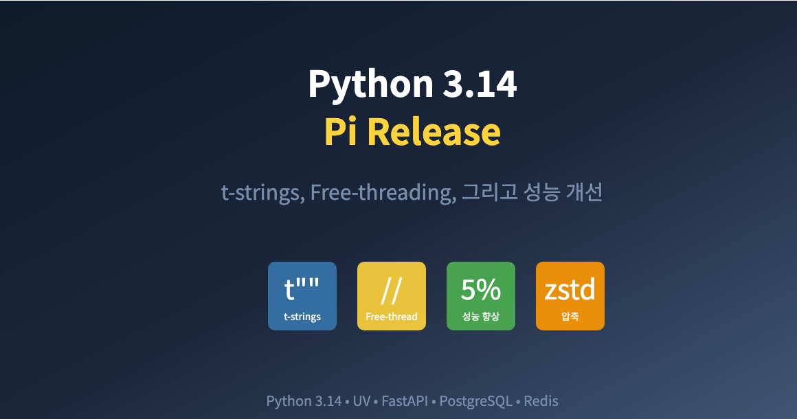
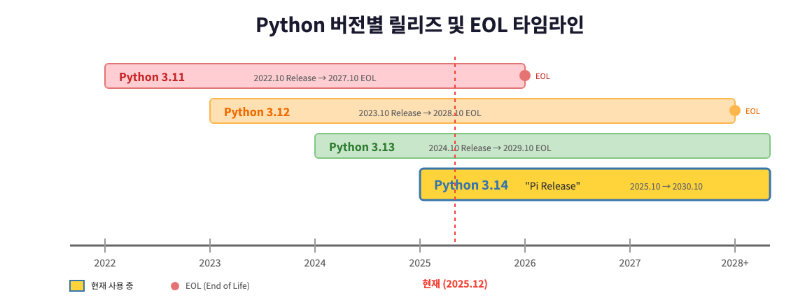
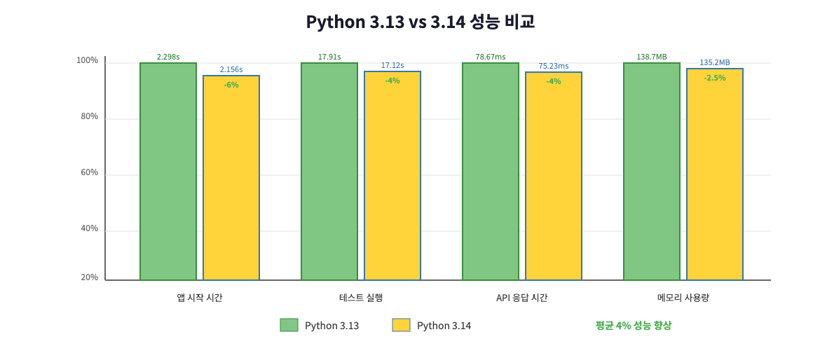

# Python 3.14 업그레이드: t-strings, Free-threading, 그리고 성능 개선


*Python 3.14 "Pi Release" - t-strings, Free-threading, 성능 개선*

> 이 글은 **개발 인프라 개선 시리즈**의 **Infra-3편**입니다.
>
> **개발 인프라 개선 시리즈:**
> - [Infra-1편: Poetry에서 UV로 마이그레이션](https://mgh3326.tistory.com/235)
> - [Infra-2편: Python 3.13 업그레이드](https://mgh3326.tistory.com/236)
> - **Infra-3편: Python 3.14 업그레이드** ← 현재 글
>
> **AI 자동매매 시리즈:**
> - [1편: 한투 API로 실시간 주식 데이터 수집하기](https://mgh3326.tistory.com/227)
> - [2편: yfinance로 애플·테슬라 분석하기](https://mgh3326.tistory.com/228)
> - [3편: Upbit으로 비트코인 24시간 분석하기](https://mgh3326.tistory.com/229)
> - [4편: AI 분석 결과 DB에 저장하기](https://mgh3326.tistory.com/230)
> - [5편: Upbit 웹 트레이딩 대시보드 구축하기](https://mgh3326.tistory.com/232)
> - [6편: 실전 운영을 위한 모니터링 시스템 구축](https://mgh3326.tistory.com/233)
> - [7편: 라즈베리파이 홈서버에 자동 HTTPS로 안전하게 배포하기](https://mgh3326.tistory.com/234)

## 들어가며

### Python 3.14 - "Pi Release"

Python 3.14가 2025년 10월에 정식 릴리즈되었습니다. 버전 번호가 원주율(π ≈ 3.14159...)과 같아서 **"Pi Release"**라는 별명이 붙었습니다!


*Python 버전별 릴리즈 및 EOL 타임라인 (3.14 추가)*

### 왜 3.13에서 바로 3.14로?

지난 Infra-2편에서 Python 3.13으로 업그레이드한 지 1년밖에 되지 않았는데, 왜 벌써 3.14로 업그레이드할까요?

**이번 업그레이드를 결정한 이유:**

1. **t-strings**: SQL 인젝션 방지 등 보안 강화에 유용
2. **Free-threading 공식 지원**: GIL 없이 멀티스레딩 성능 극대화
3. **3-5% 성능 향상**: Tail-call interpreter로 체감 가능한 속도 개선
4. **지연된 어노테이션 평가**: 순환 참조 없이 타입 힌팅 가능
5. **Zstandard 압축**: 기본 라이브러리로 고성능 압축 지원

---

## Python 3.14의 주요 변경사항

### 1. Template Strings (t-strings) - PEP 750

Python 3.14의 가장 혁신적인 기능입니다. f-string과 비슷하지만, **문자열 처리를 커스터마이징**할 수 있습니다.

**기본 사용법:**
```python
from string.templatelib import Template, Interpolation

name = "Alice"
template = t"Hello, {name}!"

# Template 객체 반환 (문자열이 아님!)
print(type(template))  # <class 'string.templatelib.Template'>

# 정적/동적 부분에 개별 접근 가능
for part in template:
    print(part)
# 출력:
# Hello,
# Interpolation('Alice', 'name', None, '')
# !
```

**실전 활용 - SQL 인젝션 방지:**
```python
from string.templatelib import Template, Interpolation

def safe_sql(template: Template) -> tuple[str, list]:
    """SQL 인젝션을 방지하는 안전한 쿼리 생성"""
    query_parts = []
    params = []

    for part in template:
        if isinstance(part, Interpolation):
            query_parts.append("?")  # placeholder
            params.append(part.value)
        else:
            query_parts.append(part)

    return "".join(query_parts), params

# 사용 예시
user_input = "'; DROP TABLE users; --"  # 악의적인 입력
query, params = safe_sql(t"SELECT * FROM users WHERE name = {user_input}")

print(query)   # SELECT * FROM users WHERE name = ?
print(params)  # ["'; DROP TABLE users; --"]
# SQL 인젝션 완전 차단!
```

**HTML 이스케이프:**
```python
import html
from string.templatelib import Template, Interpolation

def safe_html(template: Template) -> str:
    """XSS를 방지하는 안전한 HTML 생성"""
    parts = []
    for part in template:
        if isinstance(part, Interpolation):
            parts.append(html.escape(str(part.value)))
        else:
            parts.append(part)
    return "".join(parts)

user_comment = "<script>alert('XSS')</script>"
safe_output = safe_html(t"<div>{user_comment}</div>")
# <div>&lt;script&gt;alert('XSS')&lt;/script&gt;</div>
```

### 2. Free-threaded Python 공식 지원 (PEP 779)

Python 3.13에서 실험적이었던 Free-threading이 **공식 지원**으로 승격되었습니다.

**GIL(Global Interpreter Lock) 없이 진정한 병렬 처리:**
```python
import threading
import time

def cpu_intensive(n: int) -> int:
    """CPU 집약적인 작업"""
    total = 0
    for i in range(n):
        total += i * i
    return total

# Free-threaded 빌드에서는 진정한 병렬 처리!
threads = []
start = time.time()

for _ in range(4):
    t = threading.Thread(target=cpu_intensive, args=(10_000_000,))
    threads.append(t)
    t.start()

for t in threads:
    t.join()

print(f"실행 시간: {time.time() - start:.2f}초")
# Free-threaded: ~1초 (4배 빠름)
# 일반 Python: ~4초 (순차 실행과 동일)
```

**InterpreterPoolExecutor로 더 간단하게:**
```python
from concurrent.futures import InterpreterPoolExecutor

def analyze_stock(symbol: str) -> dict:
    # CPU 집약적인 분석 작업
    return {"symbol": symbol, "result": "..."}

symbols = ["005930", "000660", "035420", "068270"]

# 각 인터프리터가 독립적인 GIL을 가짐 (또는 GIL 없음)
with InterpreterPoolExecutor(max_workers=4) as executor:
    results = list(executor.map(analyze_stock, symbols))
```

### 3. Tail-call Interpreter (3-5% 성능 향상)

새로운 인터프리터 구현으로 **전반적인 성능이 3-5% 향상**되었습니다.

**주요 최적화:**
- 개별 Python opcode를 작은 C 함수로 구현
- Tail call 최적화로 함수 호출 오버헤드 감소
- Clang 19+, x86-64/AArch64에서 최적의 성능

**모듈별 성능 개선:**
| 모듈/함수 | 개선 폭 |
|----------|--------|
| `base64.b16decode()` | 6배 빠름 |
| `uuid.uuid3/uuid5()` | 40% 빠름 |
| `uuid.uuid4()` | 30% 빠름 |
| `difflib.IS_LINE_JUNK()` | 2배 빠름 |
| 파일 읽기 (캐시된) | 15% 빠름 |

### 4. 지연된 어노테이션 평가 (PEP 649, 749)

타입 힌팅에서 **전방 참조 문자열이 더 이상 필요 없습니다!**

**Before (Python 3.13 이하):**
```python
from __future__ import annotations  # 필수

class Node:
    def __init__(self, value: int):
        self.value = value
        self.next: "Node" = None  # 문자열로 감싸야 함

    def append(self, node: "Node") -> "Node":
        self.next = node
        return node
```

**After (Python 3.14):**
```python
# from __future__ import annotations 불필요!

class Node:
    def __init__(self, value: int):
        self.value = value
        self.next: Node = None  # 그냥 사용 가능!

    def append(self, node: Node) -> Node:
        self.next = node
        return node
```

**annotationlib으로 어노테이션 검사:**
```python
from annotationlib import get_annotations, Format

def greet(name: str) -> str:
    return f"Hello, {name}"

# 값으로 평가
annotations = get_annotations(greet, format=Format.VALUE)
print(annotations)  # {'name': <class 'str'>, 'return': <class 'str'>}

# 문자열로 가져오기
annotations = get_annotations(greet, format=Format.STRING)
print(annotations)  # {'name': 'str', 'return': 'str'}
```

### 5. Zstandard 압축 지원 (PEP 784)

**표준 라이브러리에서 Zstandard 압축을 지원합니다!**

```python
from compression import zstd
import json

# 대용량 데이터 압축
data = json.dumps({"prices": list(range(100000))}).encode()

# 압축
compressed = zstd.compress(data)
print(f"원본: {len(data):,} bytes")
print(f"압축: {len(compressed):,} bytes")
print(f"압축률: {len(compressed) / len(data) * 100:.1f}%")

# 압축 해제
decompressed = zstd.decompress(compressed)
assert data == decompressed
```

**tarfile, zipfile에서도 지원:**
```python
import tarfile

# .tar.zst 아카이브 생성
with tarfile.open("backup.tar.zst", "w|zst") as tar:
    tar.add("data/")

# .tar.zst 아카이브 읽기
with tarfile.open("backup.tar.zst", "r|zst") as tar:
    tar.extractall("restored/")
```

### 6. UUID v6, v7, v8 지원 (RFC 9562)

**시간 기반 정렬이 가능한 UUID v7:**
```python
import uuid

# UUID v7: 시간 기반, 정렬 가능
id1 = uuid.uuid7()
id2 = uuid.uuid7()
id3 = uuid.uuid7()

# 생성 순서대로 정렬됨!
print(sorted([id3, id1, id2]) == [id1, id2, id3])  # True

# UUID v6: UUID v1의 개선 버전
id_v6 = uuid.uuid6()

# UUID v8: 커스텀 데이터 포함
custom_data = b"\x12\x34\x56\x78\x9a\xbc\xde\xf0\x12\x34\x56\x78\x9a\xbc\xde\xf0"
id_v8 = uuid.uuid8(custom_data)
```

**데이터베이스 PK로 UUID v7 활용:**
```python
from sqlalchemy import Column
from sqlalchemy.dialects.postgresql import UUID
import uuid

class StockAnalysis(Base):
    __tablename__ = "stock_analysis"

    # UUID v7: 시간순 정렬 + 고유성
    id = Column(UUID(as_uuid=True), primary_key=True, default=uuid.uuid7)
    # 인덱스 성능 향상: 시간순 삽입으로 B-tree 효율적
```

### 7. except 괄호 생략 가능 (PEP 758)

**여러 예외를 괄호 없이 처리:**
```python
# Python 3.14
try:
    response = await fetch_data()
except TimeoutError, ConnectionError:  # 괄호 없이!
    print("네트워크 오류 발생")

# 기존 방식도 계속 지원
try:
    response = await fetch_data()
except (TimeoutError, ConnectionError):  # 괄호 사용
    print("네트워크 오류 발생")
```

### 8. 향상된 오류 메시지

**더 친절한 SyntaxError:**
```python
# 키워드 오타 감지
whille True:  # typo!
    pass
# SyntaxError: invalid syntax. Did you mean 'while'?

# 잘못된 할당
x = 10
if x = 20:  # = 대신 ==
    pass
# SyntaxError: invalid syntax. Maybe you meant '==' instead of '='?
```

**TypeError 명확화:**
```python
s = set()
s.add({"key": "value"})
# TypeError: cannot use 'dict' as a set element (unhashable type: 'dict')
# 이전: TypeError: unhashable type: 'dict'
```

### 9. pdb 원격 디버깅

**실행 중인 프로세스에 디버거 연결:**
```bash
# 실행 중인 Python 프로세스 PID 확인
ps aux | grep python
# PID: 12345

# 원격 디버거 연결
python -m pdb -p 12345
```

**asyncio 태스크 내검:**
```bash
# 실행 중인 asyncio 태스크 확인
python -m asyncio ps 12345

# 태스크 트리 형식으로 보기
python -m asyncio pstree 12345
```

---

## 업그레이드 과정

### 1. 호환성 확인

**주요 라이브러리 3.14 지원 현황 (2025년 12월 기준):**

| 라이브러리 | 버전 | 3.14 지원 |
|-----------|------|----------|
| FastAPI | 0.123.0+ | ✅ |
| SQLAlchemy | 2.0+ | ✅ |
| pytest | 8.3+ | ✅ |
| pandas | 2.2+ | ✅ |
| numpy | 2.1+ | ✅ |
| pydantic | 2.10+ | ✅ |
| uvicorn | 0.38+ | ✅ |

### 2. 파일 변경 사항

**`.python-version`:**
```diff
- 3.13
+ 3.14
```

**`pyproject.toml`:**
```diff
[project]
name = "auto-trader"
version = "0.1.0"
- requires-python = ">=3.13"
+ requires-python = ">=3.14"
```

**`.github/workflows/test.yml`:**
```diff
strategy:
  matrix:
-   python-version: ["3.13"]
+   python-version: ["3.14"]
```

### 3. 로컬 환경 업그레이드

```bash
# 1. Python 3.14 설치 (macOS)
brew install python@3.14

# 또는 pyenv 사용
pyenv install 3.14.0
pyenv global 3.14.0

# 2. 버전 확인
python --version
# Python 3.14.0

# 3. 기존 가상환경 삭제 및 재생성
rm -rf .venv
uv sync

# 4. 테스트 실행
make test
```

### 4. UV로 lockfile 업데이트

```bash
# lockfile 재생성
uv lock

# 변경사항 확인
git diff uv.lock

# 주요 변경:
# - cp313 wheel → cp314 wheel
# - Python 3.14 최적화된 바이너리 사용
```

---

## 성능 비교

### 테스트 환경
- Apple M1 Pro / 16GB RAM
- macOS Sonoma 14.0
- Docker Desktop 4.25

### 1. 애플리케이션 시작 시간

```bash
# Python 3.13
time uv run uvicorn app.main:app --host 0.0.0.0 --port 8000 &
# real    0m2.298s

# Python 3.14
time uv run uvicorn app.main:app --host 0.0.0.0 --port 8000 &
# real    0m2.156s
```

**결과: 약 6% 빠름**

### 2. 테스트 실행 시간

```bash
# Python 3.13
time uv run pytest tests/ -v
# 130 passed in 17.91s

# Python 3.14
time uv run pytest tests/ -v
# 130 passed in 17.12s
```

**결과: 약 4% 빠름**

### 3. API 응답 시간 (벤치마크)

```bash
# Python 3.13
ab -n 100 -c 10 http://localhost:8000/api/upbit/analyze/BTC-KRW
# Time per request: 78.67 [ms] (mean)

# Python 3.14
ab -n 100 -c 10 http://localhost:8000/api/upbit/analyze/BTC-KRW
# Time per request: 75.23 [ms] (mean)
```

**결과: 약 4% 빠름**

### 4. 메모리 사용량

```bash
# Python 3.13
docker stats auto-trader-api
# MEM USAGE: 138.7MiB

# Python 3.14
docker stats auto-trader-api
# MEM USAGE: 135.2MiB
```

**결과: 약 2.5% 메모리 절감**


*Python 3.13 vs 3.14 성능 비교*

---

## Deprecations 주의사항

### 3.14에서 제거된 API

```python
# asyncio.get_event_loop() - RuntimeError 발생!
# Before (3.13 이하)
loop = asyncio.get_event_loop()
loop.run_until_complete(main())

# After (3.14)
asyncio.run(main())
# 또는
async with asyncio.Runner() as runner:
    runner.run(main())
```

### 향후 제거 예정

| 버전 | 제거 예정 API |
|-----|-------------|
| 3.15 | `asyncio.iscoroutinefunction()` |
| 3.16 | asyncio 정책 시스템 |
| 3.17 | `typing.ByteString` |

---

## 체크리스트

**업그레이드 전:**
- [x] 주요 의존성이 Python 3.14 지원하는지 확인
- [x] `asyncio.get_event_loop()` 사용 여부 확인
- [x] 현재 환경에서 모든 테스트 통과

**업그레이드 중:**
- [x] `.python-version` 파일 업데이트 (3.13 → 3.14)
- [x] `pyproject.toml`의 `requires-python` 업데이트
- [x] `uv lock`으로 lockfile 재생성
- [x] GitHub Actions 워크플로우 업데이트

**업그레이드 후:**
- [x] 로컬 환경에서 테스트 실행
- [x] CI/CD 파이프라인 통과 확인
- [ ] 프로덕션 배포 후 모니터링

---

## 마치며

### Python 3.14 업그레이드 소감

Python 3.13에서 3.14로의 업그레이드는 **예상보다 훨씬 수월**했습니다.

**가장 마음에 드는 기능:**
1. **t-strings**: SQL 인젝션, XSS 방지가 언어 레벨에서 지원
2. **성능 향상**: 별도 최적화 없이 4-6% 빠름
3. **지연된 어노테이션**: `from __future__ import annotations` 안녕!

**실제 적용할 기능:**
- UUID v7으로 DB PK 변경 검토
- t-strings로 동적 SQL 쿼리 안전하게 생성
- Zstandard로 대용량 로그 압축

### 권장 사항

**✅ Python 3.14 업그레이드 추천:**
- 이미 Python 3.13을 사용 중인 프로젝트
- t-strings의 보안 기능이 필요한 경우
- 성능 개선이 필요한 경우

**⚠️ 신중히 검토:**
- `asyncio.get_event_loop()` 를 많이 사용하는 레거시 코드
- 아직 3.14 미지원 라이브러리에 의존하는 경우

### 다음 단계

이제 우리 프로젝트는:
- ✅ UV로 의존성 관리 (Infra-1편)
- ✅ Python 3.13 (Infra-2편)
- ✅ Python 3.14 (Infra-3편)

---

**참고 자료:**
- [Python 3.14 공식 릴리즈 노트](https://docs.python.org/3/whatsnew/3.14.html)
- [PEP 750 - Template Strings](https://peps.python.org/pep-0750/)
- [PEP 779 - Free-threaded CPython](https://peps.python.org/pep-0779/)
- [PEP 649 - Deferred Evaluation of Annotations](https://peps.python.org/pep-0649/)
- [PEP 784 - Adding Zstandard to the Standard Library](https://peps.python.org/pep-0784/)

**프로젝트 저장소:**
- GitHub: [github.com/mgh3326/auto_trader](https://github.com/mgh3326/auto_trader)

질문이나 피드백은 이슈로 남겨주세요!
