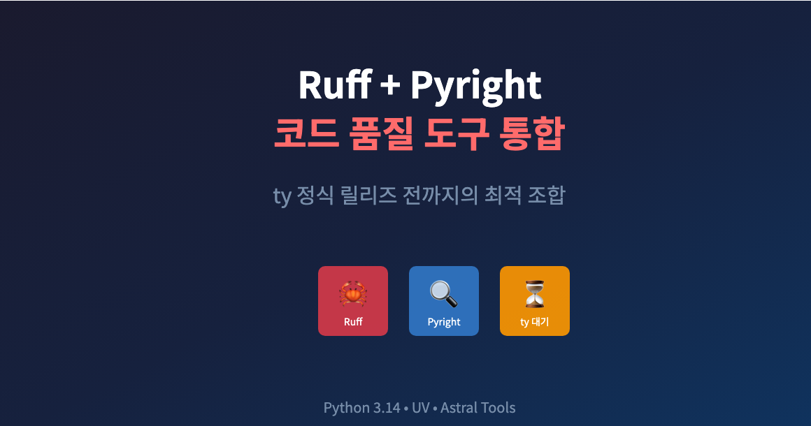
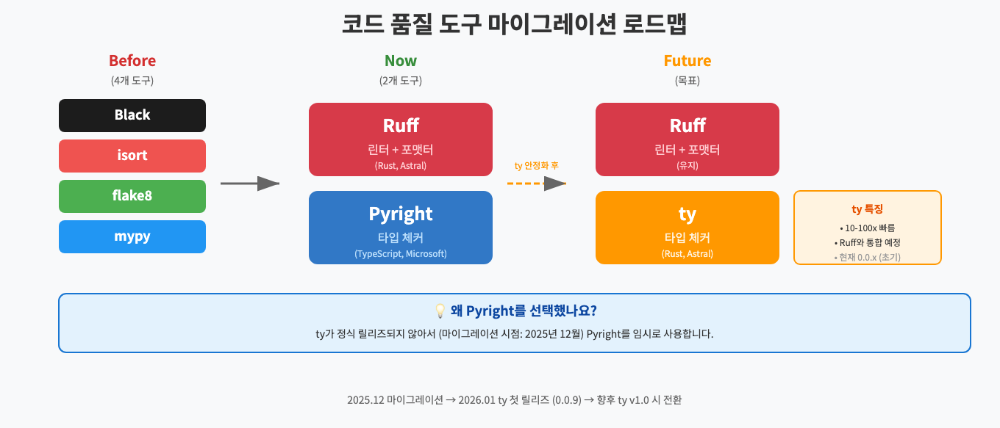
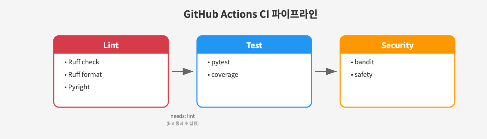
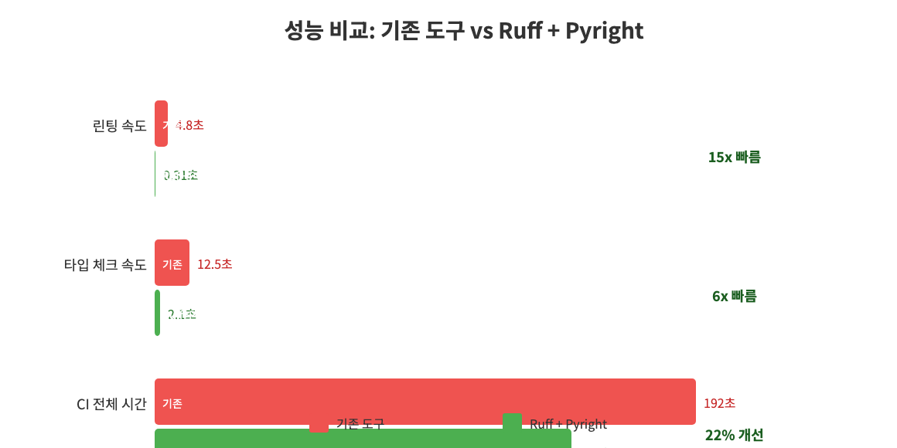

# Ruff + Pyright로 Python 코드 품질 도구 통합하기


*Black, isort, flake8, mypy에서 Ruff + Pyright로 통합*

> 이 글은 **개발 인프라 개선 시리즈**의 **Infra-4편**입니다.
>
> **개발 인프라 개선 시리즈:**
> - [Infra-1편: Poetry에서 UV로 마이그레이션](https://mgh3326.tistory.com/235)
> - [Infra-2편: Python 3.13 업그레이드](https://mgh3326.tistory.com/236)
> - [Infra-3편: Python 3.14 업그레이드](https://mgh3326.tistory.com/237)
> - **Infra-4편: Ruff + Pyright 마이그레이션** ← 현재 글
>
> **AI 자동매매 시리즈:**
> - [1편: 한투 API로 실시간 주식 데이터 수집하기](https://mgh3326.tistory.com/227)
> - [2편: yfinance로 애플·테슬라 분석하기](https://mgh3326.tistory.com/228)
> - [3편: Upbit으로 비트코인 24시간 분석하기](https://mgh3326.tistory.com/229)
> - [4편: AI 분석 결과 DB에 저장하기](https://mgh3326.tistory.com/230)
> - [5편: Upbit 웹 트레이딩 대시보드 구축하기](https://mgh3326.tistory.com/232)
> - [6편: 실전 운영을 위한 모니터링 시스템 구축](https://mgh3326.tistory.com/233)
> - [7편: 라즈베리파이 홈서버에 자동 HTTPS로 안전하게 배포하기](https://mgh3326.tistory.com/234)

## 들어가며

### 기존 도구들의 문제점

Python 코드 품질 관리를 위해 보통 여러 도구를 조합해서 사용합니다:

| 도구 | 역할 | 문제점 |
|------|------|--------|
| **Black** | 코드 포맷터 | 설정 파일이 분산됨 |
| **isort** | import 정렬 | Black과 충돌 가능성 |
| **flake8** | 린터 | 느린 속도, 플러그인 관리 |
| **mypy** | 타입 체커 | 느린 속도, 복잡한 설정 |

**우리 프로젝트의 기존 상태:**
```makefile
# Makefile (기존)
lint:
	uv run flake8 app/ tests/ --max-line-length=88 --extend-ignore=E203,W503
	uv run black --check app/ tests/
	uv run isort --check-only app/ tests/
	uv run mypy app/ --ignore-missing-imports

format:
	uv run black app/ tests/
	uv run isort app/ tests/
```

**문제점:**
1. **4개의 도구를 별도로 실행** → 느린 CI 속도
2. **설정이 여러 곳에 분산** → pyproject.toml, .flake8, setup.cfg 등
3. **도구 간 버전/설정 충돌** → Black과 isort 스타일 불일치
4. **mypy의 느린 속도** → 대규모 코드베이스에서 체감됨

### 원래 목표: ty (Astral의 타입 체커)

사실 처음에는 **ty**를 사용하고 싶었습니다.

**ty란?**
- Astral에서 개발 중인 **Rust 기반 타입 체커**
- Ruff, UV와 같은 회사에서 개발 (Astral)
- mypy, Pyright보다 **10-100배 빠름**
- 향후 Ruff와 통합 예정

```bash
# ty 사용 예시 (향후)
uv run ty check app/

# 또는 Ruff 통합 후
uv run ruff check --select=TY app/
```

**하지만 마이그레이션 시점(2025년 12월)에는:**
- ty가 아직 정식 릴리즈되지 않음
- 첫 릴리즈(v0.0.9)가 2026년 1월 5일에 나옴
- 현재(2026년 1월 25일) v0.0.13까지 릴리즈되었지만 여전히 초기 단계

그래서 **Ruff + Pyright** 조합을 선택했습니다. ty가 안정화되면 Pyright → ty로 전환할 계획입니다.

### Ruff와 Pyright란?


*기존 4개 도구 → Ruff + Pyright 2개로 통합 (ty 안정화 전까지)*

**Ruff** (Astral 개발):
- Rust로 작성된 초고속 린터 + 포맷터
- Black, isort, flake8, pyupgrade 등을 **하나로 통합**
- 기존 도구 대비 **10-100배 빠름**

**Pyright** (Microsoft 개발):
- TypeScript로 작성된 고성능 타입 체커
- VS Code Python 확장에 내장
- mypy 대비 **5-10배 빠름**
- **임시 선택**: ty가 안정화되면 교체 예정

---

## 마이그레이션 계획

### Phase별 접근

안전한 마이그레이션을 위해 4단계로 진행했습니다:

```
Phase 1: Ruff 도입 (기존 도구와 병행)
    ↓
Phase 2: Pyright 도입 (기존 mypy와 병행)
    ↓
Phase 3: CI 개선 (Ruff + Pyright로 전환)
    ↓
Phase 4: 정리 (기존 도구 제거)
```

**핵심 원칙:**
- 각 단계에서 롤백 가능하도록 설계
- 기존 도구와 새 도구 결과 비교 후 전환
- CI가 통과한 후에만 다음 단계 진행

---

## Phase 1: Ruff 도입

### 1.1 설치 및 설정

```bash
# Ruff 설치
uv add --group dev ruff
```

**pyproject.toml 설정:**
```toml
[tool.ruff]
target-version = "py314"
line-length = 88
exclude = [
    ".venv",
    "alembic/versions",
    "__pycache__",
    "data/stocks_info",
    "data/coins_info",
]

[tool.ruff.lint]
select = [
    "E",      # pycodestyle errors
    "W",      # pycodestyle warnings
    "F",      # Pyflakes
    "I",      # isort
    "B",      # flake8-bugbear
    "C4",     # flake8-comprehensions
    "UP",     # pyupgrade
]
ignore = [
    "E203",   # Whitespace before ':' (black compatible)
    "E501",   # Line too long (formatter handles this)
    "B008",   # FastAPI Depends() in default arguments
    "E712",   # SQLAlchemy == True comparison
    "B904",   # raise ... from err (FastAPI HTTPException pattern)
]

[tool.ruff.lint.per-file-ignores]
"app/core/celery_app.py" = ["E402"]  # Delayed import for Celery signals
"tests/conftest.py" = ["E402"]        # Delayed import after env setup

[tool.ruff.lint.isort]
known-first-party = ["app"]

[tool.ruff.format]
quote-style = "double"
indent-style = "space"
skip-magic-trailing-comma = false
line-ending = "auto"
```

### 1.2 주요 설정 설명

**lint.select - 활성화할 규칙:**
| 코드 | 기존 도구 | 역할 |
|------|----------|------|
| E, W | pycodestyle | PEP 8 스타일 검사 |
| F | Pyflakes | 논리 오류 검출 |
| I | isort | import 정렬 |
| B | flake8-bugbear | 버그 가능성 검출 |
| C4 | flake8-comprehensions | 컴프리헨션 최적화 |
| UP | pyupgrade | 최신 문법으로 자동 변환 |

**lint.ignore - 예외 처리:**
```python
# E712: SQLAlchemy에서는 == True 비교가 필요
query.filter(User.is_active == True)  # noqa 없이 허용

# B008: FastAPI Depends()는 기본값에 사용해도 됨
def get_user(db: Session = Depends(get_db)):  # OK

# B904: FastAPI HTTPException은 from err 없이 사용
raise HTTPException(status_code=404)  # OK
```

### 1.3 Makefile 업데이트 (병행 기간)

```makefile
# 기존 명령어 유지
lint-legacy:
	uv run flake8 app/ tests/
	uv run black --check app/ tests/
	uv run isort --check-only app/ tests/

# 새 명령어 추가
lint-ruff:
	uv run ruff check app/ tests/
	uv run ruff format --check app/ tests/
```

### 1.4 코드 자동 수정

```bash
# 린트 에러 자동 수정
uv run ruff check --fix app/ tests/

# 코드 포맷팅
uv run ruff format app/ tests/
```

**pyupgrade (UP) 규칙으로 자동 변환된 예시:**

```python
# Before (Python 3.9 스타일)
from typing import Optional, List, Dict, Union

def get_users(ids: Optional[List[int]] = None) -> Dict[str, Union[int, str]]:
    pass

# After (Python 3.10+ 스타일)
def get_users(ids: list[int] | None = None) -> dict[str, int | str]:
    pass
```

---

## Phase 2: Pyright 도입

### 2.1 설치 및 설정

```bash
# Pyright 설치
uv add --group dev pyright
```

**pyproject.toml 설정:**
```toml
[tool.pyright]
pythonVersion = "3.14"
pythonPlatform = "All"
typeCheckingMode = "basic"

include = ["app"]
exclude = [
    "**/__pycache__",
    ".venv",
    "alembic",
    "tests",
    "data",
]

# 점진적 마이그레이션 설정
reportMissingImports = "warning"
reportMissingTypeStubs = false
reportUnknownMemberType = false
reportUnknownParameterType = false
reportUnknownVariableType = false
reportUnknownArgumentType = false

# 특정 라이브러리 이슈 완화
reportAttributeAccessIssue = false  # ta library (no type stubs)
reportGeneralTypeIssues = false     # SQLAlchemy async session
reportArgumentType = false          # dict.get() returns Unknown | None
reportCallIssue = false             # Pydantic Field overloads
```

### 2.2 typeCheckingMode 이해

| 모드 | 엄격도 | 용도 |
|------|--------|------|
| off | 검사 없음 | 타입 검사 비활성화 |
| **basic** | 낮음 | 점진적 도입 시작점 |
| standard | 중간 | 일반적인 프로젝트 |
| strict | 높음 | 완벽한 타입 안전성 |
| all | 최고 | 모든 규칙 활성화 |

**basic 모드 선택 이유:**
- 외부 라이브러리에 타입 스텁이 없는 경우가 많음
- 점진적으로 strict 모드로 전환 가능
- 주요 타입 에러만 잡으면서 생산성 유지

### 2.3 주요 타입 에러 수정

**수정 전:**
```python
# app/services/upbit.py
async def get_candles(self, market: str, count: int = 200):
    response = await self.client.get(url, params=params)
    return response.json()  # Unknown type
```

**수정 후:**
```python
async def get_candles(self, market: str, count: int = 200) -> list[dict]:
    response = await self.client.get(url, params=params)
    data: list[dict] = response.json()
    return data
```

### 2.4 타입 무시 주석

어쩔 수 없이 타입 에러를 무시해야 하는 경우:

```python
# 특정 줄만 무시
from app.services.telegram import TelegramService  # type: ignore[import-not-found]

# 또는 pyright 전용
from external_lib import something  # pyright: ignore[reportMissingImports]
```

---

## Phase 3: CI 개선

### 3.1 GitHub Actions 워크플로우

```yaml
# .github/workflows/test.yml
name: Test

on:
  push:
    branches: [ main, develop ]
  pull_request:
    branches: [ main, develop ]

jobs:
  lint:
    runs-on: ubuntu-latest
    env:
      PYTHON_VERSION: "3.14"

    steps:
    - uses: actions/checkout@v4

    - name: Set up Python ${{ env.PYTHON_VERSION }}
      uses: actions/setup-python@v6
      with:
        python-version: ${{ env.PYTHON_VERSION }}

    - name: Install UV
      run: pip install uv

    - name: Load cached venv
      uses: actions/cache@v3
      with:
        path: .venv
        key: venv-${{ runner.os }}-${{ env.PYTHON_VERSION }}-${{ hashFiles('**/uv.lock') }}

    - name: Install dependencies
      run: uv sync --group dev

    - name: Run Ruff linter
      run: uv run ruff check app/ tests/

    - name: Run Ruff formatter check
      run: uv run ruff format --check app/ tests/

    - name: Run Pyright
      run: uv run pyright app/

  test:
    needs: lint  # lint 통과 후 테스트 실행
    runs-on: ubuntu-latest
    # ... 기존 테스트 설정 ...
```

### 3.2 lint → test 의존성

```yaml
test:
  needs: lint  # 핵심!
```

**효과:**
- 린트 실패 시 테스트 실행 안 함 (리소스 절약)
- 빠른 피드백 (린트는 테스트보다 훨씬 빠름)
- PR에서 명확한 실패 지점 파악


*lint → test → security 순서로 실행되는 CI 파이프라인*

---

## Phase 4: 정리

### 4.1 기존 도구 제거

```bash
# 기존 도구 제거
uv remove --group dev black isort flake8 mypy
```

### 4.2 최종 Makefile

```makefile
.PHONY: lint format typecheck

lint: ## Run linting checks (Ruff + Pyright)
	uv run ruff check app/ tests/
	uv run ruff format --check app/ tests/
	uv run pyright app/

format: ## Format code with Ruff
	uv run ruff format app/ tests/
	uv run ruff check --fix app/ tests/

typecheck: ## Run Pyright type checking
	uv run pyright app/
```

### 4.3 최종 의존성

```toml
[dependency-groups]
dev = [
    "ruff>=0.14.10",
    "pyright>=1.1.407",
    "bandit>=1.7.0,<2.0.0",
    "safety>=3.7.0,<3.8.0",
    "playwright>=1.56.0",
]
```

**Before (6개 도구):**
- black, isort, flake8, mypy, bandit, safety

**After (4개 도구):**
- ruff, pyright, bandit, safety

---

## 성능 비교

### 린트 속도 비교

```bash
# 기존 도구 (flake8 + black + isort)
time make lint-legacy
# real    0m4.823s

# Ruff
time uv run ruff check app/ tests/
# real    0m0.312s
```

**결과: 15배 빠름!**

### 타입 체크 속도 비교

```bash
# mypy
time uv run mypy app/
# real    0m12.456s

# Pyright
time uv run pyright app/
# real    0m2.134s
```

**결과: 6배 빠름!**

### CI 실행 시간

| 단계 | Before | After | 개선 |
|------|--------|-------|------|
| lint job | 42초 | 18초 | **57% 감소** |
| 전체 CI | 3분 12초 | 2분 28초 | **23% 감소** |


*기존 도구 vs Ruff + Pyright 속도 비교*

---

## 마이그레이션 결과

### 변경된 파일 수

| 항목 | 수량 |
|------|------|
| 변경된 파일 | 101개 |
| 추가된 라인 | 5,000+ |
| 삭제된 라인 | 3,200+ |
| 타입 힌트 개선 | 200+ 곳 |

### pyupgrade로 현대화된 코드

**Union → | 연산자:**
```python
# 101개 파일에서 자동 변환
Optional[str] → str | None
Union[int, str] → int | str
List[dict] → list[dict]
Dict[str, Any] → dict[str, Any]
```

### 새로 발견된 잠재적 버그

Ruff의 `B` (bugbear) 규칙으로 발견:

```python
# 발견된 이슈: 가변 기본 인자
def process(items: list = []):  # B006: 위험!
    items.append(1)
    return items

# 수정
def process(items: list | None = None):
    if items is None:
        items = []
    items.append(1)
    return items
```

---

## 향후 계획

### 1. ty로 전환 (최우선)

**ty**가 안정화되면 Pyright에서 ty로 전환할 계획입니다.

**ty의 장점:**
| 특징 | Pyright | ty |
|------|---------|-----|
| 언어 | TypeScript | **Rust** |
| 속도 | 빠름 | **10-100배 더 빠름** |
| Ruff 통합 | 별도 실행 | **향후 통합 예정** |
| 개발사 | Microsoft | **Astral (Ruff, UV와 동일)** |

**ty의 주요 기능:**
- **교집합 타입(Intersection types)**: 더 정밀한 타입 표현
- **정교한 타입 좁히기**: 조건문에서 더 스마트한 타입 추론
- **도달성 분석**: 도달 불가능한 코드 감지
- **풍부한 진단**: 컨텍스트 정보가 포함된 에러 메시지
- **언어 서버**: 코드 네비게이션, 자동완성, 자동 임포트

**전환 타이밍:**
- ty가 v1.0 또는 안정 버전에 도달하면 전환
- 현재 v0.0.13 (2026년 1월 21일 기준)으로 빠르게 개발 중
- Ruff 통합이 완료되면 도구 하나로 린트 + 타입 체크 가능

```bash
# 현재 (Ruff + Pyright)
uv run ruff check app/ tests/
uv run pyright app/

# 향후 (Ruff + ty 통합)
uv run ty check app/
# 또는
uv run ruff check app/ tests/  # 린트 + 타입 체크 통합
```

**마이그레이션 계획:**
```
현재: Ruff + Pyright (안정적)
    ↓ ty v1.0 릴리즈 시
중간: Ruff + ty (Pyright 대체)
    ↓ Ruff-ty 통합 완료 시
최종: Ruff (올인원)
```

### 2. Pyright strict 모드 전환 (ty 전환 전까지)

ty 전환 전까지 Pyright를 점진적으로 강화:

```toml
# 현재
[tool.pyright]
typeCheckingMode = "basic"

# 중간 목표
typeCheckingMode = "standard"

# 최종 목표 (ty 전환 전)
typeCheckingMode = "strict"
```

### 3. pre-commit 훅 추가

```yaml
# .pre-commit-config.yaml
repos:
  - repo: https://github.com/astral-sh/ruff-pre-commit
    rev: v0.14.10
    hooks:
      - id: ruff
        args: [--fix]
      - id: ruff-format
```

---

## 체크리스트

**마이그레이션 전:**
- [x] 기존 린트/타입 체크 모두 통과 확인
- [x] CI 파이프라인 정상 동작 확인
- [x] 롤백 계획 수립

**Phase 1 (Ruff):**
- [x] Ruff 설치 및 pyproject.toml 설정
- [x] 기존 도구와 결과 비교
- [x] 린트 에러 수정 또는 ignore 설정
- [x] Makefile 병행 명령어 추가

**Phase 2 (Pyright):**
- [x] Pyright 설치 및 pyproject.toml 설정
- [x] 기존 mypy와 결과 비교
- [x] 타입 에러 수정 또는 ignore 설정

**Phase 3 (CI):**
- [x] GitHub Actions 워크플로우 업데이트
- [x] lint job 추가 (Ruff + Pyright)
- [x] test job에 needs: lint 추가

**Phase 4 (정리):**
- [x] 기존 도구 의존성 제거
- [x] pyproject.toml 정리
- [x] Makefile 최종 버전 적용
- [x] 문서 업데이트 (CLAUDE.md, README.md)

---

## 마치며

### Ruff + Pyright 마이그레이션 소감

**가장 좋았던 점:**
1. **압도적인 속도 향상** - 린트 15배, 타입 체크 6배 빠름
2. **설정 통합** - pyproject.toml 하나로 모든 설정 관리
3. **자동 코드 현대화** - pyupgrade 규칙으로 최신 문법 적용
4. **잠재적 버그 발견** - bugbear 규칙으로 위험한 패턴 검출

**주의할 점:**
1. **점진적 도입 권장** - 한 번에 모든 규칙 적용하면 수정량이 폭발
2. **팀원 합의 필요** - 새 도구 도입은 팀 전체 동의 필수
3. **IDE 설정 동기화** - VS Code에서 Ruff/Pyright 확장 설치 필요

### 권장 사항

**✅ Ruff + Pyright 도입 추천:**
- Python 3.10+ 프로젝트
- CI 속도 개선이 필요한 경우
- 설정 파일 분산이 복잡한 경우
- 최신 Python 문법을 적용하고 싶은 경우

**⚠️ 신중히 검토:**
- Python 3.9 이하 프로젝트 (pyupgrade 규칙 조정 필요)
- mypy 플러그인을 많이 사용하는 경우
- 기존 CI에 강하게 결합된 lint 설정이 있는 경우

### 다음 단계

이제 우리 프로젝트는:
- ✅ UV로 의존성 관리 (Infra-1편)
- ✅ Python 3.13 (Infra-2편)
- ✅ Python 3.14 (Infra-3편)
- ✅ Ruff + Pyright (Infra-4편)

다음 인프라 개선으로는 **pre-commit 훅 설정**과 **Pyright strict 모드 전환**을 검토 중입니다.

---

**참고 자료:**
- [Ruff Documentation](https://docs.astral.sh/ruff/)
- [Ruff Rules Reference](https://docs.astral.sh/ruff/rules/)
- [Pyright Documentation](https://microsoft.github.io/pyright/)
- [ty Documentation](https://docs.astral.sh/ty/) - Astral의 Rust 기반 타입 체커
- [ty GitHub Repository](https://github.com/astral-sh/ty)
- [UV Documentation](https://docs.astral.sh/uv/)

**프로젝트 저장소:**
- GitHub: [github.com/mgh3326/auto_trader](https://github.com/mgh3326/auto_trader)

질문이나 피드백은 이슈로 남겨주세요!
