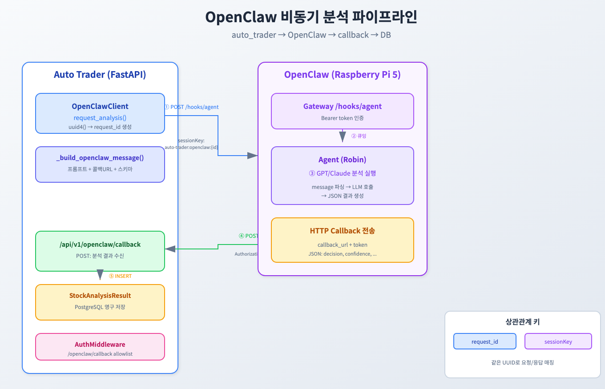
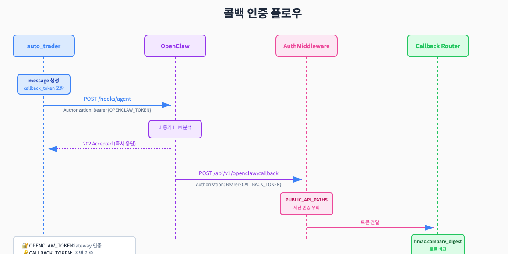
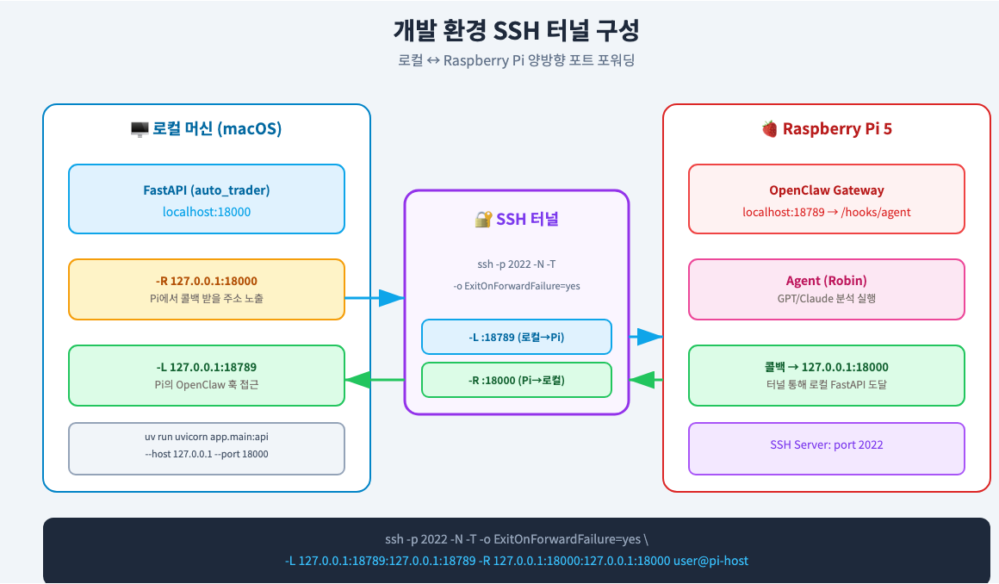

# OpenClaw + FastAPI 콜백으로 비동기 LLM 파이프라인 만들기


*Raspberry Pi에서 GPT 분석, 웹훅/콜백으로 결과 적재*

> 이 글은 **개발 인프라 개선 시리즈**의 **Infra-5편**입니다.
>
> **개발 인프라 개선 시리즈:**
> - [Infra-1편: Poetry에서 UV로 마이그레이션](https://mgh3326.tistory.com/235)
> - [Infra-2편: Python 3.13 업그레이드](https://mgh3326.tistory.com/236)
> - [Infra-3편: Python 3.14 업그레이드](https://mgh3326.tistory.com/239)
> - [Infra-4편: Ruff + Pyright 마이그레이션](https://mgh3326.tistory.com/241)
> - **Infra-5편: OpenClaw 통합** ← 현재 글
>
> **AI 자동매매 시리즈:**
> - [1편: 한투 API로 실시간 주식 데이터 수집하기](https://mgh3326.tistory.com/227)
> - [2편: yfinance로 애플·테슬라 분석하기](https://mgh3326.tistory.com/228)
> - [3편: Upbit으로 비트코인 24시간 분석하기](https://mgh3326.tistory.com/229)
> - [4편: AI 분석 결과 DB에 저장하기](https://mgh3326.tistory.com/230)
> - [5편: Upbit 웹 트레이딩 대시보드 구축하기](https://mgh3326.tistory.com/232)
> - [6편: 실전 운영을 위한 모니터링 시스템 구축](https://mgh3326.tistory.com/233)
> - [7편: 라즈베리파이 홈서버에 자동 HTTPS로 안전하게 배포하기](https://mgh3326.tistory.com/234)

## 들어가며

### 배경: LLM 분석을 분리해야 하는 이유

기존 auto_trader 시스템은 Google Gemini API를 직접 호출해서 주식/암호화폐 분석을 수행했습니다. 하지만 몇 가지 문제가 있었습니다:

| 문제 | 설명 |
|------|------|
| **API 비용/제한** | 여러 API 키를 로테이션해도 429 에러 발생 |
| **운영 분리** | 분석 서비스 장애가 트레이딩 서비스에 영향 |
| **유연성** | 다른 LLM(GPT, Claude)으로 전환이 어려움 |
| **리소스** | LLM 호출이 메인 서버 리소스 점유 |

**해결책: 분석을 별도 서비스로 오프로딩**

Raspberry Pi 5에서 운영 중인 **OpenClaw**를 활용하여:
1. auto_trader는 **분석 요청만** 보냄 (비동기)
2. OpenClaw가 **GPT/Claude로 분석** 수행
3. 완료 후 **콜백으로 결과 전송**
4. auto_trader가 **DB에 저장**

### OpenClaw란?

OpenClaw는 LLM 에이전트를 실행하고 관리하는 게이트웨이입니다:

- **웹훅 기반 실행**: POST `/hooks/agent`로 에이전트 트리거
- **비동기 처리**: 요청 즉시 202 반환, 백그라운드에서 처리
- **세션 관리**: `sessionKey`로 대화 컨텍스트 유지
- **다양한 LLM 지원**: OpenAI, Claude, 로컬 모델 등

---

## 아키텍처 개요


*auto_trader → OpenClaw → callback → DB 파이프라인*

### 핵심 흐름

```
① auto_trader: POST /hooks/agent (분석 요청)
    ├─ message: 프롬프트 + 콜백 URL + JSON 스키마
    ├─ sessionKey: auto-trader:openclaw:{request_id}
    └─ Authorization: Bearer {OPENCLAW_TOKEN}

② OpenClaw: 요청 수신, 즉시 202 반환

③ OpenClaw Agent: GPT/Claude로 분석 실행

④ OpenClaw: POST callback_url (분석 결과)
    ├─ JSON: decision, confidence, reasons, price_analysis
    └─ Authorization: Bearer {CALLBACK_TOKEN}

⑤ auto_trader: 콜백 수신, DB 저장 (StockAnalysisResult)
```

### 상관관계 키

요청과 응답을 매칭하기 위한 두 가지 키:

| 키 | 용도 | 예시 |
|----|------|------|
| `request_id` | 콜백 페이로드 식별 | `550e8400-e29b-41d4-a716-446655440000` |
| `sessionKey` | OpenClaw 세션 추적 | `auto-trader:openclaw:{request_id}` |

---

## 구현 상세

### 1. OpenClaw 클라이언트 (요청 송신)

`app/services/openclaw_client.py`:

```python
class OpenClawClient:
    """Client for OpenClaw Gateway webhook (POST /hooks/agent)."""

    async def request_analysis(
        self,
        prompt: str,
        symbol: str,
        name: str,
        instrument_type: str,
    ) -> str:
        """Send an analysis request to OpenClaw."""
        if not settings.OPENCLAW_ENABLED:
            raise RuntimeError("OpenClaw integration is disabled")

        request_id = str(uuid4())

        message = _build_openclaw_message(
            request_id=request_id,
            prompt=prompt,
            symbol=symbol,
            name=name,
            instrument_type=instrument_type,
            callback_url=self._callback_url,
            callback_token=settings.OPENCLAW_CALLBACK_TOKEN,
        )

        payload = {
            "message": message,
            "name": "auto-trader:analysis",
            "sessionKey": f"auto-trader:openclaw:{request_id}",
            "wakeMode": "now",
        }

        headers = {"Content-Type": "application/json"}
        if self._token:
            headers["Authorization"] = f"Bearer {self._token}"

        async with httpx.AsyncClient(timeout=10) as cli:
            res = await cli.post(self._webhook_url, json=payload, headers=headers)
            res.raise_for_status()

        return request_id
```

**핵심 포인트:**
- `uuid4()`로 고유한 `request_id` 생성
- `sessionKey`에 request_id 포함하여 추적 가능
- `wakeMode: "now"`로 즉시 실행 요청

### 2. 메시지 빌더

```python
def _build_openclaw_message(
    *,
    request_id: str,
    prompt: str,
    callback_url: str,
    callback_token: str | None,
    ...
) -> str:
    callback_schema = {
        "request_id": request_id,
        "symbol": symbol,
        "decision": "buy|hold|sell",
        "confidence": 0,  # 0-100 int
        "reasons": ["..."],
        "price_analysis": {
            "appropriate_buy_range": {"min": 0, "max": 0},
            ...
        },
        "detailed_text": "...",
        "model_name": "...",
    }

    callback_headers = "Content-Type: application/json\n"
    if callback_token:
        callback_headers += f"Authorization: Bearer {callback_token}\n"

    return (
        "Analyze the following trading instrument...\n\n"
        f"request_id: {request_id}\n"
        f"symbol: {symbol}\n"
        "USER_PROMPT:\n"
        f"{prompt}\n\n"
        "CALLBACK:\n"
        f"POST {callback_url}\n"
        f"{callback_headers}\n"
        "RESPONSE_JSON_SCHEMA (example):\n"
        f"{json.dumps(callback_schema)}\n"
    )
```

**메시지 구조:**
- 분석 대상 정보 (symbol, name, instrument_type)
- 원본 프롬프트 (USER_PROMPT)
- 콜백 엔드포인트와 인증 헤더
- 응답 JSON 스키마 (에이전트가 참조)

### 3. 콜백 라우터 (결과 수신)

`app/routers/openclaw_callback.py`:

```python
router = APIRouter(prefix="/api/v1/openclaw", tags=["OpenClaw"])


class OpenClawCallbackRequest(BaseModel):
    request_id: str
    symbol: str
    name: str
    instrument_type: str

    decision: Literal["buy", "hold", "sell"]
    confidence: int = Field(ge=0, le=100)
    reasons: list[str] | None = None

    price_analysis: PriceAnalysis
    detailed_text: str | None = None
    model_name: str | None = None


@router.post("/callback")
async def openclaw_callback(
    payload: OpenClawCallbackRequest,
    _: None = Depends(_require_openclaw_callback_token),
    db: AsyncSession = Depends(get_db),
) -> dict:
    # 1. 종목 정보 생성/조회
    stock_info = await create_stock_if_not_exists(
        symbol=payload.symbol,
        name=payload.name,
        instrument_type=payload.instrument_type,
        db=db,
    )

    # 2. 분석 결과 저장
    record = StockAnalysisResult(
        stock_info_id=stock_info.id,
        model_name="openclaw-gpt",
        decision=payload.decision,
        confidence=payload.confidence,
        appropriate_buy_min=payload.price_analysis.appropriate_buy_range.min,
        ...
    )

    db.add(record)
    await db.commit()
    await db.refresh(record)

    return {
        "status": "ok",
        "request_id": payload.request_id,
        "analysis_result_id": record.id,
    }
```

### 4. 콜백 인증


*2단계 토큰 인증: Gateway 토큰 + Callback 토큰*

**토큰 분리 설계:**

| 토큰 | 용도 | 보관 위치 |
|------|------|----------|
| `OPENCLAW_TOKEN` | Gateway 접근 | auto_trader만 보관 |
| `OPENCLAW_CALLBACK_TOKEN` | 콜백 인증 | 양쪽 보관 |

```python
async def _require_openclaw_callback_token(request: Request) -> None:
    expected = settings.OPENCLAW_CALLBACK_TOKEN.strip()

    # Bearer 토큰 또는 커스텀 헤더에서 추출
    provided = _extract_bearer_token(request.headers.get("authorization"))
    if provided is None:
        provided = request.headers.get("x-openclaw-token")

    # 타이밍 공격 방지를 위한 상수 시간 비교
    if not provided or not hmac.compare_digest(provided, expected):
        raise HTTPException(
            status_code=status.HTTP_401_UNAUTHORIZED,
            detail="Invalid OpenClaw callback token",
        )
```

### 5. 미들웨어 allowlist

콜백 엔드포인트는 **세션 인증 우회**가 필요합니다:

`app/middleware/auth.py`:

```python
class AuthMiddleware(BaseHTTPMiddleware):
    # 공개 API 경로 (세션 인증 없이 접근 가능)
    PUBLIC_API_PATHS: ClassVar[list[str]] = [
        "/api/v1/openclaw/callback",
    ]

    def _is_public_api_path(self, path: str) -> bool:
        return any(
            path.startswith(public_api_path)
            for public_api_path in self.public_api_paths
        )

    async def dispatch(self, request: Request, call_next):
        path = request.url.path

        # 공개 API 경로는 세션 체크 건너뜀
        if request.url.path.startswith("/api/") and self._is_public_api_path(path):
            return await call_next(request)

        # 그 외는 세션 인증 필요
        ...
```

---

## 개발 환경 설정

### SSH 터널링

로컬 개발 시 Raspberry Pi의 OpenClaw와 통신하려면 **양방향 SSH 터널**이 필요합니다:


*로컬 ↔ Raspberry Pi 양방향 포트 포워딩*

```bash
ssh -p 2022 -N -T -o ExitOnForwardFailure=yes \
    -L 127.0.0.1:18789:127.0.0.1:18789 \
    -R 127.0.0.1:18000:127.0.0.1:18000 \
    user@pi-host
```

**옵션 설명:**
| 옵션 | 설명 |
|------|------|
| `-p 2022` | SSH 포트 (기본 22가 아닌 경우) |
| `-N` | 원격 명령 실행 안 함 |
| `-T` | PTY 할당 안 함 |
| `-o ExitOnForwardFailure=yes` | 포워딩 실패 시 즉시 종료 |
| `-L :18789` | **로컬 → Pi**: OpenClaw 훅 접근 |
| `-R :18000` | **Pi → 로컬**: 콜백 수신 |

### FastAPI 실행

```bash
# 로컬에서 18000 포트로 실행
uv run uvicorn app.main:api --reload --host 127.0.0.1 --port 18000
```

### 연결 테스트

```bash
# 1. FastAPI 헬스체크
curl http://localhost:18000/health
# {"status": "ok"}

# 2. OpenClaw 훅 접근 (터널 통해)
curl -X POST http://127.0.0.1:18789/hooks/agent \
    -H "Content-Type: application/json" \
    -H "Authorization: Bearer $OPENCLAW_TOKEN" \
    -d '{"message": "test", "name": "test", "sessionKey": "test"}'
# 202 Accepted
```

---

## 환경 변수 정리

```bash
# ========================================
# OpenClaw 설정
# ========================================
# 연동 활성화 여부
OPENCLAW_ENABLED=false

# OpenClaw Gateway URL
OPENCLAW_WEBHOOK_URL=http://localhost:18789/hooks/agent

# Gateway 인증 토큰 (auto_trader → OpenClaw)
OPENCLAW_TOKEN=your_gateway_token

# 콜백 URL (OpenClaw → auto_trader)
OPENCLAW_CALLBACK_URL=http://localhost:8000/api/v1/openclaw/callback

# 콜백 인증 토큰 (OpenClaw → auto_trader 검증)
OPENCLAW_CALLBACK_TOKEN=your_callback_token
```

**토큰 분리 권장 이유:**

```
OPENCLAW_TOKEN      → Gateway 접근 권한 (유출 시 분석 요청 가능)
OPENCLAW_CALLBACK_TOKEN → 콜백 인증 (유출 시 위조 결과 삽입 가능)
```

두 토큰을 분리하면 하나가 유출되어도 피해 범위가 제한됩니다.

---

## 테스트 전략

### 단위 테스트 구조

```
tests/
├── test_openclaw_client.py       # 클라이언트 HTTP 호출 mock
├── test_openclaw_callback.py     # 콜백 라우터 DB mock
└── test_openclaw_callback_auth.py # 인증 검증 테스트
```

### 콜백 라우터 테스트

```python
@pytest.mark.asyncio
async def test_openclaw_callback_persists_result():
    db = AsyncMock()
    db.add = MagicMock()
    db.commit = AsyncMock()

    payload = OpenClawCallbackRequest(
        request_id="r1",
        symbol="AAPL",
        name="Apple Inc.",
        instrument_type="equity_us",
        decision="buy",
        confidence=90,
        reasons=["a", "b"],
        price_analysis={
            "appropriate_buy_range": {"min": 100, "max": 110},
            ...
        },
    )

    with patch("...create_stock_if_not_exists", new=AsyncMock()):
        res = await openclaw_callback(payload, db=db)

    assert res["status"] == "ok"
    db.add.assert_called_once()
    db.commit.assert_awaited_once()
```

### 인증 테스트

```python
@pytest.mark.asyncio
async def test_callback_rejects_invalid_token():
    request = Mock()
    request.headers = {"authorization": "Bearer wrong_token"}

    with pytest.raises(HTTPException) as exc_info:
        await _require_openclaw_callback_token(request)

    assert exc_info.value.status_code == 401
```

### 클라이언트 테스트

```python
@pytest.mark.asyncio
async def test_request_analysis_sends_correct_payload():
    with patch("httpx.AsyncClient") as mock_client:
        mock_response = Mock()
        mock_response.status_code = 202
        mock_client.return_value.__aenter__.return_value.post.return_value = mock_response

        client = OpenClawClient()
        request_id = await client.request_analysis(
            prompt="Analyze BTC",
            symbol="BTC",
            name="Bitcoin",
            instrument_type="crypto",
        )

        assert request_id  # UUID 형식 확인
        mock_client.return_value.__aenter__.return_value.post.assert_called_once()
```

---

## 트러블슈팅

### 405 Method Not Allowed

**증상:** `/hooks/agent` 호출 시 405 반환

**원인:** OpenClaw 설정에서 hooks 엔드포인트가 활성화되지 않음

**해결:**
```yaml
# OpenClaw 설정 확인
hooks:
  enabled: true
  path: /hooks/agent
```

### 401 Unauthorized (콜백)

**증상:** 콜백 수신 시 401 반환

**원인 1:** `OPENCLAW_CALLBACK_TOKEN` 미설정
```bash
# .env 확인
OPENCLAW_CALLBACK_TOKEN=your_token_here
```

**원인 2:** 미들웨어 allowlist 누락
```python
# auth.py PUBLIC_API_PATHS 확인
PUBLIC_API_PATHS = ["/api/v1/openclaw/callback"]
```

### 422 Unprocessable Entity (콜백)

**증상:** 콜백 페이로드 검증 실패

**일반적인 원인:**
```python
# confidence가 float으로 전송됨
{"confidence": 0.62}  # ❌ 실패

# 올바른 형식: 0-100 정수
{"confidence": 62}    # ✅ 성공
```

**스키마 확인:**
```python
confidence: int = Field(ge=0, le=100)  # 0-100 정수
```

### 5432 Connection Refused (DB)

**증상:** 콜백 수신은 성공, DB 저장 실패

**원인:** PostgreSQL 연결 불가

**해결:**
```bash
# Docker로 PostgreSQL 실행
docker compose up -d postgres

# 연결 테스트
docker compose exec postgres psql -U user -d database
```

---

## 보안 고려사항

### 현재 방식의 한계

```python
# TODO(security): Replace OPENCLAW_CALLBACK_TOKEN with HMAC-signed callbacks.
# Why: the callback token is embedded into OpenClaw messages and may appear in
# logs/session history.
```

**문제점:**
1. 토큰이 메시지에 평문으로 포함됨
2. OpenClaw 세션 히스토리에 토큰이 남을 수 있음
3. 로그 시스템에 토큰 노출 가능성

### 향후 개선: HMAC 서명 방식

```python
# 개선된 콜백 인증 (계획)
def verify_callback(request: Request) -> None:
    timestamp = request.headers.get("x-timestamp")
    signature = request.headers.get("x-signature")
    body = await request.body()

    # 1. 타임스탬프 검증 (5분 이내)
    if abs(time.time() - int(timestamp)) > 300:
        raise HTTPException(400, "Request too old")

    # 2. HMAC 서명 검증
    expected = hmac.new(
        SECRET_KEY.encode(),
        f"{timestamp}.{body.decode()}".encode(),
        hashlib.sha256
    ).hexdigest()

    if not hmac.compare_digest(signature, expected):
        raise HTTPException(401, "Invalid signature")
```

**장점:**
- 토큰 대신 서명 전송 (비밀 키 노출 없음)
- 타임스탬프로 리플레이 공격 방지
- 본문 무결성 검증

---

## 체크리스트

**환경 설정:**
- [ ] `.env`에 `OPENCLAW_*` 변수 설정
- [ ] `OPENCLAW_ENABLED=true` 활성화
- [ ] SSH 터널 설정 (개발 환경)

**코드 배포:**
- [ ] `app/services/openclaw_client.py` 배포
- [ ] `app/routers/openclaw_callback.py` 배포
- [ ] `app/middleware/auth.py` allowlist 확인
- [ ] `app/main.py`에 라우터 등록

**테스트:**
- [ ] 헬스체크 확인 (`/health`)
- [ ] OpenClaw 훅 연결 테스트
- [ ] 콜백 수신 테스트
- [ ] DB 저장 확인

**보안:**
- [ ] `OPENCLAW_TOKEN`과 `OPENCLAW_CALLBACK_TOKEN` 분리
- [ ] 토큰 로테이션 계획 수립
- [ ] HMAC 서명 방식 전환 계획 (TODO)

---

## 마치며

### OpenClaw 통합의 장점

| 항목 | Before | After |
|------|--------|-------|
| **분석 실행** | auto_trader에서 직접 | OpenClaw로 오프로딩 |
| **LLM 선택** | Gemini 고정 | GPT, Claude 등 유연 선택 |
| **장애 격리** | 분석 실패 → 서비스 영향 | 분석 분리, 서비스 안정 |
| **확장성** | 단일 서버 제한 | 분석 서버 독립 스케일 |

### 다음 단계

1. **HMAC 서명 방식으로 전환**: 토큰 노출 위험 제거
2. **재시도 로직 추가**: 콜백 실패 시 자동 재시도
3. **모니터링 대시보드**: request_id로 분석 요청 추적
4. **배치 분석**: 여러 종목 동시 분석 요청

---

**참고 자료:**
- [FastAPI Documentation](https://fastapi.tiangolo.com/)
- [httpx - Async HTTP Client](https://www.python-httpx.org/)
- [HMAC - Python Docs](https://docs.python.org/3/library/hmac.html)

**프로젝트 저장소:**
- GitHub: [github.com/mgh3326/auto_trader](https://github.com/mgh3326/auto_trader)
- PR: [#113 - OpenClaw integration](https://github.com/mgh3326/auto_trader/pull/113)

질문이나 피드백은 이슈로 남겨주세요!
