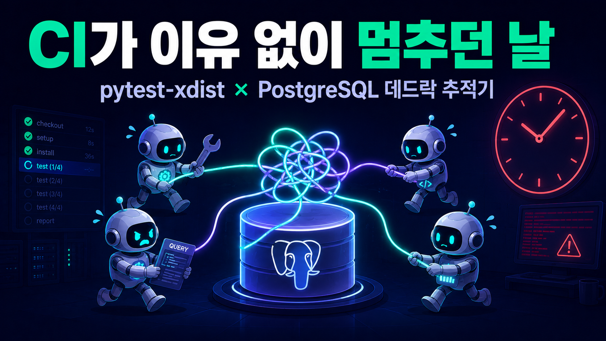

# pytest-xdist CI가 이유 없이 멈추던 날: PostgreSQL 데드락 추적기



## CI가 실패하는 게 아니라, 멈춘다

어느 날부터 CI가 이상해졌습니다. 테스트가 실패하는 게 아니라 **멈췄습니다**. 로그는 어느 순간 더 이상 올라오지 않고, 20분쯤 지나면 GitHub Actions가 잡을 강제 종료합니다. 실패한 테스트 이름이라도 찍히면 고칠 텐데, 마지막 줄은 그냥 평범하게 통과한 테스트였습니다.

우리 CI는 pytest-xdist로 테스트를 병렬 실행합니다. 4개 그룹으로 샤딩하고, 각 그룹 안에서 다시 워커를 병렬로 돌립니다:

```bash
# .github/workflows/test.yml
uv run pytest tests/ -m "not live" \
  --splits 4 --group ${{ matrix.group }} \
  -n auto --dist=loadfile \
  -o faulthandler_timeout=120 \
  --cov=app --cov-report=xml
```

`--dist=loadfile`은 **파일 단위**로 테스트를 워커에 분배하는 옵션입니다. 같은 파일의 테스트는 같은 워커에서 순서대로 돌고, 다른 파일은 다른 워커에서 동시에 돕니다. 그리고 이 워커들은 전부 **하나의 PostgreSQL test_db를 공유**합니다.

멈춤은 간헐적이었습니다. 열 번 돌리면 한두 번. 그것도 항상 같은 테스트가 아니라, 그날그날 다른 파일에서 멈췄습니다. 공통점이 하나 있긴 했습니다. 멈추는 샤드는 항상 DB를 만지는 테스트가 몰린 샤드였다는 점입니다.

## 첫 번째 오진: "내 PR 탓이 아닌데"

처음 이 증상을 만난 건 전혀 무관한 기능 PR에서였습니다. 브로커 API 재시도 로직을 고친 PR인데, DB 스키마 근처에는 손도 안 댔습니다. 그런데 CI가 빨간불입니다.

diff를 아무리 봐도 원인이 없으니, 흔한 처방을 했습니다. **rebase 후 재실행**. 그러면 신기하게도 green이 됩니다. "플레이크였네" 하고 머지했습니다.

나중에 알았지만, rebase가 통과시킨 데는 이유가 있었습니다. rebase를 하면 커밋이 바뀌고, 테스트 파일 목록이나 소요 시간 기록이 미묘하게 달라지면서 **loadfile 분배가 바뀝니다**. 문제의 테스트 파일 조합이 다른 워커로 흩어지면 락 경합의 타이밍이 어긋나서 우연히 통과하는 겁니다. 즉 rebase-green은 수리가 아니라 **주사위를 다시 굴린 것**이었습니다. 그리고 이 "다시 굴리면 통과"라는 경험이 쌓이면서, 팀 전체(사실은 저 혼자지만)가 이 플레이크를 몇 주 동안 방치하게 됐습니다. 이게 이 버그의 가장 고약한 점이었습니다. 재현이 안 되는 게 아니라, **회피가 너무 쉬워서 추적할 동기가 생기지 않았습니다.**

## 두 번째 오진: 이미 고쳤다고 믿었던 락

사실 이 데드락과의 첫 조우는 더 전이었습니다. 그때는 원인 테이블이 명확해 보였습니다. `db_session` 픽스처와 investment-reports 헬퍼 픽스처가 **둘 다** `review.*` 테이블에 DDL을 날리고 있었고, 두 워커가 동시에 ALTER와 CASCADE TRUNCATE를 실행하면 AccessExclusiveLock에서 충돌했습니다.

그래서 그때는 PostgreSQL advisory lock으로 두 픽스처의 DDL 구간을 직렬화하는 패치를 넣었습니다. 당시 `db_session` 픽스처의 주석에는 이렇게 적혀 있었습니다:

```python
# 수정 전의 db_session 픽스처 (요약)
@pytest_asyncio.fixture
async def db_session():
    """... 두 픽스처가 review.* 테이블에 DDL을 실행하므로,
    같은 advisory lock으로 DDL 구간을 직렬화한다.
    락은 yield 전에 해제해서 테스트 본문은 병렬로 돈다."""
    async with engine.connect() as guard:
        await guard.execute(
            text("SELECT pg_advisory_lock(CAST(:lock_id AS bigint))"),
            {"lock_id": INVESTMENT_REPORTS_TEST_LOCK_ID},
        )
        try:
            async with engine.begin() as conn:
                for schema in ["paper", "research", "review"]:
                    await conn.execute(text(f"CREATE SCHEMA IF NOT EXISTS {schema}"))
                await conn.run_sync(Base.metadata.create_all)
                # ... 이후 수백 줄의 ALTER TABLE / ADD CONSTRAINT ...
```

이 패치 후 한동안 조용했기 때문에 "고쳤다"고 믿었습니다. 하지만 간헐적 멈춤은 계속됐습니다. 락까지 걸었는데 왜?

## 재현: 로그에서 잡은 결정적 단서

돌파구는 `faulthandler_timeout=120` 옵션이었습니다. pytest는 테스트 하나가 120초를 넘기면 모든 스레드의 스택을 덤프합니다. 멈춘 잡의 로그를 끝까지 뒤지니, 한 워커는 `conn.run_sync(Base.metadata.create_all)` 안에서, 다른 워커는 평범한 `SELECT` 안에서 각각 얼어 있었습니다. 그리고 운 좋게 데드락 검출기가 작동한 실행에서는 이런 에러가 남아 있었습니다:

```
sqlalchemy.exc.DBAPIError: (sqlalchemy.dialects.postgresql.asyncpg.exceptions.DeadlockDetectedError)
deadlock detected
DETAIL:  Process 51234 waits for AccessExclusiveLock on relation ...;
         blocked by process 51267.
         Process 51267 waits for AccessShareLock on relation ...;
         blocked by process 51234.
```

SQLSTATE 40P01, PostgreSQL의 데드락입니다. 그림이 그려졌습니다.

- 워커 A는 픽스처 초기화 중입니다. `create_all`과 ALTER TABLE을 트랜잭션 하나로 묶어 실행하면서, 테이블을 하나씩 순회하며 **AccessExclusiveLock**을 수집합니다.
- 워커 B는 이미 테스트 본문을 실행 중입니다. 트랜잭션 안에서 여러 테이블에 SELECT를 날리며 **AccessShareLock**을 잡아둔 상태입니다.
- A는 B가 이미 읽은 테이블의 배타 락을 기다리고, B의 다음 SELECT는 A가 이미 배타 락을 잡은(혹은 대기열에 올린) 테이블을 기다립니다. 서로 반대 순서로 락을 기다리는 사슬, 교과서적인 데드락입니다.

PostgreSQL이 사이클을 검출하면 한쪽을 죽여서 40P01 에러라도 남지만, 락 대기가 사이클이 아니라 긴 **사슬**로 늘어지면 에러도 없이 전원이 서로를 기다립니다. 이게 "실패가 아니라 멈춤"의 정체였습니다.

그럼 advisory lock은 왜 소용이 없었을까요? 그 락은 **DDL을 실행하는 두 픽스처끼리만** 직렬화했기 때문입니다. 데드락의 반대편 당사자는 픽스처가 아니라 **다른 워커의 테스트 본문 SELECT**였습니다. 테스트 본문은 advisory lock을 잡지 않으니, DDL과 SELECT는 여전히 자유롭게 겹칠 수 있었습니다.

## 근본원인: DDL이 "언제든" 실행될 수 있는 구조

정리하면 근본원인은 데드락 자체가 아니라, 그 앞 단계에 있었습니다.

`db_session`은 **함수 스코프** 픽스처였습니다. 즉 이 픽스처를 쓰는 테스트가 시작될 때마다 스키마 준비 DDL이 다시 실행됐습니다. 물론 `CREATE SCHEMA IF NOT EXISTS`나 `create_all`은 두 번째부터는 사실상 no-op이지만, **no-op이라도 카탈로그를 확인하려면 락은 잡아야 합니다**. 세션 중반, 다른 워커들이 한창 테스트를 돌리는 와중에 DDL 락 수집이 끼어드는 구조 자체가 문제였습니다.

여기에 DDL이 두 픽스처에 **중복 정의**되어 있어서 유지보수 중에 서로 어긋나기까지 했으니, 고칠 방향은 명확했습니다.

1. 스키마 DDL을 한 곳으로 모은다.
2. 그 DDL을 **모든 워커의 첫 테스트가 시작되기 전에, 딱 한 번만** 실행한다.
3. 실행이 끝나기 전에는 어떤 워커도 테스트 본문에 진입하지 못하게 **배리어**를 친다.

## 수정: advisory lock + sentinel 테이블 배리어

핵심은 session 스코프 autouse 픽스처입니다. xdist의 각 워커는 독립 프로세스라서 서로 메모리를 공유하지 않지만, 모든 워커가 같은 PostgreSQL을 바라본다는 점을 역이용했습니다. **조율 채널로 DB 자체를 쓰는 겁니다.**

```python
# tests/conftest.py
@pytest_asyncio.fixture(scope="session", autouse=True)
async def _bootstrap_test_schema():
    """테스트 스키마를 어떤 테스트 본문보다 먼저, 정확히 한 번 적용한다.

    xdist --dist=loadfile 아래에서 모든 워커는 첫 테스트 전에 이
    session 스코프 autouse 픽스처를 통과한다. advisory lock을 먼저
    잡은 워커가 전체 DDL을 실행하는 동안 나머지 워커는 락에서 대기하고
    (배리어), 이후 진입한 워커는 content-hash sentinel을 보고 DDL을
    전부 건너뛴다. 결과: 스키마 DDL(AccessExclusive)이 다른 워커의
    테스트 본문 SELECT와 절대 겹치지 않는다."""
    wanted = schema_content_hash()

    async def _bootstrap_once() -> None:
        async with engine.connect() as guard:
            await guard.execute(
                text("SELECT pg_advisory_lock(CAST(:lock_id AS bigint))"),
                {"lock_id": INVESTMENT_REPORTS_TEST_LOCK_ID},
            )
            try:
                async with engine.begin() as conn:
                    await conn.execute(
                        text(
                            "CREATE TABLE IF NOT EXISTS public._pytest_schema_ready ("
                            "content_hash TEXT PRIMARY KEY, "
                            "applied_at TIMESTAMPTZ NOT NULL DEFAULT now())"
                        )
                    )
                    already = (
                        await conn.execute(
                            text(
                                "SELECT 1 FROM public._pytest_schema_ready "
                                "WHERE content_hash = :h"
                            ),
                            {"h": wanted},
                        )
                    ).first()
                    if already:
                        return
                    await apply_test_schema(conn)
                    await conn.execute(text("DELETE FROM public._pytest_schema_ready"))
                    await conn.execute(
                        text(
                            "INSERT INTO public._pytest_schema_ready (content_hash) "
                            "VALUES (:h)"
                        ),
                        {"h": wanted},
                    )
            finally:
                await guard.execute(
                    text("SELECT pg_advisory_unlock(CAST(:lock_id AS bigint))"),
                    {"lock_id": INVESTMENT_REPORTS_TEST_LOCK_ID},
                )

    await run_with_deadlock_retry(_bootstrap_once)
    yield
```


*배리어 동작 순서. 락을 먼저 잡은 워커 하나만 DDL을 실행하고, 나머지는 sentinel 확인 후 곧장 통과합니다.*

동작을 풀어 쓰면 이렇습니다.

- **advisory lock이 배리어 역할을 합니다.** 첫 워커가 락을 잡고 DDL을 실행하는 동안, 나머지 워커는 자기 첫 테스트를 시작하지 못하고 락에서 대기합니다. DDL이 도는 동안 테스트 본문 SELECT가 존재할 수 없으니, 데드락의 한쪽 당사자가 아예 사라집니다.
- **sentinel 테이블이 "완료" 신호입니다.** DDL을 끝낸 워커가 `_pytest_schema_ready`에 행을 남기면, 뒤이어 락을 잡은 워커들은 그 행을 보고 DDL을 통째로 건너뜁니다.
- **sentinel의 키는 DDL 내용의 해시입니다.** 로컬에서는 test_db를 매번 지우지 않고 재사용하는데, 스키마 DDL이 바뀌면 해시가 바뀌어 정확히 한 번 재부트스트랩됩니다. 반대로 DDL이 그대로면 로컬에서 몇 번을 돌려도 no-op입니다.

```python
# tests/_schema_bootstrap.py
def schema_content_hash() -> str:
    """부트스트랩 버전 + DDL 튜플의 SHA256 hex."""
    payload = f"{SCHEMA_BOOTSTRAP_VERSION}\n" + "\n".join(_DDL_STATEMENTS)
    return hashlib.sha256(payload.encode("utf-8")).hexdigest()
```

두 픽스처에 중복돼 있던 DDL은 `tests/_schema_bootstrap.py`의 `apply_test_schema()` 하나로 합쳤습니다. 스키마 생성, `create_all`, 수백 줄의 멱등 ALTER/CONSTRAINT가 전부 이 파일로 모였고, `db_session`은 이렇게 홀쭉해졌습니다:

```python
@pytest_asyncio.fixture
async def db_session():
    """공유 test_db에 대한 async 세션.

    스키마는 session 스코프 배리어가 소유한다. 이 픽스처는 DDL을 전혀
    실행하지 않는다 — 바로 그 DDL이 다른 xdist 워커의 테스트 본문과
    겹쳐 데드락을 일으키던 부분이다."""
    async with AsyncSessionLocal() as session:
        yield session
```

## 남은 구멍: TRUNCATE를 위한 재시도 버퍼

배리어로 스키마 DDL은 치웠지만, 테스트 뒷정리용 `TRUNCATE ... CASCADE`는 여전히 세션 중반에 실행됩니다. TRUNCATE도 AccessExclusiveLock을 잡기 때문에 이론상 락 순서 경합에서 데드락 피해자로 지목될 수 있습니다. 다행히 이런 정리 작업은 멱등이라서, 롤백하고 다시 시도하면 그만입니다. 그래서 얇은 재시도 헬퍼를 하나 만들었습니다:

```python
# tests/_db_retry.py
def _is_deadlock(exc: DBAPIError) -> bool:
    return "deadlock" in str(exc).lower()


async def run_with_deadlock_retry(
    op, *, rollback=None, attempts: int = 6, base_delay: float = 0.05,
):
    """PostgreSQL 데드락(SQLSTATE 40P01)에 한해서만 op를 재시도한다.

    데드락이 아닌 DBAPIError는 즉시 다시 던진다. 재시도 사이에는
    rollback을 호출하고 base_delay * 2**n 으로 백오프한다."""
    last: DBAPIError | None = None
    for n in range(attempts):
        try:
            return await op()
        except DBAPIError as exc:
            if not _is_deadlock(exc):
                raise
            last = exc
            if rollback is not None:
                await rollback()
            if n < attempts - 1 and base_delay:
                await asyncio.sleep(base_delay * (2**n))
    raise last
```

중요한 건 **데드락일 때만** 재시도한다는 점입니다. unique 제약 위반 같은 진짜 버그까지 재시도로 덮어버리면, 플레이크를 고치려다 새 플레이크 은폐 장치를 만드는 꼴이 됩니다.

## 검증: 수리했다는 증거 남기기

이 버그의 교훈이 "재발 안 하면 통과가 아니다"였으니, 수리 증거도 코드로 남겼습니다. `tests/infra/test_schema_barrier.py`에 회귀 테스트를 추가했습니다.

- 재시도 버퍼가 가짜 데드락은 흡수하고, 데드락이 아닌 에러는 재시도 없이 즉시 던지는지
- `apply_test_schema`가 멱등인지 (두 번 실행해도 결과 동일)
- 배리어가 sentinel을 남겨서 뒤따르는 워커가 DDL을 건너뛰는지
- `db_session`과 헬퍼 픽스처의 소스에 DDL이 다시 스며들지 않았는지 (`inspect.getsource`로 픽스처 소스를 검사합니다)
- 그리고 실제 공유 DB에 여러 태스크가 동시에 경합하는 동시성 스트레스 테스트

```python
@pytest.mark.asyncio
async def test_retry_reraises_non_deadlock_immediately():
    calls = {"n": 0}

    async def op():
        calls["n"] += 1
        raise _FakeOtherDBAPIError()

    with pytest.raises(DBAPIError):
        await run_with_deadlock_retry(op, base_delay=0.0)
    assert calls["n"] == 1  # 데드락이 아니면 재시도하지 않는다
```

수정은 [PR #1441](https://github.com/mgh3326/auto_trader/pull/1441)로 머지됐습니다. 효과는 머지 직후부터 다른 PR들에서 나타났습니다. 그동안 "diff와 무관한 CI red → rebase → 재실행"으로 낭비하던 사이클이 사라졌습니다. 실제로 이 수정 전에는 무관한 기능 PR 두 건이 이 플레이크 때문에 CI red를 맞고 rebase로 우회한 기록이 있는데, 이후로는 같은 유형의 멈춤이 재발하지 않았습니다.

## 배운 것

**플레이크는 "재발 안 하면 통과"가 아닙니다.** 간헐 실패는 낮은 확률로 성립하는 레이스 컨디션이고, 확률이 낮다는 건 고쳐졌다는 뜻이 아니라 관측이 어렵다는 뜻일 뿐입니다. 이번 건은 확률을 낮춘 첫 패치(픽스처 간 advisory lock)를 수리로 착각한 것이 추적을 몇 주 늦췄습니다.

**rebase-green은 수리 증거가 아닙니다.** 병렬 테스트에서 rebase는 테스트 분배를 뒤섞는 행위라서, 타이밍성 버그를 일시적으로 숨기는 데 오히려 최적입니다. rebase로 통과한 빨간불이 있었다면 그건 "해결"이 아니라 "미해결 버그가 하나 있다"는 기록으로 남겨야 합니다.

**병렬 테스트에서 세션 초기화는 명시적 배리어가 필요합니다.** "멱등이니까 아무 때나 실행해도 된다"는 논리는 락 관점에서는 성립하지 않습니다. no-op DDL도 락은 잡습니다. 워커들이 공유 자원을 초기화해야 한다면, 초기화는 정확히 한 번·모든 작업 시작 전이라는 순서를 코드로 강제해야 합니다. 그리고 xdist처럼 워커가 프로세스로 분리된 환경에서는, 어차피 모두가 공유하는 DB가 가장 믿을 만한 조율 채널입니다. advisory lock이 배리어가 되고, sentinel 테이블이 완료 플래그가 됩니다.

덤으로 하나 더. 이 작업 이후 스키마 DDL의 단일 소스가 생기면서, 새 테이블을 추가할 때 "어느 픽스처에 DDL을 넣지?"라는 고민 자체가 사라졌습니다. 데드락을 잡으려고 시작한 리팩터링이 테스트 인프라의 구조 개선으로 끝난 셈입니다.

---

**참고 자료:**
- [pytest-xdist Documentation — 분배 모드(loadfile 등)](https://pytest-xdist.readthedocs.io/en/stable/distribution.html)
- [PostgreSQL Advisory Locks](https://www.postgresql.org/docs/current/explicit-locking.html#ADVISORY-LOCKS)
- [PostgreSQL Deadlocks](https://www.postgresql.org/docs/current/explicit-locking.html#LOCKING-DEADLOCKS)
- [전체 프로젝트 코드 (GitHub)](https://github.com/mgh3326/auto_trader)
- [PR #1441: xdist DDL-vs-SELECT 데드락 근본 수정 (배리어 + retry)](https://github.com/mgh3326/auto_trader/pull/1441)

---

> 이 글은 **개발 인프라 개선 시리즈**의 **Infra-6편**입니다.
>
> **개발 인프라 개선 시리즈:**
> - [Infra-1편: Poetry에서 UV로 마이그레이션](https://mgh3326.tistory.com/231)
> - [Infra-2편: Python 3.13 업그레이드](https://mgh3326.tistory.com/236)
> - [Infra-3편: Python 3.14 업그레이드](https://mgh3326.tistory.com/239)
> - [Infra-4편: Ruff + Pyright 마이그레이션](https://mgh3326.tistory.com/241)
> - [Infra-5편: OpenClaw 통합](https://mgh3326.tistory.com/244)
> - **Infra-6편: pytest-xdist × PostgreSQL 데드락 추적기** ← 현재 글
