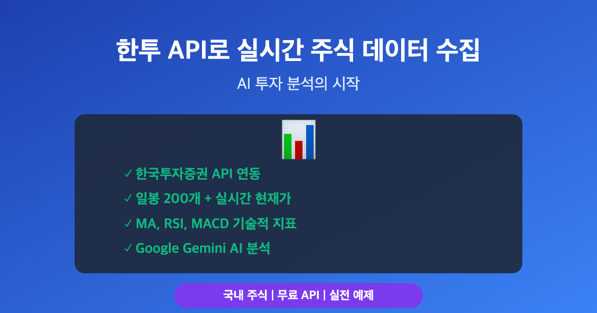

# 한투 API로 실시간 주식 데이터 수집하기: AI 투자 분석의 시작



> 이 글은 AI 기반 자동매매 시스템 시리즈의 **1편**입니다.
>
> **전체 시리즈:**
> - **1편: 한투 API로 실시간 주식 데이터 수집하기** ← 현재 글
> - [2편: yfinance로 애플·테슬라 분석하기](https://mgh3326.tistory.com/228)
> - [3편: Upbit으로 비트코인 24시간 분석하기](https://mgh3326.tistory.com/229)
> - [4편: AI 분석 결과 DB에 저장하기](https://mgh3326.tistory.com/230)

## 들어가며

주식 투자에서 데이터는 필수입니다. 하지만 국내 주식의 실시간 데이터를 무료로 쉽게 구할 수 있는 방법은 많지 않죠. 이번 글에서는 **한국투자증권(한투) API**를 사용하여 실시간 주식 데이터를 수집하고, AI가 이해할 수 있는 형태로 가공하는 방법을 알아보겠습니다. 삼성전자를 실제로 분석하면서 AI 투자 분석 시스템의 첫 걸음을 시작해봅시다.


*KIS API를 통한 주식 데이터 수집 및 AI 분석 프로세스*

## 왜 KIS API인가?

국내 주식 데이터는 해외 주식과 달리 쉽게 구할 수 있는 무료 API가 많지 않습니다. KIS(한국투자증권) API는:
- **무료로 사용 가능** (계좌 개설 후 API 신청)
- 실시간 현재가, 일봉, 분봉 데이터 제공
- 거래량, 시가총액 등 기본 정보 포함
- 실전/모의 투자 환경 모두 지원

## 1. KIS API 계정 설정

### 1-1. API 키 발급

1. 한국투자증권 계좌 개설
2. [KIS Developers 사이트](https://apiportal.koreainvestment.com/) 접속
3. 앱 등록 후 `APP_KEY`와 `APP_SECRET` 발급
4. 환경 변수 설정:

```bash
# .env 파일
KIS_APP_KEY=your_app_key
KIS_APP_SECRET=your_app_secret
```

### 1-2. 토큰 관리

KIS API는 OAuth 2.0 방식으로 토큰을 발급받아야 합니다. 토큰은 **약 1시간 동안 유효**하며, 만료 시 재발급이 필요합니다.

```python
import httpx

BASE = "https://openapi.koreainvestment.com:9443"

async def fetch_token(app_key: str, app_secret: str) -> str:
    """KIS API 토큰 발급"""
    async with httpx.AsyncClient() as client:
        response = await client.post(
            f"{BASE}/oauth2/token",
            data={
                "grant_type": "client_credentials",
                "appkey": app_key,
                "appsecret": app_secret,
            },
            timeout=5,
        )
    result = response.json()
    return result["access_token"]
```

**Tip**: Redis를 사용하여 토큰을 캐싱하면 여러 프로세스에서 동일한 토큰을 공유할 수 있어 효율적입니다.

## 2. 주식 데이터 수집

### 2-1. 일봉 데이터 가져오기

KIS API의 `inquire-daily-itemchartprice` 엔드포인트를 사용하여 과거 일봉 데이터를 가져올 수 있습니다.

```python
async def fetch_daily_ohlcv(stock_code: str, days: int = 200) -> pd.DataFrame:
    """
    국내 주식 일봉 데이터 조회

    Args:
        stock_code: 6자리 종목코드 (예: "005930" - 삼성전자)
        days: 조회할 일수 (최대 200일)

    Returns:
        DataFrame with columns: date, open, high, low, close, volume
    """
    await ensure_token()

    url = f"{BASE}/uapi/domestic-stock/v1/quotations/inquire-daily-itemchartprice"
    headers = {
        "authorization": f"Bearer {access_token}",
        "appkey": KIS_APP_KEY,
        "appsecret": KIS_APP_SECRET,
        "tr_id": "FHKST03010100",
        "custtype": "P",
    }
    params = {
        "FID_COND_MRKT_DIV_CODE": "J",  # J: 전체(코스피+코스닥)
        "FID_INPUT_ISCD": stock_code,
        "FID_INPUT_DATE_1": "",  # 시작일 (빈 값이면 오늘부터)
        "FID_INPUT_DATE_2": "",  # 종료일
        "FID_PERIOD_DIV_CODE": "D",  # D: 일봉
    }

    async with httpx.AsyncClient() as client:
        response = await client.get(url, headers=headers, params=params)

    data = response.json()
    if data["rt_cd"] != "0":
        raise RuntimeError(f"API 오류: {data['msg1']}")

    # 응답 데이터를 DataFrame으로 변환
    output = data["output2"]
    df = pd.DataFrame(output)
    df.columns = ["date", "open", "high", "low", "close", "volume", "value"]

    # 데이터 타입 변환
    df["date"] = pd.to_datetime(df["date"])
    for col in ["open", "high", "low", "close", "volume"]:
        df[col] = pd.to_numeric(df[col], errors='coerce')

    return df.sort_values("date").reset_index(drop=True).tail(days)
```

### 2-2. 현재가 정보 가져오기

실시간 현재가는 `inquire-price` 엔드포인트를 사용합니다.

```python
async def fetch_current_price(stock_code: str) -> pd.DataFrame:
    """
    국내 주식 현재가 조회

    Returns:
        DataFrame with 1 row: date, open, high, low, close, volume
    """
    await ensure_token()

    url = f"{BASE}/uapi/domestic-stock/v1/quotations/inquire-price"
    headers = {
        "authorization": f"Bearer {access_token}",
        "appkey": KIS_APP_KEY,
        "appsecret": KIS_APP_SECRET,
        "tr_id": "FHKST01010100",
        "custtype": "P",
    }
    params = {
        "FID_COND_MRKT_DIV_CODE": "J",
        "FID_INPUT_ISCD": stock_code,
    }

    async with httpx.AsyncClient() as client:
        response = await client.get(url, headers=headers, params=params)

    data = response.json()
    output = data["output"]

    # 현재가 데이터를 DataFrame으로 변환
    current_data = {
        "date": pd.Timestamp.now().normalize(),
        "open": float(output["stck_oprc"]),
        "high": float(output["stck_hgpr"]),
        "low": float(output["stck_lwpr"]),
        "close": float(output["stck_prpr"]),  # 현재가
        "volume": float(output["acml_vol"]),  # 누적 거래량
    }

    return pd.DataFrame([current_data])
```

### 2-3. 기본 정보 가져오기 (시가총액, PER 등)

```python
async def fetch_fundamental_info(stock_code: str) -> dict:
    """
    종목 기본 정보 조회 (시가총액, PER, PBR 등)
    """
    # inquire-price API에서 함께 제공
    # ... (위의 fetch_current_price에서 output 딕셔너리 활용)

    return {
        "시가총액": output.get("hts_avls", ""),  # 시가총액 (억원)
        "PER": output.get("per", ""),
        "PBR": output.get("pbr", ""),
        "52주최고가": output.get("w52_hgpr", ""),
        "52주최저가": output.get("w52_lwpr", ""),
        "상장주식수": output.get("lstn_stcn", ""),
    }
```

## 3. 데이터 병합 및 전처리

일봉 데이터와 현재가를 병합하여 최신 데이터셋을 만듭니다.

```python
def merge_historical_and_current(
    df_historical: pd.DataFrame,
    df_current: pd.DataFrame
) -> pd.DataFrame:
    """
    과거 데이터와 현재 데이터를 병합

    - 같은 날짜가 있으면 현재가로 덮어쓰기
    - 날짜순 정렬
    """
    return (
        pd.concat([df_historical, df_current.reset_index(drop=True)], ignore_index=True)
        .sort_values("date")
        .drop_duplicates(subset=["date"], keep="last")  # 중복 제거
        .reset_index(drop=True)
    )
```

## 4. 기술적 지표 추가

AI가 분석하기 쉽도록 이동평균선(MA), RSI, MACD 등의 기술적 지표를 추가합니다.

```python
import ta  # pip install ta

def add_indicators(df: pd.DataFrame) -> pd.DataFrame:
    """기술적 지표 추가"""
    df = df.copy()

    # 이동평균선 (5, 20, 60, 120, 200일)
    for window in [5, 20, 60, 120, 200]:
        df[f"ma{window}"] = df["close"].rolling(window=window).mean()

    # RSI (14일)
    df["rsi14"] = ta.momentum.RSIIndicator(df["close"], window=14).rsi()

    # MACD
    macd = ta.trend.MACD(df["close"])
    df["macd"] = macd.macd()
    df["macd_signal"] = macd.macd_signal()
    df["macd_diff"] = macd.macd_diff()

    # 볼린저 밴드
    bb = ta.volatility.BollingerBands(df["close"])
    df["bb_high"] = bb.bollinger_hband()
    df["bb_mid"] = bb.bollinger_mavg()
    df["bb_low"] = bb.bollinger_lband()
    df["bb_width"] = bb.bollinger_wband()

    # 스토캐스틱
    stoch = ta.momentum.StochasticOscillator(df["high"], df["low"], df["close"])
    df["stoch_k"] = stoch.stoch()
    df["stoch_d"] = stoch.stoch_signal()

    return df
```

## 5. AI 프롬프트 생성

수집한 데이터를 AI가 이해하기 쉬운 텍스트 형식으로 변환합니다. 이것이 이 글의 핵심입니다!


*AI 분석용 프롬프트의 7가지 구성 요소*

```python
def build_prompt(df: pd.DataFrame, stock_code: str, stock_name: str,
                 fundamental_info: dict = None) -> str:
    """
    AI 분석을 위한 프롬프트 생성

    핵심 아이디어:
    - 기술적 지표 + 기본 정보를 구조화된 텍스트로 변환
    - AI가 쉽게 파싱하고 분석할 수 있는 형식
    """
    # 1. 기술적 지표 계산
    df = add_indicators(df).sort_values("date").reset_index(drop=True)

    latest = df.iloc[-1]     # 오늘
    yesterday = df.iloc[-2]  # 어제

    # 2. 전일 대비 계산
    price_diff = latest["close"] - yesterday["close"]
    price_pct = (price_diff / yesterday["close"]) * 100
    vol_pct = ((latest["volume"] - yesterday["volume"]) / yesterday["volume"]) * 100

    # 3. 기술적 지표 요약 (한 줄로)
    tech_summary = (
        f"MACD 히스토 {latest.macd_diff:+.2f}, "
        f"RSI14 {latest.rsi14:.1f}, "
        f"BB폭 {(latest.bb_width / latest.close) * 100:.1f}%, "
        f"Stoch %K {latest.stoch_k:.1f}"
    )

    # 4. 이동평균선 정리
    ma_5 = latest["ma5"]
    ma_20 = latest["ma20"]
    ma_60 = latest["ma60"]
    ma_120 = latest["ma120"]
    ma_200 = latest["ma200"]

    # 5. 기본 정보 섹션
    info_section = ""
    if fundamental_info:
        info_section = "\n[기본 정보]\n"
        for key, value in fundamental_info.items():
            if value:
                info_section += f"- {key}: {value}\n"

    # 6. 최근 10거래일 데이터
    recent_10 = df.iloc[-11:-1][["date", "close", "volume"]].to_string(
        index=False, header=False
    )

    # 7. 프롬프트 조합
    prompt = f"""
{stock_name}({stock_code}) (관측일 {latest.date.date()})
{tech_summary}{info_section}

[가격 지표]
- MA 5/20/60/120/200 : {ma_5:,.0f} / {ma_20:,.0f} / {ma_60:,.0f} / {ma_120:,.0f} / {ma_200:,.0f} ₩
- 현재가 : {latest.close:,.0f}₩
- 전일 대비 : {price_diff:+,.0f}₩ ({price_pct:+.2f}%)
- RSI(14) : {latest.rsi14:.1f}

[거래량 지표]
- 오늘 거래량 : {latest.volume:,.0f}주
- 전일 대비 : {vol_pct:+.2f}%

[최근 10거래일 (날짜·종가·거래량)]
{recent_10}

[질문]
위 정보만으로 오늘 매수·관망·매도 중 하나를 선택하고,
근거를 3줄 이내로 한글로 설명해 주세요.
적절한 매수가, 매도가, 매수 희망가, 매도 목표가도 제시해 주세요.
"""
    return prompt.strip()
```

### 프롬프트 구조 설명

1. **헤더**: 종목명, 종목코드, 관측일
2. **기술적 지표 요약**: MACD, RSI, 볼린저밴드, 스토캐스틱을 한 줄로
3. **기본 정보**: 시가총액, PER, 52주 최고/최저가 등
4. **가격 지표**: 이동평균선, 현재가, 전일대비
5. **거래량 지표**: 거래량 변화
6. **최근 추세**: 10거래일 데이터
7. **질문**: AI에게 구체적인 분석 요청

## 6. 실행 예시

이제 위에서 만든 함수들을 조합하여 실제로 실행해봅시다!

```python
import asyncio
import pandas as pd
from google import genai

async def main():
    # 삼성전자 데이터 수집
    stock_code = "005930"
    stock_name = "삼성전자"

    print("1단계: 데이터 수집 중...")
    # 1. 데이터 수집
    df_historical = await fetch_daily_ohlcv(stock_code, days=200)
    df_current = await fetch_current_price(stock_code)
    fundamental_info = await fetch_fundamental_info(stock_code)

    print(f"  - 일봉 데이터: {len(df_historical)}개")
    print(f"  - 현재가: {df_current.iloc[0]['close']:,.0f}원")

    # 2. 데이터 병합
    df_merged = merge_historical_and_current(df_historical, df_current)
    print(f"  - 병합 완료: {len(df_merged)}개 데이터")

    # 3. 프롬프트 생성
    print("\n2단계: AI 분석용 프롬프트 생성 중...")
    prompt = build_prompt(df_merged, stock_code, stock_name, fundamental_info)

    print("\n생성된 프롬프트:")
    print("=" * 80)
    print(prompt)
    print("=" * 80)

    # 4. AI 분석 (Google Gemini)
    print("\n3단계: Gemini AI에 분석 요청 중...")
    client = genai.Client(api_key="your_google_api_key")
    response = client.models.generate_content(
        model="gemini-2.5-flash",
        contents=prompt
    )

    print("\nGemini AI 분석 결과:")
    print("=" * 80)
    print(response.text)
    print("=" * 80)

if __name__ == "__main__":
    asyncio.run(main())
```

### 필요한 패키지 설치

```bash
pip install httpx pandas ta google-genai
```

### 실제 실행 결과:

#### 1단계: 데이터 수집
```
일봉 데이터: 200개
현재가: 97,500원
병합 완료: 200개 데이터
```

#### 2단계: 생성된 프롬프트

```
삼성전자(005930) (관측일 2025-10-21)
MACD 히스토 +663.76, RSI14 76.8, BB폭 26.5%, Stoch %K 86.3

[기본 정보]
- 종목코드: 005930
- 현재가: 97500
- 전일대비: -600
- 등락률: -0.61
- 거래량: 22742094
- 거래대금: 2246581402500
- 시가총액: 5771647
- 상장주수: 5919637922
- 52주최고: 99900
- 52주최저: 49900

[가격 지표]
- MA 5/20/60/120/200 : 97,240.00 / 88,500.00 / 76,561.67 / 67,606.67 / 62,801.00 ₩
- 현재가 : 97,500.0₩
- 전일 대비 : -600.00₩ (-0.61%)
- RSI(14)   : 76.8

[거래량 지표]
- VMA 5/20/60/120/200 : 22,450,766.00 / 24,440,683.15 / 19,229,506.38 / 18,081,448.31 / 18,522,441.00 vol
- 오늘 거래량 : 22,742,094주
- 전일 대비   : +29.29%

[최근 10거래일 (날짜·종가·거래량)]
2025-09-30  83900.0  16319061
2025-10-01  86000.0  22039361
2025-10-02  89000.0  49883028
2025-10-10  94400.0  35269748
2025-10-13  93300.0  23883308
2025-10-14  91600.0  35545235
2025-10-15  95000.0  21050111
2025-10-16  97700.0  28141060
2025-10-17  97900.0  22730809
2025-10-20  98100.0  17589756

[질문]
위 정보만으로 오늘 매수·관망·매도 중 하나를 선택하고,
근거를 3줄 이내로 한글로 설명해 주세요.
적절한 매수,매도 가격도 알려줘
매수 희망가, 매도 목표가도 부탁해
```

#### 3단계: Gemini AI 분석 결과

```
**선택:** 관망

**근거:**
1. 현재 주가는 52주 최고가에 근접해 있으며, 이동평균선이 정배열을 보여 강력한 상승 추세에 있음을 알 수 있습니다.
2. 하지만 RSI(76.8)와 Stoch %K(86.3)가 과매수 구간에 진입하여 단기 조정 가능성이 높습니다.
3. 과매수 지표 해소 및 가격 조정 시기를 기다려 더 나은 매수 시점을 모색하는 것이 유리합니다.

**매수 희망가:** 95,000원 (단기 조정 발생 시 지지선 확인 후)
**매도 목표가:** 100,000원 (52주 최고가 돌파 및 심리적 저항선 고려)
```


*삼성전자 주가 차트와 Gemini AI의 분석 결과 (2025.10.21 기준)*

### 분석 해석

Gemini AI는 삼성전자 데이터를 분석하여:
- **강세장 확인**: 이동평균선 정배열 (MA5 > MA20 > MA60 > MA120 > MA200)
- **과매수 경고**: RSI 76.8, Stoch %K 86.3으로 단기 조정 가능성
- **전략 제안**: 관망 후 95,000원 부근에서 매수, 100,000원 목표가 설정

실제로 주가가 10일 만에 83,900원 → 97,500원 (약 16% 상승)으로 급등한 상태라 과열 구간으로 판단한 것입니다.

## 7. 분봉 데이터 추가 (선택사항)

단기 트레이딩을 위해 60분/5분/1분 캔들 데이터도 추가할 수 있습니다.

```python
async def fetch_minute_candles(stock_code: str) -> dict:
    """
    분봉 데이터 수집 (60분, 5분, 1분)

    Returns:
        {"60min": df_60min, "5min": df_5min, "1min": df_1min}
    """
    minute_candles = {}

    # 60분 캔들 (최근 12개)
    df_60min = await fetch_minute_data(stock_code, time_unit="60", count=12)
    minute_candles["60min"] = df_60min

    # 5분 캔들 (최근 12개)
    df_5min = await fetch_minute_data(stock_code, time_unit="5", count=12)
    minute_candles["5min"] = df_5min

    # 1분 캔들 (최근 10개)
    df_1min = await fetch_minute_data(stock_code, time_unit="1", count=10)
    minute_candles["1min"] = df_1min

    return minute_candles
```

프롬프트에 분봉 정보를 추가하면:

```
[단기(분) 캔들 정보]
- 60분 캔들 (최근 12개, 시간·종가·거래량):
  (09:00 69,800 123,456, 10:00 70,100 145,678, ...)
- 5분 캔들 (최근 12개):
  (14:50 70,000 12,345, 14:55 70,200 15,678, ...)
- 1분 캔들 (최근 10개):
  (15:25:00 70,100 1,234, 15:26:00 70,050 2,345, ...)
```

## 8. 주의사항 및 팁

### API 호출 제한
- KIS API는 **분당 호출 횟수 제한**이 있습니다 (약 10-20회/분)
- 대량 종목 조회 시 `asyncio.sleep()`으로 딜레이 추가 권장

### 토큰 만료 처리
```python
# 토큰 만료 시 자동 재발급 예시
if data.get("msg_cd") == "EGW00123":  # 토큰 만료
    access_token = await fetch_token(KIS_APP_KEY, KIS_APP_SECRET)
    return await fetch_daily_ohlcv(stock_code)  # 재시도
```

### 종목 코드 조회
종목명으로 코드를 조회하려면 [KRX 종목코드 목록](http://data.krx.co.kr/contents/MDC/MDI/mdiLoader/index.cmd?menuId=MDC0201020101)에서 다운로드하거나, 증권사 API를 활용할 수 있습니다.

```python
# 주요 종목 코드 예시
STOCK_CODES = {
    "삼성전자": "005930",
    "SK하이닉스": "000660",
    "NAVER": "035420",
    "카카오": "035720",
    "LG에너지솔루션": "373220",
}

stock_code = STOCK_CODES.get("삼성전자")  # "005930"
```

## 마치며

이번 글에서는 KIS API를 활용하여:
1. 국내 주식 데이터 수집 (일봉, 현재가, 기본정보)
2. 기술적 지표 계산 (MA, RSI, MACD, BB, Stoch)
3. AI 분석용 프롬프트 생성
4. **실제 Gemini AI 분석 결과 확인**

까지 완료했습니다!

삼성전자 실제 데이터를 통해 AI가 어떻게 기술적 지표를 해석하고 투자 전략을 제안하는지 확인할 수 있었습니다. 특히 이동평균선 정배열로 상승 추세를 확인하면서도, 과매수 지표로 단기 조정 가능성을 경고하는 등 **복합적인 분석**을 수행하는 것을 볼 수 있었죠.

**핵심 포인트:**
- KIS API는 무료로 국내 주식 실시간 데이터 제공
- 기술적 지표를 활용하여 AI에게 구조화된 정보 전달
- Gemini는 과매수/과매도, 추세, 거래량을 종합하여 판단

**다음 편 예고**: 해외 주식도 분석해볼까요? 다음 글 [2편: yfinance로 애플·테슬라 분석하기](https://mgh3326.tistory.com/228)에서 글로벌 포트폴리오 분석 방법을 알아보겠습니다.

---

**참고 링크:**
- [KIS Developers 공식 문서](https://apiportal.koreainvestment.com/)
- [전체 프로젝트 코드 (GitHub)](https://github.com/mgh3326/auto_trader)
- [Google Gemini API 문서](https://ai.google.dev/)
