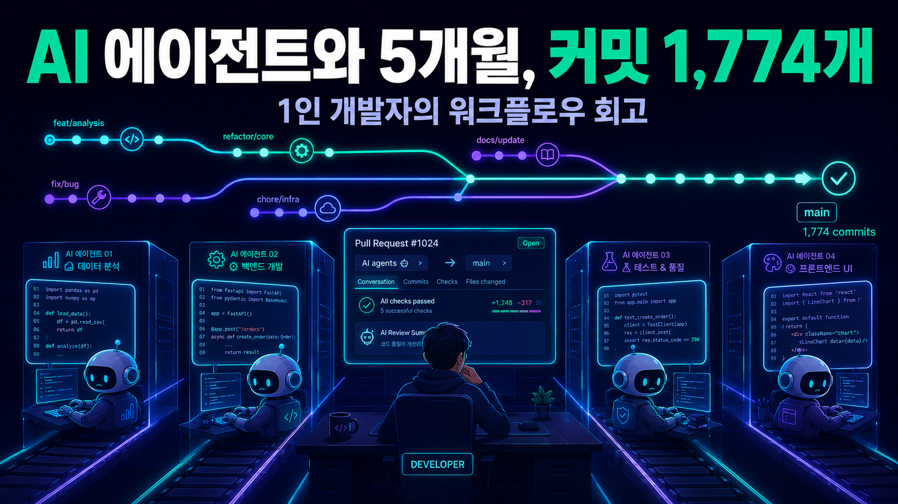
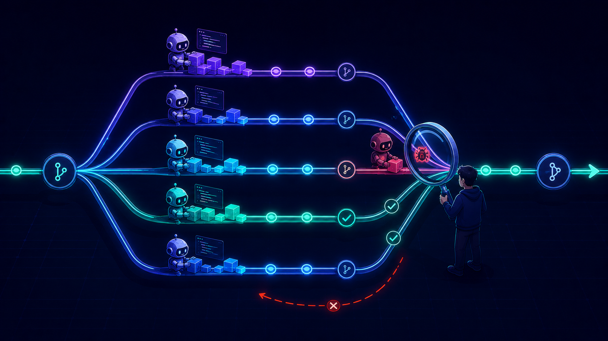

# AI 에이전트와 5개월, 커밋 1,774개: 1인 개발자의 워크플로우가 어떻게 바뀌었나



## 블로그를 쉬는 동안 무슨 일이 있었나

마지막 글을 올리고 블로그를 쉰 게 2026년 2월 초입니다.

그로부터 다섯 달 동안 이 저장소에는 커밋 1,774개가 쌓였습니다. 이슈로 세면 455개, 머지된 PR로 세면 1,000개가 넘습니다. 글을 쓰기 전에 실제로 세어 봤습니다.

```bash
$ git log --since=2026-02-04 --oneline | wc -l
1774

$ git log --since=2026-02-04 --oneline | grep -oE '[A-Z]+-[0-9]+' | sort -u | wc -l
455
```

달마다 나눠 보면 2월 196개, 3월 279개, 4월 230개, 5월 590개, 6월 336개입니다. 주말을 포함해 하루 평균 11커밋이 넘고, 가장 바빴던 5월에는 하루 19커밋꼴입니다.

커밋 타입으로 나눠 보면 feat 671개, fix 421개, refactor 79개, chore 68개, docs 62개, test 56개입니다. 새 기능과 버그 수정의 비율이 대략 3:2인데, 이 fix 421개 안에 이 글에서 다룰 이야기의 절반이 들어 있습니다. 그중 상당수가 "에이전트가 만들고, 다른 에이전트가 잡고, 사람이 승인한" 수정이기 때문입니다.

저는 회사를 다니는 1인 사이드 프로젝트 개발자입니다. 예전 기준으로 이 정도 작업량이면 몇 년치입니다. 실제로 이 시리즈의 1편부터 11편까지, 그러니까 프로젝트의 처음 몇 년 동안 쌓인 변화보다 최근 5개월의 변화가 더 큽니다. LLM 호출이 시스템 안에 남아 있던 구조를 통째로 뒤집었고, 실계좌 주문 경로에 체결 증거 게이트와 승인 해시를 깔았고, 매매 회고가 다음 판단에 자동으로 주입되는 학습 루프를 만들었고, 브로커를 두 개 더 붙였습니다. 어느 하나도 예전의 저라면 분기 단위 프로젝트였을 것들입니다.

물론 커밋 수는 허영 지표입니다. AI 에이전트가 만드는 커밋은 사람 커밋보다 잘게 쪼개지는 경향이 있고, 테스트와 문서가 후하게 딸려 옵니다. 같은 작업량이라도 커밋 수는 두세 배로 부풀 수 있습니다.

하지만 이슈 455개는 다릅니다. 이슈 하나하나가 "이 문제를 정의하고, 구현하고, 검증하고, 머지했다"는 완결 단위이고, 그중 상당수는 예전의 저라면 주말 하나를 통째로 썼을 크기입니다. 그게 다섯 달에 455개입니다.

이번 글은 시리즈의 번외편입니다. 특정 기능이 아니라 개발 방식 자체를 다룹니다. 어떻게 혼자서 이 속도가 가능했는지, 그리고 그 속도의 대가로 어떤 규율을 새로 배워야 했는지에 대한 회고입니다.

미리 말해 두면, 이 글은 특정 도구의 사용법 튜토리얼이 아닙니다. 어떤 코딩 에이전트를 쓰느냐보다, 에이전트와 일하는 프로세스를 어떻게 설계하느냐가 결과를 갈랐다는 게 다섯 달의 결론이기 때문입니다. 그래서 도구 이름보다 워크플로우의 구조를 중심으로 적습니다.

미리 결론을 말하면 이렇습니다. AI가 다 해주는 게 아닙니다. 코드를 쓰는 손은 빨라졌지만, **검증의 책임은 오히려 사람에게 더 무겁게 돌아옵니다.** 이 글의 나머지는 전부 그 한 문장에 대한 부연입니다.

## 사람의 일이 "코드 작성"에서 "작업 정의"로 옮겨갔다

가장 큰 변화는 제 하루에서 코드를 직접 타이핑하는 시간이 거의 사라졌다는 것입니다. 대신 그 시간은 이슈를 쓰는 데 들어갑니다.

지금 이 프로젝트에서 모든 작업은 이슈에서 시작합니다. 아무리 작은 버그 수정도 이슈를 먼저 만들고, 브랜치명에 이슈 ID가 들어가고, 커밋 메시지와 PR 제목이 그 이슈로 연결됩니다. 저장소의 개발 가이드 문서에 브랜치 네이밍 규칙이 이렇게 박혀 있습니다.

```
feature/<이슈ID>-<설명>     # 새 기능
fix/<이슈ID>-<설명>         # 버그 수정
chore/<설명>                # 유지보수
```

사람 팀에서도 흔한 규칙이지만, 에이전트와 일할 때 이 규칙의 의미가 달라집니다. 사람 팀에서 이슈는 "무엇을 할지 잊지 않기 위한 메모"에 가깝습니다. 에이전트와 일할 때 이슈는 **명세이자 계약**입니다. 에이전트는 이슈에 적힌 것을 하고, 적히지 않은 것은 자기 판단으로 채웁니다. 그 "자기 판단으로 채우는" 부분이 바로 사고가 나는 지점입니다.

그래서 이슈를 쓰는 방식이 바뀌었습니다. 예전에는 "매도 주문이 가끔 중복 전송됨. 고칠 것" 정도로 적었다면, 지금은 이슈 하나가 대략 이런 골격을 갖춥니다.

```
## 문제
어떤 상황에서 무엇이 잘못되는가 (재현 조건, 관측된 로그)

## 원인 가설
코드 어디를 의심하는가, 왜 그렇게 생각하는가

## 수용 기준
- 무엇이 확인되면 완료로 인정하는가
- 어떤 테스트가 새로 있어야 하는가

## 범위 밖 (하지 말 것)
- 이 작업에서 건드리지 않는 파일/경로
- 후속 이슈로 미루는 것
```

특히 마지막 항목이 중요합니다. 에이전트는 성실해서, 시키지 않은 주변 정리까지 해 오는 경우가 많습니다. 대부분은 고맙지만, 실제 돈이 나가는 주문 경로 근처에서는 "친절한 리팩토링"이 곧 리스크입니다. 그래서 이슈에 범위의 바깥 경계를 명시하는 습관이 생겼습니다. 수용 기준이 명확한 이슈는 검증도 명확해집니다. "완료됐다"는 에이전트의 주장을 수용 기준 목록과 대조하면 되기 때문입니다. 반대로 수용 기준이 흐린 이슈는 구현도 흐리게 나오고, 검증은 아예 불가능해집니다. 결과물의 품질이 이슈의 품질에서 이미 결정된다는 걸 다섯 달 내내 확인했습니다.

돌아보면 이건 주니어 개발자와 일하는 시니어의 기술과 정확히 같습니다. 차이가 있다면, 이 주니어는 지치지 않고, 동시에 여러 명이고, 제가 자는 동안에도 일한다는 점입니다.

그리고 사람 주니어와 달리 어제 한 실수를 오늘 기억하지 못한다는 점도 다릅니다. 세션이 끝나면 맥락이 사라지므로, 반복되는 실수는 사람을 교육해서가 아니라 **문서와 규칙에 고쳐 넣어서** 막아야 합니다. 저장소 루트에 있는 에이전트용 가이드 문서가 다섯 달 동안 계속 자란 이유입니다. 그 문서에는 "이 테이블에 직접 SQL을 쓰지 말 것", "이 함수는 반드시 이 서비스 레이어를 거칠 것", "이 API의 이 파라미터는 알려진 버그가 있음" 같은 문장이 쌓여 있는데, 하나하나가 과거에 실제로 났거나 날 뻔한 사고의 흔적입니다. 팀의 암묵지가 사람의 머리가 아니라 저장소에 축적되는 셈인데, 1인 개발자에게는 이게 오히려 장점이었습니다. 제 머릿속에만 있던 운영 지식이 강제로 문서화됐기 때문입니다.

## worktree로 병렬화: 저장소 하나, 작업 공간 여러 개

혼자서 에이전트 여러 세션을 굴리면 곧바로 부딪히는 문제가 있습니다. 세션 A가 기능을 구현하는 동안 세션 B가 버그를 고치려면, 같은 체크아웃 위에서는 서로의 변경이 뒤섞입니다. 브랜치를 나눠도 소용없습니다. 작업 트리는 하나뿐이라, 한 세션이 브랜치를 바꾸는 순간 다른 세션의 발밑이 통째로 바뀝니다.

해법은 git worktree였습니다. 정본(canonical) 저장소는 항상 main 브랜치에 고정해 두고, 이슈마다 별도의 worktree를 만들어 그 안에서만 작업합니다.

```bash
# 정본 저장소는 main 고정 — 여기서는 코드를 만지지 않는다
cd ~/work/auto_trader
git fetch --prune origin && git switch main && git pull --ff-only

# 이슈마다 격리된 worktree 생성
git worktree add ../auto_trader.<이슈ID> -b <브랜치명> origin/main

# 머지 후 정리
git worktree remove ../auto_trader.<이슈ID>
git branch -D <브랜치명>
```

이렇게 하면 디스크에 `auto_trader.이슈A`, `auto_trader.이슈B` 같은 디렉터리가 나란히 생기고, 각 에이전트 세션은 자기 worktree 안에서만 파일을 만집니다. git 히스토리는 공유하되 작업 트리는 격리되는 구조라, 세션끼리 충돌할 일이 없습니다.


*정본 저장소는 main에 고정, 이슈별 worktree에서 에이전트 세션들이 병렬 작업. 머지 후 worktree는 정리*

이 규칙도 저장소의 가이드 문서에 명문화되어 있습니다. 몇 가지만 옮기면 이렇습니다.

- 정본 저장소에서 feature 브랜치를 체크아웃하지 않는다.
- 머지된 브랜치 위에서 계속 커밋하지 않는다. 후속 작업은 항상 최신 origin/main 기준 새 브랜치로 시작한다.
- worktree를 재사용하기 전에 작업 트리가 깨끗한지 먼저 확인한다.

전부 한 번씩 데인 뒤에 추가된 것입니다. 특히 "머지된 브랜치 위에 계속 커밋"은 에이전트가 정말 자주 저지르는 실수입니다. 사람이라면 PR이 머지된 걸 보고 자연스럽게 새 브랜치를 파지만, 에이전트는 어제의 맥락을 모르니 어제의 worktree에서 그냥 이어서 일합니다. 규칙이 없으면 반드시 재발합니다.

병렬화의 실제 효용은 "구현 여러 개를 동시에"보다 **역할이 다른 세션을 동시에** 돌리는 데 있었습니다. 평일 저녁의 전형적인 그림은 이렇습니다. 한 세션은 새 기능을 구현하고 있고, 다른 세션은 어제 머지된 PR 묶음을 검증하고 있고, 또 다른 세션은 다음 이슈를 위한 코드 조사를 하고 있습니다. 저는 그 사이를 오가며 막힌 세션의 질문에 답하고, 끝난 세션의 결과를 읽고, 다음 이슈를 씁니다. 사람 혼자였다면 순차로 할 수밖에 없는 일들이 겹쳐서 흐릅니다. 5월에 커밋이 590개까지 치솟은 건 이 병렬 파이프라인이 자리 잡은 뒤입니다.

물론 공짜는 아닙니다. worktree가 늘어나면 디스크와 메모리를 먹고, 죽은 worktree와 머지된 지 오래된 브랜치가 쌓입니다. 결국 죽은 세션과 떠돌이 worktree를 걷어내는 정리 스크립트를 따로 만들어 주기적으로 돌리게 됐습니다. 병렬화의 운영 비용은 생각보다 실재합니다. 그리고 사람의 컨텍스트 스위칭 비용도 실재합니다. 세션을 다섯 개 띄운다고 생산성이 다섯 배가 되지는 않습니다. 제 경험상 의미 있게 관리할 수 있는 동시 세션은 두세 개가 상한이었고, 그 이상은 검증이 밀리기 시작하면서 오히려 전체 처리량이 떨어졌습니다.

감을 잡을 수 있게 평일 저녁 두어 시간의 흐름을 옮겨 보면 대략 이렇습니다.

```
21:00  낮에 적어 둔 이슈 2건을 각각 새 worktree의 세션에 배정
21:05  어제 올라온 PR 3건에 대해 적대 검증 세션 기동
21:10  ~ 21:50  다음 주 작업 후보를 조사 세션에 맡기고,
       그동안 리스크 높은 PR 1건은 직접 diff를 정독
21:50  검증 세션 보고서 도착 — 1건에서 테스트 갭 발견, 수정 지시
22:10  구현 세션 1건 완료 보고 — 수용 기준 대조 후 PR 생성 지시
22:30  검증 통과한 PR 2건 승인·머지, 나머지는 내일로
```

제가 하는 일의 대부분이 읽기, 판단, 지시라는 게 보일 겁니다. 코드 에디터보다 이슈 트래커와 PR 화면에 머무는 시간이 압도적으로 깁니다. 예전의 저라면 이 두 시간 동안 기능 하나의 절반을 짰을 텐데, 지금은 같은 시간에 서로 다른 작업 대여섯 개가 한 단계씩 전진합니다.

## 구현과 검증의 분리: 만든 세션을 믿지 않는다

이 워크플로우에서 제일 중요한 원칙을 하나만 꼽으라면 이것입니다. **구현한 세션이 "다 됐고 테스트도 통과합니다"라고 말해도, 그 말로 검증을 대신하지 않습니다.**

에이전트는 자기 결과물에 대해 놀랄 만큼 확신에 차 있습니다. 그리고 그 확신은 실제 품질과 별 상관이 없습니다. 잘된 구현도 확신에 차 있고, 전제부터 틀린 구현도 똑같이 확신에 차 있습니다. 확신의 톤으로는 둘을 구별할 수 없습니다.

그래서 정착한 패턴이 구현과 검증의 분리입니다. 한 세션(때로는 아예 다른 종류의 에이전트)이 구현하면, 맥락을 공유하지 않는 다른 세션에게 이렇게 시킵니다.

```
이 PR이 주장하는 내용이 실제로 동작하는지 적대적으로 검증하라.
- PR 설명의 주장을 그대로 믿지 말 것
- 각 테스트가 실제로 무엇을 증명하는지 확인할 것
- 테스트를 통과시키면서 기능은 동작하지 않는 시나리오를 찾을 것
- 가능하면 실제로 돌려서 관측할 것
```

검증 세션의 임무는 칭찬이 아니라 반증입니다. 그리고 검증 세션은 구현 세션의 사고 과정을 모르기 때문에, 구현 세션이 빠진 함정에 같이 빠지지 않습니다. 이게 핵심입니다.

이 적대 검증이 다섯 달 동안 여러 번 밥값을 했습니다. 대부분은 같은 부류의 문제였는데, 저는 이걸 **false-green**이라고 부릅니다. 테스트는 초록불인데 실제로는 동작하지 않는 상태입니다. 실제 사례 두 가지를 일반화해서 소개합니다.

**사례 1: 벽시계에 기대는 테스트.** 장 시작 전 시간대에 현재가가 전일 종가로 잘못 잡히는 문제를 고친 PR이 있었습니다. 구현도 맞고 테스트도 통과했습니다. 그런데 검증 세션이 파고들어 보니, 그 테스트는 실행하는 시각에 따라 검증 대상 로직이 아예 타지 않을 수 있었습니다. CI가 장중에 돌면 통과하고, 장외에 돌면 다른 분기로 빠져서 역시 통과합니다. 어느 쪽이든 초록불이지만, 후자는 아무것도 증명하지 않은 초록불입니다. 결국 테스트에 시각을 고정 주입하는 가드 커밋이 별도로 들어갔고, 이후 "시간이 개입하는 테스트는 반드시 now()를 주입받는다"는 규칙이 가이드 문서에 추가됐습니다. 이런 시한폭탄형 테스트는 이후에도 몇 번 더 잡혔습니다. 특정 날짜가 지나면 조용히 무의미해지는 신선도(freshness) 테스트 같은 것들입니다.

**사례 2: CI 설정이 실패를 가린 경우.** 어떤 PR의 CI가 초록불이었는데, 알고 보니 CI는 PR 브랜치 자체가 아니라 main과의 머지 결과물을 테스트하고 있었고, 거기에 fail-fast 설정이 겹치면서 진짜 실패가 앞선 무관한 실패에 가려 보고되지 않았습니다. PR은 초록불로 보이지만 그 초록불이 검증한 코드는 머지 후에야 존재할 코드였고, 심지어 그 검증조차 온전하지 않았던 겁니다. 이건 에이전트가 아니라 사람이 만들었어도 났을 사고지만, 에이전트 시대에는 치명도가 다릅니다. 코드 생산 속도가 10배가 되면, "초록불을 믿고 머지한다"는 관문의 신뢰도가 곧 시스템 전체의 신뢰도가 되기 때문입니다.

false-green의 반대편 문제도 있었습니다. **가짜 빨간불**입니다. 병렬 테스트 실행에서 테스트 DB를 공유하는 테스트들이 간헐적으로 데드락을 일으켜, 변경과 무관한 PR이 무작위로 빨간불을 받던 시기가 있었습니다. 이게 위험한 이유는 데드락 자체가 아니라 사람의 습관 때문입니다. "이거 또 그 플레이크네" 하고 재실행 버튼을 누르는 습관이 들면, 언젠가 진짜 실패도 재실행으로 넘기게 됩니다. 초록불의 신뢰도는 빨간불의 신뢰도와 같이 갑니다. 그래서 이 플레이크는 "가끔 재실행하면 되는 불편"이 아니라 최우선 수리 대상으로 다뤘고, 결국 테스트 격리 계층에서 근본 원인을 고치는 별도 이슈로 해결했습니다.

여기서 배운 교훈을 한 줄로 줄이면 이렇습니다. **에이전트 시대의 품질 병목은 코드를 만드는 쪽이 아니라, 초록불이 진짜인지 확인하는 쪽에 있습니다.** 테스트 커버리지 숫자보다 "이 테스트가 무엇을 증명하는가"가 중요해졌고, 그걸 캐묻는 일이 사람과 검증 세션의 몫이 됐습니다.

덧붙이면, 검증 세션도 에이전트인 이상 틀립니다. 검증 보고서가 "문제없음"이어도 그게 면죄부는 아닙니다. 실제로 검증 세션이 놓친 걸 제가 잡은 적도 있고, 반대로 제가 대충 넘긴 걸 검증 세션이 잡은 적도 있습니다. 다만 구현 세션과 검증 세션이 **서로 독립적으로 같은 결론에 도달했는가**를 보는 것만으로도 오류율이 눈에 띄게 떨어집니다. 원리는 코드 리뷰와 같습니다. 리뷰어가 완벽해서가 아니라, 실수의 상관관계가 낮은 두 시선이 겹치기 때문에 효과가 있는 겁니다.

## 자동화 전 수동 검증: AI가 만든 자동화일수록

이 프로젝트는 자동매매 시스템이라 "만들면 스케줄러에 걸어서 자동으로 돌리고 싶은" 유혹이 항상 있습니다. 다섯 달을 지나며 정착한 원칙은 반대입니다. **새 기능은 스케줄러에 걸기 전에, 사람이 수동 플레이북으로 먼저 굴려본다.**

구체적으로는 이렇게 합니다.

1. 새 파이프라인은 스케줄 없이 배포합니다. 코드에는 기능 게이트가 기본 꺼짐(default off)으로 들어가고, 실행 진입점은 CLI 스크립트나 수동 트리거뿐입니다.
2. 그 상태로 며칠에서 몇 주, 제가 직접 명령을 쳐서 돌리고 결과를 눈으로 확인합니다. 운영 문서(런북)에 "이 순서로 돌리고 이걸 확인한다"는 플레이북을 적어 두고 그대로 따라갑니다.
3. 수동 반복이 충분히 쌓여서 "이 기능이 어떤 식으로 실패하는지"에 대한 감이 생긴 뒤에야 스케줄을 겁니다. 활성화 자체도 별도 체크리스트를 통과해야 합니다.

런북의 플레이북은 대단한 게 아닙니다. 이런 식의 목록입니다.

```
1. 게이트 환경 변수가 꺼져 있는 상태에서 스크립트 실행
   → "disabled"로 안전하게 종료하는지 확인
2. 게이트를 켜고 dry-run 모드로 실행
   → 실제 전송 없이 계획만 출력되는지 확인
3. 최소 금액으로 1회 실제 실행
   → 결과 레코드, 알림, 로그가 전부 일치하는지 대조
4. 실패 케이스를 일부러 만들어 실행 (잘못된 심볼 등)
   → 실패가 조용히 삼켜지지 않고 표면화되는지 확인
```

실제로 이 저장소의 운영 문서들에는 "이 플로우는 기본 비활성 상태로 배포되며, 활성화는 운영자가 체크리스트 통과 후 별도로 수행한다"는 문장이 반복해서 나옵니다. 처음에는 답답해 보이는 관문이었는데, 지금은 이게 없었으면 어디서 사고가 났을지 셀 수가 없습니다. 특히 4번, 일부러 실패시켜 보는 단계에서 잡히는 게 많았습니다. 성공 경로는 에이전트도 테스트도 충분히 다지지만, "실패가 성공처럼 보이지 않는가"는 직접 굴려 봐야 드러나는 경우가 많습니다.

이 게이트가 AI가 만든 자동화에서 특히 중요한 이유가 있습니다. 제가 직접 짠 코드는 짜는 과정에서 엣지 케이스를 몸으로 통과하기 때문에, 코드가 완성될 즈음이면 그 코드의 실패 양식을 어느 정도 압니다. 에이전트가 짠 코드는 다릅니다. 코드는 완성되어 있는데 **그 코드에 대한 저의 운영 감각은 0에서 시작합니다.** 수동 플레이북 기간은 코드를 검증하는 시간이라기보다, 사람이 그 코드를 따라잡는 시간입니다. 이 기간을 건너뛰고 자동화부터 걸면, 새벽에 알림이 울렸을 때 "이게 정상인가 사고인가"를 판단할 수 있는 사람이 지구상에 없습니다.

같은 맥락에서, 실제 주문이 나가는 경로에는 수동 검증 원칙이 코드 레벨의 안전장치로도 박혀 있습니다. 위험한 도구는 dry_run이 기본값이고, 실제 실행은 명시적 확인 파라미터를 한 번 더 요구하고, 환경 변수 게이트는 전부 기본 꺼짐이고, 새 브로커 연동은 모의 계좌 전용 호스트만 허용하는 allowlist부터 시작합니다. "에이전트가 확신에 차서 실행해도, 기본값의 방향은 항상 안전한 쪽"이라는 설계입니다. 이 안전장치들 자체도 대부분 에이전트가 구현했다는 게 재미있는 지점인데, 무엇을 안전장치로 요구할지 정하는 건 여전히 사람의 일이었습니다.

## 사람에게 남는 일

그래서 다섯 달이 지난 지금, 제게 남은 일은 무엇인가. 정리하면 네 가지입니다.

**첫째, 방향 결정입니다.** 다음에 무엇을 만들지, 무엇을 만들지 않을지는 온전히 사람의 일로 남았습니다. 오히려 실행 비용이 급락하면서 이 결정의 무게가 커졌습니다. 예전에는 "만들려면 한 달 걸리니까"라는 비용이 자연스러운 필터였는데, 이제 웬만한 아이디어는 며칠이면 형태가 나옵니다. 필터가 사라진 만큼, 만들 가치가 없는 것을 빠르게 쳐내는 안목이 병목이 됩니다. 실제로 다섯 달 동안 "조사해 보니 만들 필요가 없다" 혹은 "데이터 소스의 약관상 해서는 안 된다"로 닫은 이슈가 꽤 많은데, 저는 이런 이슈를 실패가 아니라 성과로 칩니다. 잘못된 방향으로의 빠른 실행만큼 비싼 것은 없기 때문입니다.

**둘째, 리스크 판단입니다.** 특히 실계좌가 걸린 결정은 위임하지 않습니다. 새 주문 경로를 활성화할지, 어떤 금액 한도를 걸지, 어느 시장부터 라이브로 갈지는 에이전트가 아무리 근거를 잘 정리해 와도 최종 판단은 제가 합니다. 에이전트의 근거 정리는 정말 훌륭합니다. 하지만 "정리된 근거가 훌륭한 것"과 "결정이 옳은 것"은 다른 문제이고, 손실이 났을 때 그걸 감당하는 건 에이전트가 아닙니다. 책임이 이전되지 않는 한 결정도 이전되지 않는다는 게 제 기준입니다.

**셋째, 최종 머지 승인입니다.** 모든 PR은 제 승인 없이 머지되지 않습니다. 솔직히 고백하면 이게 현재 워크플로우의 최대 병목입니다. 에이전트 세션들이 하루에 PR을 몇 개씩 쌓아 놓으면, 저녁에 그걸 다 읽는 건 물리적으로 불가능한 날이 있습니다. 대응은 두 가지였습니다.

하나는 앞서 말한 적대 검증 세션을 리뷰의 1차 필터로 두는 것입니다. 제가 읽을 때는 diff 전체가 아니라 검증 보고서와 diff의 급소만 봅니다. 다른 하나는 리뷰 깊이를 리스크에 비례시키는 것입니다. 주문 경로나 마이그레이션을 건드리는 PR은 한 줄씩 읽고, 조회 화면의 표시 개선은 검증 보고서와 스크린샷만 봅니다. 모든 코드를 같은 깊이로 리뷰하겠다는 건 이 물량 앞에서는 성실함이 아니라 자기기만이었습니다. 리뷰 자원은 유한하고, 유한한 자원은 배분해야 합니다.

**넷째, "AI가 확신에 차서 틀릴 때" 잡아내기입니다.** 이게 제일 대체 불가능한 일입니다. 에이전트의 오류는 티가 나지 않습니다. 문법도 맞고, 테스트도 있고, 설명도 논리 정연한데, 전제 하나가 틀려 있는 식입니다. 한번은 API 토큰 만료 시 주문을 재전송하는 로직이 겉보기에 완벽했는데, 재시도에 깊이 제한이 없어서 특정 조건에서 같은 주문이 여러 번 나갈 수 있는 구조였던 적이 있습니다. 코드만 보면 "만료됐으니 갱신하고 다시 보낸다"는 지극히 합리적인 로직입니다. 그게 실계좌에서 무엇을 의미하는지는 시스템 전체와 돈의 흐름을 아는 쪽이 잡아야 합니다. 역설적이게도, 코드를 직접 안 짜게 된 뒤로 시스템의 전체 구조를 이해하는 일은 더 중요해졌습니다. 손은 놓았지만 지도는 더 정밀하게 들고 있어야 합니다.

반대로 제 일에서 사라진 것들도 명확합니다. 보일러플레이트 작성, 테스트 코드의 첫 80%, 마이그레이션 파일 작성, 문서 초안, 로그를 뒤져 재현 조건을 좁히는 단순 조사. 이런 일들은 이제 거의 위임합니다. 그리고 위임하고 보니 알겠는데, 제 개발 시간의 절반 이상이 원래 이런 일이었습니다.

균형을 위해 잘 안 된 것도 적어 둡니다. 첫째, 큰 그림의 설계를 통째로 맡기는 건 실패율이 높았습니다. 에이전트는 주어진 틀 안에서의 구현은 뛰어나지만, 틀 자체를 정하는 결정 — 이걸 테이블로 둘지 이벤트로 둘지, 동기로 할지 비동기로 할지 — 은 그럴듯하지만 나중에 비싼 선택을 하는 경우가 있었습니다. 지금은 설계 골격을 이슈에 제가 적고, 살은 에이전트가 붙입니다. 둘째, 오래 끄는 세션은 품질이 떨어집니다. 맥락 창이 길어질수록 초반의 제약을 잊고 자기 관성으로 움직입니다. 큰 작업은 애초에 이슈를 쪼개서 세션도 짧게 가져가는 편이 결과가 좋았습니다. 셋째, 에이전트가 만든 커밋 메시지와 PR 설명은 가끔 실제 diff보다 야심찹니다. "~를 보장한다"고 적혀 있는데 코드에는 보장이 없는 경우가 있어서, 문서와 코드가 다르면 코드가 진실이라는 당연한 원칙을 리뷰 때마다 되새깁니다.

## 자주 받을 것 같은 질문

본론을 닫기 전에, 이런 이야기를 하면 꼭 나오는 질문 몇 가지에 미리 답해 둡니다.

**개발 실력이 퇴화하지 않나요?**

타이핑 속도나 API 암기 같은 능력은 확실히 녹슬고 있습니다. 대신 다른 근육이 자랍니다. 요구사항을 모호함 없이 적는 능력, diff에서 급소를 빨리 찾는 능력, "이 주장이 참이려면 무엇이 성립해야 하는가"를 캐는 능력. 저는 이게 퇴화가 아니라 역할 이동이라고 생각합니다. 다만 한 가지는 의식적으로 지킵니다. 시스템의 핵심 경로 — 이 프로젝트라면 주문이 나가는 길 — 만큼은 코드를 직접 읽어서 머릿속 지도를 유지합니다. 지도를 잃는 순간 "확신에 찬 오류"를 잡을 수 없게 되고, 그러면 이 워크플로우 전체가 무너집니다.

**비용은 얼마나 드나요?**

유료 구독과 API 사용료를 합치면 취미 치고 적지 않은 고정비가 나갑니다. 하지만 비교 대상이 잘못되기 쉽습니다. 이 비용의 대안은 "무료로 같은 것을 만드는 나"가 아니라 "이 중 대부분을 아예 만들지 못하는 나"입니다. 다섯 달 동안의 산출을 외주나 채용으로 환산해 보면 논쟁의 여지가 없는 수준입니다. 오히려 진짜 비용은 돈이 아니라 앞에서 말한 검증 시간입니다.

**작은 프로젝트에도 이 규율이 다 필요한가요?**

전부는 아닙니다. 이 프로젝트는 실계좌의 돈이 걸려 있어서 규율의 강도가 높은 편입니다. 다만 순서는 어디서든 같다고 생각합니다. 이슈에 수용 기준을 적는 것과 만든 세션의 말로 검증을 대신하지 않는 것, 이 두 가지가 먼저고 나머지는 규모가 커지면서 따라옵니다. 반대로 이 두 가지 없이 속도만 올리면, 어느 시점부터는 코드베이스가 "아무도 읽지 않은 코드"로 채워집니다. 그건 자산이 아니라 부채입니다.

굳이 하나만 권하라면 검증의 분리부터 시작하시길 권합니다. 오늘부터라도 할 수 있는 형태로 줄이면 이렇습니다.

- 에이전트가 "완료"라고 하면, 새 세션을 열어 그 결과물만 주고 "이 변경이 주장하는 대로 동작하는지 반증을 시도하라"고 시킵니다.
- 두 세션의 결론이 갈리면, 그 지점이 바로 사람이 직접 봐야 할 곳입니다.
- 두 세션의 결론이 같아도, 돈이나 데이터가 걸린 경로면 한 번은 직접 돌려봅니다.

이 세 줄만으로도 false-green의 상당수는 머지 전에 걸러집니다.

## 도구가 바뀌면 규율도 바뀌어야 한다

다섯 달을 요약하면 이렇습니다. 속도는 도구가 줬지만, 그 속도를 사고 없이 유지하게 해 준 건 규율이었습니다.

- 이슈에 수용 기준과 범위 밖을 적는 규율
- 정본 저장소를 고정하고 worktree로 격리하는 규율
- 만든 세션을 믿지 않고 독립 세션에게 검증시키는 규율
- 자동화 전에 수동 플레이북으로 먼저 굴려보는 규율
- 리스크에 비례해 리뷰 깊이를 배분하는 규율

어느 것도 화려하지 않고, 전부 한 번씩 데인 뒤에 생겼습니다. 흥미로운 건 이 규율들이 갱신되는 방식입니다. 사고가 나면 원인을 조사하고, 재발 방지책을 가이드 문서나 런북의 규칙으로 적어 넣는데, 그 조사와 문서화 자체도 에이전트가 합니다. 사람은 "이걸 규칙으로 만들 가치가 있는가"만 판단합니다. 프로세스가 프로세스를 개선하는 루프가 도는 셈이고, 다섯 달 전의 가이드 문서와 지금의 가이드 문서를 비교하면 이 시스템이 겪은 사고의 역사가 그대로 읽힙니다.

그리고 어느 것도 AI 이전에는 이 강도로 필요하지 않았습니다. 혼자 일할 때 저는 제 코드의 맥락을 다 알았으니까요. 생산의 주체가 여럿이 되고 그 주체가 어제를 기억하지 못하게 되자, 사람 팀이 수십 년 동안 발전시켜 온 규율들 — 명세, 격리, 독립 검증, 점진적 롤아웃 — 이 1인 프로젝트에 고스란히 필요해졌습니다. 결국 저는 혼자가 아니라 팀을 운영하고 있는 것이고, 그 팀의 프로세스를 설계하는 게 제 일이 된 셈입니다.

"AI가 개발을 대신해 준다"는 문장은 절반만 맞습니다. 정확히 말하면 AI는 **생산을** 대신해 주고, 그 대가로 **검증을** 사람에게 몰아줍니다. 생산이 빨라진 만큼 검증할 것도 늘어나므로, 검증을 시스템화하지 못한 사람에게 이 도구는 속도가 아니라 사고의 가속 페달이 됩니다. 이 균형을 받아들이고 나서야 다섯 달 치 속도가 나왔습니다.

마지막으로 메타 코멘트 하나. 눈치채셨겠지만, 이 블로그 시리즈가 5개월 만에 부활한 것 자체가 이 워크플로우 덕분입니다. 그동안 글을 못 쓴 이유는 쓸 것이 없어서가 아니라 쌓인 것을 정리할 손이 없어서였는데, 이제는 그 정리도 에이전트와 함께 합니다. 이 글의 초안 역시 에이전트가 git 로그에서 수치를 집계하고 저장소의 규칙 문서를 근거로 삼아 함께 작성했고, 저는 방향을 정하고 사실관계를 검증하고 제 경험과 다른 문장을 고쳤습니다. 글쓰기에서도 구현과 검증의 분리인 셈입니다.

이 다섯 달 동안 쌓인 것들은 이 시리즈의 다른 글들에서 하나씩 다루고 있습니다. 에이전트에게 실제 주문을 맡기기 위해 쌓은 [안전장치](https://mgh3326.tistory.com/246), 두 번째 브로커를 붙이며 만난 함정들, 병렬 테스트가 조용히 멈추던 데드락의 추적 같은 것들입니다.

그 글들은 "무엇을 만들었나"를 다루지만, 만든 방식은 전부 오늘 이야기한 워크플로우였습니다.

---

> 이 글은 AI 기반 자동매매 시스템 시리즈의 번외편입니다.
>
> 본편 시리즈(1~12편)에서는 증권사 API 연동부터 MCP 도구 서버, 실계좌 주문 안전장치까지 시스템을 만들어 온 과정을, 인프라 시리즈에서는 Python 업그레이드·배포 환경 같은 기반 작업을 다뤘습니다.
> - [11편 — MCP 서버로 AI 트레이딩 도구 만들기](https://mgh3326.tistory.com/245)
> - [12편 — AI에게 주문 버튼을 줘도 될까: 실계좌 자동매매의 안전장치 설계](https://mgh3326.tistory.com/246)
