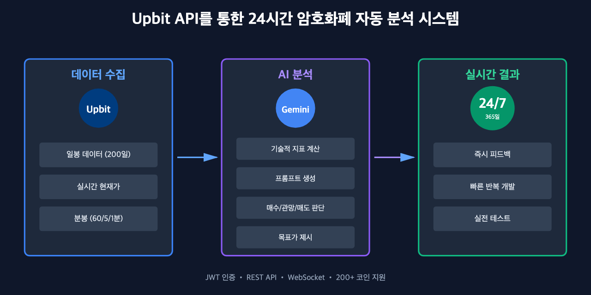
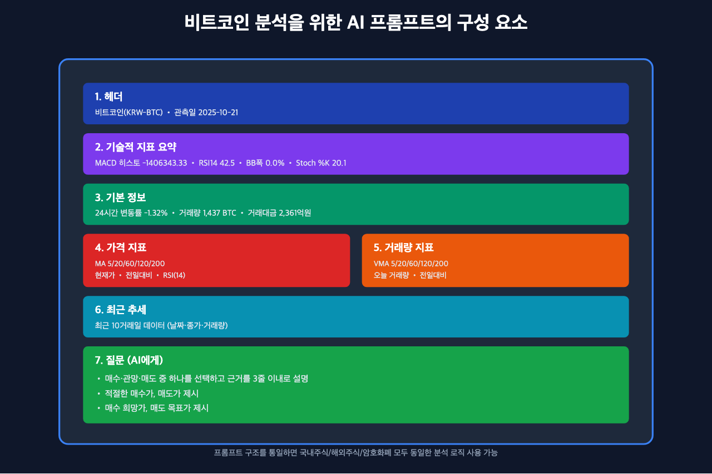
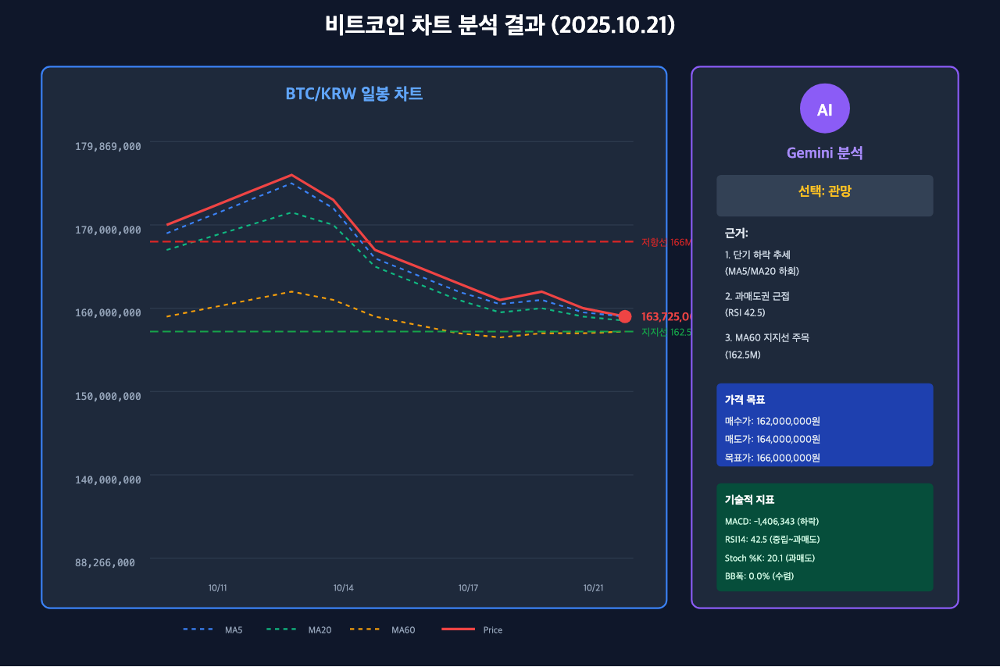
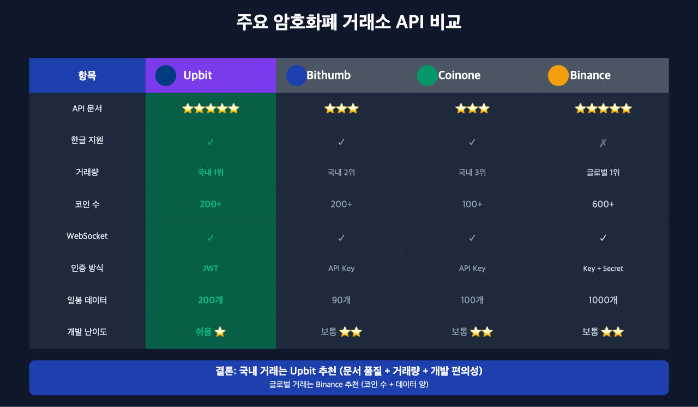
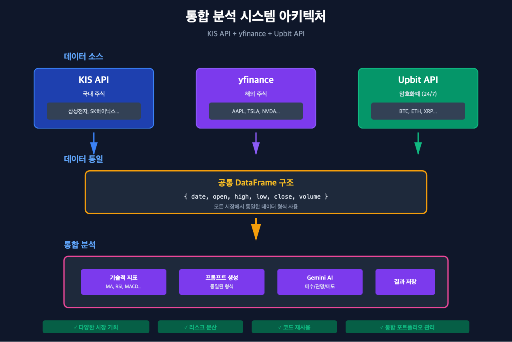

# Upbit으로 비트코인 24시간 분석하기: 암호화폐 자동매매의 시작점

> 이 글은 AI 기반 자동매매 시스템 시리즈의 **3편**입니다.
>
> **전체 시리즈:**
> - [1편: 한투 API로 실시간 주식 데이터 수집하기](https://mgh3326.tistory.com/227)
> - [2편: yfinance로 애플·테슬라 분석하기](https://mgh3326.tistory.com/228)
> - **3편: Upbit으로 비트코인 24시간 분석하기** ← 현재 글
> - 4편: AI 분석 결과 DB에 저장하기 (준비 중)

## 들어가며

지금까지 [한투 API로 국내 주식](https://mgh3326.tistory.com/227), [yfinance로 해외 주식](https://mgh3326.tistory.com/228) 데이터를 수집하고 AI 분석하는 방법을 알아봤습니다. 이번에는 시리즈의 세 번째 편으로 **Upbit API**를 활용한 암호화폐 자동 분석을 다룹니다.

제가 암호화폐 시장을 선택한 이유는 명확합니다. 암호화폐 시장은 **24시간 365일 개장**하기 때문에, 자동매매 시스템을 개발하고 배포한 직후 바로 실전에서 테스트할 수 있습니다. 주식 시장처럼 장 마감을 기다릴 필요 없이, 코드를 수정하면 몇 분 안에 실제 매수/매도 결과를 확인할 수 있죠. 이는 개발자에게 빠른 피드백 루프를 제공하여 시스템을 빠르게 개선할 수 있게 해줍니다.

또한 Upbit은 국내 1위 거래소로 **API 문서가 깔끔하고 잘 정리**되어 있어 개발하기 편합니다. 실시간 시세 조회부터 자동 주문까지 모든 기능이 REST API와 WebSocket으로 제공됩니다.


*Upbit API를 통한 24시간 암호화폐 자동 분석 시스템*

## 왜 Upbit인가?

국내에서 암호화폐를 거래할 수 있는 거래소는 여러 곳이 있습니다:

### 1. Upbit
- **장점**:
  - 국내 1위 거래소 (거래량, 유동성)
  - **API 문서가 깔끔** (https://docs.upbit.com)
  - REST API + WebSocket 모두 지원
  - 200개 이상 코인 지원
  - JWT 기반 인증으로 보안성 우수
- **단점**:
  - 출금 수수료가 다소 높음

### 2. Bithumb
- **장점**: 오래된 거래소로 안정적
- **단점**: API 문서가 다소 부족, 제공 데이터 제한적

### 3. Coinone
- **장점**: 사용하기 쉬운 인터페이스
- **단점**: 거래량이 적어 슬리피지 발생 가능

**결론**: API 개발자 친화성과 거래량을 고려하면 **Upbit이 최선의 선택**입니다!

## 암호화폐 시장의 장점: 24시간 개장

주식 시장과 암호화폐 시장의 가장 큰 차이점:

| 항목 | 주식 시장 | 암호화폐 시장 |
|------|----------|------------|
| **거래 시간** | 평일 09:00~15:30 | **24시간 365일** |
| **테스트 속도** | 하루 1번 (장 마감 후) | **즉시** (언제든지) |
| **주말 거래** | 불가능 | **가능** |
| **개발 피드백** | 느림 (다음 날 확인) | **빠름 (몇 분 내)** |

이는 자동매매 시스템 개발에 엄청난 이점을 제공합니다:

1. **빠른 반복 개발**: 코드 수정 → 배포 → 결과 확인이 몇 분 안에 가능
2. **실시간 디버깅**: 버그 발생 시 바로 로그 확인하고 수정
3. **주말에도 개발**: 주말에 새 전략을 테스트하고 월요일에 적용 가능
4. **다양한 시장 상황 경험**: 24시간 동안 다양한 변동성 경험

## 1. Upbit API 계정 설정

### 1-1. API 키 발급

1. [Upbit](https://upbit.com) 가입 및 본인인증
2. 내 정보 > API 관리 > Open API 키 발급
3. 권한 설정:
   - 자산 조회
   - 주문 조회
   - 주문하기 (자동매매 시)
4. `ACCESS_KEY`와 `SECRET_KEY` 저장

```bash
# .env 파일
UPBIT_ACCESS_KEY=your_access_key
UPBIT_SECRET_KEY=your_secret_key
```

### 1-2. JWT 인증 방식

Upbit은 JWT(JSON Web Token) 기반 인증을 사용합니다.

```python
import uuid
import jwt  # pip install pyjwt
import httpx

UPBIT_REST = "https://api.upbit.com/v1"

async def fetch_my_coins() -> list[dict]:
    """보유 자산 조회"""
    # JWT 페이로드 생성
    payload = {
        'access_key': UPBIT_ACCESS_KEY,
        'nonce': str(uuid.uuid4()),  # 고유한 요청 ID
    }

    # JWT 토큰 생성
    jwt_token = jwt.encode(payload, UPBIT_SECRET_KEY)
    headers = {"Authorization": f"Bearer {jwt_token}"}

    async with httpx.AsyncClient() as client:
        response = await client.get(f"{UPBIT_REST}/accounts", headers=headers)
        response.raise_for_status()
        return response.json()
```

**주의**: 매 요청마다 새로운 `nonce`를 생성해야 합니다!

## 2. 암호화폐 데이터 수집

### 2-1. 일봉 데이터 가져오기

Upbit은 최대 200개의 일봉 데이터를 제공합니다.

```python
import pandas as pd
from datetime import datetime, timezone

async def fetch_ohlcv(market: str = "KRW-BTC", days: int = 200) -> pd.DataFrame:
    """
    최근 N일 일봉 OHLCV 데이터 조회

    Args:
        market: 마켓 코드 (예: "KRW-BTC", "KRW-ETH")
        days: 조회할 일수 (최대 200)

    Returns:
        DataFrame with columns: date, open, high, low, close, volume
    """
    if days > 200:
        raise ValueError("Upbit 일봉 API는 최대 200개까지 요청 가능합니다.")

    url = f"{UPBIT_REST}/candles/days"
    params = {
        "market": market,
        "count": days,
    }

    async with httpx.AsyncClient() as client:
        response = await client.get(url, params=params)
        response.raise_for_status()
        data = response.json()

    # DataFrame 변환
    df = pd.DataFrame(data)

    # 컬럼명 정리
    df = df.rename(columns={
        "candle_date_time_kst": "date",
        "opening_price": "open",
        "high_price": "high",
        "low_price": "low",
        "trade_price": "close",
        "candle_acc_trade_volume": "volume",
    })

    # 날짜 변환
    df["date"] = pd.to_datetime(df["date"]).dt.date

    # 필요한 컬럼만 선택
    df = df[["date", "open", "high", "low", "close", "volume"]]

    # 날짜순 정렬 (최신 데이터가 위에 있으므로 역순)
    df = df.sort_values("date").reset_index(drop=True)

    return df
```

### 2-2. 현재가 정보 가져오기

실시간 현재가는 Ticker API를 사용합니다.

```python
async def fetch_current_price(market: str) -> pd.DataFrame:
    """
    현재가 조회

    Returns:
        DataFrame with 1 row: date, open, high, low, close, volume
    """
    url = f"{UPBIT_REST}/ticker"
    params = {"markets": market}

    async with httpx.AsyncClient() as client:
        response = await client.get(url, params=params)
        response.raise_for_status()
        data = response.json()[0]

    # 현재가 데이터 변환
    current_data = {
        "date": datetime.now(timezone.utc).date(),
        "open": data["opening_price"],
        "high": data["high_price"],
        "low": data["low_price"],
        "close": data["trade_price"],  # 현재가
        "volume": data["acc_trade_volume_24h"],  # 24시간 거래량
    }

    return pd.DataFrame([current_data])
```

### 2-3. 기본 정보 가져오기

```python
async def fetch_fundamental_info(market: str) -> dict:
    """
    코인 기본 정보 조회 (24시간 변동률, 고가/저가 등)
    """
    url = f"{UPBIT_REST}/ticker"
    params = {"markets": market}

    async with httpx.AsyncClient() as client:
        response = await client.get(url, params=params)
        data = response.json()[0]

    return {
        "마켓코드": data.get("market"),
        "현재가": data.get("trade_price"),
        "24시간변동": data.get("signed_change_price"),
        "24시간변동률": data.get("signed_change_rate"),
        "24시간고가": data.get("high_price"),
        "24시간저가": data.get("low_price"),
        "24시간거래량": data.get("acc_trade_volume_24h"),
        "24시간거래대금": data.get("acc_trade_price_24h"),
        "최고가": data.get("highest_52_week_price"),
        "최저가": data.get("lowest_52_week_price"),
    }
```

## 3. 분봉 데이터 수집 (선택사항)

단기 트레이딩을 위해 60분/5분/1분 캔들도 수집할 수 있습니다.

```python
async def fetch_hourly_candles(market: str, count: int = 12) -> pd.DataFrame:
    """60분 캔들 데이터"""
    url = f"{UPBIT_REST}/candles/minutes/60"
    params = {"market": market, "count": count}

    async with httpx.AsyncClient() as client:
        response = await client.get(url, params=params)
        data = response.json()

    df = pd.DataFrame(data)
    df = df.rename(columns={
        "candle_date_time_kst": "datetime",
        "opening_price": "open",
        "high_price": "high",
        "low_price": "low",
        "trade_price": "close",
        "candle_acc_trade_volume": "volume",
    })

    df["datetime"] = pd.to_datetime(df["datetime"])
    df = df[["datetime", "open", "high", "low", "close", "volume"]]
    df = df.sort_values("datetime").reset_index(drop=True)

    return df


async def fetch_5min_candles(market: str, count: int = 12) -> pd.DataFrame:
    """5분 캔들 데이터"""
    url = f"{UPBIT_REST}/candles/minutes/5"
    params = {"market": market, "count": count}
    # ... (위와 동일한 로직)


async def fetch_1min_candles(market: str, count: int = 10) -> pd.DataFrame:
    """1분 캔들 데이터"""
    url = f"{UPBIT_REST}/candles/minutes/1"
    params = {"market": market, "count": count}
    # ... (위와 동일한 로직)
```

## 4. 데이터 구조 통일 (주식과 동일!)

1편, 2편에서 사용한 `build_prompt` 함수를 그대로 재사용할 수 있습니다!

### 공통 DataFrame 형식

```python
# 국내주식(KIS) + 해외주식(yfinance) + 암호화폐(Upbit) 모두 동일한 구조
df = pd.DataFrame({
    "date": [...],      # 날짜
    "open": [...],      # 시가
    "high": [...],      # 고가
    "low": [...],       # 저가
    "close": [...],     # 종가
    "volume": [...]     # 거래량
})
```

이렇게 구조를 통일하면:
1. 기술적 지표 계산 함수 재사용
2. 프롬프트 생성 로직 재사용
3. **국내주식/해외주식/암호화폐를 하나의 시스템으로 통합 분석 가능**

## 5. 실행 예시

이제 비트코인을 실제로 분석해봅시다!

```python
import asyncio
from google import genai

async def main():
    # 비트코인 데이터 수집
    market = "KRW-BTC"
    coin_name = "비트코인"

    print("1단계: 비트코인 데이터 수집 중...")

    # 1. 데이터 수집
    df_historical = await fetch_ohlcv(market, days=200)
    df_current = await fetch_current_price(market)
    fundamental_info = await fetch_fundamental_info(market)

    print(f"  - 일봉 데이터: {len(df_historical)}개")
    print(f"  - 현재가: {df_current.iloc[0]['close']:,.0f}원")

    # 2. 데이터 병합 (1편에서 만든 함수 재사용)
    df_merged = merge_historical_and_current(df_historical, df_current)
    print(f"  - 병합 완료: {len(df_merged)}개 데이터")

    # 3. 프롬프트 생성 (1편에서 만든 함수 재사용, 원화 기호만)
    print("\n2단계: AI 분석용 프롬프트 생성 중...")
    prompt = build_prompt(
        df=df_merged,
        ticker=market,
        stock_name=coin_name,
        currency="₩",  # 원화
        unit_shares="",  # 암호화폐는 단위 생략
        fundamental_info=fundamental_info
    )

    print("\n생성된 프롬프트:")
    print("=" * 80)
    print(prompt)
    print("=" * 80)

    # 4. AI 분석 (Google Gemini)
    print("\n3단계: Gemini AI에 분석 요청 중...")
    client = genai.Client(api_key="your_google_api_key")
    response = client.models.generate_content(
        model="gemini-2.5-flash",
        contents=prompt
    )

    print("\nGemini AI 분석 결과:")
    print("=" * 80)
    print(response.text)
    print("=" * 80)

if __name__ == "__main__":
    asyncio.run(main())
```

### 필요한 패키지 설치

```bash
pip install httpx pandas ta pyjwt google-genai
```

### 실제 실행 결과

#### 1단계: 데이터 수집

```
일봉 데이터: 200개
현재가: 163,725,000원
병합 완료: 200개 데이터
```

#### 2단계: 생성된 프롬프트

```
비트코인(KRW-BTC) (관측일 2025-10-21)
MACD 히스토 -1406343.33, RSI14 42.5, BB폭 0.0%, Stoch %K 20.1
[기본 정보]
- 마켓코드: KRW-BTC
- 현재가: 163725000.0
- 24시간변동: -2186000.0
- 24시간변동률: -0.0131757388
- 24시간고가: 166000000.0
- 24시간저가: 162011000.0
- 24시간거래량: 1437.56878367
- 24시간거래대금: 236135849430.3502
- 최고가: 179869000.0
- 최저가: 88266000.0


[가격 지표]
- MA 5/20/60/120/200 : 164,342,400 / 170,927,300 / 162,539,100 / 160,079,300 / 151,872,580 ₩
- 현재가 : 163,725,000₩
- 전일 대비 : -2,186,000₩ (-1.32%)
- RSI(14) : 42.5

[거래량 지표]
- 오늘 거래량 : 1,438
- 전일 대비 : -0.76%

[최근 10거래일 (날짜·종가·거래량)]
2025-10-11 170390000.0 4416.693313
2025-10-12 173833000.0 3435.190730
2025-10-13 171680000.0 2243.159056
2025-10-14 170070000.0 2556.343461
2025-10-15 168539000.0 1724.325772
2025-10-16 165290000.0 2618.729855
2025-10-17 163639000.0 4263.223446
2025-10-18 163631000.0  926.134022
2025-10-19 164806000.0 1399.977514
2025-10-20 165911000.0 1448.626192

[질문]
위 정보만으로 오늘 매수·관망·매도 중 하나를 선택하고,
근거를 3줄 이내로 한글로 설명해 주세요.
적절한 매수가, 매도가, 매수 희망가, 매도 목표가도 제시해 주세요.
```


*비트코인 분석을 위한 AI 프롬프트의 구성 요소*

#### 3단계: Gemini AI 분석 결과

```
**선택:** 관망

**근거:**
1.  현재 가격(163,725,000원)은 단기 이동평균선(MA5: 164,342,400원, MA20: 170,927,300원) 아래에 위치하며,
    MACD 히스토그램이 음수(-1,406,343.33)로 단기 하락 추세가 지속되고 있습니다.
2.  RSI14(42.5)와 Stoch %K(20.1)는 과매도권에 근접하고 있지만 아직 진입하지 않아 매수 시점으로
    보기에는 이르며, 추가 하락 가능성이 있습니다.
3.  MA60(162,539,100원)이 지지선 역할을 할 수 있으나, 이를 하향 돌파할 경우 추가 하락이 나올 수 있어
    추이를 지켜보는 것이 좋습니다.

**적절한 가격 제안:**
- **매수가:** 162,000,000원 (MA60 부근 및 24시간 최저가 162,011,000원 아래에서 지지 확인 후)
- **매도가:** 164,000,000원 (단기 저항선인 MA5에 근접한 가격대에서 추가 하락을 방지하기 위한 매도 고려)
- **매수 희망가:** 162,000,000원 (과매도권 진입 및 MA60 지지 확인 후)
- **매도 목표가:** 166,000,000원 (24시간 고가 수준의 저항선을 돌파 시)
```


*비트코인 차트와 Gemini AI의 분석 결과 (2025.10.21 기준)*

### 분석 해석

Gemini AI는 비트코인 데이터를 분석하여:
- **단기 하락 추세 확인**: MACD 히스토그램 음수, 현재가가 MA5/MA20 하회
- **과매도권 근접**: RSI 42.5, Stoch %K 20.1로 곧 반등 가능성
- **지지선 주목**: MA60(162,539,100원)을 주요 지지선으로 판단
- **전략 제안**: 관망 후 162,000,000원 부근 매수, 166,000,000원 목표가 설정

실제로 24시간 최고가 166,000,000원에서 163,725,000원으로 하락한 상황이라 단기 조정 중으로 판단한 것입니다.

## 6. 여러 코인 동시 분석

보유한 모든 코인을 자동으로 분석할 수도 있습니다!

```python
async def analyze_my_portfolio():
    """내 포트폴리오 전체 분석"""
    # 1. 보유 코인 조회
    my_coins = await fetch_my_coins()

    # 2. KRW가 아닌 코인만 필터링
    coin_list = [
        coin for coin in my_coins
        if coin.get("currency") != "KRW"  # 원화 제외
        and float(coin.get("balance", 0)) > 0  # 잔고가 있는 것만
    ]

    print(f"총 {len(coin_list)}개 코인 보유 중")

    # 3. 각 코인 분석
    for coin in coin_list:
        currency = coin["currency"]
        market = f"KRW-{currency}"
        balance = float(coin["balance"])
        avg_price = float(coin["avg_buy_price"])

        print(f"\n=== {currency} 분석 ===")
        print(f"보유량: {balance:.8f}")
        print(f"평균 매수가: {avg_price:,.0f}원")

        # 데이터 수집 및 분석
        df_historical = await fetch_ohlcv(market)
        df_current = await fetch_current_price(market)
        df_merged = merge_historical_and_current(df_historical, df_current)

        prompt = build_prompt(df_merged, market, currency, "₩", "")
        result = await analyze_with_gemini(prompt)

        print(f"AI 추천: {result}")
```

실제 실행 결과:

```
총 24개 코인 보유 중
분석 가능한 코인: 24개
- BTC: 0.00072847개, 평균 164,699,569₩, 총 119,979₩
- ETH: 0.04625415개, 평균 6,060,207₩, 총 280,310₩
- XRP: 125.48147885개, 평균 3,778₩, 총 474,046₩
- ETC: 115.15398989개, 평균 29,656₩, 총 3,414,970₩
- SOL: 0.87974741개, 평균 294,738₩, 총 259,295₩
... (총 24개)
```

## 7. Upbit vs 다른 거래소 API 비교

실전 비교표:


*주요 암호화폐 거래소 API 비교*

| 항목 | Upbit | Bithumb | Coinone | Binance |
|------|-------|---------|---------|---------|
| **API 문서** | 매우 깔끔 | 보통 | 보통 | 매우 상세 |
| **한글 지원** | O | O | O | X |
| **거래량** | 국내 1위 | 국내 2위 | 국내 3위 | 글로벌 1위 |
| **코인 수** | 200+ | 200+ | 100+ | 600+ |
| **REST API** | O | O | O | O |
| **WebSocket** | O | O | O | O |
| **인증 방식** | JWT | API Key | API Key | API Key + Secret |
| **일봉 데이터** | 200개 | 90개 | 100개 | 1000개 |
| **수수료** | 0.05% | 0.04% | 0.1% | 0.1% |
| **개발 난이도** | 쉬움 | 보통 | 보통 | 보통 |

**결론**:
- **국내 거래**: Upbit 추천 (문서 품질, 거래량)
- **글로벌 거래**: Binance 추천 (코인 수, 데이터 양)
- **본 프로젝트**: Upbit 선택 (한글 지원, 개발 편의성)

## 8. 24시간 자동매매를 위한 팁

### 8-1. WebSocket으로 실시간 시세 수신

REST API 대신 WebSocket을 사용하면 실시간으로 가격 변화를 감지할 수 있습니다.

```python
import websockets
import json

async def watch_ticker(market: str):
    """실시간 시세 감시"""
    uri = "wss://api.upbit.com/websocket/v1"

    async with websockets.connect(uri) as websocket:
        # 구독 요청
        subscribe_data = [
            {"ticket": "test"},
            {"type": "ticker", "codes": [market]}
        ]
        await websocket.send(json.dumps(subscribe_data))

        # 실시간 데이터 수신
        while True:
            data = await websocket.recv()
            ticker = json.loads(data)

            price = ticker["trade_price"]
            print(f"{market} 현재가: {price:,.0f}원")

            # 여기서 자동매매 로직 실행
            # if should_buy(price):
            #     await place_buy_order(market, price)
```

### 8-2. 자동 주문 (매수/매도)

```python
import hashlib

async def place_buy_order(market: str, price: float, volume: float):
    """지정가 매수 주문"""
    query = {
        'market': market,
        'side': 'bid',  # 매수
        'volume': str(volume),
        'price': str(price),
        'ord_type': 'limit',  # 지정가
    }

    # Query string 생성
    query_string = '&'.join([f"{k}={v}" for k, v in query.items()])
    m = hashlib.sha512()
    m.update(query_string.encode())
    query_hash = m.hexdigest()

    # JWT 페이로드
    payload = {
        'access_key': UPBIT_ACCESS_KEY,
        'nonce': str(uuid.uuid4()),
        'query_hash': query_hash,
        'query_hash_alg': 'SHA512',
    }

    jwt_token = jwt.encode(payload, UPBIT_SECRET_KEY)
    headers = {"Authorization": f"Bearer {jwt_token}"}

    async with httpx.AsyncClient() as client:
        response = await client.post(
            f"{UPBIT_REST}/orders",
            headers=headers,
            json=query
        )
        return response.json()
```

### 8-3. 주의사항

1. **API 호출 제한**: 초당 10회, 분당 100회 제한
2. **최소 주문 금액**: 5,000원 이상
3. **소수점 처리**: 각 코인마다 최소 주문 단위가 다름
4. **수수료**: 매수/매도 시 각각 0.05% 수수료

```python
# API 호출 제한 처리
import asyncio
from datetime import datetime, timedelta

class RateLimiter:
    def __init__(self, calls_per_second=10):
        self.calls_per_second = calls_per_second
        self.last_call = datetime.now()

    async def wait_if_needed(self):
        now = datetime.now()
        time_passed = (now - self.last_call).total_seconds()

        if time_passed < 1.0 / self.calls_per_second:
            await asyncio.sleep(1.0 / self.calls_per_second - time_passed)

        self.last_call = datetime.now()

# 사용 예시
limiter = RateLimiter(calls_per_second=10)

async def fetch_with_limit(market):
    await limiter.wait_if_needed()
    return await fetch_ohlcv(market)
```

## 9. 국내주식/해외주식/암호화폐 통합 시스템

이제 세 시장을 하나의 시스템으로 통합할 수 있습니다!


*KIS API, yfinance, Upbit API를 통합한 전체 시스템 구조*

```python
async def analyze_all_markets():
    """국내주식 + 해외주식 + 암호화폐 통합 분석"""

    # 1. 국내 주식 (KIS API)
    print("=== 국내 주식 분석 ===")
    korean_stocks = ["삼성전자", "SK하이닉스"]
    for stock in korean_stocks:
        df = await kis.fetch_daily_ohlcv(stock)
        result = await analyze_with_gemini(df, stock, "₩", "주")
        print(f"{stock}: {result}")

    # 2. 해외 주식 (yfinance)
    print("\n=== 해외 주식 분석 ===")
    us_stocks = ["AAPL", "TSLA"]
    for stock in us_stocks:
        df = await yahoo.fetch_ohlcv(stock)
        result = await analyze_with_gemini(df, stock, "$", "shares")
        print(f"{stock}: {result}")

    # 3. 암호화폐 (Upbit)
    print("\n=== 암호화폐 분석 ===")
    coins = ["KRW-BTC", "KRW-ETH"]
    for coin in coins:
        df = await upbit.fetch_ohlcv(coin)
        result = await analyze_with_gemini(df, coin, "₩", "")
        print(f"{coin}: {result}")
```

### 통합의 장점

1. **다양한 시장 기회**: 24시간 어디선가 거래 기회 발생
2. **리스크 분산**: 한 시장이 하락해도 다른 시장에서 수익
3. **코드 재사용**: 동일한 분석 로직을 모든 시장에 적용
4. **통합 대시보드**: 하나의 화면에서 전체 포트폴리오 관리

## 10. 성능 최적화

### 병렬 처리로 속도 향상

```python
import asyncio

async def analyze_multiple_coins(markets: list):
    """여러 코인 동시 분석"""
    tasks = [
        analyze_single_coin(market)
        for market in markets
    ]
    results = await asyncio.gather(*tasks)
    return results

# 24개 코인을 몇 초 만에 분석!
markets = ["KRW-BTC", "KRW-ETH", "KRW-XRP", ...]
results = await analyze_multiple_coins(markets)
```

### 캐싱으로 API 호출 절약

```python
from functools import lru_cache
from datetime import datetime, timedelta

# 5분간 캐시
@lru_cache(maxsize=100)
def get_cache_key(market, timestamp):
    return f"{market}_{timestamp}"

async def fetch_ohlcv_cached(market: str):
    """5분간 캐시된 데이터 사용"""
    now = datetime.now()
    cache_time = now.replace(second=0, microsecond=0)
    cache_time = cache_time - timedelta(minutes=cache_time.minute % 5)

    cache_key = get_cache_key(market, cache_time.timestamp())

    # 캐시 확인 로직 (Redis 등 활용)
    # ...
```

## 마치며

이번 글에서는 Upbit API를 활용하여:
1. 암호화폐 데이터 수집 (일봉, 현재가, 분봉)
2. 국내주식/해외주식과 동일한 데이터 구조 통일
3. 1편, 2편의 프롬프트 생성 로직 재사용
4. **실제 비트코인 분석 결과 확인**
5. 24시간 자동매매를 위한 실전 팁
6. 세 시장(주식+암호화폐) 통합 전략

까지 완료했습니다!

**핵심 포인트:**
- Upbit API는 문서가 깔끔하고 개발하기 쉬움
- **암호화폐 시장은 24시간 개장**하여 빠른 피드백 루프 가능
- 국내주식/해외주식/암호화폐 데이터 구조를 통일하여 코드 재사용
- JWT 인증으로 보안성 우수
- WebSocket으로 실시간 자동매매 구현 가능

이제 국내 주식, 해외 주식, 암호화폐를 모두 AI로 분석할 수 있는 완전한 시스템을 갖추게 되었습니다!

**다음 편 예고**: 하지만 매번 AI API를 호출하면 비용이 증가하고 응답 시간도 오래 걸립니다. 다음 글 **4편: AI 분석 결과 DB에 저장하기**에서는 PostgreSQL 데이터베이스 설계를 통해 비용을 90% 절감하고, 웹 대시보드로 즉시 조회하는 방법을 알아보겠습니다. (준비 중)

---

**참고 링크:**
- [Upbit API 공식 문서](https://docs.upbit.com)
- [전체 프로젝트 코드 (GitHub)](https://github.com/mgh3326/auto_trader)
- [1편: 한투 API로 실시간 주식 데이터 수집하기](https://mgh3326.tistory.com/227)
- [2편: yfinance로 애플·테슬라 분석하기](https://mgh3326.tistory.com/228)
- [Google Gemini API 문서](https://ai.google.dev/)
