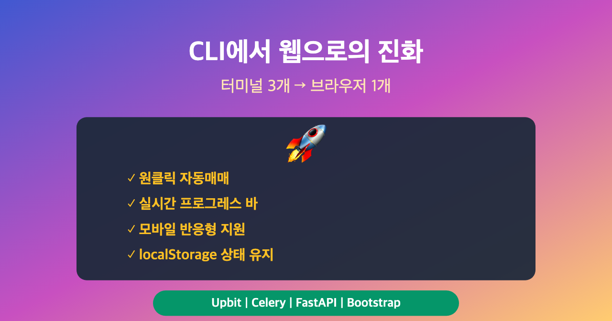
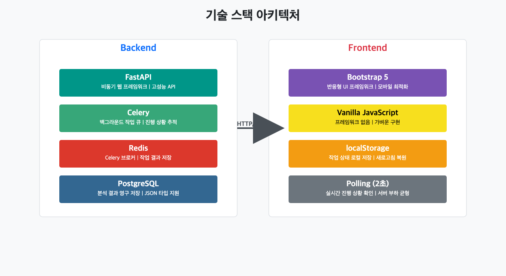
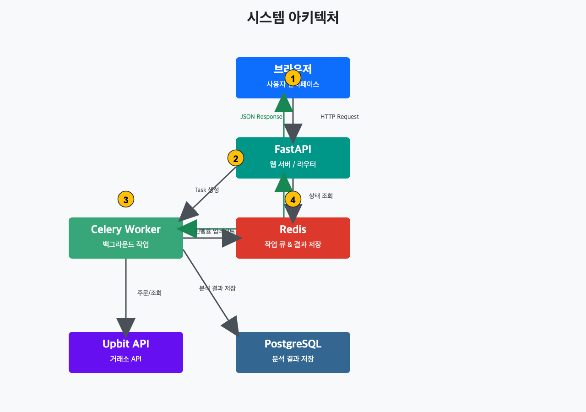
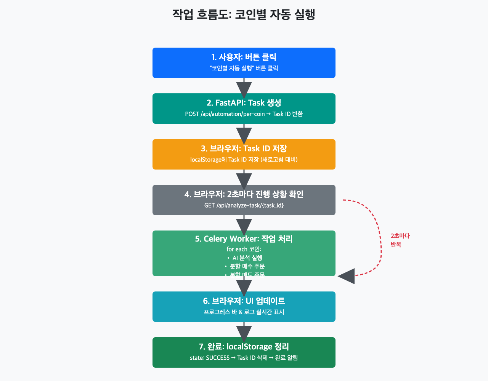
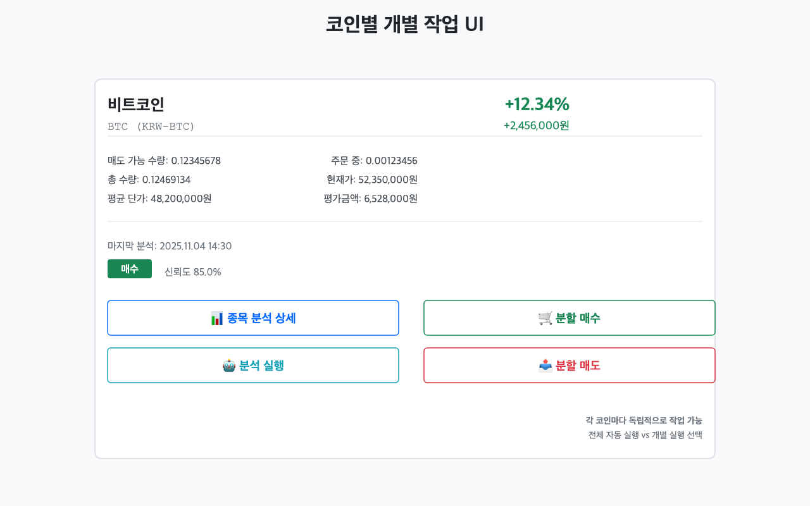
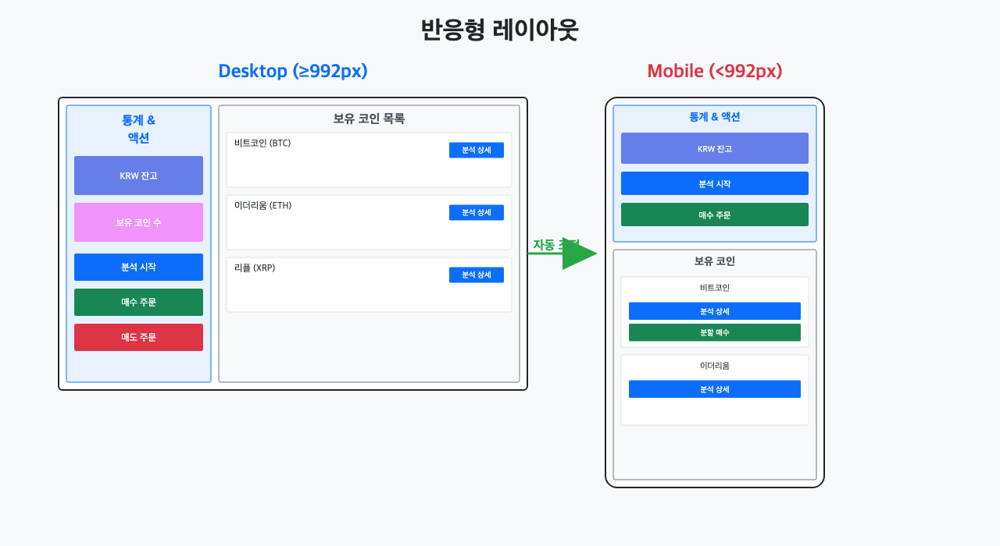
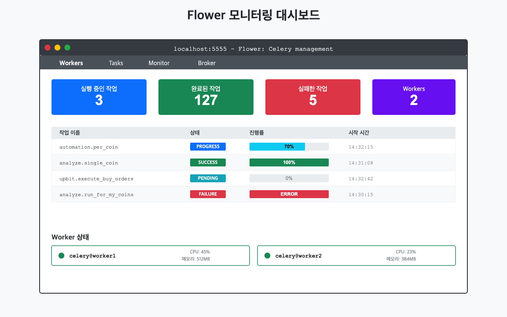

# Upbit 웹 트레이딩 대시보드 구축하기: CLI에서 웹으로의 진화



> 이 글은 AI 기반 자동매매 시스템 시리즈의 **5편**입니다.
>
> **전체 시리즈:**
> - [1편: 한투 API로 실시간 주식 데이터 수집하기](https://mgh3326.tistory.com/227)
> - [2편: yfinance로 애플·테슬라 분석하기](https://mgh3326.tistory.com/228)
> - [3편: Upbit으로 비트코인 24시간 분석하기](https://mgh3326.tistory.com/229)
> - [4편: AI 분석 결과 DB에 저장하기](https://mgh3326.tistory.com/230)
> - **5편: Upbit 웹 트레이딩 대시보드 구축하기** ← 현재 글
> - 6편: 실전 운영을 위한 모니터링 시스템 구축 (예정)
> - 7편: 라즈베리파이 홈서버에 Docker 배포하기 (예정)

## 들어가며

[지난 글](https://mgh3326.tistory.com/230)에서 AI 분석 결과를 데이터베이스에 저장하고 웹 대시보드로 조회하는 시스템을 구축했습니다. 하지만 실제 매매 작업은 여전히 터미널에서 Python 스크립트를 직접 실행해야 했습니다.

**기존 CLI 방식의 문제점:**

```bash
# 1. 분석 실행
$ python debug_upbit_json.py
⏳ 비트코인 분석 중... (30초 소요)
✅ 분석 완료

# 2. 매수 실행
$ python debug_upbit_buy_post_orders.py
⏳ 매수 주문 처리 중...
✅ 주문 완료

# 3. 매도 실행
$ python debug_upbit_post_orders.py
⏳ 매도 주문 처리 중...
✅ 주문 완료
```

**이런 불편함들을 겪었습니다:**

- 터미널 3개를 켜서 순차적으로 스크립트 실행
- 스크립트 파일 경로를 매번 찾아야 함
- 진행 상황을 로그로만 확인 가능
- 외출 중에는 실행 불가능
- 모바일에서 접근 불가능
- 실수로 잘못된 스크립트 실행 위험

이번 글에서는 **웹 브라우저 하나로 모든 작업을 처리**할 수 있는 Upbit 전용 트레이딩 대시보드를 구축한 과정을 소개합니다.

## 구현 목표

### 핵심 요구사항

1. **원클릭 자동매매**: 버튼 하나로 분석 → 매수 → 매도 자동 실행
2. **실시간 진행 추적**: 프로그레스 바로 작업 상태 실시간 확인
3. **반응형 디자인**: 데스크톱, 태블릿, 모바일 모두 지원
4. **상태 유지**: 페이지 새로고침해도 진행 중인 작업 복원
5. **코인별 개별 작업**: 특정 코인만 선택해서 분석/매수/매도

### 기술 스택 선택



**백엔드:**
- **FastAPI**: 비동기 웹 프레임워크
- **Celery**: 백그라운드 작업 큐
- **Redis**: Celery 브로커 및 결과 저장소
- **PostgreSQL**: 분석 결과 저장

**프론트엔드:**
- **Bootstrap 5**: 반응형 UI 프레임워크
- **Vanilla JavaScript**: 프레임워크 없이 순수 JS
- **localStorage**: 작업 상태 로컬 저장

**선택 이유:**
- Celery: 긴 작업(AI 분석 30초~1분)을 백그라운드에서 처리
- localStorage: 페이지 새로고침 시에도 작업 상태 유지
- Vanilla JS: 가벼운 프로젝트에 React/Vue는 오버엔지니어링

## 시스템 아키텍처

### 전체 구조



```
┌─────────────┐
│   Browser   │ ← 사용자 인터페이스
└──────┬──────┘
       │ HTTP Request
       ↓
┌─────────────┐
│  FastAPI    │ ← 웹 서버
│   Router    │
└──────┬──────┘
       │ Task 생성
       ↓
┌─────────────┐     ┌─────────────┐
│   Celery    │ ←─→ │    Redis    │ ← 작업 큐 & 결과 저장
│   Worker    │     │   (Broker)  │
└──────┬──────┘     └─────────────┘
       │
       ↓
┌─────────────┐     ┌─────────────┐
│   Upbit     │ ←─→ │ PostgreSQL  │ ← 분석 결과 저장
│     API     │     │  Database   │
└─────────────┘     └─────────────┘
```

### 작업 흐름

**1. 분석 → 매수 → 매도 자동 실행 흐름:**

```python
# 사용자가 "코인별 자동 실행" 버튼 클릭
1. POST /api/automation/per-coin
   └─→ Celery Task ID 반환

# 브라우저가 2초마다 진행 상황 확인
2. GET /api/analyze-task/{task_id}
   └─→ {"state": "PROGRESS", "progress": {...}}

# Celery Worker가 각 코인에 대해 순차 처리
3. for coin in 보유코인:
     a. AI 분석 실행
     b. 분할 매수 주문
     c. 분할 매도 주문
     └─→ 진행률 업데이트

# 완료 시
4. {"state": "SUCCESS", "result": {...}}
```



### localStorage를 활용한 상태 복원

**문제점:** 사용자가 페이지를 새로고침하면 진행 중인 작업 정보가 사라짐

**해결책:** localStorage에 Task ID 저장

```javascript
// Task 시작 시: localStorage에 저장
localStorage.setItem('upbit_analysis_task_id', task_id);

// 페이지 로드 시: 진행 중인 작업 복원
const storedTaskId = localStorage.getItem('upbit_analysis_task_id');
if (storedTaskId) {
    // 작업 상태 확인
    const response = await fetch(`/api/analyze-task/${storedTaskId}`);
    const data = await response.json();

    if (data.state === 'PROGRESS') {
        // 프로그레스 바 복원 & 계속 추적
        showProgressBar();
        startPolling();
    } else if (data.state === 'SUCCESS' || data.state === 'FAILURE') {
        // 완료된 작업: localStorage 정리
        localStorage.removeItem('upbit_analysis_task_id');
    }
}
```

**장점:**
- 페이지 새로고침해도 작업 진행 상황 유지
- 브라우저 탭을 닫았다가 다시 열어도 복원
- 네트워크 연결이 끊겼다가 복구되어도 이어서 추적

## 핵심 구현 상세

### 1. 보유 코인 조회 API

**요구사항:**
- 거래 가능한 코인만 필터링
- 현재가, 수익률, 평가금액 계산
- 최신 AI 분석 결과 포함

**구현 (app/routers/upbit_trading.py):**

```python
@router.get("/api/my-coins")
async def get_my_coins(db: AsyncSession = Depends(get_db)):
    """보유 코인 조회 API"""
    # 1. Upbit API로 보유 코인 조회
    my_coins = await upbit.fetch_my_coins()

    # 2. 거래 가능한 코인 필터링
    analyzer = UpbitAnalyzer()
    tradable_coins = [
        coin for coin in my_coins
        if coin.get("currency") != "KRW"
        and analyzer._is_tradable(coin)
        and coin.get("currency") in upbit_pairs.KRW_TRADABLE_COINS
    ]

    # 3. 현재가 일괄 조회 (API 호출 최소화)
    market_codes = [f"KRW-{coin['currency']}" for coin in tradable_coins]
    current_prices = await upbit.fetch_multiple_current_prices(market_codes)

    # 4. 최신 AI 분석 결과 조회
    analysis_service = StockAnalysisService(db)
    latest_analysis_map = await analysis_service.get_latest_analysis_results_for_coins(
        market_codes
    )

    # 5. 코인별 데이터 병합
    for coin in tradable_coins:
        currency = coin['currency']
        market = f"KRW-{currency}"

        # 수익률 계산
        if market in current_prices:
            current_price = current_prices[market]
            avg_buy_price = float(coin.get('avg_buy_price', 0))

            if avg_buy_price > 0:
                profit_rate = (current_price - avg_buy_price) / avg_buy_price
                coin['profit_rate'] = profit_rate

        # AI 분석 결과 추가
        analysis = latest_analysis_map.get(market)
        if analysis:
            coin['analysis_id'] = analysis.id
            coin['last_analysis_decision'] = analysis.decision  # buy/hold/sell
            coin['analysis_confidence'] = float(analysis.confidence)

    return {
        "success": True,
        "krw_balance": krw_balance,
        "tradable_coins_count": len(tradable_coins),
        "coins": tradable_coins
    }
```

**최적화 포인트:**
- `fetch_multiple_current_prices()`: N개 코인을 1번의 API 호출로 조회
- DB 쿼리 배치 처리로 N+1 문제 방지
- Decimal 타입으로 금액 정확도 보장

### 2. Celery 백그라운드 작업

**왜 Celery가 필요한가?**

AI 분석은 1개 코인당 30초~1분이 소요됩니다. 5개 코인이면 최대 5분! HTTP 요청은 보통 30초 타임아웃이므로 동기 처리는 불가능합니다.

**Celery 작업 구조 (app/tasks/analyze.py):**

```python
@shared_task(name="automation.per_coin", bind=True)
def run_per_coin_automation(self) -> dict:
    """각 코인에 대해 분석 → 매수 → 매도 자동 실행"""

    async def _run() -> dict:
        # 1. 보유 코인 조회
        my_coins, tradable_coins = await _fetch_tradable_coins()
        total_coins = len(tradable_coins)
        total_steps = total_coins * 3  # 각 코인당 3단계

        results = []
        processed_steps = 0

        # 2. 각 코인 처리
        for coin in tradable_coins:
            currency = coin['currency']
            korean_name = upbit_pairs.COIN_TO_NAME_KR.get(currency)
            coin_steps = []

            # 2-1. AI 분석
            self.update_state(
                state='PROGRESS',
                meta={
                    'processed_steps': processed_steps,
                    'total_steps': total_steps,
                    'current_name': korean_name,
                    'current_currency': currency,
                    'current_step': '분석',
                    'step_status': '진행 중'
                }
            )

            analysis_result = await _analyze_coin_async(currency)
            coin_steps.append({
                "step": "분석",
                "result": analysis_result
            })
            processed_steps += 1

            # 2-2. 분할 매수
            self.update_state(
                state='PROGRESS',
                meta={
                    'processed_steps': processed_steps,
                    'total_steps': total_steps,
                    'current_name': korean_name,
                    'current_step': '매수',
                    'step_status': '주문 처리 중'
                }
            )

            buy_result = await _execute_buy_order_for_coin_async(currency)
            coin_steps.append({
                "step": "매수",
                "result": buy_result
            })
            processed_steps += 1

            # 2-3. 분할 매도
            sell_result = await _execute_sell_order_for_coin_async(currency)
            coin_steps.append({
                "step": "매도",
                "result": sell_result
            })
            processed_steps += 1

            results.append({
                "currency": currency,
                "korean_name": korean_name,
                "steps": coin_steps
            })

        return {
            "status": "completed",
            "total_coins": total_coins,
            "results": results
        }

    # 비동기 함수를 새 이벤트 루프에서 실행
    return asyncio.run(_run())
```

**핵심 기능:**
- `self.update_state()`: 진행 상황을 Redis에 저장
- `meta` 필드: 현재 처리 중인 코인, 단계, 진행률 등
- 프론트엔드가 주기적으로 이 정보를 조회하여 UI 업데이트

### 3. 프론트엔드 진행 상황 추적

**실시간 프로그레스 바 업데이트:**

```javascript
// 2초마다 작업 상태 확인
async function checkCoinAutomationProgress() {
    if (!coinAutomationTaskId) return;

    try {
        const response = await fetch(
            `/upbit-trading/api/analyze-task/${coinAutomationTaskId}`
        );
        const data = await response.json();

        if (data.state === 'PROGRESS') {
            // 진행률 업데이트
            const progress = data.progress || {};
            const percent = Math.round(
                (progress.processed_steps / progress.total_steps) * 100
            );

            // 프로그레스 바 표시
            progressBar.style.width = percent + '%';
            progressBar.textContent = percent + '%';

            // 현재 작업 표시
            statusEl.textContent = `
                ${progress.current_name} (${progress.current_currency})
                - ${progress.current_step}
                [${progress.step_status}]
            `;

            // 로그 추가
            if (progress.last_message) {
                logEl.insertAdjacentHTML(
                    'afterbegin',
                    `<div>${escapeHtml(progress.last_message)}</div>`
                );
            }
        } else if (data.state === 'SUCCESS') {
            // 완료 처리
            clearInterval(coinAutomationInterval);
            progressBar.style.width = '100%';
            showAlert('코인별 자동 실행이 완료되었습니다.', 'success');

            // localStorage 정리
            localStorage.removeItem('upbit_coin_automation_task_id');

            // 보유 코인 새로고침
            await loadMyCoins();
        } else if (data.state === 'FAILURE') {
            // 실패 처리
            showAlert(`실패: ${data.error}`, 'danger');
            resetUI();
        }
    } catch (error) {
        console.error('Progress check error:', error);
    }
}

// 2초마다 실행
coinAutomationInterval = setInterval(checkCoinAutomationProgress, 2000);
```

**UX 개선 포인트:**
- 2초 간격 폴링: 실시간성과 서버 부하 균형
- 작업 로그 누적 표시: 사용자가 전체 작업 흐름 파악 가능
- 실패 시 자동 UI 리셋: 버튼 다시 활성화

### 4. 코인별 개별 작업

**전체 자동 실행 vs 개별 실행:**



각 코인 카드에 4개 버튼 제공:
1. **종목 분석 상세**: 최근 AI 분석 결과 모달로 표시
2. **분석 실행**: 해당 코인만 AI 분석
3. **분할 매수**: 해당 코인만 매수 주문
4. **분할 매도**: 해당 코인만 매도 주문

**구현:**

```javascript
// 코인별 분석 버튼 클릭
async function triggerCoinAnalysis(currency, koreanName, button) {
    if (!confirm(`${koreanName} (${currency})에 대한 AI 분석을 실행할까요?`)) {
        return;
    }

    button.disabled = true;
    button.innerHTML = '<span class="spinner-border spinner-border-sm"></span> 요청 중...';

    try {
        const response = await fetch(
            `/upbit-trading/api/coin/${currency}/analysis`,
            { method: 'POST' }
        );
        const data = await response.json();

        if (data.success) {
            showAlert(data.message || `${koreanName} 분석이 시작되었습니다.`, 'success');
        } else {
            showAlert(`❌ ${data.error}`, 'danger');
        }
    } finally {
        button.disabled = false;
        button.innerHTML = '<i class="bi bi-robot"></i> 분석 실행';
    }
}
```

**백엔드 API:**

```python
@router.post("/api/coin/{currency}/analysis")
async def analyze_single_coin(currency: str):
    """특정 코인 1개만 분석"""
    from app.core.celery_app import celery_app

    # Celery Task 실행
    async_result = celery_app.send_task(
        "analyze.single_coin",
        args=[currency]
    )

    return {
        "success": True,
        "message": f"{currency} 분석이 시작되었습니다.",
        "task_id": async_result.id
    }
```

## 반응형 디자인

### 모바일 최적화



**Bootstrap Grid 시스템 활용:**

```html
<div class="container-fluid mt-4">
    <div class="row">
        <!-- 왼쪽: 통계 & 액션 (모바일에서는 위) -->
        <div class="col-md-4 col-12">
            <!-- 통계 카드 -->
            <div class="stats-card">
                <p class="stats-number" id="krw-balance">-</p>
            </div>

            <!-- 액션 버튼 -->
            <button class="btn btn-primary btn-action">
                <i class="bi bi-cpu"></i> 분석 시작
            </button>
        </div>

        <!-- 오른쪽: 보유 코인 목록 (모바일에서는 아래) -->
        <div class="col-md-8 col-12">
            <div id="coins-list">
                <!-- 코인 카드들 -->
            </div>
        </div>
    </div>
</div>
```

**모바일 UI 개선:**

```css
/* 데스크톱: 버튼 가로 배치 */
@media (min-width: 992px) {
    .coin-actions {
        display: flex;
        justify-content: flex-end;
        gap: 0.5rem;
    }
}

/* 모바일: 버튼 세로 배치 */
@media (max-width: 991px) {
    .coin-actions {
        display: flex;
        flex-direction: column;
        gap: 0.5rem;
    }

    .coin-actions button {
        width: 100%;
    }
}
```

## 실제 사용 시나리오

### 시나리오 1: 출근 전 매매 설정

```
07:30 - 휴대폰으로 대시보드 접속
07:31 - "코인별 자동 실행" 버튼 클릭
07:32 - 진행 상황 확인 후 출근
08:00 - 회사 도착, 브라우저로 다시 접속
        → localStorage 덕분에 진행 상황 그대로 표시
08:05 - 모든 작업 완료 알림
```

### 시나리오 2: 특정 코인만 집중 관리

```
14:00 - 비트코인 뉴스 확인
14:01 - 대시보드에서 비트코인 카드의 "분석 실행" 클릭
14:02 - AI 분석 결과 확인: "매수 (신뢰도 85%)"
14:03 - "분할 매수" 버튼 클릭
14:05 - 주문 체결 확인
```

### 시나리오 3: 미체결 주문 관리

```
20:00 - 대시보드 접속
20:01 - "미체결 조회" 버튼 클릭
20:02 - 3일 전 주문 발견
20:03 - "전체 취소" 버튼으로 한번에 정리
```

## 성능 최적화

### 1. API 호출 최소화

**Before:**
```python
# N개 코인 = N번 API 호출
for coin in coins:
    price = await upbit.fetch_current_price(coin['market'])
```

**After:**
```python
# N개 코인 = 1번 API 호출
markets = [coin['market'] for coin in coins]
prices = await upbit.fetch_multiple_current_prices(markets)
```

### 2. DB 쿼리 최적화

**N+1 문제 방지:**

```python
# Before: N+1 쿼리
for market in markets:
    analysis = await db.query(StockAnalysisResult)\
        .filter_by(symbol=market)\
        .order_by(desc(created_at))\
        .first()

# After: 1번 쿼리로 모든 최신 분석 조회
analysis_map = await analysis_service.get_latest_analysis_results_for_coins(markets)
```

**Window Function 활용:**

```sql
SELECT DISTINCT ON (stock_info_id)
    id, stock_info_id, decision, confidence, created_at
FROM stock_analysis_results
WHERE stock_info_id IN (...)
ORDER BY stock_info_id, created_at DESC
```

### 3. 프론트엔드 최적화

**이벤트 위임 패턴:**

```javascript
// Before: 각 버튼마다 이벤트 리스너 (N개)
coins.forEach(coin => {
    const button = document.querySelector(`#analyze-${coin.id}`);
    button.addEventListener('click', () => analyzeCoin(coin));
});

// After: 부모 요소에 1개 리스너
document.getElementById('coins-list').addEventListener('click', (e) => {
    if (e.target.classList.contains('coin-analyze-btn')) {
        const currency = e.target.dataset.currency;
        analyzeCoin(currency);
    }
});
```

**폴링 간격 조정:**
- 분석 작업: 1초 (빠른 피드백)
- 매수/매도 작업: 2초 (서버 부하 감소)
- 코인별 자동화: 2초 (장시간 작업)

## 테스트 전략

### 1. Celery Task 테스트

```python
# tests/test_celery_tasks.py
import pytest
from app.tasks.analyze import run_per_coin_automation

@pytest.mark.asyncio
async def test_per_coin_automation_empty_coins():
    """보유 코인이 없을 때 처리 확인"""
    # Mock: 빈 코인 목록 반환
    with patch('app.services.upbit.fetch_my_coins', return_value=[]):
        result = run_per_coin_automation()

        assert result['status'] == 'completed'
        assert result['total_coins'] == 0
        assert result['results'] == []

@pytest.mark.asyncio
async def test_per_coin_automation_with_coins():
    """정상 작업 흐름 테스트"""
    mock_coins = [
        {"currency": "BTC", "balance": "0.1"},
        {"currency": "ETH", "balance": "1.0"}
    ]

    with patch('app.services.upbit.fetch_my_coins', return_value=mock_coins):
        result = run_per_coin_automation()

        assert result['status'] == 'completed'
        assert result['total_coins'] == 2
        assert len(result['results']) == 2
```

### 2. API 엔드포인트 테스트

```python
# tests/test_upbit_trading.py
async def test_get_my_coins_api(client: AsyncClient):
    """보유 코인 조회 API 테스트"""
    response = await client.get("/upbit-trading/api/my-coins")

    assert response.status_code == 200
    data = response.json()
    assert data['success'] is True
    assert 'krw_balance' in data
    assert 'coins' in data

async def test_analyze_coins_requires_api_keys(client: AsyncClient):
    """API 키 없이 분석 요청 시 에러"""
    with patch('app.core.config.settings.upbit_access_key', None):
        response = await client.post("/upbit-trading/api/analyze-coins")

        assert response.status_code == 400
        assert "API 키가 설정되지 않았습니다" in response.json()['detail']
```

### 3. 프론트엔드 테스트

```javascript
// 수동 테스트 체크리스트
describe('Upbit Trading Dashboard', () => {
    it('페이지 새로고침 시 진행 중인 작업 복원', async () => {
        // 1. 분석 시작
        // 2. 프로그레스 바 50% 시점에 새로고침
        // 3. 프로그레스 바가 50%부터 다시 시작하는지 확인
    });

    it('네트워크 오류 시 재시도', async () => {
        // 1. 분석 시작
        // 2. 네트워크 연결 끊기
        // 3. 연결 복구 시 자동으로 폴링 재개
    });

    it('동시에 여러 작업 실행 방지', async () => {
        // 1. 분석 버튼 클릭
        // 2. 진행 중에 매수 버튼 클릭
        // 3. 두 번째 버튼이 비활성화되어 있는지 확인
    });
});
```

## 배포 및 운영

### Docker Compose 구성

```yaml
# docker-compose.yml
version: '3.8'

services:
  # FastAPI 웹 서버
  web:
    build: .
    ports:
      - "8000:8000"
    environment:
      - DATABASE_URL=postgresql+asyncpg://user:pass@db/auto_trader
      - REDIS_URL=redis://redis:6379/0
      - UPBIT_ACCESS_KEY=${UPBIT_ACCESS_KEY}
      - UPBIT_SECRET_KEY=${UPBIT_SECRET_KEY}
    depends_on:
      - db
      - redis
    command: uvicorn app.main:app --host 0.0.0.0 --port 8000

  # Celery Worker
  celery:
    build: .
    environment:
      - DATABASE_URL=postgresql+asyncpg://user:pass@db/auto_trader
      - REDIS_URL=redis://redis:6379/0
    depends_on:
      - redis
      - db
    command: celery -A app.core.celery_app worker --loglevel=info

  # Redis (Celery Broker)
  redis:
    image: redis:7-alpine
    ports:
      - "6379:6379"

  # PostgreSQL
  db:
    image: postgres:16-alpine
    environment:
      - POSTGRES_DB=auto_trader
      - POSTGRES_USER=user
      - POSTGRES_PASSWORD=pass
    volumes:
      - postgres_data:/var/lib/postgresql/data

volumes:
  postgres_data:
```

### 모니터링

**Flower로 Celery 작업 모니터링:**

```bash
# docker-compose.yml에 추가
flower:
  build: .
  ports:
    - "5555:5555"
  environment:
    - CELERY_BROKER_URL=redis://redis:6379/0
  command: celery -A app.core.celery_app flower
```



**접속:** http://localhost:5555
- 실행 중인 작업 실시간 확인
- 작업 성공/실패 통계
- Worker CPU/메모리 사용량

## 트러블슈팅

### 문제 1: Celery Worker에서 비동기 함수 실행 오류

**증상:**
```
RuntimeError: This event loop is already running
```

**원인:**
Celery Worker의 이벤트 루프와 충돌

**해결:**
```python
# Before
async def _run():
    result = await some_async_function()

loop = asyncio.get_event_loop()
return loop.run_until_complete(_run())  # ❌

# After
return asyncio.run(_run())  # ✅ 새 이벤트 루프 생성
```

### 문제 2: localStorage에서 Task ID 복원 시 이미 완료된 작업

**증상:**
페이지 새로고침 시 이미 완료된 작업을 계속 추적

**해결:**
```javascript
if (data.state === 'SUCCESS' || data.state === 'FAILURE') {
    // localStorage 즉시 정리
    localStorage.removeItem('upbit_analysis_task_id');

    // 폴링 중단
    clearInterval(analysisCheckInterval);
}
```

### 문제 3: Decimal 타입 JSON 직렬화 오류

**증상:**
```
TypeError: Object of type Decimal is not JSON serializable
```

**해결:**
```python
from decimal import Decimal

def _to_decimal(value) -> Decimal:
    """입력 값을 Decimal로 안전하게 변환"""
    try:
        return Decimal(str(value))
    except (InvalidOperation, TypeError):
        return Decimal("0")

# API 응답 전에 float로 변환
coin['balance'] = float(_to_decimal(coin['balance_raw']))
```

## 개선 아이디어

### 1. WebSocket 실시간 업데이트

현재는 폴링 방식(2초마다 HTTP 요청)으로 진행 상황을 확인합니다.

**WebSocket 도입 시:**
```javascript
// 서버에서 push 방식으로 실시간 업데이트
const ws = new WebSocket('ws://localhost:8000/ws/upbit-trading');

ws.onmessage = (event) => {
    const data = JSON.parse(event.data);

    if (data.type === 'progress') {
        updateProgressBar(data.progress);
    } else if (data.type === 'completed') {
        showSuccessMessage();
    }
};
```

**장점:**
- 서버 부하 감소 (폴링 없음)
- 더 빠른 반응 속도
- 양방향 통신 가능

### 2. 알림 기능

**Telegram Bot 연동:**

```python
# 작업 완료 시 텔레그램 알림
async def send_completion_notification(results):
    message = f"""
    🎉 코인별 자동 실행 완료

    총 {len(results)}개 코인 처리
    ✅ 성공: {success_count}
    ❌ 실패: {fail_count}
    """

    await telegram_bot.send_message(
        chat_id=settings.telegram_chat_id,
        text=message
    )
```

### 3. 스케줄링

**매일 오전 9시 자동 분석:**

```python
# Celery Beat 스케줄 설정
from celery.schedules import crontab

celery_app.conf.beat_schedule = {
    'daily-morning-analysis': {
        'task': 'analyze.run_for_my_coins',
        'schedule': crontab(hour=9, minute=0),  # 매일 09:00
    },
}
```

### 4. 백테스팅 모드

**가상 매매 시뮬레이션:**

```python
@router.post("/api/backtest")
async def run_backtest(start_date: str, end_date: str):
    """과거 데이터로 전략 검증"""
    # 1. 과거 차트 데이터 조회
    # 2. AI 분석 실행 (실제 주문 없이)
    # 3. 가상 수익률 계산
    # 4. 결과 시각화
```

## 마치며

### 주요 성과

| 항목 | CLI 방식 | 웹 대시보드 |
|------|---------|------------|
| 접근성 | 터미널 필수 | 브라우저만 있으면 됨 |
| 모바일 | 불가능 | 가능 (반응형) |
| 진행 상황 | 로그만 | 프로그레스 바 + 로그 |
| 동시 작업 | 터미널 여러 개 | 하나의 페이지 |
| 상태 유지 | 없음 | localStorage 복원 |
| 실수 방지 | 낮음 | 확인 다이얼로그 |

### 배운 점

1. **Celery의 강력함**: 긴 작업을 백그라운드에서 처리하면서 진행 상황을 실시간으로 추적할 수 있는 `update_state()` 기능
2. **localStorage 활용**: 페이지 새로고침에도 끄덕없는 UX 구현
3. **프론트엔드 최적화**: 이벤트 위임, 폴링 간격 조정으로 성능 개선
4. **테스트 중요성**: Celery Task 테스트로 배포 전 버그 발견

### 다음 단계

실전 배포 전에 **모니터링 시스템**을 먼저 구축하는 것이 중요합니다!

[다음 글 - 6편: 실전 운영을 위한 모니터링 시스템 구축](예정)에서는:
- OpenTelemetry + SigNoz로 분산 추적 및 메트릭 수집
- Telegram 실시간 에러 알림 (Redis 중복 제거)
- 커스텀 비즈니스 메트릭 구현
- 문제 발견 시간: 6시간 → 1초로 단축!

**그 다음 7편**에서는 라즈베리파이 홈서버에 Docker 배포를 다룰 예정입니다:
- 라즈베리파이 초기 설정 (Ubuntu Server)
- Docker & Docker Compose 설치
- nginx 리버스 프록시 설정
- Let's Encrypt HTTPS 인증서
- 자동 재시작 및 로그 관리
- 외부에서 안전하게 접속하기

이제 터미널을 닫고 편하게 웹 브라우저로 자동매매를 관리해보세요!

---

**참고 자료:**
- [Celery 공식 문서](https://docs.celeryproject.org/)
- [FastAPI Background Tasks](https://fastapi.tiangolo.com/tutorial/background-tasks/)
- [Bootstrap 5 Documentation](https://getbootstrap.com/docs/5.3/)
- [프로젝트 GitHub 저장소](https://github.com/mgh3326/auto_trader)
