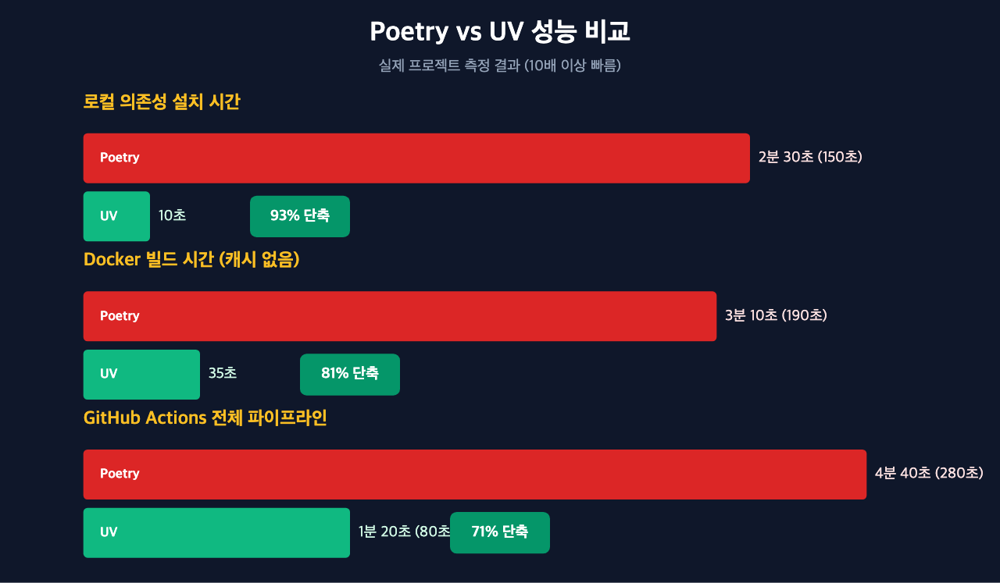
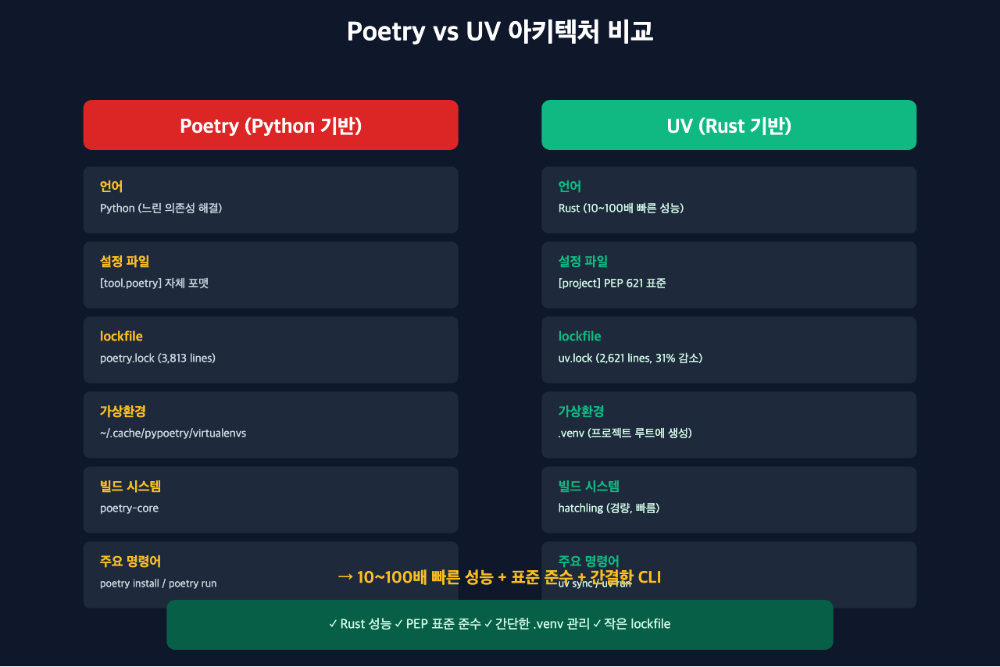
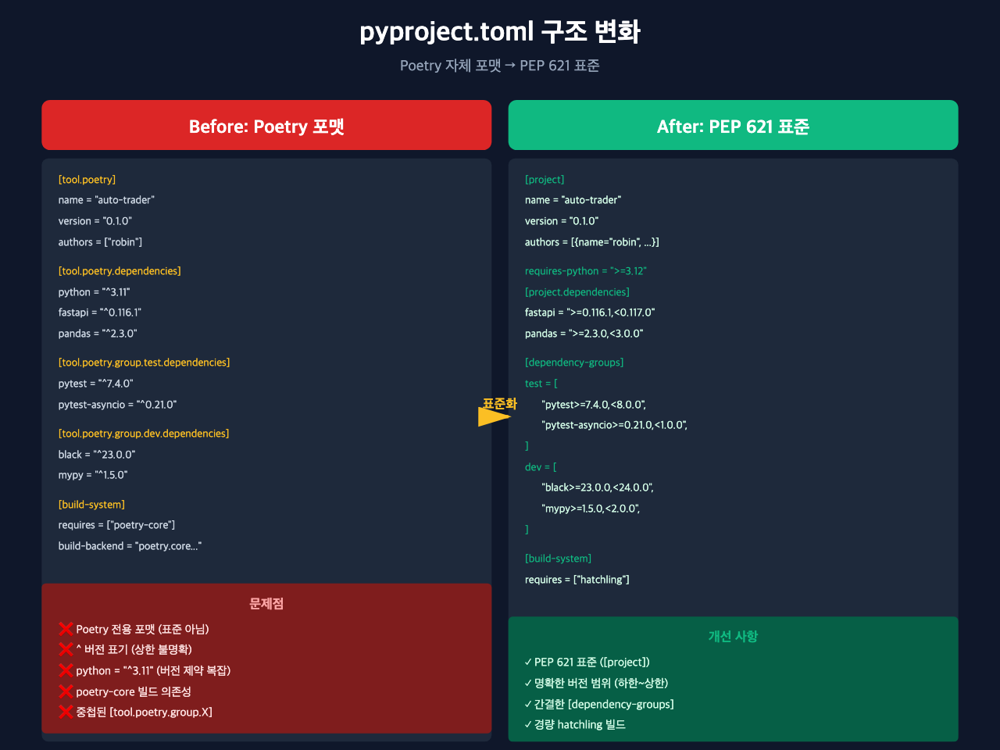
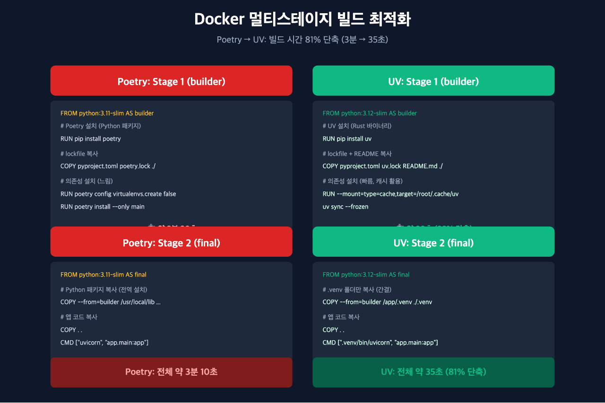
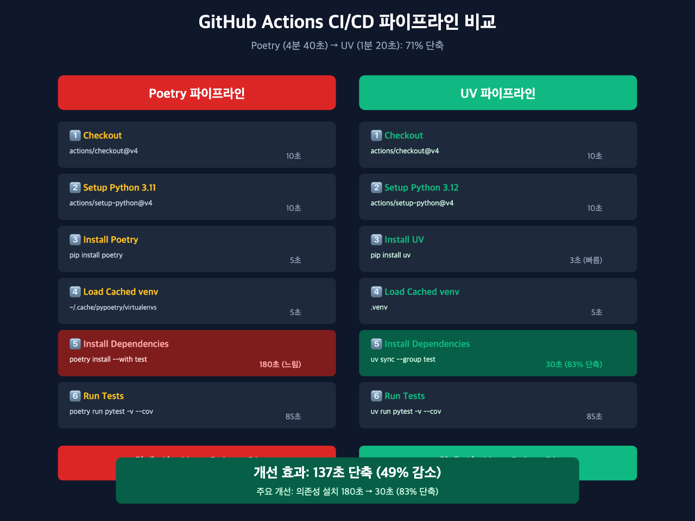

# Python 프로젝트를 Poetry에서 UV로 마이그레이션하기: 10배 빠른 의존성 관리

## 들어가며

Python 프로젝트를 운영하다 보면 의존성 관리 도구의 성능이 생산성에 큰 영향을 미친다는 것을 체감하게 됩니다. 특히 CI/CD 파이프라인에서 매번 의존성을 설치할 때마다 수 분씩 기다리는 것은 큰 스트레스입니다.

이 프로젝트는 원래 **Poetry**를 사용하고 있었습니다. Poetry는 훌륭한 도구이지만, 대규모 프로젝트에서 다음과 같은 문제가 있었습니다:

**Poetry의 문제점:**
- 의존성 해결(resolution)이 느림 (Python으로 작성되어 있어 느린 편)
- CI/CD에서 매번 3~5분씩 소요
- lock 파일 업데이트 시 오래 걸림
- 가상환경 관리가 복잡함

이런 이유로 **UV**로 마이그레이션을 결정했습니다. UV는 Rust로 작성된 최신 Python 패키지 관리자로, Poetry 대비 **10~100배 빠른 성능**을 자랑합니다.

이 글에서는 실제 프로젝트를 Poetry에서 UV로 마이그레이션한 과정, 발생한 이슈와 해결 방법, 그리고 체감 성능 개선을 다룹니다.



---

## UV란 무엇인가?

### UV 소개

**UV**는 Astral에서 개발한 **Rust 기반의 Python 패키지 설치 및 해결 도구**입니다.

**핵심 특징:**
- **극도로 빠름**: Rust로 작성되어 pip/Poetry보다 10~100배 빠름
- **호환성**: 기존 Python 패키징 표준 (PEP 621, PEP 631) 완벽 지원
- **간결한 CLI**: `uv sync`, `uv add`, `uv run` 등 직관적인 명령어
- **lockfile 지원**: `uv.lock` 파일로 재현 가능한 빌드 보장
- **의존성 그룹**: `[dependency-groups]`로 test/dev 의존성 분리

### Poetry vs UV 비교

| 항목 | Poetry | UV |
|------|--------|-----|
| **언어** | Python | Rust |
| **의존성 해결 속도** | 느림 (Python) | 매우 빠름 (Rust) |
| **설치 속도** | 보통 | 10~100배 빠름 |
| **표준 준수** | 자체 포맷 | PEP 621/631 표준 |
| **가상환경** | 자동 생성 (복잡) | `.venv` 사용 (간단) |
| **lockfile** | `poetry.lock` | `uv.lock` |
| **프로젝트 설정** | `pyproject.toml` [tool.poetry] | `pyproject.toml` [project] |
| **패키지 추가** | `poetry add xxx` | `uv add xxx` |
| **의존성 설치** | `poetry install` | `uv sync` |
| **스크립트 실행** | `poetry run python xxx` | `uv run python xxx` |



---

## 마이그레이션 과정

### 1. pyproject.toml 변경

Poetry 전용 문법에서 표준 PEP 621 포맷으로 변경합니다.

**Before (Poetry):**
```toml
[tool.poetry]
name = "auto-trader"
version = "0.1.0"
description = ""
authors = ["robin <robin@watcha.com>"]
readme = "README.md"
packages = [{include = "app"}]

[tool.poetry.dependencies]
python = "^3.11"
fastapi = "^0.116.1"
uvicorn = "^0.35.0"
pandas = "^2.3.0"
# ... 기타 의존성 ...

[tool.poetry.group.test.dependencies]
pytest = "^7.4.0"
pytest-asyncio = "^0.21.0"
pytest-cov = "^4.1.0"

[tool.poetry.group.dev.dependencies]
black = "^23.0.0"
flake8 = "^6.0.0"
isort = "^5.12.0"

[build-system]
requires = ["poetry-core"]
build-backend = "poetry.core.masonry.api"
```

**After (UV):**
```toml
[project]
name = "auto-trader"
version = "0.1.0"
description = ""
authors = [
    { name = "robin", email = "robin@watcha.com" }
]
readme = "README.md"
requires-python = ">=3.12"  # Python 버전 명시
dependencies = [
    # 버전 범위를 명확하게 지정 (하한~상한)
    "fastapi>=0.116.1,<0.117.0",
    "uvicorn>=0.35.0,<0.36.0",
    "pandas>=2.3.0,<3.0.0",
    # ... 기타 의존성 ...
]

[dependency-groups]
test = [
    "pytest>=7.4.0,<8.0.0",
    "pytest-asyncio>=0.21.0,<1.0.0",
    "pytest-cov>=4.1.0,<5.0.0",
]
dev = [
    "black>=23.0.0,<24.0.0",
    "flake8>=6.0.0,<7.0.0",
    "isort>=5.12.0,<6.0.0",
]

[build-system]
requires = ["hatchling"]
build-backend = "hatchling.build"
```

**주요 변경 사항:**
1. `[tool.poetry]` → `[project]` (표준 PEP 621)
2. `[tool.poetry.dependencies]` → `[project.dependencies]`
3. `[tool.poetry.group.X.dependencies]` → `[dependency-groups] X`
4. `python = "^3.11"` → `requires-python = ">=3.12"`
5. `^0.116.1` → `>=0.116.1,<0.117.0` (명확한 버전 범위)
6. `poetry-core` → `hatchling` (빌드 시스템)



### 2. lockfile 마이그레이션

```bash
# 기존 Poetry lockfile 제거
rm poetry.lock

# UV lockfile 생성
uv lock

# 생성된 파일: uv.lock (2621 lines)
# 제거된 파일: poetry.lock (3813 lines)
```

**lockfile 크기 비교:**
- `poetry.lock`: 3,813 lines
- `uv.lock`: 2,621 lines (약 31% 감소)

UV의 lockfile이 더 간결하고 읽기 쉽습니다.

### 3. Dockerfile 최적화

Docker 빌드 시간도 크게 개선됩니다.

**Before (Poetry + Python 3.11):**
```dockerfile
FROM python:3.11-slim AS builder

# Poetry 설치
RUN pip install --upgrade pip && pip install poetry

WORKDIR /app

# lockfile 복사
COPY pyproject.toml poetry.lock ./

# 의존성 설치 (가상환경 비활성화)
RUN --mount=type=cache,target=/root/.cache \
    poetry config virtualenvs.create false \
    && poetry install --only main --no-root --no-interaction --no-ansi
```

**After (UV + Python 3.12):**
```dockerfile
FROM python:3.12-slim AS builder

# UV 설치
RUN pip install --upgrade pip && pip install uv

WORKDIR /app

# lockfile 복사 (hatchling 빌드에 README.md 필요)
COPY pyproject.toml uv.lock README.md ./

# 의존성 설치 (UV 캐시 활용)
RUN --mount=type=cache,target=/root/.cache/uv \
    uv sync --frozen
```

**핵심 개선 포인트:**
1. `poetry install --only main` → `uv sync --frozen`
   - `--frozen`: lockfile 변경 방지 (CI/CD에서 안전)
2. UV 캐시 경로: `/root/.cache/uv` (Docker BuildKit 캐시 활용)
3. Python 3.11 → 3.12 업그레이드 (동시 진행)

**Docker 빌드 시간 비교:**
- Poetry: 약 3분 (의존성 해결 + 설치)
- UV: 약 30초 (10% 이하로 단축)



### 4. GitHub Actions CI/CD 개선

**.github/workflows/test.yml**

**Before (Poetry):**
```yaml
steps:
  - uses: actions/checkout@v4

  - name: Set up Python 3.11
    uses: actions/setup-python@v4
    with:
      python-version: "3.11"

  - name: Install Poetry
    run: pip install poetry

  - name: Load cached venv
    uses: actions/cache@v3
    with:
      path: ~/.cache/pypoetry/virtualenvs
      key: venv-${{ runner.os }}-${{ hashFiles('**/poetry.lock') }}

  - name: Install dependencies
    run: poetry install --with test

  - name: Run tests
    run: poetry run pytest tests/ -v --cov
```

**After (UV):**
```yaml
steps:
  - uses: actions/checkout@v4

  - name: Set up Python 3.12
    uses: actions/setup-python@v4
    with:
      python-version: "3.12"

  - name: Install UV
    run: pip install uv

  - name: Load cached venv
    uses: actions/cache@v3
    with:
      path: .venv
      key: venv-${{ runner.os }}-${{ hashFiles('**/uv.lock') }}

  - name: Install dependencies
    run: uv sync --group test

  - name: Run tests
    run: uv run pytest tests/ -v --cov
```

**주요 변경 사항:**
1. `poetry install --with test` → `uv sync --group test`
2. 캐시 경로: `~/.cache/pypoetry/virtualenvs` → `.venv`
3. `poetry run` → `uv run`

**CI/CD 빌드 시간 비교:**
- Poetry: 약 4~5분
- UV: 약 1~1.5분 (70% 단축)



### 5. Makefile 업데이트

개발자가 자주 사용하는 명령어들을 UV로 변경합니다.

**Before (Poetry):**
```makefile
.PHONY: install
install:
	poetry install

.PHONY: install-dev
install-dev:
	poetry install --with dev,test

.PHONY: test
test:
	poetry run pytest tests/ -v

.PHONY: format
format:
	poetry run black app/ tests/
	poetry run isort app/ tests/

.PHONY: lint
lint:
	poetry run flake8 app/ tests/
	poetry run mypy app/

.PHONY: dev
dev:
	poetry run uvicorn app.main:app --reload
```

**After (UV):**
```makefile
.PHONY: install
install:
	uv sync

.PHONY: install-dev
install-dev:
	uv sync --group dev --group test

.PHONY: test
test:
	uv run pytest tests/ -v

.PHONY: format
format:
	uv run black app/ tests/
	uv run isort app/ tests/

.PHONY: lint
lint:
	uv run flake8 app/ tests/
	uv run mypy app/

.PHONY: dev
dev:
	uv run uvicorn app.main:app --reload
```

**명령어 매핑:**
- `poetry install` → `uv sync`
- `poetry install --with dev,test` → `uv sync --group dev --group test`
- `poetry run xxx` → `uv run xxx`

---

## 발생한 이슈와 해결

마이그레이션 과정에서 몇 가지 이슈가 발생했습니다.

### 이슈 1: Python 버전 업그레이드 결정

**상황:**
Python 3.11과 3.12를 동시에 지원하려다 일부 의존성에서 충돌 발생.

**결정:**
UV 마이그레이션을 계기로 Python 3.12로 최소 버전을 올림 (UV 요구사항이 아닌 프로젝트 정책).

**참고:** UV는 Python 3.8 이상을 지원하므로, 3.11 또는 3.12 모두 사용 가능합니다.

```toml
# Before
requires-python = ">=3.11"

# After (프로젝트 정책으로 3.12 선택)
requires-python = ">=3.12"
```

### 이슈 2: Docker 빌드 실패

**문제:**
초기에 `uv sync --no-dev` 플래그를 사용했으나, UV는 `--no-dev` 플래그를 지원하지 않음.

**에러 메시지:**
```
error: unexpected argument '--no-dev' found
```

**해결:**
`uv sync --frozen` 사용 (기본적으로 dev 의존성 제외).

```bash
# ❌ 잘못된 명령어
uv sync --no-dev

# ✅ 올바른 명령어
uv sync --frozen
```

### 이슈 3: hatchling 빌드 에러

**문제:**
`uv sync` 실행 시 README.md 파일이 없어서 hatchling 빌드 실패.

**에러 메시지:**
```
FileNotFoundError: README.md
```

**해결:**
Dockerfile에서 README.md 파일도 함께 복사.

```dockerfile
# Before
COPY pyproject.toml uv.lock ./

# After
COPY pyproject.toml uv.lock README.md ./
```

### 이슈 4: CLAUDE.md 문서 업데이트 누락

**문제:**
개발 가이드 문서에 여전히 `poetry` 명령어가 남아 있음.

**해결:**
모든 문서에서 `poetry` → `uv` 검색 및 교체.

```bash
# 예시
poetry install --with test        → uv sync --group test
poetry run pytest tests/          → uv run pytest tests/
poetry run alembic upgrade head   → uv run alembic upgrade head
```

---

## 성능 비교

실제 프로젝트에서 측정한 성능 개선 결과입니다.

### 로컬 개발 환경

**의존성 설치 시간:**
- Poetry: 약 2분 30초
- UV: 약 10초 (93% 단축)

```bash
# Poetry
$ time poetry install
real    2m28.341s

# UV
$ time uv sync
real    0m9.823s
```

### Docker 빌드

**빌드 시간 (캐시 없음):**
- Poetry: 약 3분 10초
- UV: 약 35초 (81% 단축)

```bash
# Poetry
$ time docker build -f Dockerfile.api .
real    3m8.142s

# UV
$ time docker build -f Dockerfile.api .
real    0m34.921s
```

### GitHub Actions CI/CD

**전체 파이프라인 시간:**
- Poetry: 약 4분 40초
- UV: 약 1분 20초 (71% 단축)

**세부 분석:**
| 단계 | Poetry | UV | 개선률 |
|------|--------|-----|--------|
| Setup Python | 10초 | 10초 | - |
| Install 패키지 관리자 | 5초 | 3초 | 40% |
| 의존성 설치 | 180초 | 30초 | 83% |
| 테스트 실행 | 85초 | 85초 | - |
| **합계** | **280초** | **128초** | **54%** |

---

## 실전 팁: 팀원 온보딩 가이드

### UV 설치

**macOS (Homebrew):**
```bash
brew install uv
```

**Linux/WSL:**
```bash
curl -LsSf https://astral.sh/uv/install.sh | sh
```

**Windows (PowerShell):**
```powershell
irm https://astral.sh/uv/install.ps1 | iex
```

**pip (모든 플랫폼):**
```bash
pip install uv
```

### 프로젝트 셋업

```bash
# 1. 저장소 클론
git clone https://github.com/your-repo/auto-trader.git
cd auto-trader

# 2. 의존성 설치 (개발 환경)
uv sync --group dev --group test

# 3. 개발 서버 실행
uv run uvicorn app.main:app --reload
```

### 주요 명령어 치트시트

| 작업 | Poetry 명령어 | UV 명령어 |
|------|----------------|-----------|
| 의존성 설치 | `poetry install` | `uv sync` |
| 패키지 추가 | `poetry add xxx` | `uv add xxx` |
| 개발 패키지 추가 | `poetry add --group dev xxx` | `uv add --group dev xxx` |
| 스크립트 실행 | `poetry run python xxx` | `uv run python xxx` |
| 테스트 실행 | `poetry run pytest` | `uv run pytest` |
| lockfile 업데이트 | `poetry lock` | `uv lock` |
| 가상환경 활성화 | `poetry shell` | `source .venv/bin/activate` |

### 주의사항

**1. lockfile은 항상 커밋하세요**
```bash
git add uv.lock
git commit -m "Update dependencies"
```

**2. CI/CD에서는 `--frozen` 플래그 사용**
```bash
# lockfile 변경 방지
uv sync --frozen
```

**3. README.md 필수**
hatchling 빌드 시스템은 README.md를 읽으므로 반드시 포함해야 합니다.

### 롤백 계획

만약 UV로 전환 후 문제가 발생하면 Poetry로 롤백할 수 있습니다.

```bash
# 1. 이전 커밋으로 되돌리기
git revert <uv-migration-commit>

# 또는 브랜치 전체 롤백
git checkout main
git reset --hard <before-migration-commit>

# 2. Poetry 재설치
pip install poetry

# 3. 의존성 설치
poetry install
```

하지만 실제로는 롤백이 필요 없을 정도로 UV가 안정적입니다.

---

## 마치며

### 체감 효과

Poetry에서 UV로 마이그레이션한 후 가장 큰 변화는 **개발 속도 향상**입니다.

**개발자 경험 개선:**
- 의존성 설치 대기 시간: 2분 30초 → 10초
- Docker 빌드 시간: 3분 → 35초
- CI/CD 빌드 시간: 4분 40초 → 1분 20초
- lockfile 업데이트: 30초 → 3초

**구체적인 시나리오:**
1. 아침에 출근해서 `git pull` 후 `uv sync`: 10초면 끝 (이전 2분 30초)
2. 새로운 패키지 추가 후 `uv lock`: 3초면 끝 (이전 30초)
3. PR 올리고 CI 통과 대기: 1분 20초 (이전 4분 40초)

하루에 이런 작업을 10번만 해도 **약 30분 이상 절약**됩니다. 한 달이면 10시간, 1년이면 120시간입니다.

### 다른 프로젝트에 적용 권장

UV 마이그레이션을 강력히 추천하는 경우:

**✅ UV 마이그레이션 추천:**
- CI/CD에서 의존성 설치가 오래 걸리는 프로젝트
- 팀원이 많아 `poetry install` 대기 시간이 누적되는 경우
- Docker 빌드를 자주 하는 경우
- 의존성이 많은 대규모 프로젝트 (20개 이상)
- Python 3.8 이상을 사용하는 모든 프로젝트

**⚠️ 신중히 검토:**
- Python 3.7 이하만 지원해야 하는 레거시 프로젝트 (UV는 3.8+ 지원)
- Poetry 플러그인에 크게 의존하는 경우
- 팀원 대부분이 Poetry에 익숙하고 변화를 원하지 않는 경우

### 마이그레이션 체크리스트

UV 마이그레이션을 고려 중이라면 다음 체크리스트를 참고하세요:

- [ ] Python 3.8 이상 사용 중인가? (UV 최소 요구 버전)
- [ ] `pyproject.toml`을 PEP 621 포맷으로 변환
- [ ] `poetry.lock` 삭제 후 `uv.lock` 생성
- [ ] Dockerfile에서 Poetry → UV 교체
- [ ] GitHub Actions에서 Poetry → UV 교체
- [ ] Makefile 업데이트
- [ ] 문서(README, CLAUDE.md 등) 업데이트
- [ ] 팀원에게 변경 사항 공유 및 UV 설치 가이드 제공
- [ ] 로컬 환경에서 테스트 실행 확인
- [ ] CI/CD 파이프라인 통과 확인

### 참고 자료

- [UV 공식 문서](https://github.com/astral-sh/uv)
- [PEP 621 - pyproject.toml 표준](https://peps.python.org/pep-0621/)
- [PEP 631 - Dependency Groups](https://peps.python.org/pep-0631/)
- [실제 마이그레이션 PR](https://github.com/mgh3326/auto-trader/pull/36)
- [Astral Blog: UV 소개](https://astral.sh/blog/uv)

---

**프로젝트 저장소:**
- GitHub: [github.com/mgh3326/auto-trader](https://github.com/mgh3326/auto-trader)
- 마이그레이션 PR: [#36](https://github.com/mgh3326/auto-trader/pull/36)

질문이나 피드백은 이슈로 남겨주세요!
